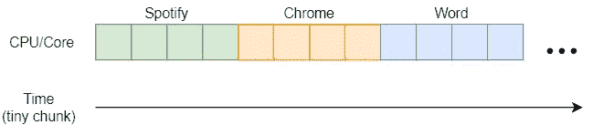
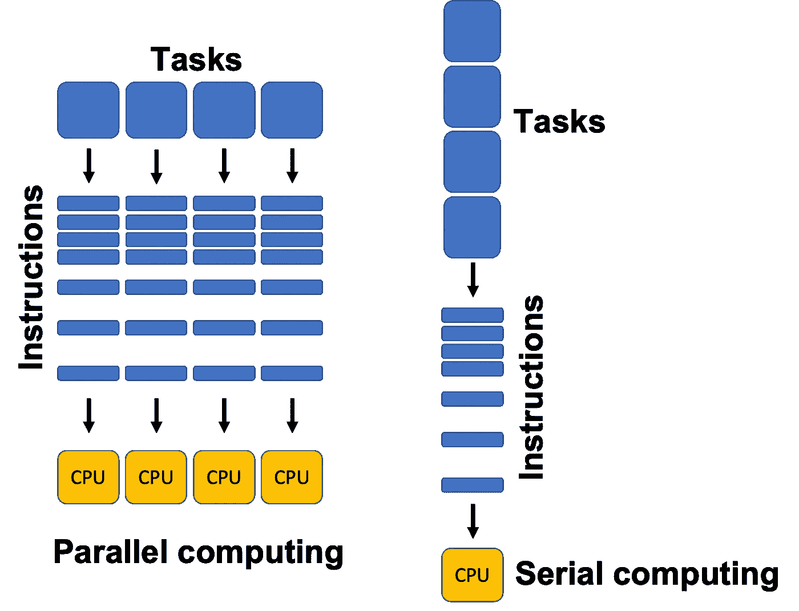
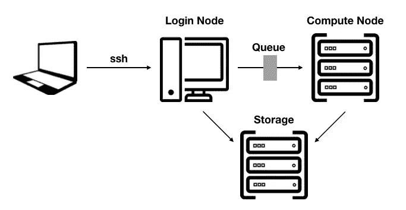
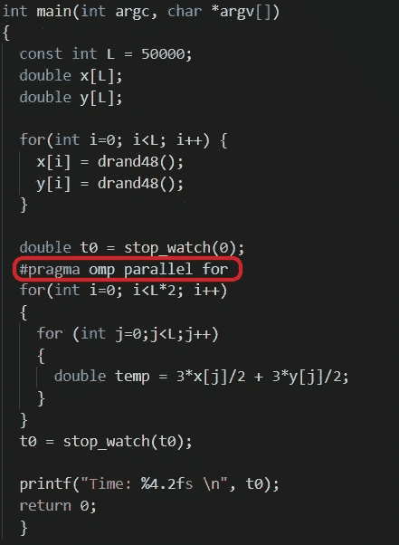
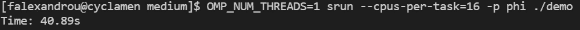

# 超级计算机是如何工作的？

> 原文：<https://levelup.gitconnected.com/how-do-supercomputers-work-39ab80eb90a3>

## 高性能计算简介

由 [Unsplash](https://unsplash.com?utm_source=medium&utm_medium=referral) 上的 [CHUTTERSNAP](https://unsplash.com/@chuttersnap?utm_source=medium&utm_medium=referral) 拍摄

## 介绍

超级计算——现在称为高性能计算(HPC)——主要用于科学和工程目的，如物理模拟、密码分析、量子力学、天气预报、分子建模、空气动力学、核聚变研究等。虽然个人电脑的运算速度为数百千兆次(每秒浮点运算)到数十万亿次，但最近的超级计算机的速度达到了数百万亿次。为了帮助理解速度上的差异，一千万亿次浮点运算由一千万亿次浮点运算组成。这种巨大的加速使我们能够在几分钟和几小时内完成繁重的数据密集型计算，而不是几周或几个月。这听起来令人印象深刻，但是这些计算机怎么这么快呢？要回答这个问题，我们首先需要理解串行和并行执行之间的区别。

## 串行与并行执行

传统上，具有一个核心的个人计算机以连续/串行的顺序工作，即使看起来事情是同时运行的。这种“假”并行化的效果之所以会发生，是因为操作系统的调度程序使 CPU 能够在程序/进程之间快速切换其处理能力。这种变化发生得如此之快，以至于人类大脑都没有注意到。

操作系统调度程序时间片(图片由作者提供)

然而，真正的并行化可以通过拥有多个 CPUs 内核来实现，这些 CPUs 内核可以独立运行，也可以承担相同的工作负载。我们不会深入线程和进程的细节，但正如下图所示，拥有多个 CPUs 内核允许计算机并行执行代码，从而提高速度。

并行与串行计算([来源](https://pythonnumericalmethods.berkeley.edu/notebooks/chapter13.01-Parallel-Computing-Basics.html))

## 高性能计算(HPC)集群

高性能计算集群由几十到几千个联网的计算机器/节点组成，其中每个节点包含大约 8 到 128 个 CPUs 核心。例如，在 10 个具有 16 个内核的节点上执行代码，我们可以并行运行 160 个进程，从而提高处理速度，实现高性能计算。

高性能计算集群架构([来源](https://www.gdc-docs.ethz.ch/GeneticDiversityAnalysis/GDA20/site/biocomputing_Euler/))

HPC 集群通常还包括一个登录节点，用户可以从该节点使用自己的计算机通过 [ssh](https://www.ssh.com/academy/ssh/protocol) 连接到集群。然后，使用特定的 [slurm](https://slurm.schedmd.com/) (用于资源管理的简单 Linux 实用程序)脚本命令，批处理作业可以提交给集群的调度程序来执行。

## HPC 标准和框架

在本节中，我们将简要介绍最流行的 HPC 库和框架，从大多数并行处理框架使用的 [OpenMP](https://www.openmp.org/) 开始。OpenMP 代表开放多处理，它是一个用于 C、C++和 Fortran 的跨平台共享内存多处理 API。实际上，单独使用 OpenMP 可能是不够的，因为它只能在单个节点内并行化代码，而单个节点的处理能力可能不足以进行高要求的计算。另一方面，MPI(消息传递接口)允许跨多个节点并行化代码。最流行的 MPI 库是 [OpenMPI](https://www.open-mpi.org/) ，它和 OpenMP 都是开源的，得到了业界和学术界的认可和标准化。

HPC 集群室([来源](https://www.ge.com/research/sites/default/files/inline-images/HPC_1.jpg))

即使使用多个节点，各种问题也需要更多的处理能力。具体而言，与矩阵变换相关的计算，如计算机图形渲染或神经网络训练，更适合在 GPU(图形处理单元)上执行。幸运的是，有一些框架可以实现这种执行，如针对 Nvidia GPUs 的 [CUDA](https://developer.nvidia.com/cuda-toolkit) (计算统一设备架构)和为 AMD 和 Nvidia 显卡提供支持的 [OpenCL](https://www.khronos.org/opencl/) (开放计算语言)。通常，Cuda 和 MPI 相结合，支持在多个节点的多个 GPU 上执行代码，从而最大化性能输出。

## OpenMP 演示

在本节中，我们将了解如何使用 OpenMP 对代码进行并行化，以及它的速度优势。下图中显示的代码没有语义含义，因为它仅用于演示目的。简而言之，它创建两个大小为 50000 的随机数组，并执行一些基本计算(乘法、除法和加法)，迭代 500 万次(2 x L x L)。

演示代码(图片由作者提供)

OpenMP 关键字“#pragma omp parallel for”用于跨多个线程并行化外部 for 循环。例如，我们可以用 4 个线程运行程序，而不是在单个线程上迭代 100k 次(2 x L ),这样它可以在每个线程上并行迭代 25k (100k / 4)次。需要注意的是,“stop_watch”函数是用来计算执行并行区域(for 循环内的代码)而不是整个程序所需的时间的。

演示程序以串行执行方式运行— 1 个线程(图片由作者提供)

如上图和下图所示，用 1 个线程执行程序需要大约 41 秒，而用 8 个线程执行需要大约 6 秒。这几乎快了 7 倍。它总是比我们预期的要慢(快 8 倍)，因为打开和关闭并行区域会消耗资源。

演示程序并行运行— 8 个线程(图片由作者提供)

代码是在 [Cyclamen](https://hpcf.cyi.ac.cy/resources.html) 上执行的，为此我被授权在塞浦路斯学院完成[高性能计算入门](https://www.cyi.ac.cy/index.php/education/masters-programs/simulation-and-data-sciences/sds-402-introduction-to-high-performance-computing.html)课程。

*感谢您的阅读，我希望这篇文章能激发您的好奇心，了解更多关于超级计算机这个神奇世界的知识。*

## 参考

1.  [https://www.suse.com/suse-defines/definition/supercomputer/](https://www.suse.com/suse-defines/definition/supercomputer/)
2.  [https://python numerical methods . Berkeley . edu/notebooks/chapter 13.01-Parallel-Computing-basics . html](https://pythonnumericalmethods.berkeley.edu/notebooks/chapter13.01-Parallel-Computing-Basics.html)
3.  [https://www . netapp . com/data-storage/高性能计算/what-is-hpc/](https://www.netapp.com/data-storage/high-performance-computing/what-is-hpc/)
4.  [https://www.ssh.com/academy/ssh/protocol](https://www.ssh.com/academy/ssh/protocol)
5.  [https://slurm.schedmd.com/](https://slurm.schedmd.com/)
6.  [https://www.openmp.org/](https://www.openmp.org/)
7.  [https://www.open-mpi.org/](https://www.open-mpi.org/)
8.  [https://developer.nvidia.com/cuda-toolkit](https://developer.nvidia.com/cuda-toolkit)
9.  [https://www.khronos.org/opencl/](https://www.khronos.org/opencl/)