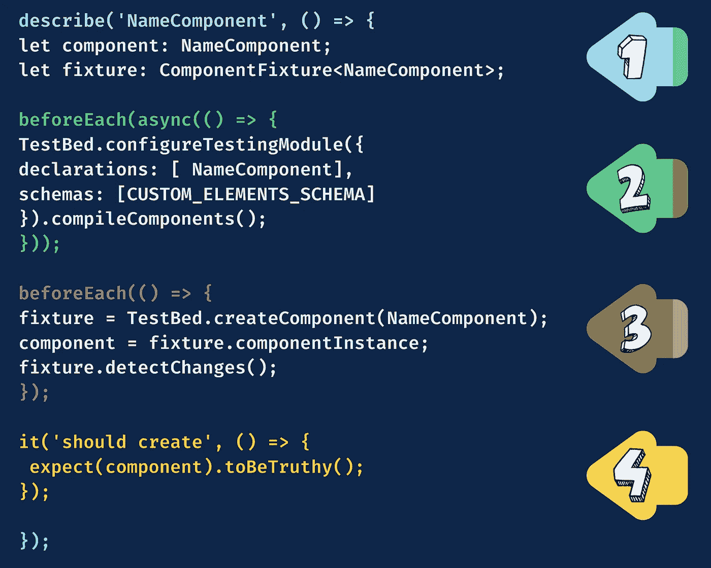
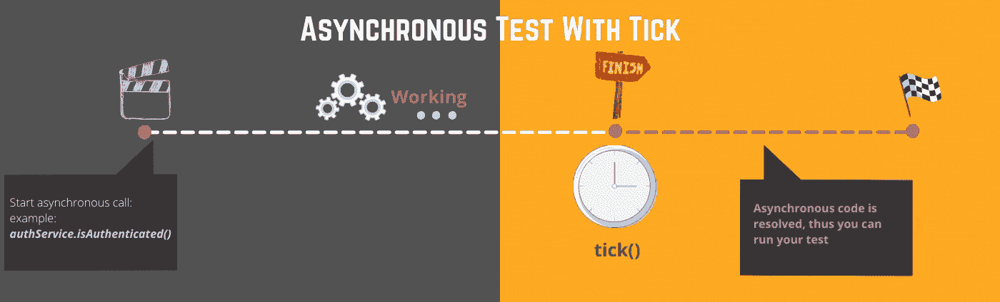

# 如何编写单元测试用例？在 Angular 中开始单元测试之前你必须知道的事情！

> 原文：<https://levelup.gitconnected.com/how-do-you-write-a-unit-test-case-what-you-must-know-before-starting-a-unit-test-in-angular-f1174f437cb6>

## 角度单位测试

通常，当我们第一次加入 angular 应用程序任务时，我们开始学习 Angular，这不是很快就能学会的，你必须为每个编码的功能编写一个单元测试来完成你的用户故事。通过我的经验，我注意到几乎每个 Angular 初学者都开始复制/粘贴现有的单元测试，而不理解后面是什么。当然，随着时间的推移，我们最终会有一些奇怪的代码，这些代码在测试单元中是逻辑上不需要的。

当我开始调查这个过程中出了什么问题时，我发现主要有两个原因。第一，是时间，我是说期限问题。第二，缺乏询问信息或以正确方式做事情的快速培训。

这就是为什么我决定写这篇文章，作为一个快速指南，在几分钟内有一个基本的深刻理解，这将帮助你肯定首先，理解 Angular 中的单元测试，并为你开发的功能编写单元测试代码。

Angular 中的单元测试可能看起来很复杂，而且要花很多时间，但是如果你对它的工作原理有一个清晰的概念，你会发现测试很容易也很快。

这篇文章将会给你一个在 Angular 中进行单元测试的平稳着陆。因此，这给了你理解任何已经编码的测试和编写你自己的测试的基础。

本文的计划如下:

*   ***了解测试骨骼***
*   ***关键字了解进行异步测试的***
*   ***关键字了解模板和 HTML 测试***
*   ***外卖***

拿一个☕和你的📝让我们开始吧(ง ل͜ )ง

# 理解测试框架

在深入探讨之前，我们需要了解一下角测试骨架。这真的很重要，因为如果你不理解测试是如何在幕后运行的，什么时候是异步或同步的，等等，有些 bug 是无法修复的。

下面是一个简单单元测试的框架图，它验证了当前是否创建了一个组件:

这是每个组件应该验证它是否被正确初始化和创建的初始测试。(如果你想复制代码，这里有一个 git 版本)

让我们开始吧。

## 第一步:描述

Describe bloc 顾名思义是对它所包含的单元测试集的描述。在一个大组件中，我们找到多个描述块来按类别组织测试。因此，我们将有主描述块(组件的父描述)和描述几个大功能的子块，来进行按主题或类别分组的单元测试。

> 所以，把`describe`想象成打开一个测试块或者一个测试集的`{`。

## 步骤 2 和 3: BeforeEach(异步)与 BeforeEach

`BeforeEach` bloc 旨在设置实例和正确的配置，这个 bloc 在每次测试之前运行并提供必要的实例，不管是服务还是组件的实例都要测试。有时我们还会加上 AfterEach 来收拾残局。

你注意到我们有两个 BeforeEach blocs。事实上，我们可以在每个集团之前将两个集团连接成一个集团。分成两个块的原因是为了理解何时应该在 BeforeEach 中使用异步。

使用 ***async*** 测试区域是强制性的，以告诉测试运行者我们解析了这个块中的异步和同步编译组件。

*   **现在我们来谈谈异步部分(2 号)**

这一步至关重要。这是我们配置我们需要的组件、服务或管道的地方…等等。

可以把它看作是向使用组件或服务的模块添加一个必要的导入。在模块中，我们声明组件，这样我们就知道它的存在。我们提供它正常工作所需的必要服务等等。这里也是一样，因为测试必须是自主的。我们需要声明组件并提供初始化组件或服务所需的任何东西…等等。

***/！\提示:*** 我这里的提示是使用 Angular CLI 来生成测试。当您准备好测试您的功能时，请检查组件的构造函数或声明。这将告诉您需要为组件提供什么。

***/！\提示:*** 另一个提示，只需要声明组件，只提供服务。所以如果你正在写一个服务测试，不需要`declarations:[NameComponent]`。

*   **每个之前(数字 3)**

**固定物，是什么？**

夹具，你在每次测试中肯定会用到的东西之一。因此，你需要理解它，了解它的力量！

> fixture =包含在 ComponentFixture 类型中的组件实例

什么是组件夹具类型？

这是一种实用程序类型，可帮助您访问关于组件的所有所需内容:

*   组件实例
*   允许您查询 DOM 的调试元素
*   触发变化检测周期
*   ….

## 步骤 4:单元测试

您可能已经注意到，单元测试以`it`开始，后面是一个小描述。当我们运行上面的测试时，我们应该看到测试名为***‘它应该创建’。***

我们可以想创建多少就创建多少，我们需要用`it`进行单元测试。如果我们有很多测试，建议用关键字`describe`将它们归类到一个主题或功能名称下……等等。

***/！\提示:*** 我在开发时使用的一个提示是 ***fit。*** 合体的意思是 ***焦点+它。这在编写测试代码时非常实用，因为它告诉测试运行人员关注它，并首先运行它。我通常创建所有的 ***它是*** 我需要测试一个组件，这样我就不会忘记任何功能。跑完全程会白白花费你这么多时间。fit 将关注您正在编写的当前测试，如果有任何错误，将立即显示出来。当然，当我做完测试时，我会把注意力从测试上移开。***

# 在 beforeEach 中设置测试时要知道的关键字

*   **试验台**

该类主要用于在角度测试中配置测试模块。当您想要测试的组件有依赖关系时，这是非常重要的。我们用与普通`NgModule`相同的方式配置它。

在下面的例子中，我正在测试声明中的`LoginComponent`,这个组件使用了`AuthService`依赖，所以我们需要将它提供给测试模块。

有时我们需要访问一个依赖项来测试一个功能。在这种情况下，我们也使用 TestBed 类来测试它。

您可能已经注意到，我们也使用 TestBed 类来创建 fixture。

这里有一个例子:

# 测试异步功能要知道的关键词

*   ***茉莉方式:*** 茉莉的`done`功能

`done`函数是 Jasmine 中处理异步代码的内置方式。这是通过在测试中传递内置函数(`done`)来实现的。以下示例显示了它的工作原理:

*   *:`async`和`whenStable`*

*另一个和我们使用 Jasmine 的`done`函数一样的方法是使用`whenStable`。*

*这两种方法解决了异步调用，所以基于最可读和可理解的，你可以选择你想要的解决方案，但是在你需要学习另一种方法之前，给我们更多的控制并使代码可读。*

*   *`fakeAsync` & `tick`(推进时钟)*

**

*当我有异步代码要测试时，这是我用得最多的方法。它简单而高效。首先，`fakeAsyc`马上告诉你我们在一个异步代码中。因此，无论何时使用异步代码，都需要将其包装在 fakeAsync 块中。第二，包装测试是不够的，因为我们仍然需要知道 ***何时*** 我的异步调用被解析以测试结果。这可以通过使用`tick`功能来完成，该功能会为您提前时钟。所以在自动调用`tick`之后，你的承诺就解决了，之后你就可以测试了。*

*下面是一个例子:*

*   *`fakeAsync` & `flush`(确保 FakeAsync 的所有排队定时器为空或已解析)*

*还有一个功能可以提前时间，就是`flush`功能。`tick()`和`flush()`的区别在于:*

*>`tick()`将向前移动到您的第一个异步呼叫得到解决的时间。*

*>`flush()`将移动到结束，所有异步调用结束的时间。*

*其用法与`tick()`功能相同。*

# *测试模板和 HTML 需要知道的关键词*

*   *debug element . query all(by . CSS(' CSS class '))*
*   *查询选择器*
*   *debug element . native element . outer html*
*   *调试元素*
*   *…*

# *外卖*

*   *`detectChanges()`是触发变更检测周期和查看结果的强制选项。*
*   *出于组织的原因，编写待定测试将有助于您了解需要编写多少测试，并且不会忘记任何单元测试。这也将帮助您估计完成整个测试套件需要多少时间。*
*   *当您在`detectChanges()`之后看不到您想要的更改时，检查`detectChanges()`调用的顺序或者您是否正在测试一个异步代码。*
*   *测试您的测试是否因为异步操作而失败的临时技巧之一是使用 setTimeout(()，5000)来检查测试是否通过。你可能需要更多的时间。*
*   *当你进行异步测试时，你应该使用带有`tick` API 或者`flush`的角度`fakeAsync`测试区域。*
*   *使用`fit`而不是`it`来告诉测试运行人员，出于编码/调试的原因，您想要专注于一个特定的测试。*

*亲爱的读者朋友们，感谢你们的支持和宝贵时间。我希望这对你有用和有帮助。*

***关注我上** [**中**](https://medium.com/@famzil/) **，**[**Linkedin**](https://www.linkedin.com/in/fatima-amzil-9031ba95/)**，** [**【脸书**](https://www.facebook.com/The-Front-End-World) **，**[**Twitter**](https://twitter.com/FatimaAMZIL9)**查看更多文章。***

*回头见(ﾉ◕ヮ◕)ﾉ*:･ﾟ✧)*

*快速辅助存贮器(Fast Auxiliary Memory)*

**