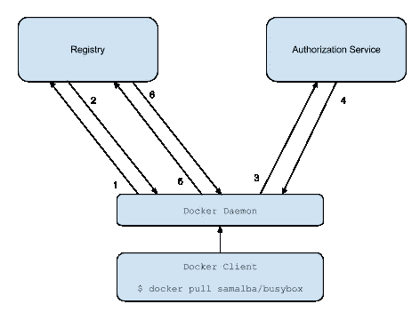

# Docker 认证如何工作:通过文档、MITM 和实现

> 原文：<https://levelup.gitconnected.com/how-docker-authentication-works-by-documentation-mitm-and-implementation-e62cd7a31178>

# 背景

在 Nordstrom，我们到处使用 Docker 和 Kubernetes。我们已经将这些容器技术深度集成到我们日常开发的各个方面，从 CI/CD 构建、计划的作业，到每秒处理数千个事务的托管公共服务。

我们已经这样做了很多年，这给了我们时间来成熟它是一个平台。这意味着适当的工程标准、共享的分布式跟踪和日志记录，最重要的是导致这种深入的原因:限制性的 pod 安全策略。

在搜索团队中，我们最近引入了另一个容器协调器:[亚马逊的弹性容器服务](https://aws.amazon.com/ecs/)。我们这样做是为了降低使用特定于 AWS 的服务的复杂性，但是新的基础设施总是会带来学习的机会。

*特别是*，我遇到了让我们在 Kubernetes 的 Gitlab CICD 运行人员从 docker 文件构建 docker 映像并将其部署到 [ECR](https://aws.amazon.com/ecr/) 的问题。问题的根源在于，单个 Gitlab CICD 级可能会:

*   获取 AWS 证书(例如`awscli ecr get-login` ) **或**
*   运行 docker 守护进程来拉、构建和推送(例如`docker pull`)

我可以在一个容器中做一个，在另一个容器中做另一个，但是我不能在同一个容器中同时做两个。这是因为我们共享的 CICD 运行器锁定了哪些服务可以与哪些映像并行运行。这给了我以下选择:

*   在没有守护进程的情况下构建 docker 映像(无守护进程 docker)
*   找到一种方法来安全地生成 ECR 凭证，并将其从一个阶段传递到另一个拥有 docker 并可以使用它们的阶段。

虽然最终的解决方案是后者(使用 Gitlab 的秘密管理器),但我通过研究 daemonless docker builders 开始了这个过程。我学到了以下几点:

有一些无 daemonless 容器构建器，它们使用 runc 构建映像并运行容器，与 Docker 使用相同的开放容器规范。

有两家非常有前途的集装箱制造商不是码头工人:

*   [谷歌的 Kaniko](https://github.com/GoogleContainerTools/kaniko) 是专门为在 Kubernetes 上用作 docker 图像构建器而构建的。
*   [正版工具的 img](https://github.com/genuinetools/img) 宣称自己是一个“独立的、无守护进程的、无特权的 Dockerfile 和 OCI 兼容的容器映像构建器”

听起来很棒！对吗？嗯……算是吧。

还记得我之前提到的那些 pod 安全策略吗？我们的 Kubernetes 集群上的策略之一是 [ReadOnlyRootFilesystem，](https://kubernetes.io/docs/concepts/policy/pod-security-policy/#volumes-and-file-systems)这意味着您的容器不能修改根文件系统。对于 Kaniko，这是一个问题，因为它写入到硬编码的根文件夹路径[。我们可以定制我们自己的版本，但是现在，让我们继续。](https://github.com/GoogleContainerTools/kaniko/blob/c5bc179c85be57128d802626a03cbc24469f7bec/pkg/constants/constants.go#L37)

所以我看了看正版工具的 img 和 d，看起来它符合所有的标准:

*   无梦的
*   在非特权设置下运行良好
*   根目录中没有建筑
*   支持 ECR 认证`docker login {creds}` → `img login {creds}`

然而，在我的研究中，我在 github 上找到了下面这张票:


勉强挤过特征

原来 *img 只有*支持 ECR 私人回购，这让我很好奇:

*   docker 认证是如何工作的？
*   为什么这个项目只适用于一个私有存储库，而不适用于所有其他的存储库？
*   在这个项目中实现对 GCR 的支持有多难？(我们在 Nordstrom 也有谷歌云项目)

# Docker 认证如何工作

我们将通过使用 Google 容器注册中心作为私有注册中心的例子来详细了解这一点，我们将首先查看关于它应该做什么的相关文档，然后在我的机器上设置一个 MITM 代理来监视所有传出的请求，以查看到底发送了什么。

如果你想跟着做，你需要安装[谷歌云 SDK](https://cloud.google.com/sdk/?utm_source=google&utm_medium=cpc&utm_campaign=na-CA-all-en-dr-bkws-all-all-trial-b-dr-1008076&utm_content=text-ad-none-any-DEV_c-CRE_339544711141-ADGP_Hybrid+%7C+AW+SEM+%7C+BKWS+%7C+RLSA+%7C+CA+%7C+en+%7C+BMM+~+Tools+~+Developer+Tools+~+Cloud+SDK+~+Sdk+Google+Cloud-KWID_43700042240005671-kwd-317970009092&utm_term=KW_%2Bsdk%20%2Bgoogle%20%2Bcloud-ST_%2Bsdk+%2Bgoogle+%2Bcloud&gclid=CjwKCAiApOvwBRBUEiwAcZGdGC2fAXg6iKl3QRRF-W4lzYgOMc7XWhQnnpDhXKDLUbQR9c6os2oe-RoCqxwQAvD_BwE) ，通过`gcloud auth` 正确认证，并使用 SDK 的`gcloud auth configure-docker`设置命令。

# 文档

当你执行`docker login gcr.io`登录并且*正常工作*时，你很容易忽略到底发生了什么。



docker 认证模型

上图来自 [Docker 令牌认证规范，](https://docs.docker.com/registry/spec/auth/token/)，它从较高的层面向我们展示了认证是如何发生的，它还告诉我们每个调用代表什么:

> 1.尝试对注册表开始推/拉操作。
> 
> 2.如果注册中心需要授权，它将返回一个包含如何认证信息的`401 Unauthorized` HTTP 响应。
> 
> 3.注册中心客户端向授权服务请求一个承载令牌。
> 
> 4.授权服务返回代表客户端授权访问的不透明载体令牌。
> 
> 5.客户端使用嵌入在请求授权头中的承载令牌重试原始请求。
> 
> 6.注册中心通过验证承载令牌和嵌入其中的声明集来授权客户端，并照常开始推/拉会话。

这是一个很好的开始，但是 Docker 守护进程，或者可能是它的客户机(不清楚是哪一个)如何从“授权服务”获得凭证以获得不记名令牌呢？

## 凭据助手

[根据文档](https://docs.docker.com/engine/reference/commandline/login/#credential-helpers)，docker 客户端通过凭证助手启动该流程。凭证助手是 docker 客户机用来调用特定于服务的身份验证机制的二进制文件。它们实现了一个非常简单的接口，并通过一个非常简单的机制被调用。

当您使用 gcloud sdk 的`gcloud auth configure-docker`设置 docker 时，它会将以下文件写入您的`~/.docker/config.json`:

gcloud docker 配置示例

当您执行一个`docker login {HOST_NAME}`时，它会在这个文件中执行一个查找来找出要调用哪个助手。在上面的配置中`docker login gcr.io`会调用`docker-credential-gcloud`。

这意味着配置具有以下结构:

```
{
  "credHelpers":
    [HOST_NAME]: [HELPER_SUFFIX]
  }
}
```

助手界面很简单:

```
docker-credential-{suffix} get [host_name]
docker-credential-{suffix} store [host_name]
docker-credential-{suffix} erase [host_name]
```

*   `get`要求帮助者接收它将需要的认证凭证
*   `store`要求助手保存凭证
*   `erase`要求助手删除任何为`docker logout`呼叫保存的凭证

我们实际上可以通过直接调用助手来测试这一点:

验证并打印我们的凭证

这将为您提供类似于

```
{
  "Secret": "ya29.[REDACTED]",
  "Username": "_dcgcloud_token"
}
```

# 作者:MITM

让我们看看具体的请求是什么。我们可以通过在以下两者之间建立一个中间人代理来做到这一点:

*   证书助手和互联网
*   docker 守护进程和互联网
*   docker 客户端和 docker 守护进程

**警告:**我们将把 Docker 和 gcloud SDK 都配置为不安全的，这使得针对我们的 MITM 攻击变得轻而易举。不要在你的机器上尝试这样做，除非你愿意自己撤销。


我们将要策划的 MITM 袭击

## 设置

打开你的终端，让我们开始安装我们将需要设置一个 MITM 攻击

```
docker pull mitmproxy/mitmproxy
sudo apt-get install socat
```

现在设置 gcloud 以允许不安全的连接，并通过我们即将设置的代理进行代理

```
gcloud config set proxy/address 127.0.0.1
gcloud config set proxy/port 8080
gcloud config set proxy/type http
gcloud config set auth/disable_ssl_validation  True
```

现在设置 docker 守护进程通过我们的代理，并允许它与 docker 守护进程建立不安全的连接

在`/etc/docker/daemon.json`

```
{
  "insecure-registries" : ["gcr.io"]
}
```

在`/etc/systemd/system/docker.service.d/http-proxy.conf`

```
[Service]
Environment="HTTP_PROXY=[http://localhost:8080/](http://localhost:8080/)"
```

在`/etc/systemd/system/docker.service.d/https-proxy.conf`

```
[Service]
Environment="HTTPS_PROXY=[http://localhost:8080/](http://localhost:8080/)"
```

现在，在另外两个终端中，我们需要启动以下程序:

*   我们的 HTTP 代理
*   我们的 SOCKS 代理

HTTP 代理:

```
docker run --rm -it -v ~/.mitmproxy:/home/mitmproxy/.mitmproxy -p 8080:8080 mitmproxy/mitmproxy
```

SOCKS 代理:

```
socat -v UNIX-LISTEN:/tmp/fake,fork UNIX-CONNECT:/var/run/docker.sock
```

## 执行

我们现在有一个人在中间代理运行。在第三个终端中，我们可以开始认证。

```
export DOCKER_HOST=unix:///tmp/fake
docker login gcr.io
```

您将立即看到 4 个 HTTP 请求和一系列 SOCKs 消息。最重要的 SOCKS 消息是启动整个过程的认证请求:

```
> 2020/01/11 16:29:33.415001  length=353 from=165 to=517
POST /v1.39/auth HTTP/1.1\r
Host: docker\r
User-Agent: Docker-Client/18.09.0 (linux)\r
Content-Length: 214\r
Content-Type: application/json\r
\r
{"username":"_dcgcloud_token","password":"ya29.[REMOVED]","serveraddress":"gcr.io"}
< 2020/01/11 16:29:33.850583  length=250 from=2826 to=3075
HTTP/1.1 200 OK\r
Api-Version: 1.39\r
Content-Type: application/json\r
Docker-Experimental: false\r
Ostype: linux\r
Server: Docker/18.09.0 (linux)\r
Date: Sun, 12 Jan 2020 00:29:33 GMT\r
Content-Length: 48\r
\r
```

从那里，docker 守护进程开始处理进程的其余部分，并执行以下 4 个调用:


1.  gcloud 凭证助手使用用户的 Oauth 令牌(在`gcloud auth`期间由浏览器登录检索并存储)调用`/oauth/v4/token`
2.  对注册中心的第一个调用，它返回一个`401 Forbidden`来触发下一个调用:
3.  使用正确的凭据作为 GET 参数调用注册表。
4.  使用不记名令牌对注册中心进行测试调用，以确保身份验证成功。

现在你知道了。文档中描述的全套网络调用。

如果你跟着做，现在是撤销这个不安全配置的好时机。

# 履行

那么，为什么 *img 不支持*使用认证助手或 ECR 之外的任何其他注册表认证助手对 GCR 进行认证呢？结果他们几乎做到了。

*img* 使用与 docker 客户端完全相同的代码，[事实上它是一个直接依赖](https://github.com/genuinetools/img/blob/master/login.go#L14)。他们只是忽略了凭证助手的工作，并且**总是**提示输入密码，而不是通过`img login`命令提供。

那么解决方法是什么？


拉式请求 img

我的前三行 golang。[作为拉取请求提交给项目](https://github.com/genuinetools/img/pull/276/files)。

# 结论

作为软件工程师，我们站在巨人的肩膀上。我们的大量日常工作依赖于 Rube Goldberg 机器的二进制文件、库和服务，我们可以在解决问题的过程中理所当然地使用它们。花点时间深入探究香肠是如何制成的，可以教会我们一些我们从来不知道自己想了解的事情，比如:

*   我们构建的映像都是同一个[开放容器规范](https://www.opencontainers.org/)的一部分，在 docker 之外有不同的运行时。
*   几乎整个 docker/runc/img/kaniko/jib 生态系统都依赖于相同的共享管道。
*   [基础设施规划宣言](https://www.docker.com/blog/runc/)和 Docker 试图将他们所有的基础设施分解成模块化组件。
*   为逆向工程套接字请求设置 MITM 代理几乎非常简单。

因此，当你面临一个问题时，花一点时间考虑一下你所期望的*只是工作*，并深入了解它正在做什么来帮助保持位流。