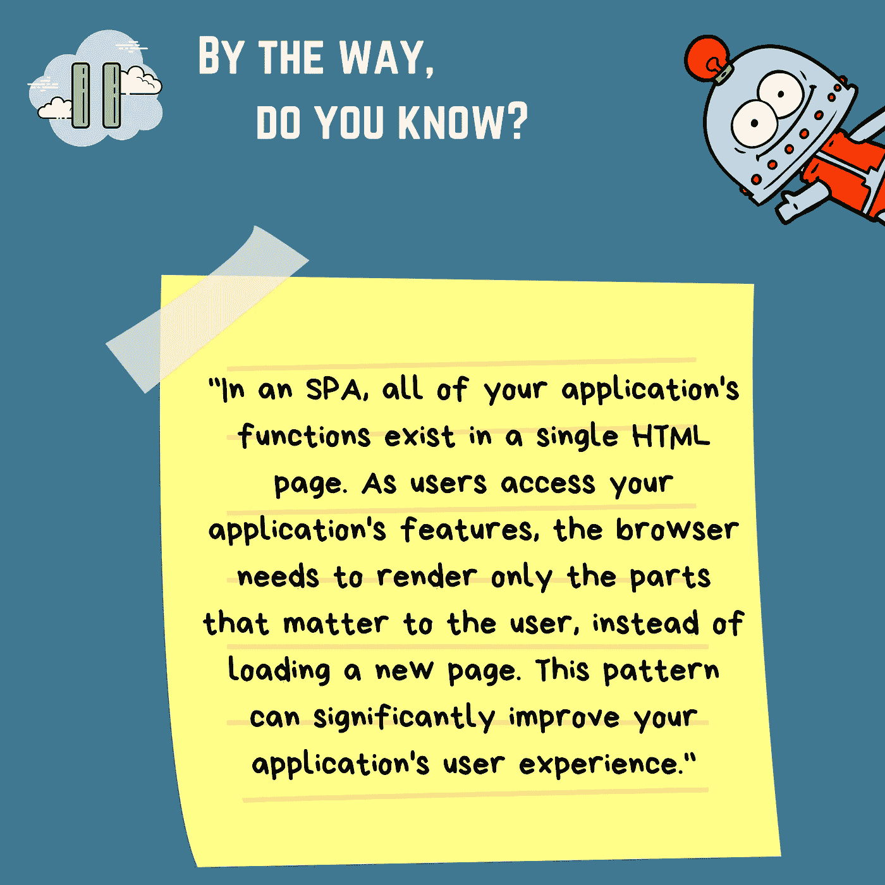

# 角度应用程序是如何工作的？

> 原文：<https://levelup.gitconnected.com/how-does-an-angular-application-work-8c4fac523a02>

## 你有没有好奇过一个有角 app 的幕后发生了什么？


你想知道角度应用是如何开始的吗？你想知道幕后发生了什么吗？亲爱的读者，这篇文章送给你！

故事从一个文件开始。哦，对了，每一个角度应用都要归功于`angular.json`。这不是应用程序的入口，而是一个 Angular 应用程序的启动，这要感谢这个配置文件。

# 切入点是什么？

如果你使用的是旧版本的 Angular，比如 Angular 4 或 Angular 5，你会发现你没有这个文件。取而代之的是 angular-cli.json。在 Angular 的最新版本中，它刚刚被重命名。

`angular.json`包含应用程序的所有配置。Angular builder 将查看该文件，以找到应用程序的入口。很好，我们找到了^^的入口

现在，让我们深入了解一下这个文件包含了什么。这里有一个`angular.json`的例子:

这个文件就像人类的 DNA。基于这个文件，我们知道我们正在使用哪个 UI 库、我们用来构建应用程序的构建器、索引文件的路径、聚合填充的路径、编译器的类型、我们正在使用的资产等等。

👀**注:**顺便说一句，每当我用新的 Angular app 开始一个新的任务时，我通常会从查看这个文件和`package.json`文件开始。它让我对应用程序的初始信息有了一个全局的了解。有时候，你也可以检测到 app 里是否有一些奇怪的东西(例如。在样式数组中有多个 UI 库)。你可以预期，应用程序可能需要一些清理。

在构建部分，您会发现`main`选项。在这里，我们通过提供`main.ts`文件的路径来指定应用程序的入口。所以这个文件是强制启动 app 的。如果您已经使用 Angular CLI 创建了应用程序，那么一切都会为您设置和生成。

## `main.ts`:

如您所见，这个文件的任务是为应用程序创建一个浏览器环境。接着是**的调用 *bootstrapModule* 的调用**。然后，应用程序被引导。

等一下。我跳过了一些东西。不是吗？

应用程序是如何被引导的，甚至引导了什么？


你说得对。这一点并不总是清楚的。我第一次学习这个学期，我想到了框架 bootstrap ^^'' …无论如何，让我们开始吧！

# App 的大门是敞开的。什么是自举？

每个应用程序至少有一个角度模块。引导启动应用程序的根模块称为引导模块。

因此，自举是一种加载和启动角度应用程序的机制或技术。这是当我们加载组件或模块，将被渲染。

既然我们找到了门。main.ts 通过由构建器执行以下步骤完成了它的工作:

```
platformBrowserDynamic().bootstrapModule(AppModule)
```

您可能已经注意到，我们传入了 AppModule。真正的 app 代码！是的，事实上，这就是包含我们的应用程序的代码。AppModule 就是所有的声明、组件、服务和所有与我们的应用程序相关的代码。

让我们检查一下著名的 AppModule 文件:

在 App 模块中，在@NgModule 装饰数组中，我们有一个引导数组。这里提供或添加了引导组件，因此在这一点上，角载荷 AppComponent。

但是，您可能想知道，从根组件到工作页面，缺少了什么。不是吗？它是如何被浏览器阅读和理解的？浏览器只知道 HTML，CSS，和 JS 吧？这个应用程序是用 Typescript 编写的。所以还发生了其他事情。

# App 的家是开放的。我们怎么在里面开房？

下面是 app.component.ts 文件的一个示例:

每个组件都声明有三个属性:
1 .**选择器** —用于访问组件
2。 **Template/TemplateURL** —包含组件
3 的 HTML。 **StylesURL** —包含特定于组件的样式表

在这之后，Angular 调用**index.html**文件。顺便说一下，Angular 是一个允许我们创建“单页应用程序”的框架，这里的**index.html**是由服务器提供的单页。



因此，该文件调用根组件 **app-root** 。根组件在 **app.component.ts** 中定义。index.html 的档案看起来是这样的:
:

根组件的 HTML 模板显示在`<app-root>`标签中。

好了，现在，我们知道了主页是如何呈现的。其他页面和其他组件是如何渲染的？

首先，index.html 总是被渲染。无论我们做什么，index.html 是主要的模板。改变的是基于 URL 的`<app-root>`标签中的内容。接下来是 app.routing.module.ts。由于`app.component.html`模板内的路由器出口，键入的 URL 的相应组件将呈现在`<app-root>`标签内，依此类推:

这里有一个用爱做的插图，让我们清楚地了解它是如何工作的:


请注意，到目前为止，您不需要为访问权限而烦恼。并非所有部件都有路线防护装置保护。不过，如果你好奇，我推荐你阅读以下内容:

[](/route-guards-angular-1ea6e596ce65) [## 路线防护装置—角形

### canActivate vs canActivate child vs can deactivate vs can load vs resolve

levelup.gitconnected.com](/route-guards-angular-1ea6e596ce65) 

这就是每个角度应用的工作方式，我们的故事到此结束。我希望你对 Angular 的内部工作原理有一个清晰的认识。请喜欢并留言鼓励我多写文章。


亲爱的读者朋友们，感谢你们的支持和宝贵时间。我希望这对你有用和有帮助。

**关注我上** [**中**](https://medium.com/@famzil/) **，**[**Linkedin**](https://www.linkedin.com/in/fatima-amzil-9031ba95/)**，** [**【脸书**](https://www.facebook.com/The-Front-End-World) **，**[**Twitter**](https://twitter.com/FatimaAMZIL9)**查看更多文章。**

回头见(ﾉ◕ヮ◕)ﾉ*:･ﾟ✧)

**FAM**