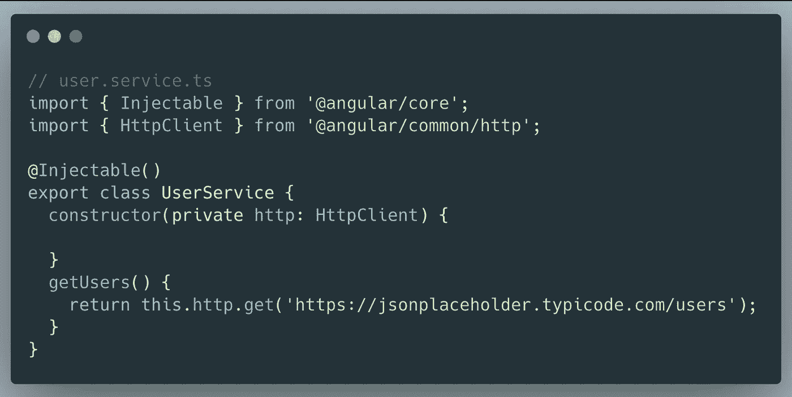
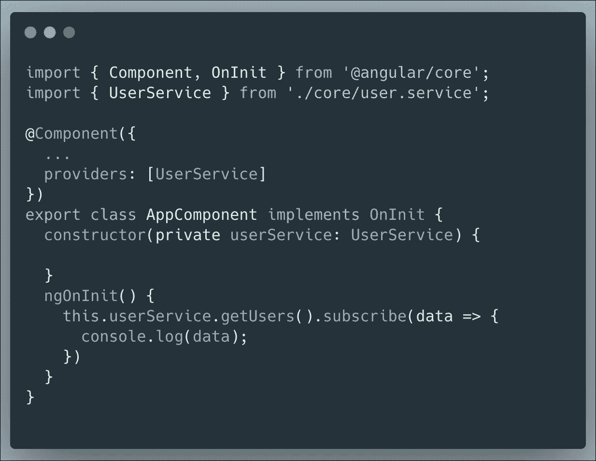
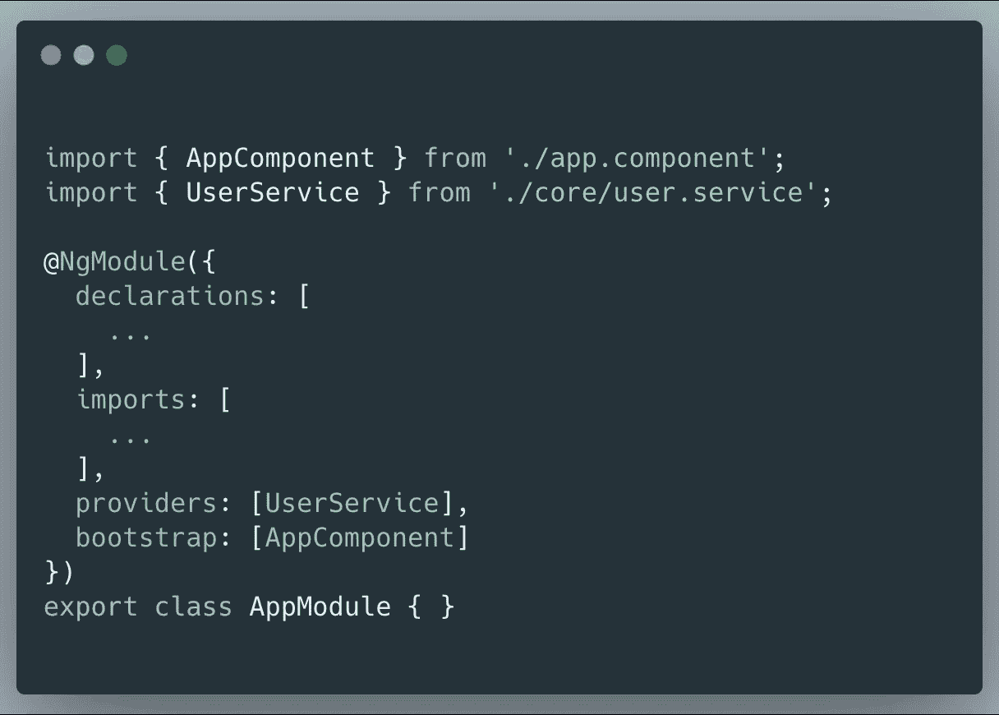
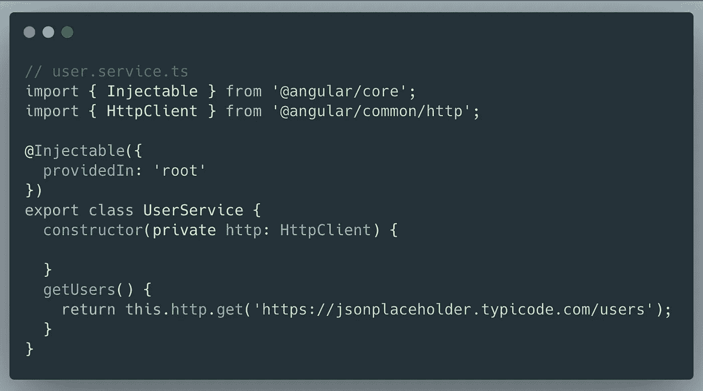

# 依赖注入如何在 Angular

> 原文：<https://levelup.gitconnected.com/how-does-dependency-injection-work-in-angular-6f398963de4c>

[Gabriel Porras](https://unsplash.com/@gabrielizalo?utm_source=medium&utm_medium=referral) 在 [Unsplash](https://unsplash.com?utm_source=medium&utm_medium=referral) 上拍摄的照片

> 在 Angular 中，依赖注入(DI)是一种编码模式，在这种模式中，一个类从外部源请求依赖，而不是自己创建依赖——Angular docs

依赖注入(DI)是 Angular 的核心概念，它允许一个类从另一个类接收依赖。在 Angular 中，大多数时候依赖注入是通过将一个服务类注入到一个组件或模块类中来完成的。

Angular 6 为我们带来了新的更好的`providedIn`语法，用于将服务注册到角度依赖注入机制中。

Angular 中的依赖可以是一个类，称为服务，甚至是一个简单的对象。让我们创建依赖，并将其注入到不同的类中。

用户服务

`@Injectable`装饰器将一个类标记为可以作为依赖项提供和注入。

用`@Injectable`标记一个类可以确保在注入类时，编译器会生成必要的元数据来创建类的依赖项。

## 让我们将服务注入组件

在 Angular 6 之前，唯一的方法是在`@NgModule`装饰器或者`@Component`或者`@Directive`的`providers: []`属性中指定服务

在这种情况下，服务不是单例的，每次在另一个组件的模板中使用该组件时，我们都会获得所提供服务的一个新实例。这也意味着服务实例将与组件一起被销毁。

我们可以直接将服务全局注入到模块中，而不是将服务局部注入到`Component`中。

在这个场景中，服务是单例的，它不会在我们每次使用组件时都创建一个新的实例。

## Angular 6+中 DI 的新方法

Angular 6 为我们带来了新的更好的`providedIn`语法，用于将服务注册到角度依赖注入机制中。

新语法非常简单，使用`providedIn`解决方案的主要好处是，只有当我们在任何组件中使用服务时，服务才会被捆绑。否则，它将不是初始包的一部分。

## 结论

当`providedIn: 'root'`应该作为单件在整个应用程序中可用时，将它用于服务。

使用`@Component`或`@Directive`中的`providers: []`来限定特定组件子树的服务范围，这也将导致创建多个服务实例。

## 参考

[战斧](https://medium.com/@tomastrajan/total-guide-to-angular-6-dependency-injection-providedin-vs-providers-85b7a347b59f)中篇
棱角

感谢阅读:)