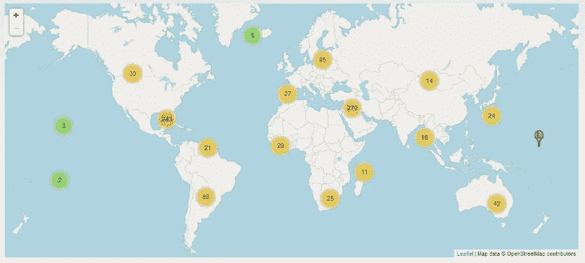
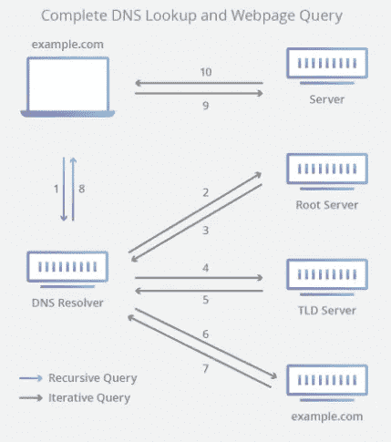

# DNS 是如何工作的？

> 原文：<https://levelup.gitconnected.com/how-does-dns-work-f75f27525468>

首先，让我们简单解释一下什么是 DNS 或域名系统。当我们想访问一个网站时，我们输入它的域名，页面就会出现，但在我们眼前发生的事情非常复杂和有趣。我们最喜欢的网站可能有一个像 104.31.65.108 这样的 IP 地址，但显然这是不实际的，因为大多数人不会记得它，然而，域名 templeoftech.net 更容易记住。DNS 是互联网的核心部分，它提供了一种用 IP 地址连接域名的方式。

泰勒·维克在 [Unsplash](https://unsplash.com?utm_source=medium&utm_medium=referral) 上的照片

为了让我们理解这个过程，我们必须在访问我们需要的页面之前学习请求的步骤。这些都发生在后台，并被优化为超级快速，这样我们就不必等待太久。当我们在输入域名后按“Enter”键时，第一个查询就开始了通过互联网服务器的旅程。找到您的网站不是猜测，因为这将需要字面上的年龄，因为有大约 1.607 亿注册域名。com 和。net 放在他们名字的末尾。

# “递归解析器”服务器

查询与之交互的第一个服务器是递归解析器，它通常由 ISP 或任何其他第三方公司操作。递归解析器知道它需要其他哪些 DNS 服务器来回答查询。在找到 IP 地址之前，它必须执行的查询路由如下图所示。但是，这不是该服务器的唯一功能。

如果 IP 地址信息已经在高速缓存或存储器中，递归 DNS 服务器将立即把地址返回给浏览器，用户将被带到该站点。这个缓存功能是使整个系统高效快速的因素之一。比方说，我的网站每隔一天更换一次 IP，只有当天我的网站的第一个用户必须完成完整的路线，其他人只是要立即从缓存中获取信息，直到它过期。

# “根服务器”

如果所需的信息没有存储在缓存中，递归解析器服务器首先连接到根服务器。这些“根服务器”在世界各地运行，每个服务器都知道顶级域名(如. com)的信息。这些服务器只有 13 个，它们服务于根区域，而且它们位于将域名映射到 IP 地址的层次结构的顶端。此外，还有数千台服务器支持根，这些服务器根据互联网活动最频繁的位置进行战略性部署。

图片由 root-servers.org 提供

# TLD 域名服务器

(TLD) DNS 或顶级域名服务器在他们的 TLD .com 中存储二级域名(如 templeoftech.net)的地址信息。当查询到达该目的地时，TLD 以域名服务器的 IP 地址作为响应。接下来，递归解析器将查询发送到域名服务器。DNS 服务器知道 IP 地址并完整地返回它。现在，您的查询已完成路线，网站出现在您的屏幕上。如果这个解释很难完全理解，让我们一步一步往下看。

# DNS 查找的步骤

1.  用户在 web 浏览器中键入“example.com ”,该查询进入互联网并被 DNS 递归解析器接收。
2.  然后，解析器查询 DNS 根域名服务器。
3.  然后，根服务器用顶级域(TLD) DNS 服务器的地址(例如。com 或者。net)，它存储其域的信息。在寻找 example.com 的时候，我们的要求是指向。com TLD。
4.  然后，解析程序向。com TLD。
5.  然后，TLD 服务器用域名服务器 example.com 的 IP 地址作出响应。
6.  最后，递归解析器向域名服务器发送一个查询。
7.  然后，example.com 的 IP 地址从名称服务器返回给解析器。
8.  然后，DNS 解析器用最初请求的域的 IP 地址来响应 web 浏览器。
9.  浏览器向 IP 地址发出一个 [HTTP](https://www.cloudflare.com/learning/ddos/glossary/hypertext-transfer-protocol-http/) 请求。
10.  该 IP 上的服务器返回要在浏览器中呈现的网页(步骤 10)。

[图片来源](https://www.cloudflare.com/learning/dns/what-is-dns/)。