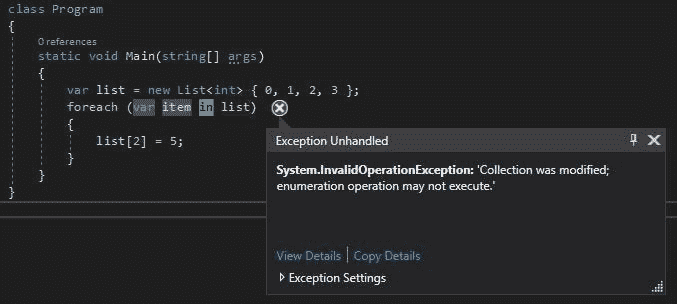
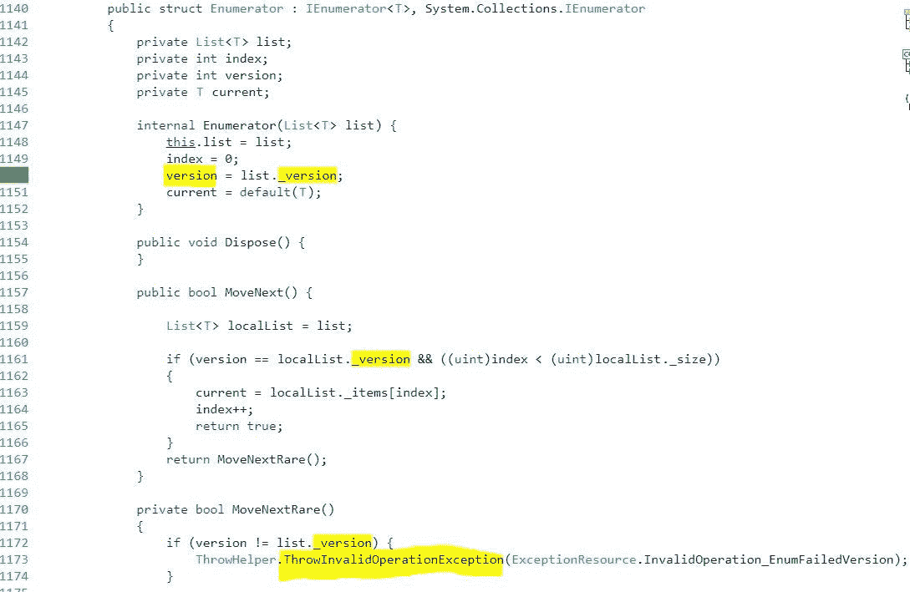

# foreach 如何跟踪更改？

> 原文：<https://levelup.gitconnected.com/how-does-foreach-keep-track-of-changes-fe64f97058fe>

我们都知道,`foreach`循环被设计成读取集合，而不是写入集合。

这就是为什么下面的结果是一个`InvalidOperationException`:

# 它如何跟踪集合中的变化？

这是通过`List<T>`类中一个名为`_[version](https://referencesource.microsoft.com/#mscorlib/system/collections/generic/list.cs,43)`的 int 完成的。

每当集合被更新时，`_version`就会增加，方法如下:

*   索引器设置器方法
*   `Add()`
*   `Clear()`
*   `Insert()`
*   `InsertRange()`
*   `RemoveAll()`
*   `RemoveAt()`
*   `RemoveRange()`
*   `Reverse()`
*   `Sort()`

当在`foreach`中枚举`List<T>`时，调用`GetEnumerator()`方法，该方法返回名为`[Enumerator](https://referencesource.microsoft.com/#mscorlib/system/collections/generic/list.cs,1140)`的结构的实例。

`Enumerator`有自己的`version`变量，该变量只初始化一次，使用来自`List<T>._version`的值，并且永不改变。

在`foreach`的每次迭代中，都会调用`MoveNext()`方法来检查`List<T>._version`是否与`version`相同。

如果它们不是相同的值，则会引发异常:

阅读这篇文章来学习一个绕过这个异常的有趣技巧。