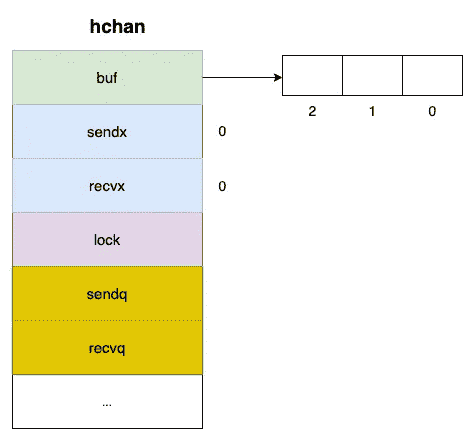

# Golang 频道是如何运作的

> 原文：<https://levelup.gitconnected.com/how-does-golang-channel-works-6d66acd54753>

## 了解戈朗通道的内部运作


Goroutine 和 Channel

一个 **goroutine** *是一个轻量级的用户空间线程，由 Go 运行时管理。它同时执行任务，可能是并行的*。**

一个**通道**用于 goroutines 之间的通信。

在这篇文章中，我们将深入探讨通道的内部工作原理及其发送/接收操作。

# 制作缓冲通道

让我们首先为下面的解释创建一个缓冲通道。

```
ch := make(chan int, 3) 
```

上面的语句创建了一个缓冲通道，最多可容纳 3 个类型为`int`的值。

在底层，函数`make`在堆上分配一个`hchan`结构，并返回一个指向它的指针。

下面是`hchan`结构的一些字段及其解释。


`hchan`结构的一些字段

```
type **hchan** struct { buf      unsafe.Pointer
 sendx    uint
 recvx    uint
 lock     mutex

 ...   // other fields}
```

*   `buf`是指向一个数组的指针，该数组维护一个**循环队列**
*   `sendx`是数组中已发送元素的索引
*   `recvx`是数组中接收到的元素的索引
*   `lock`确保通道的读写是原子操作

# 解除阻塞发送和接收

当通道未满时，我们可以在循环队列后面无阻塞地插入元素。

```
// G1 sends three elements into the channel, capicity = 3ch <- elem1
ch <- elem2
ch <- elem3
```


解除阻塞发送操作

当通道不为空时，我们可以从循环队列的前面无阻塞地接收元素。

```
// G2 receive three elements from the channel, capicity = 3<- ch
<- ch
<- ch
```


解锁接收操作

# 等待路线

在处理 goroutines 之间的阻塞时，其他字段也很重要。让我们看一看。



`hchan`结构的一些字段

*   `recvq`在试图读取通道上的数据时，存储阻塞的 goroutines。
*   `sendq`尝试从通道发送数据时，存储被阻止的 goroutines。

> 记住`recq`和`sendq`都是链表。

```
type **hchan** struct { buf      unsafe.Pointer
 sendx    uint
 recvx    uint
 lock     mutex

 sendq    **waitq**   
 recvq    **waitq** ...   // more fields}type **waitq** struct {
  first *sudog      
  last  *sudog
}// pseudo goroutine
type **sudog** struct {
  g     *g
  elem  unsafe.Pointer 
  next  *sudog      
  prev  *sudog
  ... c     *hchan}
```

# 从空信道接收

当通道为空时，接收操作会导致当前 goroutine 阻塞。所有阻塞的 goroutines 都存储在`recvq`队列中。


从空信道接收

> 阻塞的是 goroutines，而不是 OS 线程。

那么，阻塞的 goroutine 什么时候恢复？

答案是当一个新的 goroutine 在通道上执行发送操作时。

以下是细节。

1.  新的 goroutine 将新数据直接复制到第一个等待的 goroutine 的元素中
2.  第一个等待程序从`recvq`弹出
3.  运行时调度器设置弹出的 goroutine runnable，并把它放在它的'`runqueue`。然后被阻塞的 goroutine 被触发并准备再次运行。


接收 goroutine 以继续

# 在完整信道上发送

当通道已满时，下一个发送操作会阻塞它们各自的 goroutines。所有阻塞的 goroutines 都存储在`sendq`队列中。


在完整信道上发送

在另一个 goroutine 接收之前，被阻塞的 goroutine 将继续运行。以下是详细情况:

1.  当新的 goroutine 在通道上执行接收操作时，缓冲区中的第一个元素将被删除
2.  第一辆等待的戈罗廷从`sendq`起飞
3.  poped goroutine 的元素被复制到缓冲区中
4.  运行时调度器设置弹出的 goroutine runnable，并放在它的'`runqueue`。然后被阻塞的 goroutine 被触发并准备再次运行。


发送 goroutine 以继续

渠道是围棋中一个非常强大而有趣的机制。希望这篇文章能解释 Go 中通道的基本工作原理。

下面的视频绝对值得一看，有时间一定要看。

同样，如果你喜欢这篇文章，请鼓掌，让其他人也能看到。💚

参考文章:

*   [潜入戈朗海峡深处](https://codeburst.io/diving-deep-into-the-golang-channels-549fd4ed21a8)
*   [Golang 中的并发和并行](https://medium.com/@tilaklodha/concurrency-and-parallelism-in-golang-5333e9a4ba64)
*   [Go a Tale of Concurrency 初学者指南](https://medium.com/swlh/go-a-tale-of-concurrency-a-beginners-guide-b8976b26feb)