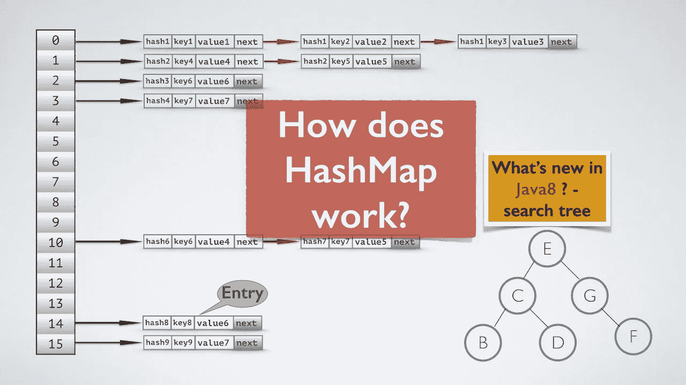

# 散列表如何在内部工作

> 原文：<https://levelup.gitconnected.com/how-does-hashmap-work-internally-612dd950822f>

嘿大家好👋,

我又回到了另一个有趣的话题，那就是“散列表”。在本文中，我们将学习 hashmap 以及 hashmap 的内部工作原理。

这是一个非常重要的面试问题。在我过去的一次采访中，有人问我 hashmap 的工作方式，我在很多解决方案中都使用了它。

对于所有的问题解决者来说，HashMap 是解决编码问题最受欢迎的数据结构之一。连我也是其中之一😆。散列表可以让问题的解决变得更加容易和快捷。让我们找出原因😉

在这个编程世界中，散列是一种存储键值对的方法，这是通过利用 Java 中的 HashMaps 来实现的。因为我用 Java 编码，所以我将讨论 Java 中散列表的工作方式。

> **什么是 HashMap？**

HashMap 类是 Java 集合框架的一部分，用于存储键值对中的元素。hashmap 中的所有键都是唯一的。它允许通过键检索值。

假设您想要存储员工的详细信息，比如员工 id 和员工姓名，那么您可以使用 hashmap 轻松地存储它们。雇员 id 作为键，雇员姓名作为值，可以映射到雇员 id。

**关于 hashmap 需要记住的一些要点:**

*   用于使用哈希表存储键值对
*   只允许唯一的键
*   Hashmap 不保证元素的顺序

> **如果我们试图在一个散列表中用同一个键存储多个值会怎么样？**
> 
> 嗯，答案是否定的！在 HashMap 中，不能用同一个键存储多个值。如果您尝试这样做，那么将会发生重写，即旧的键值对将被新的键值对替换。

**散列表的内部工作:**

散列表使用散列表，然而，它在内部使用两种数据结构实现，即数组和链表。每当你在内部声明一个 hashmap 时，它都会创建一个桶数组。这些桶被称为节点，或者你可以说是一个链表。一个节点可以表示:

*   哈希码
*   钥匙
*   价值
*   下一个节点的地址



HashMap 的内部工作

现在，当您使用 HashMap 类的 put()方法在键中插入值时，hashcode 将由 put()方法生成。Hashcode 使得接收值的过程更快更容易。这个 hashcode 被进一步计算，它将生成用于存储值的索引。

我们的键的值将以链表的形式存储在 hashcode 给出的索引中。

为了更有效地检索键值对，Java 8 引入了二叉查找树(BST)来代替链表。

现在，让我们看看如何计算索引来存储值。

> **HashMap 中的索引计算:**

键的 Hashcode 可能非常大，无法创建数组。生成的 Hashcode 可能在整数的范围内，如果我们为这么长的范围创建数组，那么它可能是一个消耗内存的任务。

```
**index = hashCode(key) & (length-1)**
```

表达式`**hashcode & (length-1)**`使用`**length-1**`对`**hashcode**`进行逐位`**AND**`，这就像一个位掩码，只返回`**hashcode**`的低阶位，从而形成了`**hashcode % length**`的超快速变体。

> 在 Hashmap 中，put(插入)、remove(删除)和 get(搜索)操作是在固定的时间执行的，也就是说，时间复杂度是 **O(1)** ，假设键值对在桶中分布良好。

**散列表中的冲突:**

哈希冲突是指对于两个或更多不同的记录，哈希函数返回哈希表中相同的桶位置。这是使用 hashmap 的主要缺点。

HashMap 使用这两种方法来处理冲突:

1.  单独链接
2.  散列地址

用于独立链接的数据结构是

1.  链表
2.  自平衡二叉查找树
3.  动态大小数组

在链接中，所有映射到同一个索引的键值对都将存储在该索引的链表中。类似地，二分搜索法树也可以用于链接。

碰撞是一个需要了解的非常重要的话题。我将分享一篇关于这方面的文章。

这是我到目前为止对 HashMap 的所有了解。如果你觉得这篇文章有用，那就给它一个掌声。

快乐学习！！！