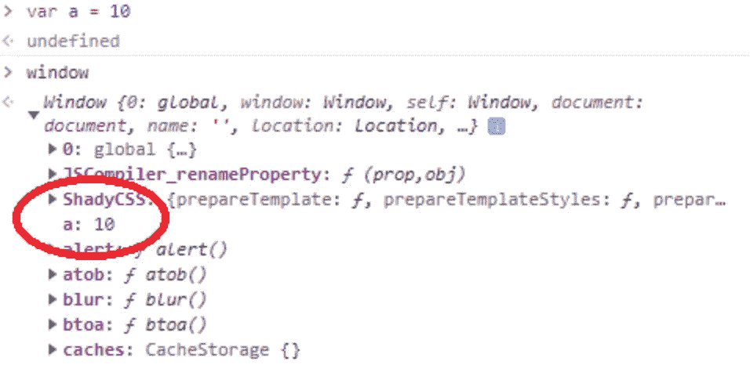
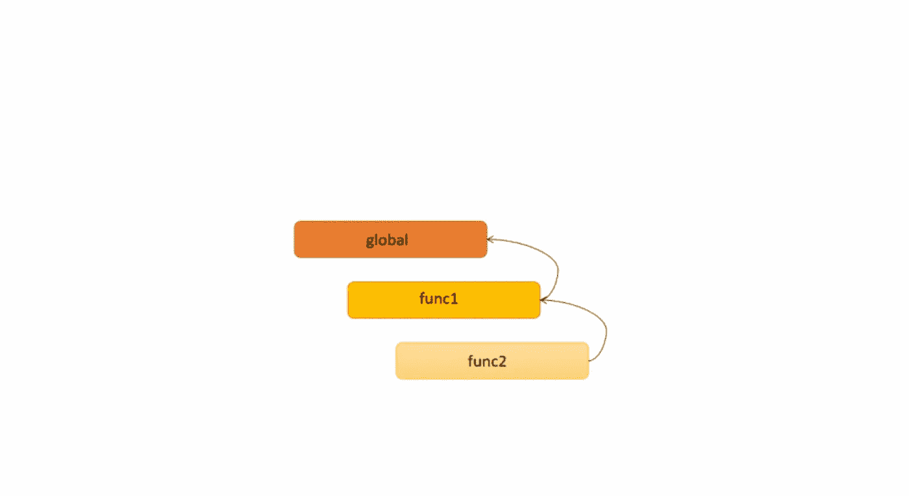

# JavaScript 作用域是如何工作的？

> 原文：<https://levelup.gitconnected.com/how-does-javascript-scoping-work-f0f6b79ae896>


萨法尔·萨法罗夫在 [Unsplash](https://unsplash.com?utm_source=medium&utm_medium=referral) 上拍摄的照片

根据 MDN 的定义，JavaScript 中的“作用域”就是当前执行的上下文。这到底意味着什么？作用域定义了当前可访问性范围内的变量和值，它也可以被称为变量的环境。让我们直接看一个例子:

```
function hello(){
    var phrase = "Hello";
    console.log(phrase + " Dylan");
}console.log(phrase);
```

我们有一个名为 hello()的函数，并在函数中定义了一个名为“phrase”的变量。如果我们试图从函数外部访问变量“短语”,我们会得到这个错误:

```
Uncaught ReferenceError: phrase is not defined
```

这很容易理解吧？从全球范围来看，我们不知道什么是“短语”。

但是，如果我们定义了一个全局变量，并试图在函数内部使用它:

```
var person = "Dylan"function hello(){
    var phrase = "Hello";
    console.log(phrase + " "+ person);
}hello()
```

我们将获得:

```
Hello Dylan
```

从这里我们知道，作用域遵循层次结构，子层可以访问父层的变量，但反之则不行。

在我们上一篇文章( [JavaScript，单线程但非阻塞](https://medium.com/gitconnected/javascript-single-threaded-but-non-blocking-45c26d4d5bcc))中，我们提到 JavaScript 引擎有一个函数执行上下文的调用栈。当创建全局执行上下文时，还会引入全局变量环境。如果我们现在定义一个全局变量，这个变量将被添加到全局对象(浏览器的窗口对象)下。



每个执行上下文都有一个局部变量环境，称为局部范围。如果我们试图在当前的执行上下文中访问一个变量，它将开始在局部范围内寻找这个变量。如果没有找到该变量，它将向上到父作用域去寻找它。这就是所谓的范围链。例如:

```
function func1(){
    var a = 20;
    return function func2(){
        console.log(a);
    }
}var a = 10;func1()();
```

在这个例子中，代码试图寻找变量 *a* ，因为它在 func2 中使用。在 func2 范围内找不到它之后，它将向上找到 func 1(a = 20)。因此，控制台日志的结果是 20。

*范围执行上下文链*



如果我们把代码改成这样会怎么样:

```
function func1(){
    var a = 20;
    return func2()
}function func2(){
    console.log(a);
};var a = 10;func1()
```

这次它印出了 10 张。为什么会这样呢？我们必须引入另一个术语，叫做词法作用域，这个作用域是我们决定函数定义的位置，而不是调用的位置。在第一个例子中，func2 被定义在 func1 中；因此，它将接触 func1 来寻找不在其当前范围内的变量。然而，在第二个示例中，func2 是在全局范围内定义的(与 func1 是同一级别)，因此它将在全局范围内查找丢失的变量。

希望这能让您对 JavaScript 作用域的工作原理有一个简单的了解。在我们以后的文章中，我还将引入提升、闭包、块范围等概念，让您有一个更清晰的了解。

如果你想看更多的网络开发或软件工程相关的内容，请关注我。干杯！