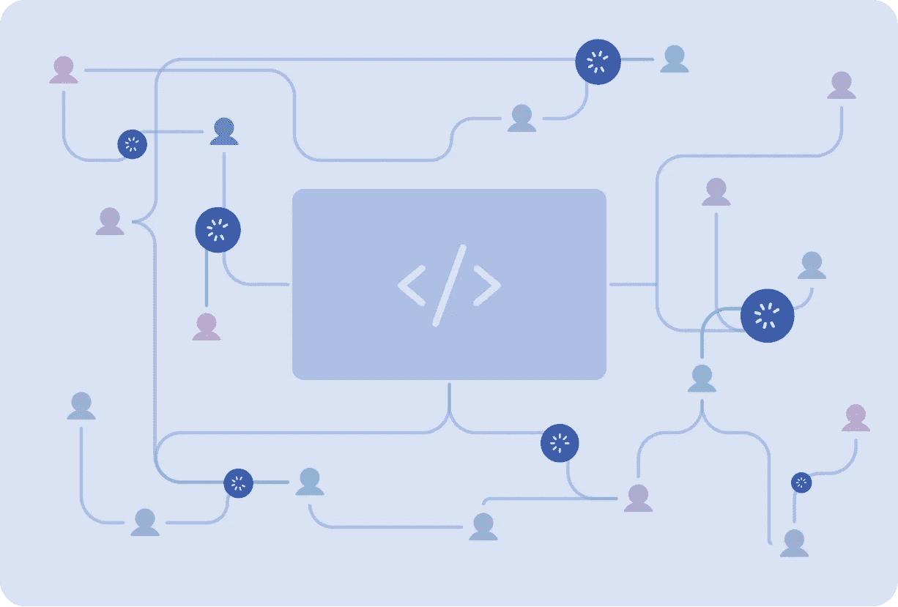
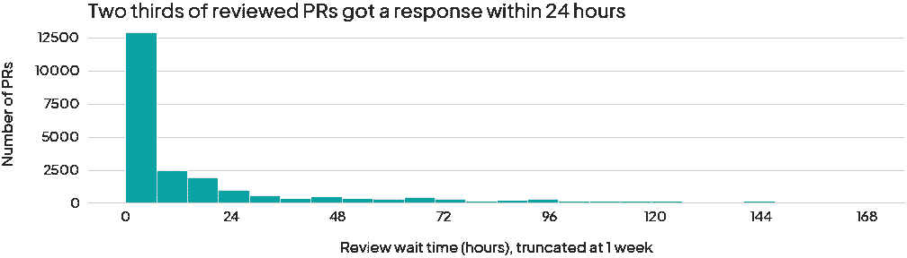
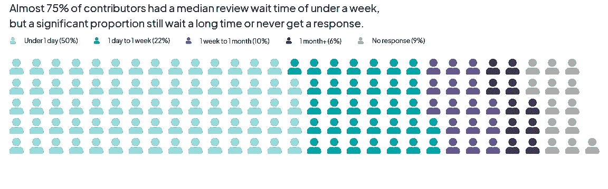
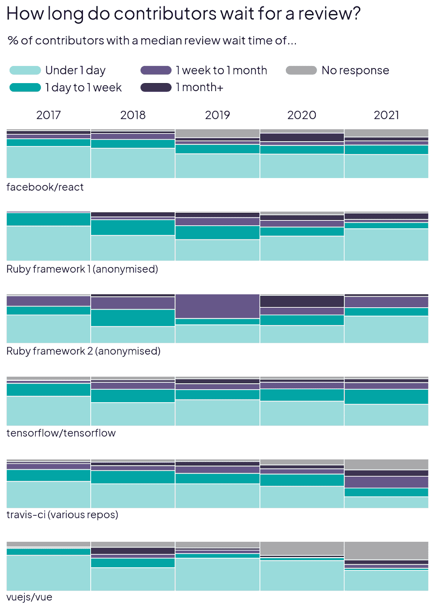
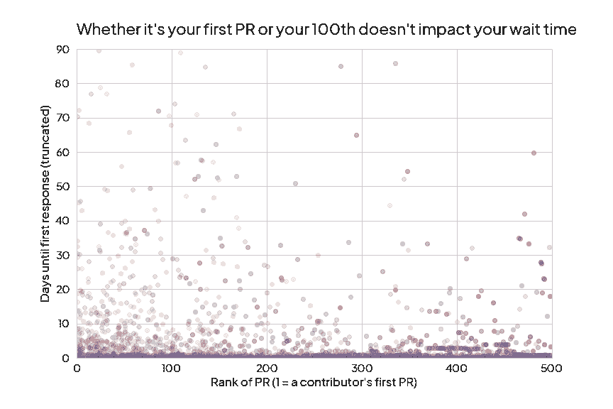

# PR 评审等待时间如何影响你的开源项目？

> 原文：<https://levelup.gitconnected.com/how-does-pr-review-wait-time-affect-your-open-source-project-d79bd0af0ea3>



你好！我是珍妮，是 [*众*](http://multitudes.co/) *的数据科学家。我想看看我们在大众中提供的见解是否对开源软件(OSS)社区有所帮助，这是我们在技术世界中所依赖的。我与 OSS 的贡献者交谈，阅读文献，并探索从 GitHub 挖掘的数据，以确定关键挑战&机会，这些挑战和机会不仅与 OSS 相关，而且与任何希望改善团队福利、协作和交付的软件团队相关。这是一个系列的第二部分——下面是第一部分*[](https://medium.com/gitconnected/how-to-grow-a-sustainable-inclusive-open-source-community-ce156214cc9f)*[*第三部分*](/how-to-create-a-better-first-time-contributor-experience-for-your-open-source-project-27300d6085ad)*[*奖金*](/how-to-mine-github-data-in-2022-e9c70b3f61d3) *。***

# **对于潜在的贡献者来说，PRs 上的长等待时间是令人讨厌的**

**熟悉软件开发的人会知道长时间等待对他们的 PR 的评估是什么感觉。特别是在开源软件(OSS)项目中，维护人员会承认长时间的审查等待会导致负面的贡献体验。这可能会阻碍项目急需的新贡献者。**事实上，研究表明，新人往往会因为必须等待很长时间才能获得对其 PRs 的反馈而气馁** ( [李等人，2021](https://ieeexplore.ieee.org/abstract/document/9332267) )，Mozilla 的[研究表明，维护者的响应能力是鼓励重复贡献的关键因素。然而，由于开源中的许多维护者是志愿者，所以有时很难及时响应所有未决的 PRs。](https://docs.google.com/presentation/d/1hsJLv1ieSqtXBzd5YZusY-mB8e1VJzaeOmh8Q4VeMio/edit#slide=id.g43d857af8_0177)**

# **审查等待时间对于 OSS 项目来说是一个有用的度量标准**

**古老的格言说，“你不能改善你不能衡量的”。尽管由于志愿者工作时间有限，开源社区并不总是有可能改善他们的等待时间，但是为了获得贡献者体验的可见性，对他们进行测量仍然是很重要的。有许多开发人员生产力的度量标准，如交付时间或部署频率，但是这如何应用于开源社区呢？在开源社区中，工作很大程度上是由志愿者驱动的。**

**我决定研究审查等待时间，以确定维护人员的时间最值得花的时间段。**审查等待时间是从创建采购订单到其他人对该采购订单做出第一次回应的交付时间的子集。**基本上是 PR 上什么都没发生，PR 作者在等评论的时候。我们可以用 GitHub 的数据来衡量这一点。**

**为了衡量这一点，**我从 2017 年到 2021 年(包括 2017 年和 2021 年)的 5 年时间范围内提取了 6 个不同开源项目的数据。这 6 个项目是 Tensorflow、ReactJS、VueJS、Travis CI 和两个更小的 Ruby 框架，它们的规模、功能和志愿者驱动与付费都各不相同。项目的规模从 5 年内有 500 个拉动请求的项目到有 20000 多个拉动请求的项目不等。我还排除了机器人的活动，它们通常会在 PR 打开时自动生成消息。关于我如何获得这些数据的更多信息在本系列的第 4 部分！****

**我计算了每个 PR 的审阅等待时间，从 PR 创建(或当它第一次被标记为准备审阅时，如果它是在草稿状态下打开的)，到第一次评论、审阅或被 PR 作者之外的其他人合并。僵尸工具或已删除用户的活动被排除在外。**

# **总的来说，审查等待时间往往很快**

**查看所有 6 个组织的 PRs 的审查等待时间，我发现实际上， **PRs 得到了相当快的响应！在得到回复的 PRs 中，大多数在 24 小时内得到回复。****

****

**但是，这并没有考虑到所有没有收到任何响应的 PRs 它们要么是自合并的，要么仍然是开放的，没有响应。在截至 2021 年底仍未解决的减贫战略中，没有回应的减贫战略的范围在 10%至 60%之间。**

# **在用户层面，体验到的典型等待时间有很大差异**

**上图显示了总体水平上的审核等待时间。然而，我们真正感兴趣的是这些指标如何转化为贡献者的体验。**当我查看每位投稿人的*中值*审核等待时间*时，我发现人与人之间存在相当大的差异。*****

****

**虽然数据集中几乎 75%的贡献者的平均等待时间不到一周，但仍有相当一部分贡献者倾向于等待很长时间才能得到第一次响应。例如，6%的贡献者的平均等待时间超过一个月。此外，几乎十分之一的贡献者没有对他们的任何减贫战略作出回应。**

****

**当然，这些值会因项目和时间的不同而不同。例如，我发现较小的社区存储库(如匿名的 Ruby framework 2)可能会有较长的等待时间，这是有道理的，因为它们可能没有一些较大的项目那么多专门的付费维护者。这就是为什么资助开源如此重要——它可以帮助改善贡献者的体验，从而影响开源的可持续性。此外，我们知道疫情对开源产生了影响——事实上，[许多项目的活动都有所增加](https://venturebeat.com/2021/01/26/how-the-pandemic-is-accelerating-enterprise-open-source-adoption/)。这将影响提交的拉取请求的数量，尤其是新来者提交的请求。虽然我们在 2020-2021 年的样本中没有看到所有 6 个项目的特定趋势，但很明显，审核等待时间会随着社区的发展而变化，因此在定期监控时最有用。**

**🌱*需要讨论的事情:在你的团队、社区或组织中，你希望合理的评审等待时间是多少？***

**人们等待时间变长可能还有其他更具体的原因。也许一些贡献者选择了复杂的问题来解决，这需要评审者留出更多的精力和时间来坐下来处理它。也许他们是新来的，不熟悉有贡献的规范——结果，他们的 PR 不是很清楚，评审者很容易发现，或者它没有解决一个紧迫的问题。**查看审核等待时间可以作为一个起点，让机构群体对他们所处的位置进行基准测试，并致力于逐步改善等待时间的长度和一致性。****

# **人们越做 PRs 就越快**

**之前分析中出现的一个假设是，审查等待时间是否会随着贡献者打开更多 PRs 而改变。我想看看相对较新的贡献者的 PRs 是否比已经提交 PRs 有一段时间的人的 PRs 等待审查的时间更长。**

**假设你的第一次公关的“排名”是 1，而你的第十次公关的“排名”是 10。较低“级别”的 PR 比较高“级别”的 PR 多得多，因为第一个 PR 比第 100 个 PR 多得多(不是每个人都达到 100 个 PR，但所有贡献者都有第一个 PR)。为了处理这个不平衡的数据集，我首先按等级对 PRs 进行分类，然后从每个分类中抽取一致的样本大小。如果我不这样做，结果将总是看起来像较低等级的 PRs 更有可能具有长的响应时间，纯粹是因为有更多具有各种响应时间的较低等级的 PRs，无论是短的还是长的。**

****

**上图显示了结果，用阴影区分每个样本。每个样本将 PRs 分成大小为 10 的桶(即一桶等级为 1-10、11-20 等的 PRs。).从每个桶中随机选择 10 个 PRs 并标绘。重复 10 次，结果绘制在同一图表上。看起来公关的级别和你等待回复的时间之间没有明显的关系！这让我很惊讶，因为我认为随着贡献者对项目的过程和规范越来越熟悉，他们可能会提交更清晰、更容易审查的 PRs(因此等待时间更短)。看起来维护者对 PRs 的反应是一致的，不管你是新手还是老手💝**

**🌱*拥有公关回应模板有助于缩短您的审核等待时间，同时设定对公关作者的期望。一句简单的“我已经看到了，我会在接下来的 X 天/周内处理它”会有很大的帮助！***

# **结论**

*   **审核等待时间是一个有用的指标，可以说明贡献者的部分公关体验。**
*   **大多数投稿人的平均审查等待时间不到一周，但请记住，也有许多人*只*经历了更长的等待时间。此外，有相当一部分人从未收到任何回复。**
*   **不管是你的第一次公关还是第 100 次公关，等待审核的时间都差不多。**

**无论您是开源社区的一员、一家初创公司还是一家企业公司，您都可以在评审等待时间采取以下措施:**

*   **一个清晰的、最新的 CONTRIBUTING.md 文件将大大有助于减少潜在的费用。你可以在网上找到很多模板——这里有一个是由[云本地计算基金会](https://contribute.cncf.io/maintainers/github/templates/required/contributing/)提供的，另一个来自[开源指南](https://opensource.guide/starting-a-project/#writing-your-contributing-guidelines)。[公关模板](https://docs.getdbt.com/blog/analytics-pull-request-template)也很方便！**
*   **[清楚的问题标签表明什么是好的第一个问题](https://help.github.com/en/articles/helping-new-contributors-find-your-project-with-labels)将大大减少新人选择太困难的任务并导致第一个 PR 拖延的机会——这对他们和评审者来说都不是一件有趣的事情！**
*   **让一个公关作者知道多久你会回复一个快速确认收到的回复，可以减少等待时间，减轻压力，设定明确的期望，并让作者放心，他们的作品已经被看到并将被考虑。**

**[第 3 部分](/how-to-create-a-better-first-time-contributor-experience-for-your-open-source-project-27300d6085ad)将探讨什么因素可能导致第一次贡献者离开或留在 OSS 社区。那里见！**

```
**🌱 Send us your feedback, questions, and thoughts via [Twitter](https://twitter.com/MultitudesCo), [LinkedIn](https://www.linkedin.com/company/multitudesco/), or [hello@multitudes.co](mailto:hello@multitudes.co)👉 Interested in ethical team health metrics? [Apply to join our closed beta!](http://multitudes.co/)**
```

# **分级编码**

**感谢您成为我们社区的一员！在你离开之前:**

*   **👏为故事鼓掌，跟着作者走👉**
*   **📰查看更多内容请参见[升级编码刊物](https://levelup.gitconnected.com/?utm_source=pub&utm_medium=post)**
*   **🔔关注我们:[Twitter](https://twitter.com/gitconnected)|[LinkedIn](https://www.linkedin.com/company/gitconnected)|[时事通讯](https://newsletter.levelup.dev)**

**🚀👉 [**加入升级人才集体，找到一份神奇的工作**](https://jobs.levelup.dev/talent/welcome?referral=true)**