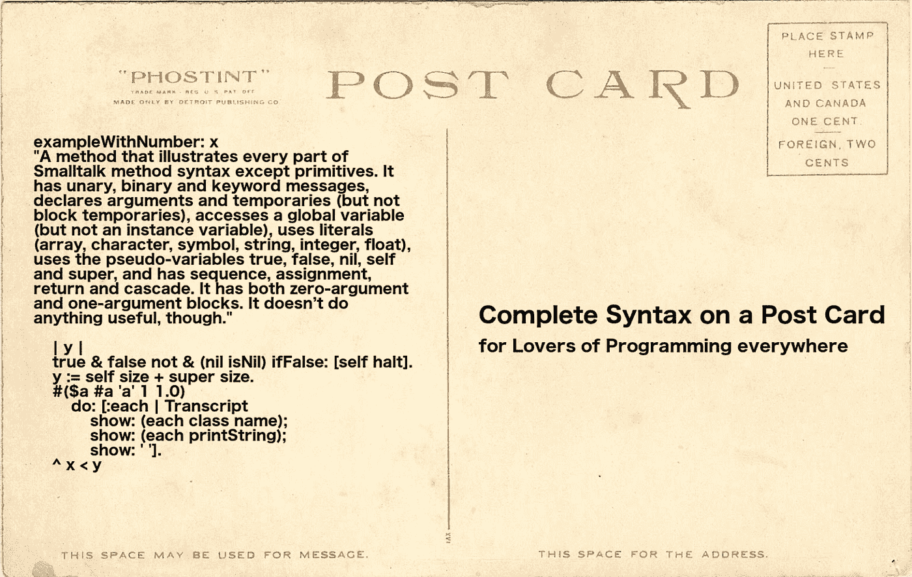
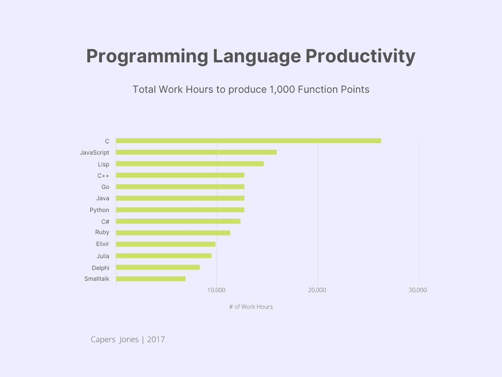

# Python 和 Smalltalk 相比如何？

> 原文：<https://levelup.gitconnected.com/how-does-python-compare-with-smalltalk-4e549d77171>

Python 是目前世界上最流行的编程语言，根据 [TIOBE](https://www.tiobe.com/tiobe-index/) 、 [PYPL](https://pypl.github.io/PYPL.html) 、 [IEEE Spectrum](https://spectrum.ieee.org/top-programming-languages-2022) 。RedMonk 将 Python 放在第二位。

Python 是招聘信息中最受欢迎的两种语言之一。

那么，Python 的巨大吸引力是什么呢？主要是 Python 易学，读起来像英语。对于大多数编程新手来说，这是容易做到的。

其次，Python 拥有丰富的库和工具生态系统。

但是，如果我告诉你，有一种编程语言比 Python 简单易学得多呢？事实上，Smalltalk 是专门为向年轻人教授编程而设计的(Python 不是)。Smalltalk 的所有语法都可以总结在一张明信片上(Python 的语法不能)。

Smalltalk 非常容易学习，你可以在 15 分钟内学会它的所有语法！用 Python 试试。[用 ProfStef](https://amber-lang.net/learn.html) 学习 Smalltalk。

事实是，尽管 Python 被大肆吹嘘为易于学习，但这种语言确实有许多奇怪之处，可能会让初学者感到困惑，并使 Python 成为一种更复杂的语言。我们来看几个…

首先，虽然 Python 和 Smalltalk 都是面向对象的语言，但 Smalltalk 是纯粹的、始终如一的面向对象语言，而 Python 主要是一种过程语言，具有面向对象的功能特性。

当您查看 Python 中的方法定义时，这一点最为明显:第一个参数必须始终是“self”对象。但是，当您在代码中调用此方法时，您不会将“self”对象作为第一个参数进行传递。很奇怪，你不觉得吗？

看看信息隐藏。Python 通过在名字前加下划线来“隐藏”实例变量。Python 使用这种约定和程序员规则来支持信息隐藏。感觉很糟糕，不是吗？

Python 区分了属性和特性。属性是不断更新的，而属性是静态的。经典的例子是物体的“长度”。这个属性需要被修饰成一个属性，这样它就可以根据需要不断更新。对象的实际“长度”由全局函数 *len()* 决定。困惑了吗？

其次，Python 和 Smalltalk 都在某种程度上支持函数式编程(数据不变性不可用)。然而，在 Python 中，lambdas 被限制在一行代码中。这是一个非常不方便的限制。

第三，在 Python 中，范围是半开区间。例如， *range(1，6)* 产生值 1，2，3，4，5，但不是 6。这是不直观的，这也是为什么大多数语言使用封闭区间(例如，1 到 6，*)。*

*第四，Python 中的多线程操作会受到全局解释器锁(GIL)的阻碍。*

*第五，Python 有特殊的作用域规则，这可能会令人困惑。比如看关键词*全球*和*外地*。*

*第六，Python 不需要变量声明。你可以通过给它赋值来创建一个新变量，即使这个新变量是一个印刷错误！*

*第七，虽然理论上可以用 Python 进行“实时编程”,但这并不常见。部分原因是 PyCharm 之类的工具不是为支持这一点而设计的。*

*而 Smalltalk 则是直播编程之王。根据 Capers Jones 在 2017 年发表的一项研究[，这几乎是 Smalltalk 的唯一使用方式，也是 Smalltalk 在所有主要编程语言中最具生产力的原因。](http://www.ifpug.org/wp-content/uploads/2017/04/IYSM.-Thirty-years-of-IFPUG.-Software-Economics-and-Function-Point-Metrics-Capers-Jones.pdf)*

**

*重要的是要记住，20 年前，Python 远没有今天这么受欢迎，它的生态系统也没有今天这么丰富。近年来，人们开始大量采用 Python，这就是它成功的原因。*

*给 Smalltalk 同样的机会，我预计它会把 Python 打得落花流水。*让 Smalltalk 再次变得伟大！**

*观看 [50 年的闲聊](https://www.youtube.com/channel/UCzipicZiZ1843jAqmSGgYwg)。*