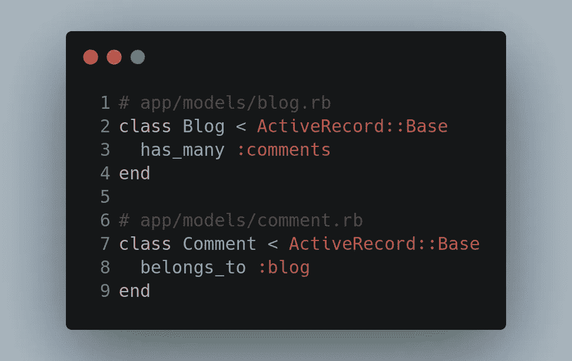
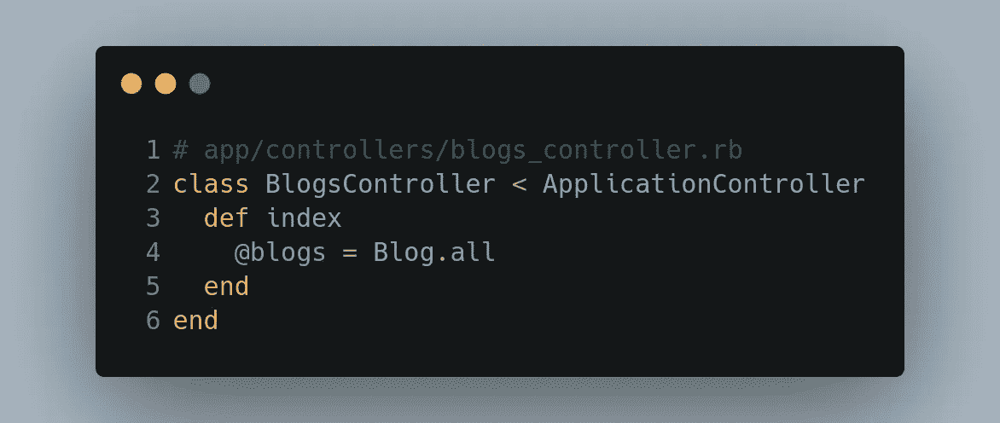
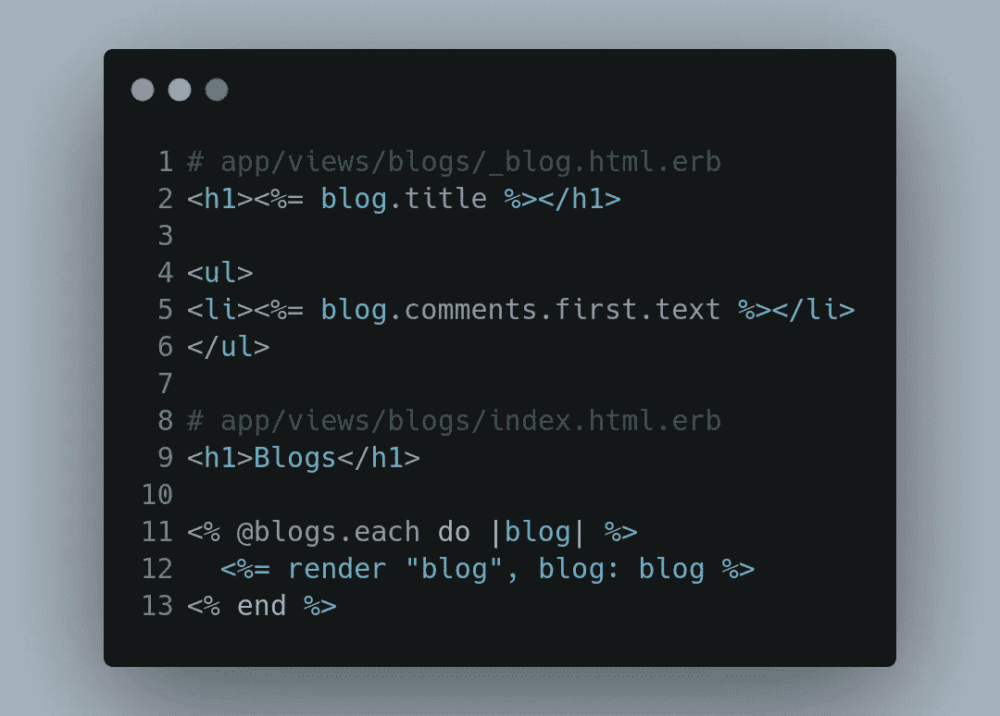
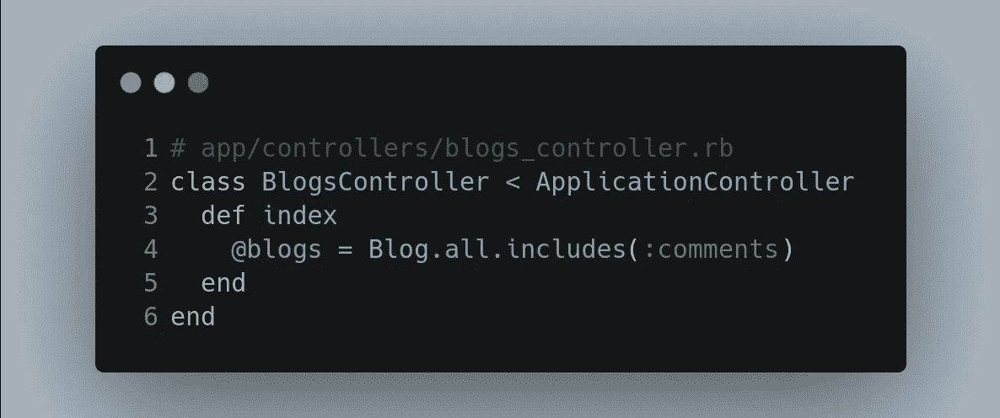
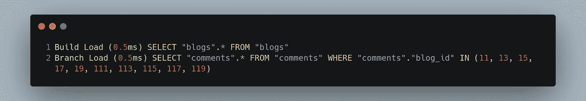

# 在视图中执行查询会降低应用程序的性能

> 原文：<https://levelup.gitconnected.com/how-doing-queries-in-views-can-degrade-the-performance-of-your-application-bf737622fdc4>

## 在 MVC 框架中优化查询

由 [Unsplash](https://unsplash.com?utm_source=medium&utm_medium=referral) 上的 [CHUTTERSNAP](https://unsplash.com/@chuttersnap?utm_source=medium&utm_medium=referral) 拍摄

MVC——模型视图控制器，软件开发中最流行的框架之一。我犯了很多错误，也看到其他人犯了同样的错误。

我使用 MVC 已经很多年了，也在各种语言中使用过。我工作过的一些流行的 MVC 框架有 Ruby On Rails、Django、Revel 等。

开发人员犯这些错误有很多原因。以下是我注意到的一些常见原因:

*   新手由于缺乏经验而犯错误。
*   专家对框架和错误感到舒服。
*   一个快速的改变，实际上是一个没有经过深思熟虑的改变。

影响应用程序性能的最常见错误之一是—在视图代码中查询数据库。

我将使用 Ruby On Rails 和 ERB 来演示查询可能在视图中引起的问题。

在本文中，我将演示如何使用 *Ruby On Rails* 和 *ERB* 。这可以适用于任何 MVC 框架。

# n + 1 查询

假设我们有以下两个模型:

让我们考虑一个博客应用，它有以下两种模式，博客和评论:

让我们假设有一个 GET route /blogs，它显示所有的博客，每个博客上有一个评论。

下面是获取所有博客的控制器:

控制器调用视图“app/views/blogs/index.html.erb”来呈现包含所有博客的页面。而“app/views/blogs/_blog.html.erb”是渲染博客的部分博客。

在这种情况下，如果在 *blogs* 表中有 100 个博客，那么将执行 1 + 100 个查询来呈现 index.html 页面:

*   1 从博客表中获取所有博客的查询。
*   在局部视图中，当调用 *blog.comments* 时，它会查询 comments 表以获取每个博客的评论。这个数到 100。

**解决方案**

同样的工作可以用 1 个或最多 2 个查询来完成。在 Rails 中，这被称为急切加载。不是在视图中运行查询，而是在查询博客时将评论加载到控制器本身中。

这执行两个查询:

第一个查询是获取所有博客，第二个查询是从第一个查询的结果中获取所有博客 id 的所有评论。

这将查询数量减少到 2。使用连接也可以做到这一点。

# 分散代码

在视图中编写查询会使您的代码看起来很糟糕并且难以理解。如果一个新开发人员只看控制器和输出，他可能很难理解。

**解决方案**

在模型中编写 DB 查询并在控制器中调用它们是 MVC 框架的精髓。没有这样的规则，但是遵循 MVC 的惯例会使你的代码更容易理解和修改。

# 数据库性能

更多的查询意味着更多的数据库负载。当查询发生在一个视图中时，它是一个经常被调用的 API，这会给数据库带来不必要的负载。

当从视图中执行查询时，如示例所示，在每次局部视图渲染时都会调用 DB。

**解决方案**

通过仔细设计模型和控制器来优化数据库查询可以减少数据库服务器上的负载。

 [## 每当 Amrit Pal Singh 发布内容时，您都会收到一封电子邮件。

### 每当 Amrit Pal Singh 发布内容时，您都会收到一封电子邮件。通过注册，您将创建一个中型帐户，如果您还没有…

singhamrit.medium.com](https://singhamrit.medium.com/subscribe) 

# 结论

尽管我已经给出了一个 *Ruby on Rails* 的例子，但是这个概念可以是任何 MVC 框架。

我经常看到开发人员犯这样的错误，有时是无意识的，但大部分是有意识的。我在评论中发现过这一点，犯过这样的错误，我自己也清理过很多次这样的代码。

以上例子要从理解概念的角度来看。代码没有优化。

你在 MVC 框架中遇到过这样的问题吗？

感谢阅读！