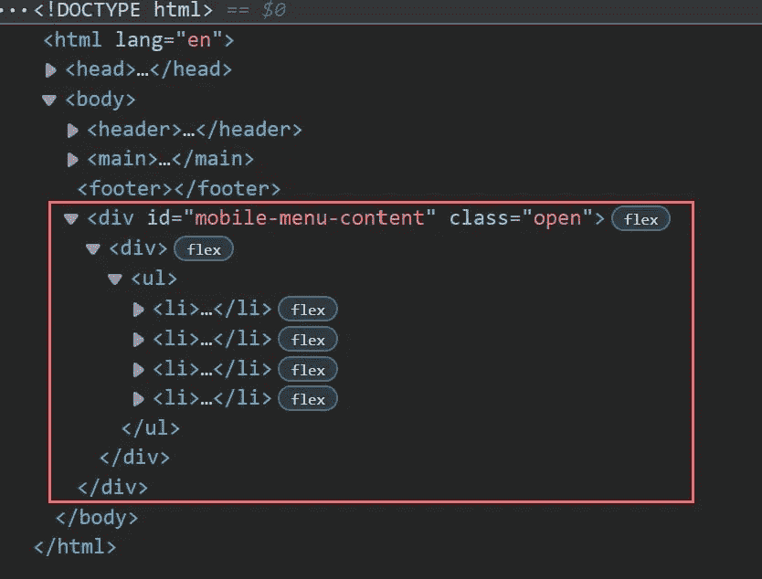

# 用 CSS 和 JavaScript 编写一份汉堡菜单有多简单

> 原文：<https://levelup.gitconnected.com/how-easy-i-code-a-hamburger-menu-with-css-and-javascript-5537d5669aa>

## 如何用 73 行 Javascript 编写移动菜单的快速教程。

## 这个概念

在事件监听器 *DOMContentLoaded* 中，我为每个页面调用一个函数`mobileMenu_init()`。此函数处理移动菜单是否必须显示、构建或销毁。

在窗口事件监听器 *resize* 中，我还调用了`mobileMenu_init()`来处理关于窗口大小调整的移动菜单。

在*构建函数*中， *JavaScript* 克隆导航中的所有链接。所以移动菜单是完全动态创建的。

*CSS* 通过媒体查询隐藏桌面导航。

JavaScript 为移动菜单构建的 HTML 代码

> 下面是**工作实例**:
> [https://www . Stephan-rom hart . de/medium . com/mobile-menu-vanilla-js/](https://www.stephan-romhart.de/medium.com/mobile-menu-vanilla-js/)

## HTML

对于本教程，我使用一个简单的 HTML。桌面视图的菜单位于`<nav>`元素内的`<header>`中。

在文件的`<head>`部分有两个文件链接:

*   样式的 **styles.css**
*   为了让菜单工作

# CSS

我假设你知道 CSS 的基础知识。为了给你看这个最简单的例子，我只定义了

*   一个简单的重置和一个桌面导航条，
*   *移动菜单按钮*，
*   *移动菜单内容*
*   以及*媒体查询*隐藏手机上的桌面导航

## CSS:全局变量和桌面版本

首先我做了一个简单的 CSS 重置(*第 3 行到第 6 行*)。变量定义字体大小、标题高度、菜单宽度和一些颜色(*第 12 行到第 20 行*)。第 25 到 63 行定义了主体和桌面标题(包括导航)的一些基本样式。

## CSS:移动菜单按钮

菜单按钮的大小由变量 mobile-menu-width 定义。

## 汉堡菜单:外观和动画

菜单的 HTML 完全来自 Javascript。为了让 3 行的菜单按钮变成 2 行的 **x** ，我用了 3 个``。JavaScript 向`
`添加了一个开放类，因此中间的``的不透明度设置为 0，第一个和最后一个``使用 transform 旋转。

处理 3 档开放式汉堡菜单。

## CSS:移动菜单内容

如果关闭，移动菜单内容位于 *-100vh* 。当点击移动菜单按钮时，#mobile-menu-content 获取类 *open* 。由于第 13 行的转换，菜单内容变成了动画。

第 18 行中额外的`
`是可选的，但是如果链接高于智能手机，这是一个解决方案。用一个简单的 *overflow-y:auto* 你可以在打开的菜单中滚动。

## CSS:媒体查询

通过这个简单的媒体查询，我只需隐藏桌面导航。

顺便说一下:如果你对如何用 notepad++更好地构建你的 CSS 感兴趣，请阅读我的文章😊

 [## 我如何用 Notepad++和函数列表跟踪大型 CSS 文件

### 这篇文章展示了我如何配置 notepad++并编写 CSS 代码在定义之间快速导航。

medium.com](https://medium.com/codex/how-do-i-keep-track-of-large-css-files-with-notepad-and-the-function-list-6b3ec567937d) 

# Javascript

正如介绍中提到的，我在文档事件监听器 *DOMContentLoaded* 和窗口事件监听器 *resize 中调用了`mobileMenu_init();`。*

为了让菜单工作，我使用了五个功能:

*   🚩mobileMenu_init()
*   ▶️ mobileMenu_show()
*   🛠️ mobileMenu_build()
*   🔃移动菜单 _ 切换()
*   💣mobileMenu_destroy()

在接下来的步骤中，我将详细解释所有五个功能。最后，我展示了整个 javascript 文件。

## mobileMenu_show()

此功能检查是否必须显示移动菜单。使用 [window.matchMedia](https://developer.mozilla.org/en-US/docs/Web/API/Window/matchMedia) 方法，可以在 JavaScript 中检查媒体查询。在本例中，移动的*断点的最大宽度为 1024 像素。*

## 🚩mobileMenu_init()

该函数初始化完整的菜单行为。

我检查移动菜单是否必须显示(*行 3* )。

如果必须显示，我会检查菜单是必须构建(*第 5 行*)还是必须销毁(*第 18 行*)。

如果必须构建，我会在标题的`<nav>`元素中添加移动菜单按钮的 HTML。然后我调用`mobileMenu_build()`从`<header>`中现有的导航构建移动菜单内容。最后我定义了手机菜单按钮上的*点击事件*。

## 🛠️ mobileMenu_build()

该函数为移动菜单内容创建元素，并将其附加到正文中。

*menu_content_overflow* 是一个可选的容器，用于处理长导航，这样用户可以使用 CSS 的 *overflow:auto* 在里面滚动。

为了从标题中获取所有的桌面导航链接，我只是克隆并附加到菜单内容 div ( *第 10 行*)。

## 🔃移动菜单 _ 切换()

该函数在*点击事件*内的`mobileMenu_build()`函数中调用，处理菜单按钮和菜单内容打开状态。

## 💣mobileMenu_destroy()

如果菜单存在，并且用户调整浏览器大小以显示桌面版本，我只需删除菜单按钮和菜单内容的元素。

# 完整的 Javascript

为了完整起见，这里是完整的 Javascript 文件。

# 结论

这篇文章展示了我的移动菜单解决方案。我尽量保持简单。同时，我演示了如何使用 CSS 和溢出容器来制作菜单按钮的动画，如何处理比标准智能手机屏幕高得多的移动导航。

我自己做代码分析。

**感谢阅读。** 期待您的反馈。😍

请评论、书签或关注我，支持我的频道。

如果你心中有一个特定的主题，你会希望我写下来，让我在推特上知道:[https://www.twitter.com/@stephan_romhart](https://www.twitter.com/@stephan_romhart)