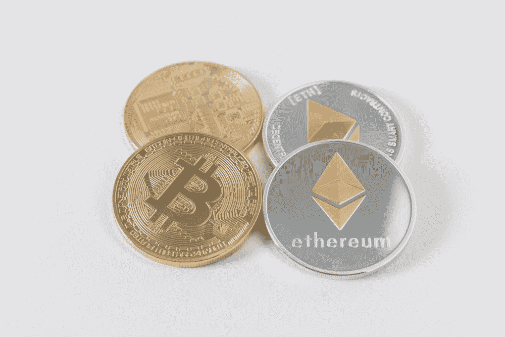
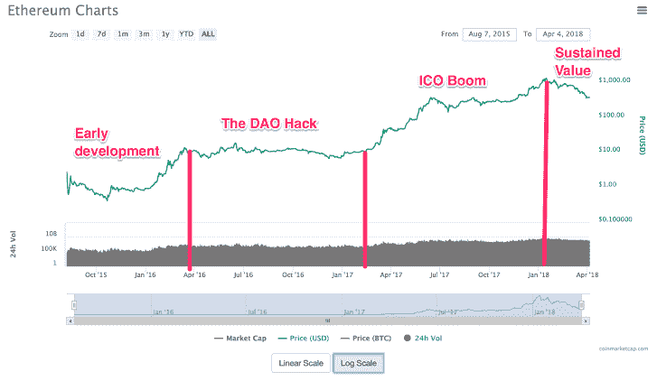

# 以太坊如何逆转 5000 万刀的攻击！

> 原文：<https://levelup.gitconnected.com/how-ethereum-reversed-a-50-million-dao-attack-cee528d8c030>

## 成功避开网络威胁

以太坊是一个基于区块链的开源平台，支持智能合约。以太，以太坊平台产生的加密货币是目前第二大最有价值的加密货币。【2016 年 6 月，以太坊发现自己受到攻击，当时一名未知黑客利用一些现有漏洞窃取了超过 360 万以太币，价值 5000 万美元的加密货币。

## 刚接触区块链的人应该熟悉一些术语，以帮助您更好地理解这次攻击的来龙去脉:

> 一个**道**是一个**分散的自治组织**，其功能相当于一个计算机程序，其中组织的政策和决策结构被编码。它对所有股东都是透明的，因此不需要一个中央机构。
> 
> **智能合同**是一种计算机协议，旨在以数字方式促进、验证或执行[合同](https://en.wikipedia.org/wiki/Contract)的协商或履行。智能合约允许在没有第三方的情况下进行可信的交易。这些交易是可追踪和不可逆转的(维基百科)。简而言之，它是在以太坊区块链上执行的代码，可以与以太网和用户钱包交互。
> 
> 一个**分布式账本**是以太坊区块链上所有交易的公共数据库，由每个以太坊节点维护。

以太坊利用了上述概念。这些赋予了区块链最重要的特性**安全性**和**不变性**。想象一下，当这些最核心的原则受到威胁时，股东们会有多疯狂！

# 袭击背后的背景故事:

以太坊由 21 岁的 Vitalik Buterin 于 2015 年创建，他希望通过以太坊分散互联网。众包活动帮助筹集了启动以太坊的资金(出售了价值 1800 万美元的以太)。

以太坊作为一个分散的自治组织(DAO)发挥作用。“The DAO”是德国初创公司 Slock.it 于 2016 年 4 月推出的一个 DAO 的名称。当一名未知黑客开始从“The DAO”中提取乙醚并将其转移到与其母公司结构相同的子 DAO 时，它在推出后 2 个月内就发现自己受到了攻击。这导致乙醚的市场价格从 17.5 美元暴跌至 13 美元。

# 出了什么问题？

今年 6 月，“道”宣布在其中发现了一个递归调用错误，但没有理由担心，所有资金都是安全的。在 6 月 17 日发布这一消息后的 6 天内，一名不知名的黑客开始窃取价值 5000 万美元的乙醚。攻击者还宣称，他的行为符合法律管辖范围内的法律，不能对他提起刑事诉讼，因为他所做的只是利用了系统中的一个漏洞。

# 攻击者做了什么

黑客利用漏洞在法律框架内窃取以太网。以太坊是一个在天然气上进行所有交易的平台，天然气是在区块链执行智能合同的成本。攻击者利用这一点来增加以太坊块的大小，方法是用没有价值的非法事务淹没以太坊块。这导致了实际有用的交易的延迟。

但是攻击者在 28 天内无法访问子 DAO 中的以太，因为那是子 DAO 的初始资助期。任何想从子道身上抽身的企图都会引起警觉。攻击者不能冒险！

攻击者发布的公开信

# 以太坊没有解决的缺点

以太坊的设计者没有解决的问题是所有的以太都存储在一个地址。这给了黑客继续攻击的空间。当然，分割“刀”来阻止攻击的想法确实在股东的脑海中闪过，但时间太少了，无法达成共识并获得所需的票数。

# 提议的解决方案

现在只剩下两条路可走了。一种是什么都不做，最终可能损失数百万美元。提出的第二个解决方案是一个两步流程，即先软分叉，再硬分叉。这违背了区块链所主张的不变性的主要原则，即先前的状态是不可改变的。这使得许多人持怀疑态度。

> “开发社区正在提议一个软分叉，(没有回滚；没有事务或块将被“反转”)，这将使得进行任何调用/调用代码/委托调用的任何事务执行具有代码散列的代码(即 DAO 和 children)会导致事务(不仅仅是调用，事务)无效，从而防止攻击者在 27 天的时间内撤销以太网。随后会有一个硬分叉，让代币持有者能够收回他们的以太。”
> 
> **-6 月 17 日 Vitalik Buterin 回应 DAO 漏洞**

然而，软分叉的想法后来被搁置了，因为它提出了一些安全问题。另一方面，以太坊的大部分股东投票赞成并同意了硬叉提案。

以太坊历年价格历史。(图片来源:谷歌)

# 最终渡过难关…

硬叉终于在 2016 年 7 月 20 日到位。然而，这创造了两个分支——分叉的以太坊和在原区块链上的以太坊经典。

在那之后，以太坊采取了一些措施来防止区块链的规模扩大，以防这种情况再次发生。它还增加了对 DDoS(分布式拒绝服务)攻击的额外保护。

此后，以太坊从攻击中恢复过来。它已将 It 挖掘方法从工作证明概念转变为利益证明概念。目前，它是市场上第二大货币，市值为 450 亿美元。

## 参考资料:

[1][https://www.coindesk.com/understanding-dao-hack-journalists](https://www.coindesk.com/understanding-dao-hack-journalists)

[2] [维塔利科·布特林对袭击的回应](https://pastebin.com/xW16N7Ye)

[3][https://medium . com/@ ogucluturk/the-Dao-hack-explained-uncomfort-take-off-of-smart-contracts-2bd 8 c8 db 3562](https://medium.com/@ogucluturk/the-dao-hack-explained-unfortunate-take-off-of-smart-contracts-2bd8c8db3562)

[4][https://www . coin desk . com/Dao-attached-code-issue-leads-6000 万-ether-theft](https://www.coindesk.com/dao-attacked-code-issue-leads-60-million-ether-theft)

【5】[攻击者的公开信](https://pastebin.com/CcGUBgDG)

> 仅此而已！感谢您一路阅读！请留下您的反馈。如果你喜欢这个博客，请留下一些掌声👏也是。
> 
> 你可以在—
> LinkedIn:[https://www.linkedin.com/in/spreehadutta/](https://www.linkedin.com/in/spreehadutta/)
> Twitter:[https://twitter.com/DuttaSpreeha](https://twitter.com/DuttaSpreeha)
> Github:[https://github.com/Spreeha](https://github.com/Spreeha)上联系我