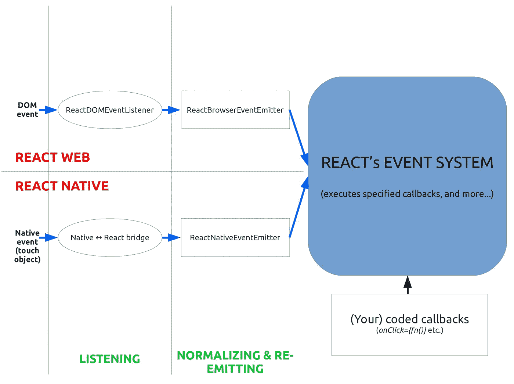
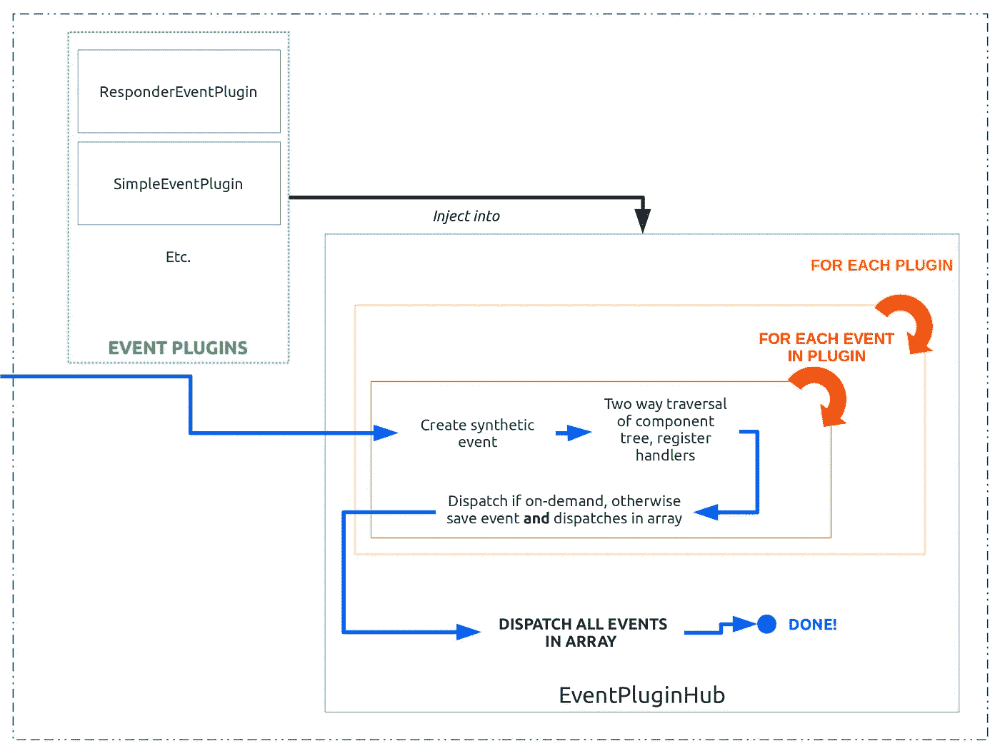
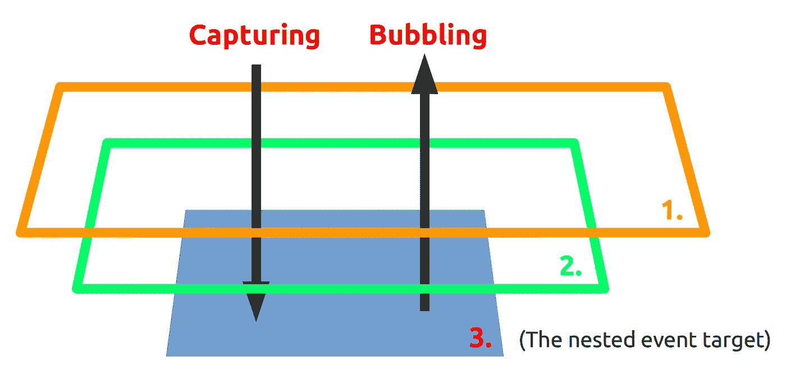

# 反应和反应本土事件系统解释:和谐共存

> 原文：<https://levelup.gitconnected.com/how-exactly-does-react-handles-events-71e8b5e359f2>

## 你正在使用它。你喜欢它。但是您知道 React 的事件处理程序在做什么吗？

如果你不知道它是如何工作的，事情有时会变得令人惊讶的混乱…

有很多帖子解释如何使用 React 的事件处理系统，但没有多少解释*如何工作的*。我最近一直在做 React Native，我在事件处理方面的挣扎提醒我准确理解*正在发生的事情是多么重要。因此，我决定收集尽可能多的关于 React 中事件处理的信息:以下是我在查看[源代码](https://github.com/facebook/react)时发现的报告。*

我们走吧！

# React 中的事件处理:概述

从概念上讲，React 中的事件处理没有什么革命性。它唯一的目标是拦截各种事件(点击、触摸……)并触发程序员编写的相关回调。正是*实现*让 React 的事件处理系统脱颖而出。

React 事件处理流程概述

React 强调的一点是协调:跨浏览器的 React web，跨平台的 React Native。但是事件系统实际上把这个概念又向前推进了一步，为*React web 和 React Native 提供了一个(几乎)相同的事件处理系统。没错:DOM 和原生事件都是使用完全相同的代码*来处理的——减去一点点预处理。React 是如何完成这个魔术的？这本身就可以成为一篇文章的主题，所以让我们尽量简短。

# 欢迎来到纤维的神奇世界

当一个应用程序更新时(比如说，点击一个按钮后)会发生什么？新的信息传播，应用程序必须用它再次渲染。现在，React (web 或原生)背后的核心思想是将这一过程分为两个独立的阶段:“协调”——React 计算差异并决定需要什么更新——和“渲染”——实际应用更新。看到这将我们引向何方了吗？你说得对。**“协调”阶段不关心*如何*或*在哪里*渲染，只关心*应该渲染什么***。因此，相同的过程可以用于 React Native 和 React web。剩下唯一要做的工作是插入合适的渲染引擎。

事件处理是“协调”阶段的一部分，因此发生在同一个抽象世界中，其中浏览器事件和 DOM 组件与本机事件和组件没有什么不同。那个世界是什么样子的？这可能有点复杂，因为我们习惯于从可见的、有形的物体的角度来思考，但是在这个平行宇宙中，每一个组成部分都变成了一个`Fiber`。事实上，由于 React 协调算法并不关心组件如何渲染，而只关心*在两次渲染迭代之间什么改变了*，组件本身并不重要。只有从组件的先前状态到新状态必须完成的工作才是重要的(如果没有发生变化，该工作也可以是无操作)。这就是`Fiber`的含义:它不是一个物理实体，而是一个工作单元，是协调过程的大计划中的一小步。

对于那些对之前的`Fiber` s 的介绍感到好奇的人，我建议你多了解一下`Fiber`和 React Fiber！林·克拉克的这个有趣的视频演示是一个好的开始。对于其他人，不要担心:理解纤程绝对不是理解本文其余部分所必需的(转向纤程是最近的事，无论如何，事件管理系统在这个过程中没有经历任何重大变化)。需要记住的是: **React 在一个“抽象的世界”中工作，在这个世界中，更新是独立于组件的物理表示而进行的:多个“现实世界”**(浏览器、手机…) **呈现组件的地方只是那个独特的、独立于设备的世界的投影。事件处理也不例外，几乎所有事情都发生在这个“抽象世界”中——无论事件最初来自 DOM 还是本地，都没有关系。**

在事件处理的情况下，“监听、规范化和重新发射”阶段的存在正是为了将真实的事件和组件转换成它们的抽象对应物。它捕获来自组件的本地事件，并将它们转换成 React 所说的与`Fiber`相关联的`topLevelType`。因此，本地事件和组件本身对于下游事件处理系统来说实际上是不可见的，并且在“真实”环境中没有安装处理程序:一切都发生在虚拟 DOM 中。

# 接收(监听)事件

好的，看上面的图，似乎在每种情况下，事件处理都是从监听阶段开始的。这不足为奇。毕竟，我们中的许多人习惯于在应用程序中定义自己的定制监听器——因为我们希望它只对`click`做出反应，而不是对`mousescroll`做出反应。但是为什么*会自己做出反应*需要监听所有事件呢？这是因为事件出现在它们的“自然”环境中:web 应用程序的 DOM，以及移动设备上的本机。React，无论是它的 web 版本还是本机版本，都是建立在这些基础环境之上的工具。因此，**事件不会自然地经过 React，它必须主动地监听它们**。

## 接收事件:React web

对于 React web，这个过程相当简单，使用**顶级委托**。这意味着 React 在`document`级别监听每一个事件，这有一个有趣的含义:当任何 React 相关的代码被执行时，事件已经*通过了 DOM 树的第一个捕获/冒泡周期。*

*从浏览器接收到该事件后，React 执行一个额外的跨浏览器协调步骤。作为对同一事件有不同名称的浏览器的一种变通方法，React 定义了`topLevelTypes`，它是特定于浏览器的事件的包装器。例如，`transitionEnd`、`webkitTransitionEnd`、`MozTransitionEnd`和`oTransitionEnd`都变成了`topAnimationEnd`——通过整合有效地减轻了设计跨浏览器应用程序的部分痛苦。*

## *接收事件:本地反应*

*对于 React Native，事件是通过将本机代码与 React 链接起来的桥**接收的。简而言之，每当创建一个`View`时，React 也会将其 ID 号传递给 native，以便能够接收与该元素相关的所有事件。同样，在将(touch)事件传递到下游之前会进行一些小的修改，包括将`touches`和`changedTouches`数组添加到事件中，以使其符合 [W3 的](https://www.w3.org/TR/touch-events/#idl-def-TouchEvent)。***

*从现在开始，为了将它们与后面将要介绍的`SyntheticEvents`区分开来，我们将称之为“事件”(即事件对象，来自本机或浏览器，经过轻微的修改)为“本机事件”*

# *React 事件管理系统的内部结构*

*我们现在有了跨平台和浏览器的本地事件。太好了！我们现在准备开始真正的工作:将这些事件传递给适当的回调函数。这就是 React 事件系统的职责。让我们仔细看看。*

**

*React 事件系统中的事件流*

*咻，到处都是东西。尽管如此，`EventPluginHub`和它的事件插件还是脱颖而出。`EventPluginHub`实际上是整个体系的基石，正如它:*

*   *为要注入的事件插件提供统一的接口。*
*   *每次接收到新的本地事件时，运行注入的插件，在分派它们之前收集返回的`SyntheticEvents`。*

*另一方面，事件插件都有相似的结构，并以本地事件作为输入，输出一个或几个`SyntheticEvents`，完成一系列将在稍后阶段执行的分派(函数)。`SyntheticEvent`是一个围绕本地事件的 React 特定包装器，本质上与您已经习惯的浏览器事件具有相同的接口，包括`stopPropagation()`和`preventDefault()`(有关更多信息，关于事件的官方文档有一个专门的页面[这里是](https://reactjs.org/docs/events.html))。*

## *事件插件*

*尽管有各种各样不同的事件插件，包括`SimpleEventPlugin`(处理`onClick`、`onTouch`等。)和著名的`[ResponderEventPlugin](https://facebook.github.io/react-native/docs/gesture-responder-system.html)`，它们都遵循同样的模式:*

1.  *创建一个或多个`SyntheticEvent`以响应本机事件。*
2.  *收集与一个`SyntheticEvent`(例如`onTouchStart={doStuff}`中的`doStuff`)关联的所有派单(即编码者提供的功能)。*
3.  *返回每个`SyntheticEvent`及其发货。*

*这里值得注意的是**插件**中实际上没有执行任何调度，因为它只收集函数本身。(大部分时间，也就是说，一些插件确实在收集阶段执行特定的分派，但这是例外而非常态)。这些`SyntheticEvent`可以简单地镜像本地事件(如`click`或`drag`)，也可以更复杂(如`touchTap`)，但在所有情况下都会返回它们的分派数组，以便“准备好进行处理”。*

*为了收集分派，React 运行组件(无论是本机还是 DOM)树的双重遍历，其中捕获和冒泡阶段从根到嵌套目标(捕获阶段)再回到根(冒泡阶段)。*

**

*双重遍历*

*注意，对于*所有*不同的分派(在插件本身之外执行的分派，也就是说大多数分派)，双重遍历完全发生。诸如`stopPropagation()`之类的中断将在调度时间生效*，有效阻止该`SyntheticEvent`的后续功能的执行，仅*(见结论)。*

## *`EventPluginHub`*

*当应用程序启动时，所有事件插件都被注入到`EventPluginHub`中，插件按照配置文件排序。然后，在运行时，`EventPluginHub`将在每次收到本机事件时执行以下操作:*

1.  *对于每个插件(按顺序)，收集所有的`SyntheticEvents`和它们的调度配置，并将它们存储在队列中。*
2.  *对队列中的所有事件执行所有调度，有效地清除队列。*

*就是这样！您的回调用正确的事件执行。:)*

# *后果和结论*

*这个系统的一个有趣的结果是**一个单独的本地事件可以(并且大多数时候会)生成多个** `**SyntheticEvent**` **，每个事件的范围都被限制在创建它的插件**之内。这意味着:*

*   *只有`SyntheticEvent`的`nativeEvent`部分会在插件间传递，所以虽然对`nativeEvent`的修改会影响后续插件的执行，但对`SyntheticEvent`的修改不会。*
*   *由于`SyntheticEvent`的作用范围有限，像`stopPropagation()`这样的调用方法只对*一个*事件插件有效。*

*作为第二点的例子，让我们想象我们有两个插件，`A`和`B`，分别定义合成事件`eventA`和`eventB`。我们将假设这些事件有以下名称:`onEventA`和`onEventB`用于冒泡阶段，而`onEventACapture`和`onEventBCapture`用于捕获阶段。最后，两者都由同一个顶级类型(比如说，`topClick`)触发，并被排序为`[A, B]`。现在考虑 React Native 中的以下代码(对于 React web，只需将`View`替换为`div`):*

*任何点击事件都将首先触发对`eventA`的捕获阶段，在嵌套组件中调用`stopPropagation()`并有效地阻止随后的冒泡阶段。不出所料，`'onEventA'`不会出现。然而，由于`eventB`已经在不同的插件中定义，因此依赖于不同的`SyntheticEvent`，`**'onEventB'**` **将最终被打印到控制台**。虽然这可以说是一个非常极端的情况，但我可以看到这可能导致意外行为的情况。*

*当然，关于 React 的事件处理系统还有更多要说的，例如`SyntheticEvents` [实际上是池化的](https://reactjs.org/docs/events.html#event-pooling)，但是为了避免矫枉过正，我在这里避免了这些。*

*我确实从参观代码库(遗憾的是没有太多关于这个主题的深入文档)以及观看由[肯特·c·多兹](https://medium.com/u/db72389e89d8?source=post_page-----71e8b5e359f2--------------------------------)、[丹·阿布拉莫夫](https://medium.com/u/a3a8af6addc1?source=post_page-----71e8b5e359f2--------------------------------) &本·阿尔珀特制作的[精彩视频](https://www.youtube.com/watch?v=dRo_egw7tBc)中学到了很多。我希望你也能学到一些东西！*

*对我来说，我将继续享受观察事物如何在引擎盖下工作的乐趣…*