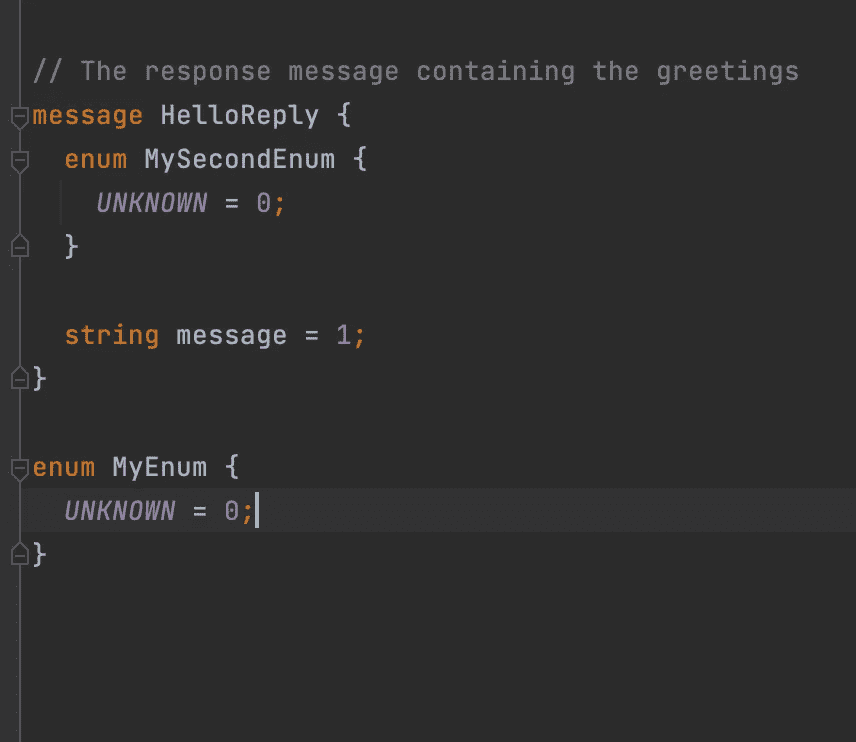

# 有经验的开发人员如何解决这 5 个 gRPC 常见问题

> 原文：<https://levelup.gitconnected.com/how-experienced-developers-resolve-these-5-grpc-common-issues-f714dbeb6528>

## 5.不要对 UUID 使用字节数组


Lexica.art

如果您使用 gRPC 和 protobuf，您很可能会遇到以下问题。

有时问题出在 protobuf 一方，或者有一个惯用的解决方案。

***为了防止这些问题，浏览(或阅读)这个列表，并避免将来的问题。***

# 1.您总是获得枚举的默认值

在 protobuf 中没有空字段这种东西。你总是得到默认值。

所以对于枚举，默认值是 0，这是枚举中的第一个常量字段。

```
enum MyEnum {
    FIRST = 0;
    SECOND = 1;
}
```

假设您想用这个枚举值发送一条消息。如果发送方没有设置这个值，接收方将首先获得，因为这是默认值。

因此，为了解决这个问题，第一个枚举值总是设置为 unknown。

```
enum MyEnum {
    UNKNOWN = 0;
    FIRST = 1;
    SECOND = 2;
}
```

此外，如果没有包装器，您需要用未知值对类型进行编码。因为枚举常量值对于原型文件必须是唯一的。

这是一个具有相同枚举值的例子。

```
enum MyEnum {
 UNKNOWN = 0;
}enum MySecondEnum {
 UNKNOWN = 0;
}
```

您将得到以下错误。


***那么一个方案是什么呢？*** 将其包裹在其他消息中。这样可以缩小范围，避免在整个原型文件中使用枚举。



另一种解决方案是在枚举默认值中对类型进行编码。


我更喜欢第一个，因为它是一个更好的范围，并且改变枚举名称不会改变默认值。

# 2.如果需要默认值呢？

***想把 proto 消息转换回 JSON 怎么办？***

这方面的一个用例是使用 proto 消息作为控制器负载。您需要返回 JSON，而不是 proto 消息。

在 Spring Boot，你需要下面的转换器:[protobufjsonformahttpmessageconverter(Spring Framework 5 . 3 . 23 API)](https://docs.spring.io/spring-framework/docs/current/javadoc-api/org/springframework/http/converter/protobuf/ProtobufJsonFormatHttpMessageConverter.html)。这个转换器可以接受定制的解析器和打印机。

有了这些，我们现在可以配置打印机和解析器了。如果需要，打印机[也可以包含默认值](https://developers.google.com/protocol-buffers/docs/reference/java/com/google/protobuf/util/JsonFormat.Printer.html#includingDefaultValueFields-java.util.Set-:~:text=is%20already%20set.-,includingDefaultValueFields,-public%C2%A0JsonFormat)。配置完成后，JSON 将打印出默认值。

***什么是有意义的默认值？实体版本作为乐观并发锁。***

如果客户端检索到第一个实体版本，protobuf 将从结果中删除该版本。最后，生成的 JSON 不会设置版本字段。

# 3.如何检查字段是默认的，还是没有设置？

如果你使用 proto2 语法，你有一个可选的关键字。所以有了这个字段，`optional field = 0;`你也得到了`hasField`方法。这在 proto2 中是显式的。

在 proto3 中可选的关键字被删除了。这使得所有字段都是可选的，并且删除了`hasField`。

那么这个奇怪的变化的解决方法是什么呢？ 使用[包装类型](https://github.com/protocolbuffers/protobuf/blob/main/src/google/protobuf/wrappers.proto)。

这样，您就可以将包装的`value`设置为`null`。这是在 proto3 取消支持后创建选项的唯一选项。

为什么这是一个糟糕的决定？ 默认值和可选冲突。

如果你没有设置一个值，protobuf 会用默认值填充它。这意味着默认值已设置还是缺失？

而`hasField`是回答这个问题的一个很好的工具。 ***这就是为什么可选在 proto 3.15 中被带回了*** [***。***](https://github.com/protocolbuffers/protobuf/blob/main/docs/field_presence.md)

如果不存在，默认值意味着字段未被设置或清除，或者它被显式设置为默认值。有了显式存在，字段就有了确定为空的方法。

如果我们看一下代码，这里是[如何工作的](https://github.com/protocolbuffers/protobuf/blob/main/docs/field_presence.md#java-example)。下面是当您有了字段的显式定义时生成的代码，以及对应的内容—不存在。

```
// No presenceMsg.Builder m = GetProto().toBuilder();
if (m.getFoo() != 0) {
  // "Clear" the field:
  m.setFoo(0);
} else {
  // Default value: field may not have been present.
  m.setFoo(1);
}// Explicit presenceMsg.Builder m = GetProto().toBuilder();
if (m.hasFoo()) {
  // Clear the field:
  m.clearFoo()
} else {
  // Field is not present, so set it.
  m.setFoo(1);
}
```

更新到最新的协议，并在需要时使用可选的。即便如此，这个关键字还是会让您得到生成的`hasField`检查。所有字段都是`optional`不过。

# 4.如何用 mapstruct 避免样板文件

假设我们有下面的原型文件。这里我们有三层嵌套结构。

所以如果源是 protobuf 重复字段，就需要在字段名后面追加`List`。在下面的例子中，字段是`dto`，所以映射器中的源字段将是`dtoList`。

***如果需要从 POJOs 转换成 proto 消息怎么办？*** 你可以使用`@InheritInverseConfiguration`并得到 POJO- > proto 转换。


您不能添加到不可修改的集合，因为默认生成会添加到不可修改的`dtoList`。 ***这个怎么修？***

您需要向映射器添加不同的生成策略。需要的策略是`collectionMappingStrategy = CollectionMappingStrategy.ADDER_PREFERRED`。

然后映射器将使用加法器而不是 getters。映射器将包含类似下面的代码。

```
if ( dto.getSecondLevelDTOList() != null ) {  
    for ( SecondLevelDTO secondLevelDTOList : dto.getSecondLevelDTOList() ) {  
        firstLevelDto.addDto( secondLevelProtoMapper.map( secondLevelDTOList ) );  
    }  
}
```

如果你需要从 POJO 转换到 protobuf，或者相反，Mapstruct 是一个很好的帮手。如果没有 mapstruct，您会得到许多构建器和样板文件。

# 5.如何避免 UUID 问题？

假设你把 UUID 表示成一个字符串。你想改成字节数组。

***这会导致什么问题吗？***

[根据 MS 规范，UUIDs 不应该使用字节。](https://learn.microsoft.com/en-us/dotnet/architecture/grpc-for-wcf-developers/protobuf-data-types)

***为什么？因为 gRPC 客户端和 gRPC 服务中的字节序。***

另一端的客户端或服务可能会使用小端顺序转换 UUID，而您是以大端顺序发送的。这将把 UUID 变成一个不同的，甚至可能是一个无效的 UUID。

如果我们[检查一下这个分析](https://stackoverflow.com/a/69660215/5999670)，就能看出区别。在 C#中，库以混合字节顺序转换 UUID，而在 Java 中，转换是大端顺序。

```
"String": 35918bc9-196d-40ea-9779-889d79b753f0
"C#"    : C9 8B 91 35 6D 19 EA 40 97 79 88 9D 79 B7 53 F0
"Java"  : 35 91 8B C9 19 6D 40 EA 97 79 88 9D 79 B7 53 F0
```

***如果你不能控制消费者，这可能会导致问题。***

为了安全起见，对 UUIDs 使用字符串。字符串是通用表示的，你不会遇到字符顺序的问题。

# 分级编码

感谢您成为我们社区的一员！在你离开之前:

*   👏为故事鼓掌，跟着作者走👉
*   📰查看[升级编码出版物](https://levelup.gitconnected.com/?utm_source=pub&utm_medium=post)中的更多内容
*   🔔关注我们:[Twitter](https://twitter.com/gitconnected)|[LinkedIn](https://www.linkedin.com/company/gitconnected)|[时事通讯](https://newsletter.levelup.dev)

🚀👉 [**加入升级人才集体，找到一份惊艳的工作**](https://jobs.levelup.dev/talent/welcome?referral=true)