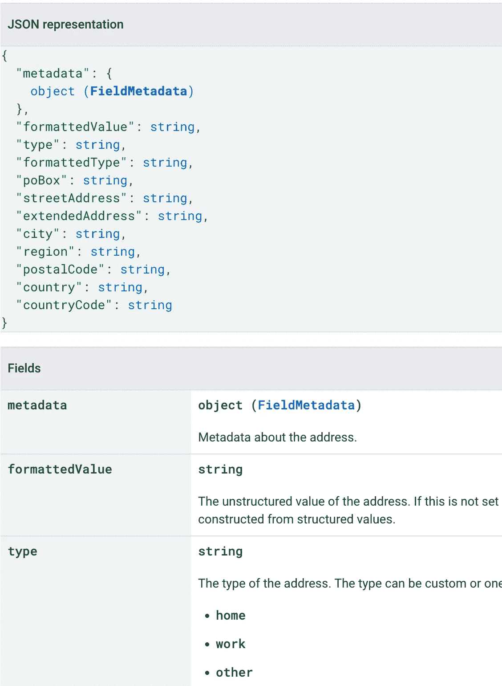

# 有经验的开发人员如何在 API 中使用枚举

> 原文：<https://levelup.gitconnected.com/how-experienced-developers-use-enums-in-apis-7798504e1857>

## **你应该在 API 中使用枚举的 3 个理由**


[来自 Pexels 的马体·米罗什尼琴科的照片](https://www.pexels.com/photo/a-man-writing-on-the-mirror-6914015/)

你在 API 中使用枚举。 ***但这是好的做法还是不好的做法？***

*到目前为止，API 中的枚举没有任何问题。那么枚举有什么问题呢？为什么不能随心所欲的使用 enums？*

让我们来区分不同的 API，以及枚举如何适应每种 API。同样，让我们看看生产 API 中的枚举。

这样我们就能更清楚地了解如何在 API 中使用枚举。另外，在 API 中哪里需要注意枚举

# REST API 中的枚举忽略了什么？

***你要从 API 客户端鞋想。***

*您希望获得新的枚举值还是普通的旧字符串值？你会如何处理每一个问题？枚举和字符串哪个更让你头疼？*

添加新的枚举值会给客户端带来问题。他们需要为这个新值添加更多的映射。

```
public enum MyEnum {
     @JsonProperty("theFirstValue") THE_FIRST_VALUE,
     @JsonProperty("another_value") ANOTHER_VALUE;
     // another one here, or delete the previous ones
}
```

***如果这是一个字符串就不存在这个问题了。*** 你可以解析任何字符串并继续前进。您不会担心解析异常。

当你实现你的 API 时，你可能会忽略客户端。 毕竟，你在实现端安然无恙。定义枚举并实现所需的行为。

枚举可以作为 API 输入。

持有枚举的请求是好的，因为我们对它们负责。您可以为每个枚举值实现策略，或者随意使用它们。你不会像客户那样崩溃。

在服务器端使用枚举的一种方法是创建*可变*属性。这里有一个例子。

```
public enum AddressType { 
    HOME(true),
    WORK(false),
    OTHER(true); private AddressType(boolean businessLogicCondition) {
        this.businessLogicCondition = businessLogicCondition;
    } private final boolean businessLogicCondition; public boolean getCond() {
        return businessLogicCondition;
    }
};@Entity
public class Person {@Enumerated
private AddressType address;// ...}// you can use it after inflation in your code where needed 
Person p1 = service.getPersonById("123");
if(p1.getAddress().getCond()) { /*...*/ }
```

Hibernate 用一个 enum 字段来扩充实体。您将获得隐藏了`businessLogicCondition`的`AddressType`枚举。这使得这个字段不可变，除非你改变枚举本身。

*在生产 API 中哪里可以看到这种做法？*我们来看看 Google People API。

您仍然可以在 API 的两边看到枚举。请求和响应都有枚举。

即便如此，在回复中，****枚举※***[***在某些情况下得到弃用***](https://developers.google.com/people/api/rest/v1/people#agerange) 。我们看到对象类型被表示为枚举。对象类型很好，因为你不会经常改变对象，而且类型的选择有限。*

*我们还可以看到，响应不包含枚举。一个例子是地址资源和类型字段。我们看到了可能的预定义值，但没有枚举。*

**

*你不应该忽略以下几点:*

****输入可以包含 Enum 作为参数，响应应该非常小心地使用它们。****

# *gRPC API 中的枚举是一个问题吗？*

*你也可以在 gRPC 世界里推广这个想法。那么枚举在 gRPC 方法中是个问题吗？*

*枚举的唯一问题是默认值。*

*零是 gRPC 枚举的默认值。这意味着零必须是一个默认值，或者是一个未知值。你可以在几乎每个 API 中看到这一点，它要么是未知的，要么是无法识别的值。*

*你应该知道空字段会被默认值填充。*

*此外，如果客户端没有为 enum 发送任何字段值，它将获得默认值。您必须在 API 服务器端意识到这一点，这样您就不会得到无效的行为。FieldMasks 可以过滤请求并挑选必要的字段。*

*[Ted 还提到了类似 RPC 的 SDK API 中的](https://medium.com/codex/should-your-api-use-enums-340a6b51d6c3)枚举。对于这些类型的 API，两端都有一些问题。*

*For SDK 枚举很好，因为你可以免费获得自动完成功能。对于 OpenAPI 客户端，这是有问题的，因为它们没有正确的描述。*

*对于 RPC 接口，客户端获得[生成的枚举类](https://developers.google.com/protocol-buffers/docs/reference/java/com/google/protobuf/Enum)。所以就像 SDK 里的用法一样。这意味着将它同时用作 API 的输入和输出并没有错。*

*此外，静态类型语言中的枚举不会引起问题。对于其他客户，他们可能会。例如，在 Typescript [中，enum 的变化不支持开发人员在 refactors](https://www.executeprogram.com/blog/typescript-features-to-avoid) 中的工作。*

*在 gRPC 代码中使用枚举应该没有任何问题。您将获得所需的支持，同时也会遇到编译时的失败。*

# *添加枚举会破坏 API 吗？*

*在 API 中使用枚举如何影响这三个 API 原则:*

*   **什么都不带走**
*   **不要重新定义 API**
*   **添加可选内容**

**

*[来源](https://medium.com/pragmatic-programmers/table-of-contents-38e94a9476f2)*

****假设您从 API 响应中移除了 enum。你会打破什么都不带走和重新定义事物的原则。****

*如果你添加了一个枚举，你就没有选择添加。这也需要在客户端进行解析。*

****假设你用 string 代替。*** 你可以呈现一些预定义的值，并允许附加值。我们可以在谷歌人的地址栏类型中看到这一点。*

*对于 gRPC 或 SDK APIs 来说，这些原则并没有被打破，因为它们有客户端的支持。一旦你更新了 SDK，你就会发现问题并知道如何改正。*

*在 HTTP 响应中有一个有趣的枚举怪癖。*

*正如我们前面看到的，枚举不适合作为响应字段。即便如此，真正的常量字段也可以作为响应字段。我们都知道的一个例子是`HttpStatus`枚举。但是这个枚举能产生什么影响呢？*

****枚举可能会增加内存占用。****

*如果枚举在每个响应中都被解析，那么它们可能会成为瓶颈。 这是导致内存占用的响应枚举的问题。*

*[](https://github.com/spring-projects/spring-framework/issues/26842) [## HttpStatus.resolve 在每次调用时分配一次 HttpStatus.values()问题#26842 …

### 我刚刚注意到，查看我们运行的一些基于反应器的性能指标评测的配置文件来测量 Datadog tracer 开销…

github.com](https://github.com/spring-projects/spring-framework/issues/26842) 

枚举状态代码解析为枚举值以恒定的速率分配内存。解决方案是使用[枚举值缓存](https://github.com/spring-projects/spring-framework/commit/7f1062159ee9926d5abed7cadc2b36b6b7fc242e)。

在回应中使用枚举不是小事，应该从不同的角度来看。* 

# *相关文章*

*你的 API 应该使用枚举吗？枚举值是一个聪明的… |作者 Ted Spence | CodeX | Medium*