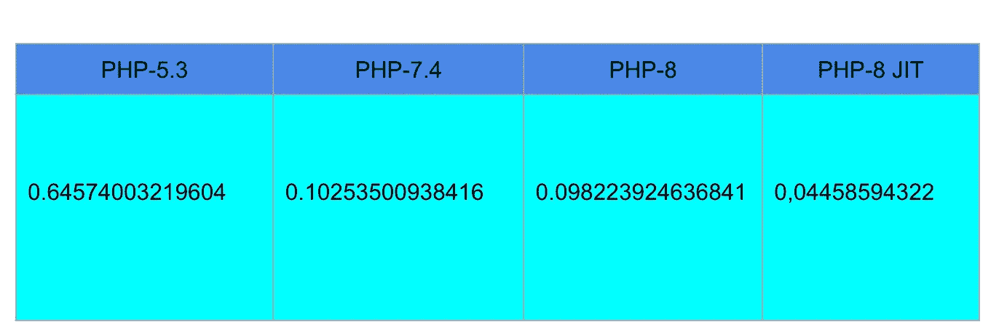

# PHP-8 会有多快？

> 原文：<https://levelup.gitconnected.com/how-fast-is-php-8-going-to-be-f7fdc111cd6>

PHP-8 将于今年年底发布，它最令人兴奋的特性之一就是 JIT 编译。让我们看看它如何提高 PHP 脚本的速度。


Marc-Olivier Jodoin 在 [Unsplash](https://unsplash.com?utm_source=medium&utm_medium=referral) 上拍摄的照片

今年年底，PHP-8 将成为现实。虽然这个主要版本带来了许多新特性，如联合类型、静态返回和弱映射，但最令人期待的改进是 JIT 编译器。

理论上，由于 JIT 处理 PHP 脚本编译的方式，它将提高应用程序的速度(我过于简化了)。但是让我们看看这种方法是否符合我们的期望

> 注意，我将要使用的 PHP-8 版本不是最终版本。

首先，我们来定义要运行的代码。我选择冒泡排序是因为它是最差的排序方法，我只能在这样的练习中使用它。

[中的源代码 https://gist . github . com/PedroEscudero/b 64 ea 7409 c 0 cc 483 c 44 f 0773 b 6 aebbdb](https://gist.github.com/PedroEscudero/b64ea7409c0cc483c44f0773b6aebbdb)

我意识到中间那个讨厌的数组并不好看。我知道我可以生成一个随机数组。我也知道我可以从文件中读取它。然而，我只是想要一个与其他考虑无关的缓慢的泡沫。我不希望在这个基准测试中有任何额外的噪声。

[](/php-8-first-release-candidate-performance-a4bb02dff6f4) [## PHP 8 首次发布候选性能

### 让我们继续关注 PHP 8 第一个候选版本的速度

levelup.gitconnected.com](/php-8-first-release-candidate-performance-a4bb02dff6f4) 

首先，让我们在 the 7.4 的当前版本中运行脚本 it

```
docker container run --rm -v $(pwd):/script/ php:7.4 php /script/bubble.php
```

运行 100 次后，我的平均时间是 0.10253500938416 秒。还不错。

现在我们用 PHP-8 **而不用 JIT** **激活**。

```
docker container run --rm -v $(pwd):/script/ martinpham/php8:fpm-extra-alpine php /script/bubble.php
```

同样，在 100 次跑步后，我的平均时间是 0.098223924636841 秒。老实说，改进并不十分显著。

但我们是来测试明星特性的，闪亮而神奇的 JIT:

```
docker container run --rm -v $(pwd):/script/ keinos/php8-jit php /script/bubble.php
```

平均时间为 0.053637981414795 秒！的确 JIT 它是闪亮和惊人的！对于像我一样需要担心执行时间的人来说，这是一个巨大的祝福。虽然这个数字看起来不太相关(只有 0.04458594322 秒的改善)，但如果我们用百分比来看，我们可以更好地理解好处:45.39%。

我想要更多的视角，所以我用 2009 年史前时期的 PHP-5.3 版本运行它。

```
docker container run --rm -v $(pwd):/script/ php:5.3 php /script/bubble.php
```

用了 0.64574003219604 秒。比使用 PHP-8 和 JIT 激活时慢 0.5921020508(-差 1103.88%！).天哪，2009 年我们是怎么做到的？



脚本运行 100 次的平均性能比较

## 注释和注意事项

*   我选择了一个纯心血来潮的带有气泡排序的脚本。你可以尝试其他选项，比如推销员问题或二叉树。结果应该遵循相同的模式。
*   正如我提到的，在这个基准测试中运行的 PHP-8 版本不是最终版本，所以在最后一个版本发布之前可以添加额外的改进。
*   我决定保留有很多小数的浮点数，即使它并不漂亮。我想尽可能精确。
*   我使用了 [keinos](https://hub.docker.com/r/keinos/php8-jit) 和 [martinpham](https://hub.docker.com/r/martinpham/php8) docker 图像作为基准。[但是还有其他的](https://hub.docker.com/search?q=php8&type=image&sort=updated_at&order=desc)。如果你喜欢玩一会儿，你可以试试。
*   我是在一台装有 Linux Manjaro 的笔记本电脑上进行这些测试的，这台笔记本电脑配有 3 GHz 英特尔酷睿 i5 处理器和 32 GB 内存。对于其他配置，这些数字可能会有所不同，但我确信改进是相似的。

如果你对近几年来 PHP、Python 和 Ruby 的性能如何提高感兴趣，你可以看看这篇文章:

[](/how-has-the-performance-of-php-python-and-ruby-improved-in-recent-years-1768fd5b6df9) [## PHP、Python 和 Ruby 的性能近年来有了怎样的提升？

### 让我们回顾一下 3 种主要编程语言的性能改进，以便更好地理解…

levelup.gitconnected.com](/how-has-the-performance-of-php-python-and-ruby-improved-in-recent-years-1768fd5b6df9)