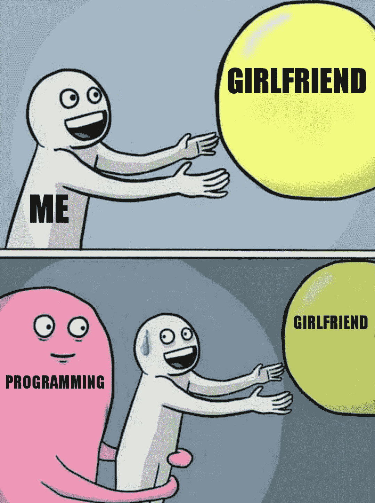
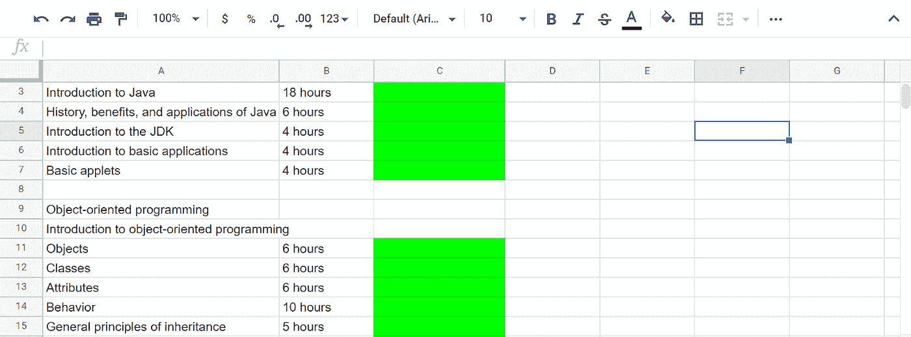

# 对抗编程焦虑如何让我成为更好的代码:应对编码压力的 5 个技巧

> 原文：<https://levelup.gitconnected.com/how-fighting-programming-anxiety-made-me-a-better-code-5-tips-to-follow-for-dealing-with-coding-f5b162244afe>

作为一个初学编程的人，你可能经常从你的同龄人那里听到编程是多么有趣。当我与高级开发人员交谈时，他们分享了很多为什么他们如此热爱自己所做的事情的原因——这个领域不断挑战你，它非常刺激，从头开始构建新东西并看到你的代码的兴奋感是其他任何事情都难以比拟的。

有经验的程序员对编码的感受可以用 Linus Torvalds 的话来概括:

大多数优秀的程序员从事编程不是因为他们期望得到报酬或得到公众的奉承，而是因为编程很有趣。

# 对我(和许多其他人)来说，编程并不全是乐趣和游戏

受到无数 r/coding 帖子和 Freecodecamp 文章的启发，这些文章讲述了经过几个月的学习建立网站的开发人员，我迫不及待地终于开始学习了。

然而，当我真正接触 Java 课程和书籍时，突然之间，我意识到我正面临着程序员们不常谈论的问题——压力。很多很多压力。

不久前，我在 r/learnprogramming 上看到了这个[的帖子，在我看来，它完美地总结了初级程序员的感受:](https://www.reddit.com/r/learnprogramming/comments/8lrg86/why_is_learning_programming_so_hard/)

*“所以我的软件工程本科学期快结束了，管它呢！编程真的很难。*

就像我正在学习数学、物理和中文，而学习 java 是一场艰苦的斗争。

*实际上，此刻我被它淹没了，就像我正在读第二章一样，我只是不明白它，这本书说的事情就像每个人都应该自动假设的一样。这么多流行语。他们只是告诉你这个和那个，我一直在问自己为什么，但没有答案。*

*只有我一个人有这种情况吗？”*

在我进入编码之前，我很惊讶。编程真的能比学一门有挑战性的外语感觉更让人应接不暇吗？

在成为 Java 初学者仅几个月后，我完全理解了沮丧学生的感受。对我来说，在日常工作、社交生活和编程课程之间周旋太难了。我觉得自己快累垮了——而我才刚刚开始。

# 编程焦虑是一个不容忽视的大问题

我不想退出 Java——所以当我觉得我开始讨厌学习曲线时，我不得不寻找处理编程焦虑的方法。现在，4-5 个月过去了，我在编程时仍然不能完全放松——然而，压力水平已经变得可控，学习已经成为我日常生活中不可或缺的一部分。

为了其他 Java 学生的利益，我决定分享一些帮助我应对编程焦虑的技巧，这些学生也在努力将编程融入日常生活，并对大量新概念感到不知所措。

# 提示 1。坚持少数资源(选择好的)

帮助我摆脱压力的第一件事是理解没有“已经学会”编程这样的事情。我开始学习编程时是一个超级完美主义者——我不想用最简单的方法来解决问题，而是想找到最好的(通常是相当复杂的)方法。

长话短说，不知不觉我就迷失了。

解决方案:我给初学者的第一个建议是，不要浪费太多时间同时学习多门课程、书籍和教程。虽然这种彻底的方法可能会让你对概念有深刻的理解，但在一天结束时，你会觉得自己哪儿也去不了。

为了保持专注于改善和不断进步，我需要挤出我经常使用的资源。现在，我的学习材料清单如下:

*   书籍: [Java:初学者指南(第 6 版)](https://www.amazon.com/Java-Beginners-Guide-Herbert-Schildt/dp/0071809252)
*   课程: [CodeGym Java 课程](https://codegym.cc/)
*   Youtube 频道:[德里克·巴纳斯](https://www.youtube.com/user/derekbanas)
*   基于文本的教程: [Oracle 文档](https://docs.oracle.com/)。

拥有这样一个明确的资源列表有助于我避免学习时的混乱，并在每次学习后获得切实进步的感觉。

# 秘诀 2。休息一下

在我开始编程之旅的时候，我是“实践出真知”原则的忠实追随者。我把尽可能多地编写代码作为一个目标——在工作之前和之后，在堵车的时候，在我不喜欢的聚会上。

经过几个月的学习，我成为了这个迷因的准确代表:

**解决方案**:当我接近精疲力竭时，我意识到我不能再让编程从我的生活中吸走快乐和能量。尽管一开始我确实对此感到内疚——我开始从学习中抽出急需的休息时间。

如果你在想“我是一个很慢的程序员，如果我不练习，我怎么能变得更好”，看看为什么 15 分钟的休息可以让你成为一个更好的程序员:

*   据统计，人们无法在超过 50 分钟的时间里完全集中精力完成复杂的任务。在一个小时的紧张工作之后，我们需要 15 分钟的休息来重新集中精力。
*   为了我们的眼睛，眼科医生建议在 20 分钟的紧张工作后休息 2 分钟(编码是一项高度紧张的活动，即使你使用大型显示器)。
*   工作场所的疲惫会导致令人尴尬的错误，还会毁掉几个月的工作(更不用说你的工作面试了)。

如果你在编码休息时不知所措，这里有一些对我有用的想法:

*   快速锻炼——已经证明可以刺激认知功能。
*   冲个澡——这会帮助你恢复身心健康。
*   在没人的时候去晨间散步(为了社交距离)。
*   演奏乐器——我发现学习如何演奏音乐和编程需要相似的技能，所以弹奏吉他实际上是大脑的训练营。

# 秘诀三。编程是一种手段，而不是目标

当编码错误越积越多，你无法发现错误所在，或者当你无法掌握多线程的诀窍时，我不可避免地会问自己——我这样做是为了什么？在我的道路之初，我并没有一个明确的理由，为什么我首先选择 Java 或编程。

我花了一段时间来为我的开发旅程定义“为什么”——以下是我想到的。

*   利润丰厚的就业市场。作为一名编程专业的学生，我最近和一名物理学毕业生成为了朋友，他很难找到一份与自己专业相关的工作。作为一名开发人员，他发出了不到 20 份简历，仍然不断收到招聘人员的电子邮件。他非常高兴地发现，多亏了编码，他再也不会陷入工作困境了。
*   **我可以申请**的多种角色。在做了一些研究后，我发现学习 Java 可以让我在后端开发、移动编程、甚至大数据或嵌入式设备开发中找到一份工作。接触这么多不同的任务将有助于我防止精疲力尽，即使在这个领域工作了 10 年以上也能保持挑战。
*   **很多偏远的机会**。当我对 Java 感到厌倦时，想到知道如何编程可以让我一天都不用呆在办公室，真的让我精神振奋。如果工作场所的灵活性对你来说很重要，提醒自己开发人员在整个学习过程中保持积极性的各种远程机会。

我给初学者的另一个建议是尽可能多地加入专业社区。交流经验和获得同伴的支持是不偏离学习道路的有效方法。

以下是我关注的群组和论坛主题:

**Reddit**

*   [r/java](https://www.reddit.com/r/java/)
*   [r/ask 计算机科学](https://www.reddit.com/r/AskComputerScience/)
*   [r/learn 编程](https://www.reddit.com/r/learnprogramming/)
*   [记者提问](https://www.reddit.com/r/cscareerquestions)
*   [r/c 教育](https://www.reddit.com/r/CSEducation/)
*   [r/dataisbeautiful](https://www.reddit.com/r/dataisbeautiful/)
*   [r/逻辑](https://www.reddit.com/r/logic/)

**松弛**

*   [欧洲开发浏览器(非常适合 EU-的程序员)](https://europeandevexplorer.typeform.com/to/MC3qnG)
*   [代码新手](https://www.typeform.com/private-typeform/?utm_source=typeform.com-228400-Free&utm_medium=typeform&utm_content=typeform-private&utm_campaign=uwsWlZ&formId=uwsWlZ&user=codenewbie&enableInsightsTracker=true)
*   [斜线火箭](https://slashrocket.io/)
*   [标签开发者](http://www.hashtagdevelopers.com/)

# 秘诀 4。不要指望马上用 Java 点击

在我开始 Java 开发之旅的时候，我相信一旦我开始做编程，就会一见钟情。我想“我应该小心练习太多”。

然而，后来，有一天我完全不想编程了。我仍然可以不情愿地阅读编码书籍或观看鼓舞人心的视频，但我讨厌练习。

然后，我意识到编码类似于演奏一种乐器或者做运动。虽然对一些人来说，技术的各个方面在一瞬间出现，并且在几年内，他们已经准备好参加职业比赛或跑完全程马拉松，但其他人需要几年才能达到同样的水平。

换句话说，当我们开始学习一门编程语言时，我们经常期望成为刚刚掌握这门语言的神童。然而，从统计学上来说，500-1000 万个学习者中只有 **1 个是神童**，只有 *10%可以被归类为天才*。所以，不管我们喜不喜欢，我们最终都可能处于平均水平。

# 一个一般的程序员如何变得更好？

除了通过纪律和持续的练习，没有其他答案。在某一点上，我意识到如果我不磨练我的技艺，我最终会失去我已经取得的进步。

因此，即使在我不能很好地使用 Java 的日子里，我也会坚持学习 3-4 个小时。我这样做不是因为我相信每天学习会让我变得更好。

我只知道*不*练肯定会让我成为 ***更差的*** 编码员。

# 秘诀 5。创建一个基于截止日期的学习计划

当我在 Reddit 或 Stack Overflow 上与 Java 程序员交谈时，他们经常指出学习曲线看不到尽头。

这就是为什么很难区分初学者和初级，初级和中级，最后，定义一个人是高级开发人员。

为了确保我不会陷入学生心态，我需要给我的学习曲线增加一些外部压力。这就是为什么我决定找出学习 Java 需要多少时间，并创建一个循序渐进的学习计划，让我达到估计值。

**学习 Java 需要多少时间？**

根据你是忙碌的、普通的还是专心学习的，时间表会因你而异。[根据统计](https://codegym.cc/groups/posts/how-long-does-it-take-to-learn-java#:~:text=The%20learning%20of%20Java%20mission,learn%20Java%20fast%E2%80%9D%20as%20well.)，这些是学习 Java 的预估:

*   快速学习者— 16 个月。
*   普通学生——26 个月。
*   忙碌的学生——39 个月。

由于我有一份全职工作，我选择把自己归类为一个忙碌的 Java 学生，并建立了一个跨越三年的 Java 学习计划。我把主要的 Java 参数和截止日期放在电子表格中的每一个旁边。

我在每个概念旁边标记了完成状态，以跟踪我的学习进度。这对我非常有帮助，因为它帮助我定义了学习道路的界限。

毕竟，在 Java 中要学的东西可能是无限的——但是电子表格中的行数却不是。两年半后，我将完成我的学习计划——这将是我从初学者转变为初级开发人员的线索。

# 结论

很少有人提到并公开分享编码焦虑的经历，这让我很沮丧。这在开发人员中非常普遍——这就是为什么我强烈鼓励编程社区对此开放。

至于对抗编码焦虑的方法，我上面分享的大多数技巧都可以归结为给自己定步调。有了合适的资源，准备好休息并投入到语言中，当你开始编码时，你会更加冷静和自信。

学习 Java 可能感觉像一条黑暗的隧道——但是，只要有足够的决心和纪律，我们一定会到达终点。