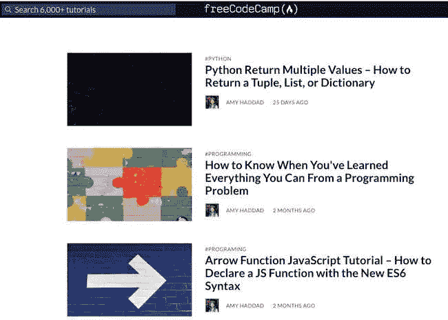

# freeCodeCamp 如何帮助我成为一名更好的程序员

> 原文：<https://levelup.gitconnected.com/how-freecodecamp-is-helping-me-become-a-better-programmer-90995bb11ed1>

从标题来看，你可能认为这篇文章是关于 freeCodeCamp 上的编程内容。你说对了一部分。但这也是关于更大的东西。

在此之前，我需要和你分享一些细节。

# 技术路线

我向 freeCodeCamp 提交第一篇文章的时候，是 11 月的一个雨天。我曾经写过我学习编程的经历。我希望这篇文章能发表，但并不抱太大希望。拒绝在写作领域很常见。

几天后，我坐在马萨诸塞州剑桥的图书馆里，那时我住在那里。完成一天的编程工作后，我检查了我的电子邮件。令我惊讶的是，我收到一条消息，让我知道我的文章发表了。我太激动了！随着时间的推移，我继续为 freeCodeCamp 撰写更多的文章。

但是在我的第一篇 freeCodeCamp 文章发表一年后，事情又发生了令人惊讶的转变。

二月的一个周一下午，我和自由代码营的创始人昆西·拉森进行了视频通话。他问我关于写一些技术性更强的文章的想法。

我心想:“技术文章？我吗？在 freeCodeCamp 上？!"

到目前为止，我只贡献了一些关于学习编程过程的文章，比如如何让[脱离困境](https://www.freecodecamp.org/news/how-to-get-unstuck/)和[解决问题与练习](https://www.freecodecamp.org/news/do-you-solve-programming-problems-or-complete-exercises-the-difference-matters/)。

我是一个相当表现主义的人。所以我确信昆西可以看到我脸上的震惊和兴奋。如果他做了，他没有动摇。他似乎认为我会迎接挑战。

# 变得更好:一次一篇文章

写作迫使你清晰地思考和交流。技术写作更上一层楼。

我不知道作为一名程序员，为 freeCodeCamp 写技术编程文章会给我带来多大的收获。这个过程对我的编码技能的帮助比我想象的要多。

写关于 [Python](https://www.freecodecamp.org/news/python-unique-list-how-to-get-all-the-unique-values-in-a-list-or-array/) 、 [JSON](https://www.freecodecamp.org/news/json-comment-example-how-to-comment-in-json-files/) 、 [CSS](https://www.freecodecamp.org/news/inline-css-guide-how-to-style-an-html-tag-directly/) 和 [JavaScript](https://www.freecodecamp.org/news/arrow-function-javascript-tutorial-how-to-declare-a-js-function-with-the-new-es6-syntax/) 的文章教会了我“技术交流”的重要性，Codesmith 的首席执行官 Will Sentance 称之为“技术交流”。即在谈论代码时使用精确的技术语言。或者以我的情况写下来。

例如，程序员经常会互换使用“自变量”和“参数”这样的术语。然而，这些术语有不同的含义。当教别人某个话题时，你必须精确。细节很重要。而且，事实证明，训练你的头脑和眼睛去关注细节在编码时是有好处的。

技术写作也让你在密集的技术文档中挖掘，以获得更深入的理解。同样，我经常发现自己在编码时会参考一门语言或技术的文档；写技术文章只是让我对它更加适应。

然后，挑战变成了把复杂的事情变得简单。这很难做到，任何代码或散文作家都可以证明这一点。“轻松阅读就是艰难写作”这句话很有道理

最重要的是，你在处理模糊性。不可避免地，在写作的过程中，你需要了解一些细微的差别，就像你在编码时遇到一些新东西一样。

如你所见，你用来写技术文章的许多技巧和你用来编程的技巧是一样的。同样的技能，不同的背景。把它想象成交叉训练:你正在从一个不同的角度攻击你作为程序员日常使用的一些核心能力。

还有更多。为 freeCodeCamp 写技术文章增强了我作为程序员的信心。为此，我要感谢昆西和 freeCodeCamp 的团队。

# 未来一代的程序员

freeCodeCamp 的使命是:“帮助人们免费学习编码。”这是令人钦佩的。毫无疑问，你会在它的网站上发现大量旨在帮助人们学习编码的内容。

然而，同样重要的是，它为像我这样的贡献者提供了分享编程知识和想法的机会。反过来，这个机会提高了无关紧要的编程技能，培养了信心，这是帮助人们编码的一个重要部分。

我必须详细说明这一关键点。freeCodeCamp 可以跟随当今许多公司的脚步，这些公司通常只寻找高级软件工程师。相反，freeCodeCamp 似乎在这种模式之外思考，并意识到资格有各种各样的味道。

然而，当 freeCodeCamp 的机会出现时，我已经做好了准备。我是一个自学成才的程序员，在一家软件公司做技术写作。

这些主题——打破模式和做好准备——形成了接下来的两个行动号召:一个针对企业，一个针对程序员。

# 呼吁企业采取行动

如果你在自己的领域已经有所建树，不管你是公司老板还是招聘经理，都要思想开放:跳出固有模式思考。

我认识的一个程序员，姑且称他为“Ed”，申请了数以吨计的编程工作，但都遭到了拒绝。他自学成才，从事自由职业多年。只有一个问题:他不符合标准。

尽管 Ed 没有正式的证书，但他是一名出色的程序员，拥有出色的解决问题的技能。从他多年的管理经验来看，他可以很快地学习技术话题并清晰地交流。

一家公司看到了他的潜力。像 freeCodeCamp 一样，它对 ed 如何打造自己的道路持开放态度。他得到了这份工作，并得到了他需要的“正式”头衔。

需要说明的是，艾德不仅仅是免费得到了一些东西。他拥有必要的编程技能和知识。他只是需要应用它们的机会。

然后，当机会来临时，他接受了挑战。他在任期间事业蒸蒸日上。现在他是另一家公司的首席工程师。几年过去了，Ed 仍然把他的成功归功于“给了我机会”的公司。

一次又一次，我看到人们在有机会的时候挺身而出。这在体育界是常有的事。我最喜欢的一个故事是关于俄亥俄州立大学(OSU)足球队在 2014 赛季的故事。

OSU 的明星四分卫在赛季初受伤了。然后，令人难以置信的是，他的替代者在赛季末受伤了。两名四分卫在赛季结束时受伤。

所以第三梯队的四分卫卡戴尔·琼斯成为了首发四分卫。当他做到了，他接受了挑战:那年他带领七叶树队获得了全国冠军。

“不幸的是，两个家伙都受伤了，”琼斯后来在回应 2014 赛季时说，“幸运的是，我准备好了试图利用这种情况。”

琼斯的回应引出了我们的第二个行动呼吁。这次是给程序员看的。

# 程序员的行动号召

如果你是一名程序员，正在寻找进入这个领域的突破口，那么你需要做的是:做好准备。

你可以说琼斯运气不错。不管幸运与否，琼斯无疑是有备而来。他投入工作去做大事。当他的时刻到来时，这正是他所做的:他带领球队赢得了冠军。

对我来说，做好准备意味着磨练你的编程技能，这样你就可以立即做出贡献。只有你自己知道你是否真的投入了时间和精力去学习一门特定的语言或技术。虽然你不需要成为最顶尖的专家，但你需要做好准备。

我认识一个初露头角的程序员，他经常在我参加的聚会上向其他程序员求职。他经常得到同样的答案:提高他解决问题的能力。很长一段时间，他忽视了反馈(尽管我最近听说他参加了一个训练营)。关键是:他想在没有准备好的情况下得到一份工作。不要这样。

你必须投入工作；这是没有办法的。然后，当准备好了，把你自己放在那里。

是的，freeCodeCamp 在那个决定命运的 11 月的一天发表了我的文章。但我发表了那篇文章，因为我把自己放在那里，并在这个过程中让自己面临被拒绝的风险。

我非常感谢成为 freeCodeCamp 的贡献者。我希望我写的文章对其他程序员的帮助和这个过程对我的帮助一样多。

我同样感激能为一个忠于使命的组织做贡献。其他人应该注意到这个非凡的组织，以及它是如何为未来的程序员带来很多好处的——不仅是它提供的内容，还有它提供的机会。

我在 amymhaddad.com 的**上写了关于学习编程的文章，以及学习编程的最佳方法。**

**原载于*[*amymhaddad.com*](https://amymhaddad.com/how-freeCodeCamp-is-helping-me-become-a-better-programmer)*。**