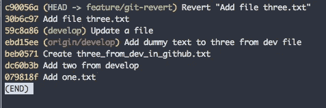
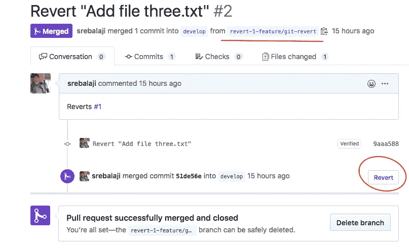

# git 还原如何工作

> 原文：<https://levelup.gitconnected.com/how-git-revert-works-9b87b8b03dd3>


git 还原如何工作

`git revert`命令用于“撤销”您过去所做的更改。简单。但是与其他撤销命令不同，git revert 将引入一个新的提交，它具有相反的更改。

例如，考虑下面的 git 历史。

假设“E”是错误的提交，您不再需要这些更改。所以你决定撤销 E 所做的改变。您已经决定使用 git revert。

```
git revert E
```

git revert 将总是接受一个提交散列。因此，您需要传递您需要恢复的提交。

在恢复 E 之后，提交历史将被更改如下。

“e”是还原的提交。“E”将包含 E 的还原更改。但是您可以看到，在 git 历史记录中，提交 E 也存在。并且 E 所做的更改不再出现在工作目录中。

这是 git revert 的优势之一。在这种情况下，git 历史非常清晰，每个阅读 git 历史的人都会理解特定的提交由于某种原因已经恢复。

## 如何进行 git 还原

如前所述，git revert 将接受一个提交散列。


在上图中，您可以看到提交历史。见头部提交(最新提交)。我已经添加了一个文件‘three . txt’。现在让我们尝试恢复提交。


我已经恢复了上图中的头部提交。您可以看到 Git 试图反转由 HEAD commit 所做的更改，并删除了由 HEAD commit 创建的文件。

现在看看 git 的历史是如何变化的



您可以看到新的提交引入了解释它恢复了以前的提交。

## git 还原-n

当您恢复提交时，有时您不需要 Git 来为您执行提交。您可能需要检查 Git 恢复的更改，然后自己提交。


在上面的例子中，你可以看到我用-n 选项进行了恢复。所以 Git 恢复了更改，但是没有提交更改。它刚刚暂存了所有恢复的更改。您可以检查这些更改并自己提交它们。

## 还原一系列提交

恢复一系列提交总是很方便的。

```
git revert A..B
```

a 和 B 是提交散列。上述命令将把提交从 **A** 恢复到 **B** 。并且记住 **A 应该比 B 大**。

## 还原合并提交

恢复合并提交有些棘手。当合并时，包含两个分支。父 B 分支被合并到父 A 分支中。

因此，当您恢复合并提交时，您必须指定您是否需要恢复父-A 分支或父-B 分支的更改。

```
A - B - C - E - F (branch A)
     \     /
      G - H - I (branch B)
```

在上面的例子中， **E** 是合并提交。如果你运行 **git revert E** ，那么 git 将抛出一个警告。你必须提到母分公司的号码。

你能做到

这将从合并分支中还原所有提交。因此来自 **G — H** 的变化被恢复。所以 git 历史将会是这样的

```
A - B - C - E - F - E' (branch A)
```

“e”是还原的合并提交。

恢复合并提交意味着您正在反转来自合并分支的所有更改，以便您不能再次合并该分支。如果需要合并回分支，您必须恢复“恢复提交”。

在上面的例子中，你不能再次将分支 B 合并到分支 A。因为它在 E '中被还原。

假设有时，你已经对分支 B 做了一些改变，现在你可以合并那个分支了。为此，您必须恢复“恢复提交”。

```
git revert E'
```

上述命令将恢复 E' commit。现在你可以把分支 B 合并到分支 a。

现在，git 历史将看起来像这样

```
A - B - C - E - F - E' - E'' (branch A)
```

E ' '是 E '的还原

## 在 Github 和 Gitlab 中恢复拉请求

在 Github 中，你可能已经注意到了一个恢复拉取请求的选项。


如果您必须回复合并的提取请求，您可以使用此选项。

假设您已经恢复了拉取请求(PR)。

现在是棘手的部分。出于某种原因，你必须再次合并分支。您可能在分支中也有一些更新的提交。

如果您再次对分支进行拉请求，您可以看到没有要合并的变更。因为反向的更改已经存在于当前分支中，所以 Git 不会显示任何要合并的更改。


在上面的图像中，您可以看到我们已经合并了 pull 请求，然后恢复了合并的 pull 请求。

如前所述，现在要再次合并分支，您必须恢复“恢复提交”。做这件事有两种选择。

第一，可以直接在 Github 本身做。当您恢复 PR 时，Github 将创建一个包含反向变更的分支，并为这些变更创建一个 PR。



在上面的图片中，你可以看到 Github 已经创建了一个新的分支**revert-1-feature/git-revert**，并且 PR 已经被合并以恢复更改。

现在，您可以再次从“恢复分支”恢复更改。简单。因此，您已经恢复了恢复的更改:P. Github 使任务变得简单。

还有另一种方法。您可以在本地恢复“恢复提交”并推送它。请参考上面的提交历史。

```
git revert -m 1 51de56e7bfe319e4ba670b2743eb135af0988fb3
```

这与恢复 PR 是一样的。Git 将只添加另一个 revert commit，然后可以推送它。

恢复是一个非常有用的工具，可以“撤销”分支中的更改。这不会影响历史，每个人都可以理解已经做了什么。

## 要记住的要点

1.  **git revert<commit-hash>**
2.  **git 回复..B** 恢复一系列提交。a 应该比 B 大
3.  **git revert-n<commit-hash>**恢复提交，并在不提交的情况下暂存所有这些更改。
4.  **git revert-m<parent-branch><commit-hash>**恢复合并提交。请记住，您必须以 1 或 2 的形式提及母公司分支机构编号
5.  Github 之类的 Git 托管平台有一个选项来恢复 PR 本身。你可以明智地使用它。

如果您有任何疑问、反馈或任何事情，您可以留下评论。

如果你需要我涵盖一些特定的主题，你可以告诉我。:)

**你可以在这里找到我的其他 git 相关文章**

```
1\. [How git cherry-pick works and how to use it effectively](/what-is-git-cherry-pick-and-how-to-use-it-effectively-665247192442)2\. [Automate repetitive tasks in Git](/automate-repetitive-tasks-with-custom-git-commands-76a4b71d262f)3\. [Useful tricks of git fetch and git pull](/how-to-use-git-fetch-and-git-pull-effectively-c6a4becfbc16)4\. [A very basic intro of Git](https://medium.com/@srebalaji/a-very-basic-intro-of-git-b9cab0e64153)
```

**本帖原载于我的简讯**[**GitBetter**](https://gitbetter.substack.com/)**。如果你已经来了这么久，那么我想你会对 Git 非常感兴趣。可以订阅**[**Git better**](https://gitbetter.substack.com/)**获取 Git 的招数、技巧、高级话题。**