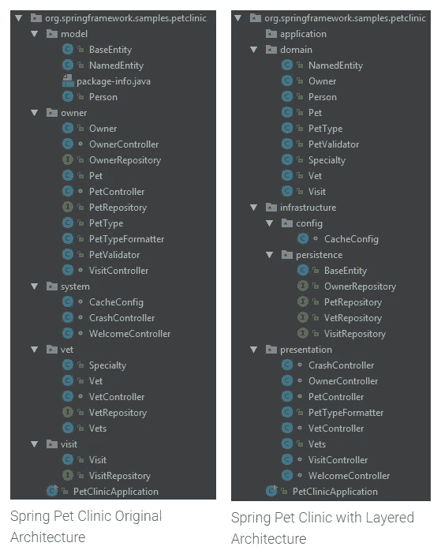
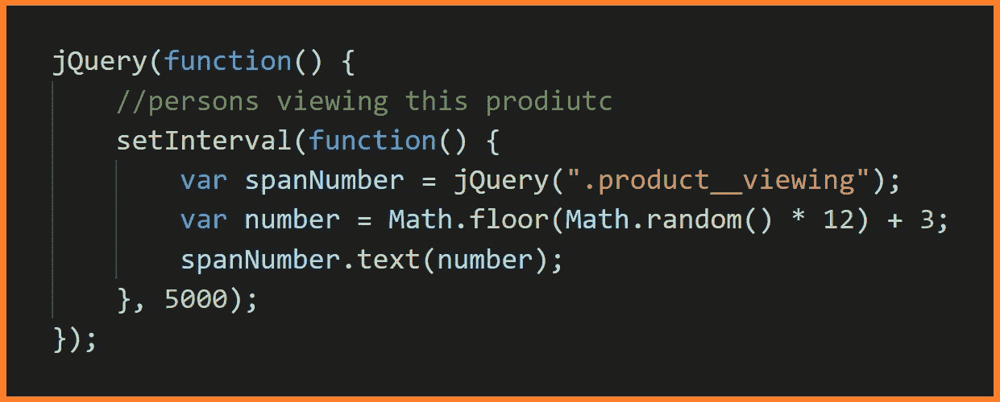

# 优秀的开发者如何修复易受攻击的应用？

> 原文：<https://levelup.gitconnected.com/how-good-developers-fix-insecure-apps-44372b6eac07>

## 如何把不安全和批判逻辑分开？

照片由 [Pexels](https://www.pexels.com/photo/concentrated-diverse-colleagues-brainstorming-together-in-office-6238174/?utm_content=attributionCopyText&utm_medium=referral&utm_source=pexels) 的 Gabby K 拍摄

# 业务和 UI 逻辑生活在哪里？

> 这些是业务规则、验证和计算，它们在数据被引入信息系统或由信息系统显示时对数据进行操作。—马丁·福勒

您的服务位于业务层。应用于数据的业务规则，并根据数据得出结论。

您的控制器位于 UI 层，负责 UI、页面和它们周围的简单逻辑。

[分层建筑](https://dzone.com/articles/layered-architecture-is-good)

# 为什么业务层至关重要？

让我们通俗地解释一下。 [Laurent S.](https://stackoverflow.com/users/2187273/laurent-s) 对这个话题有很棒的解释。我会试着传达他的话，并附上我自己的意见。

[来源](https://undraw.co/search)

让我们看看卡车装载过程。有两个工人。

一个是装卡车的工人，一个是监工，监工。工人代表表象逻辑。主管-业务规则。

主管关心卡车的重量。*卡车能装多少？* —业务规则。

工人把箱子放进卡车里。工人决定*将盒子*放在哪里——展示逻辑。

当你没有主管时，你需要教工人规则。假设是一个简单的规则，1 音就是重量限制。

您的业务扩展了，您雇佣了更多的员工(移动、桌面和其他设备)。你教他们这条规则。

新规则来了。现在你需要遵守国家的法律。法律变化太频繁了。

您有两种选择:

*   雇律师来装满卡车。
*   工人打电话给律师。

假设你选择律师来装满你的卡车。他们知道法律，能算出重量限制。

用软件术语来说，你把更多的逻辑放在你的表示层。

另一种选择更有利。工人们打电话给律师，询问他们是继续装货还是停止装货。

用软件术语来说，将业务规则添加到业务层，UI 可以调用它来获取信息。

# 在 UI 中做什么是错的？

不要欺骗你的顾客。看下面这篇文章。

 [## 一个网上商店的源代码中揭露的无耻谎言

### 14 个人真的在看这个产品吗？

medium.com](https://medium.com/dev-genius/are-14-people-currently-looking-at-this-product-e7fe8412f16b) 

不要谎称客户活跃。任何开发者都会识破这个谎言。

在后端解决这个问题。查看活动会话和额外信息来识别产品。顾客正在看的产品。

向后端查询数据。计算活跃客户，并响应 UI 层。

不要在前端做你的业务逻辑。例如，不要在前台计算晋升。

 [## 这个网站不小心在源代码中留下了推广代码

### 通过浏览网站找到有趣的东西

javascript.plainenglish.io](https://javascript.plainenglish.io/this-website-accidentally-left-promo-codes-in-their-public-source-code-176c52fbfdc3) 

对后端的数据进行操作。对前端隐藏敏感信息。

将您的促销规则保存在后台。促销是条件和行动。您确实需要一些规则引擎来决定促销是否有效。

做出决定后，应用推广，返回页面。在无头方法中，您调用 promo API 来获取信息。

似乎合乎逻辑，但我们有不好的例子。

# UI 层什么合适？

访问后端逻辑。发送促销代码。得到回复。或者嵌入到应用推广的页面中。

调用后端，获取相关活跃用户进行统计，并呈现在 UI 上。后端应该计算这个计数。不是 jQuery。

不要这样— [来源](https://medium.com/dev-genius/are-14-people-currently-looking-at-this-product-e7fe8412f16b)

# 结论

这些是如何打击不良行为的几个例子。

在后端执行您的关键规则。检查促销，开发算法，在后端。不太重要的可以放在前端。在这一层开发条件样式。

有了这个，你可以放心，你的应用程序是受保护的。免受不必要的行为。

# 资源

 [## 企业模式

### 近年来，在描述企业开发模式方面有了一个小而有用的增长…

martinfowler.com](https://martinfowler.com/articles/enterprisePatterns.html) 

这个话题大部分来源于这个[问题](https://softwareengineering.stackexchange.com/questions/423680/is-it-really-possible-to-decouple-the-ui-from-the-business-logic)。