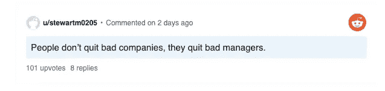

# 优秀的开发人员如何处理糟糕的管理

> 原文：<https://levelup.gitconnected.com/how-good-developers-handle-bad-management-f49b64432202>

## 以下是我处理糟糕管理的方法


[图片](https://stocksnap.io/photo/business-team-W6PNBNYHM6)由[直媒](https://stocksnap.io/author/directmedia)在 [StockSnap](https://stocksnap.io/) 上拍摄

你鄙视编码。你的任务毫无意义。性能问题移到下一个 sprint。你改变标签，而性能受到影响。

你被微观管理。你一直在加班。你有一个糟糕的经理。

*以下是如何应对糟糕的管理。*

```
· [How to notice bad management?](#487b)
· [Good management results](#23be)
· [How to deal with bad management?](#d00d)
· [References](#eec3)
```

# 如何注意到不好的管理？

糟糕的经理不会解决冻结的冲突。他们不做任何事情来删除它们。*冲突如何影响发展？*你不会审查来自高冲突同事的代码。你想避免冲突。*糟糕的人员管理导致冲突发生。*

*没有明确的目标。你在毫无意义地工作。你的任务是基于猜测，而不是基于客户的实际需求。你未使用的功能会导致动力下降。糟糕的管理没有明确的目标。*

没有明确的计划。概念验证进入生产阶段。测试或重构发生在错误发生之后。你今天做什么都无法避免将来的问题。没有一个粗略的计划，每个功能都会陷入混乱。

*团队士气下降。没有有趣的工作，开发人员就会离职。薪水是一个很好的动力，但是无聊会扼杀动力。*



[来源](https://www.reddit.com/r/programming/comments/nwfx4l/bad_managers_are_a_huge_problem_in_tech_and/h190hhe?utm_source=share&utm_medium=web2x&context=3)

忽视开发者的技能。让开发者应用他们的技能，给他们建议但不要命令。我们是聪明人。我们可以学习。我们不需要建议。管理者应该专注于管理，而不是发展。

*表现不佳者仍在工作*。他们雇佣表现不佳的员工。优秀的开发者为那些不优秀的人工作。这是由于*沉没成本谬论。这家公司对表现不佳的公司投资很多。他们听信沉没成本谬论，把工作留给了他。经理不会解雇表现不佳的员工——团队士气会受到影响。*

你不会赢得任何争论。你不能强行推行你的想法。*是什么激怒了开发者？做企业喜欢的事情，而不是对任务最有利的事情。管理不善的危险信号是什么？“企业最了解情况，你不应该质疑他们的决定。”*

经常加班。没有计划——加班。糟糕的管理者不知道加班只会导致倦怠。“时间压力下的人不会思考得更快。”⁴

*加班就像短跑:对于那些还有精力的人来说，跑完马拉松的最后一百码是有意义的，但如果你在第一英里就开始冲刺，你只是在浪费时间。⁵*

从经理的角度来看，*开发者也不怎么样。*我们喜欢在发布前进行重构，做出突破性的改变，并且在没有文档的情况下继续前进。*下面是一位经理写的故事:*

# 良好的管理结果

软件的变化和冲突是不可避免的。不同的意见导致建设性的冲突。建设性的冲突会带来最好的决定。没有冲突会导致糟糕的管理。 ⁵

*“没有变化——没有冲突。”—伊查克·爱迪思*

你的想法很有价值。当辩论到了关键时刻，没有人会贬低你的观点。博扬 leads 认为尊重能带来更好的组织。不同的观点可以成就或破坏你的软件。带着敬意一起讨论问题会带来更好的计划。

*“积极主动——为未来制定战略，但今天就行动。”—伊查克·爱迪思*

经理给你分配关键任务。他们知道你的未来价值。他们知道你会是一个很好的团队资产。经理今天给你分配入场券，让你明天变得更有见识。

*“他* ***拥有一切****——好的组织标志”—*

良好的管理使团队更加紧密。当你们一起工作时，你们工作得更好。人们正在离队吗？那是管理不善的表现。塞尔维亚俗语:***“唯有团结才能拯救塞尔维亚人”。*** *团结拯救团队，好的管理者培养团结。*

当人们几乎不知道一个领导者的存在时，他是最好的。他是不居功而成功的老师。因为功劳不是别人的，功劳是别人的”——*老子(约公元前 565 年)，论领导权*

# 如何应对管理不善？

*改善你的沟通。博扬 suggests⁵通信被低估了。交流导致做正确的事情。沟通导致高效的工作。*

*今天如何提高自己的沟通能力？*上下文和状态消息。⁵语境应该轻松传达你的想法。这条信息包含上下文和主要思想。状态包含具体日期。任务的具体日期。这些信息有助于改善你的沟通。

请求许可。*应该怎么问？詹姆斯·citrin⁷展示了一些征求许可的方法*

*   直接法
*   ***组件能力***
*   交换许可
*   帮助经理，他们会回报你

个人认为最好的方法是分解工作。展示组件方面的能力。每个经理都喜欢分解工作。展示每个工作组成部分的专业知识。⁷ *经理知道你的能力，可以分配给你一个有意义的任务。*

如果无济于事， ***离开*** 。有了正确的选择，在其他公司，你会很好地去。一次好的面试会挑选出一个适合他们文化的人。*这帮助我从一个充满危险的环境转变为一个组织更好的公司。*

跳槽后寻找好的管理。*好的经理有哪些特质？⁷*

*   不会因为团队合作而受到表扬
*   承担大部分责任
*   为团队设定合理的目标
*   让人们负起责任

# 参考

[1][https://iism . org/material/software-management-essentials-research-1/motivation-factors-top-3-unless-reported-by-creative-workers](https://iism.org/material/software-management-essentials-research-1/motivation-factors-top-3-dislikes-reported-by-creative-workers)

[2][https://iism . org/material-assets/software-management-essentials-research-1/motivation-factors-top-3-priorities-requested-by-creative-workers-R1 . jpg](https://iism.org/material-assets/software-management-essentials-research-1/motivation-factors-top-3-priorities-requested-by-creative-workers-r1.jpg)

[3]精明能干:乔尔·斯波尔斯基寻找最佳技术人才简明指南第 1 版。由 Avram Joel Spolsky 编辑

[4]懈怠:忘掉倦怠、忙碌和完全效率的神话——[汤姆·狄马克](https://www.amazon.com/Tom-DeMarco/e/B000AP7OPO/ref=dp_byline_cont_book_1)

[5] Peopleware:生产项目和团队第三版— [汤姆·狄马克](https://www.amazon.com/Tom-DeMarco/e/B000AP7OPO/ref=dp_byline_cont_book_1)

[6]博扬·莱科维奇—梅德韦迪·纳·普图

[7]非凡职业的 5 种模式:获得成功和满足感的指南平装本— [詹姆斯·m·西特林](https://www.amazon.com/James-M-Citrin/e/B001IXS7LM/ref=dp_byline_cont_book_1) [理查德·史密斯](https://www.amazon.com/s/ref=dp_byline_sr_book_2?ie=UTF8&field-author=Richard+Smith&text=Richard+Smith&sort=relevancerank&search-alias=books)