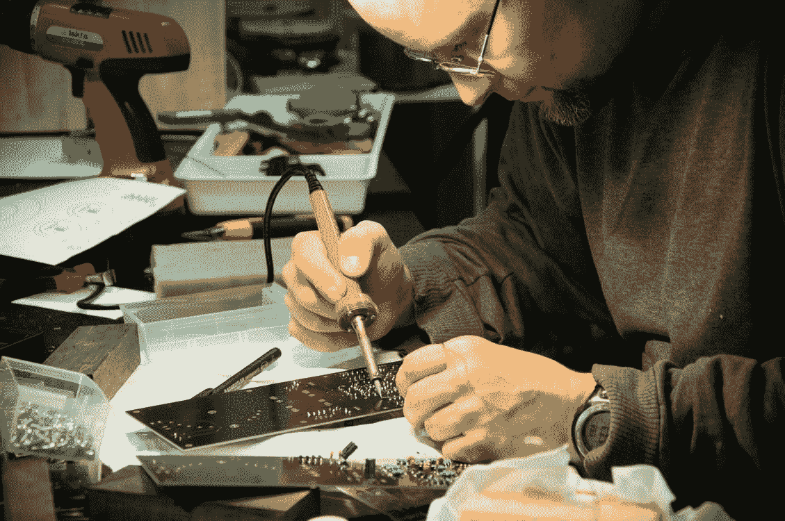

# 优秀的开发人员如何修复糟糕的代码库

> 原文：<https://levelup.gitconnected.com/how-good-developers-repair-bad-codebases-64cd1e3ec7de>

## 了解高级开发人员如何修复糟糕的代码库

照片由 [Pexels](https://www.pexels.com/photo/man-soldering-circuit-board-2517330/?utm_content=attributionCopyText&utm_medium=referral&utm_source=pexels) 的 [Blaz Erzetic](https://www.pexels.com/@www-erzetich-com?utm_content=attributionCopyText&utm_medium=referral&utm_source=pexels) 拍摄

当你看到一个坏的代码库时，你就知道它是坏的。没有测试。大班。团队沟通不好。无问题跟踪。没有 CI/CD。很多科技债务。

这是您需要了解更多维修知识的几个原因。修复糟糕的代码库很麻烦。如果做得好，修复软件会让[感到奇怪的满足](https://www.reddit.com/r/oddlysatisfying/)。

# 设置新的编码规则

不要让你的代码库溜走。设置规则。从静态代码分析开始。在每个构建中，进行强制性的行为和 UI 测试。

规则可以很简单。不要在一个 PR 中添加超过 500 个文件。上课不要超过 1000 行。

设置声纳来检查 Java 代码。利用詹金斯。将代码分析集成到您的构建中。这里是 Java 的规则。

有几千行代码的类，产生了引力。大三学生忍不住在那里多加代码。

> 我也这样做了。

尽可能分离逻辑。创建助手类更好。避免在一个大类中放更多的代码。

适应代码风格。没有灵活性会导致软件不稳定。

设置提交规则。添加有意义的消息。即使你独自工作。

假设你的项目成功了。你需要更多的条件，更多的逻辑。如果在提交时没有适当的沟通，就很难做出改变。

# 解决技术债务

培养科技债的心态。债务随着时间的推移而增加。你需要偿还它。

看软件升级。你从一个角度的版本开始。开发了几个月，新版本出现了。您现在需要升级。不要忽视这一点。做好计划，适应不断变化的软件生态系统。

当你修补软件时，把它记录在某个地方。知道那个补丁。当你有时间的时候，回去做一个适当的修复。

从 Alex Omeyer[那里找到更多关于科技债务的信息。他有很多关于科技债务的好文章。](https://medium.com/u/82f08f65bde8?source=post_page-----64cd1e3ec7de--------------------------------)

承认科技债务。开发商都知道。商务人士不太喜欢。他们看到修复成功了，修补好了，并继续做好工作。

这就是为什么开发人员和业务人员需要达成一致。同意科技债务。

让我们来看看科技债务的可能类型。这将有助于弥合开发者与企业之间的鸿沟。

我喜欢科技债务的分类。它将科技债务分为三类。

> 好的——提前释放

这种科技债务是最有益的。走这条路，去收集领域上的知识。

可以利用知识，提高。通过代码重构还清债务。

> 糟糕的——混乱的代码

当你不测试代码时，你就产生了这种技术债务。此外，如果你对代码不彻底，这也会适得其反。

这种类型的技术债务会导致严重的问题。不明智的选择。然而，我们可以在我们的代码库中看到这些代码。尽快确定并计划好。

> 好的:运行一个实验

运行实验产生的技术债务并不那么糟糕。客户和开发人员都同意这种债务。

它背后的代码必须是可移动的。我会把 A/B 测试放在这里。即使这会导致问题，人们也可以立即停止测试。

# 软件修理工还是制造者？

你是[制造者还是修理者](https://corgibytes.com/blog/2015/08/14/makers-vs-menders/)？

我喜欢从事稳定的项目。改进现有的设计。因此是个修理工。

当业务成功时，代码库就会增长。您有新的客户类型、新的促销活动和新的业务问题。

即使开始重构，也没有尽头。你可以进步很多，以至于你不知所措。因此，我们进行了一轮又一轮的重构，却没有任何改进。

这就是为什么这份工作是高级开发人员的工作。他们需要跳进去。告诉我们什么是更好的解决方案。

当你开始修理时，放下自我。接受批评，尤其是如果你是这个项目的新手。

不要改变技术，这样你就能解决问题。检查依赖关系。你需要它们吗？即使你改变了技术，商业模式也保持不变。会长成一样的烂摊子。

## 今天就加入 Medium！

这篇文章是[中的冰山一角](https://zivce.medium.com/membership)。[订阅 Medium](https://zivce.medium.com/membership) 提高你的生产力，成为更好的开发者，获得实用的小技巧。

*免责声明:5$中的 2$将直接支持我和我的文章。*

# 结论

制造者或修理者，我们需要修理软件。糟糕的代码库无处不在。使用这些提示，走得更远。

了解你的界限。提问。

先探索再改变。探索软件的惯用原则。探索 OO 设计原则。

# 资源

 [## 开发者差异:制造者与修补者

### 虽然确实有许多软件开发人员喜欢从头开始，但也有一群人…

corgibytes.com](https://corgibytes.com/blog/2015/08/14/makers-vs-menders/)  [## 敏捷焦点

### 回顾社区关于技术债务的智慧，我被这个术语的各种定义所震惊，这些定义不是…

agilefocus.com](http://agilefocus.com/2012/07/02/technical-debt-the-good-the-bad-and-the-okay/) 

Sandi Metz 是这篇文章的灵感来源