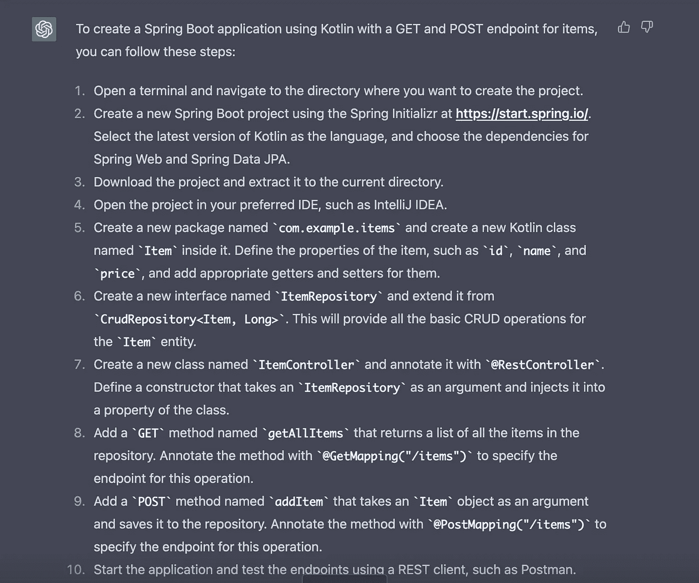
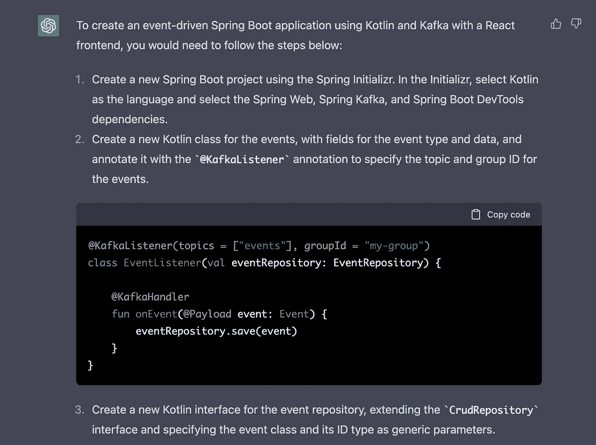

# ChatGPT 和 Kotlin 有多好？

> 原文：<https://levelup.gitconnected.com/how-good-is-chatgpt-with-kotlin-5dc6b22da28e>

ChatGPT 是最近发布的，已经引起了开发者和开发社区对程序员是否会失业的很多关注。让我们看看用 Kotlin 语言编程有多好。


阿曼达·达尔比约恩在 [Unsplash](https://unsplash.com?utm_source=medium&utm_medium=referral) 上的照片

# 问题#1

让我们从一个常见的 web 开发问题开始，用 Kotlin 作为语言创建一个像 Spring Boot 这样的后端 API。

**输入:**

> 使用 kotlin 为项目创建一个带有 get 和 post 端点的 spring boot 应用程序


**输出**



```
// Item.kt

package com.example.items;

import javax.persistence.Entity
import javax.persistence.GeneratedValue
import javax.persistence.GenerationType
import javax.persistence.Id

@Entity
class Item {
    @Id
    @GeneratedValue(strategy = GenerationType.AUTO)
    var id: Long = 0
    var name: String = ""
    var price: Double = 0.0

    fun getId(): Long = id
    fun setId(id: Long) {
        this.id = id
    }

    fun getName(): String = name
    fun setName(name: String) {
        this.name = name
    }

    fun getPrice(): Double = price
    fun setPrice(price: Double) {
        this.price = price
    }
}
```

```
// ItemRepository.kt
package com.example.items;

import org.springframework.data.repository.CrudRepository

interface ItemRepository : CrudRepository<Item, Long>
```

```
// ItemController.kt
package com.example.items;

@RestController
@RequestMapping("/items")
class ItemController(val itemRepository: ItemRepository) {

    @GetMapping
    fun getAllItems(): List<Item> {
        return itemRepository.findAll().toList()
    }

    @PostMapping
    fun addItem(@RequestBody item: Item): Item {
        return itemRepository.save(item)
    }
}
```

```
// application.properties

spring.datasource.url=jdbc:mysql://localhost:3306/my_database
spring.datasource.username=my_username
spring.datasource.password=my_password
spring.jpa.hibernate.ddl-auto=update
```

**运行命令**

```
$ curl http://localhost:8080/items
$ curl -X POST -H "Content-Type: application/json" -d '{"name": "Item 1", "description": "Description for Item 1"}' http://localhost:8080/items
```

不算太坏。

如您所见，它能够生成一个 CRUDRepository、RestController、Entity 和 application.properties 以及一些代码来测试端点以添加一个项目。

如果我在谷歌上搜索这个问题，我可能会搜索几个帖子，但得到的是一个 StackOverflow 线程，内容非常相似。然而，我在一个请求中得到了所有这些，我可以使用这些代码，甚至可以交给初学者，让他们开始使用。

少了什么？

我不能下载一个 zip 文件，或者直接运行它。我需要知道在哪里将这些值插入到 Spring Boot 应用程序中，目录结构是什么样子，以及如何将其连接到 MYSQL 数据库。

惯用的 Kotlin 也有一些缺陷，实体类应该真正使用一个`data`类，这样我就不必生成所有那些`set`和`get`方法。另外，使用`items`包对我来说也有点奇怪。

不错的开始，让我们看看 ChatGPT 如何处理一个更复杂的问题。

# 问题#2

事件驱动系统现在非常流行，让我们看看 ChatGPT 是否会为我们的下一个事件驱动系统带来一些很酷的东西。

**输入**

> 使用 kotlin 和 kafka 创建一个事件驱动的 spring boot 应用程序


**输出**



```
import React, { useState } from "react";
import { Producer } from "kafkajs";

const EventForm = () => {
    const [eventType, setEventType] = useState("");
    const [eventData, setEventData] = useState("");

    const handleSubmit = async (event) => {
        event.preventDefault();

        const producer = new Producer();
        await producer.connect();
        await producer.send({
            topic: "events",
            messages: [
                { value: JSON.stringify({ type: eventType, data: eventData }) },
            ],
        });
        await producer.disconnect();

        setEventType("");
        setEventData("");
    };

    return (
        <form onSubmit={handleSubmit}>
            <input
                type="text"
                placeholder="Event Type"
                value={
```

您会注意到 React 代码是不完整的。我运行了这个命令几次，这是我能得到的最大限度，所以我们必须准确地假设解决方案的其余部分是什么。

同样，这是一组不错的代码。它抓取了一些卡夫卡、Spring Boot 的库，并使用了通用的 Event 类。我不确定`events`端点具体用于什么，但是我假设通过`curl`测试或者 React 代码会有一个显示事件的列表页面。

就像我上面提到的，我必须知道如何处理这些代码。这是一个很好的开始，但是没有一个首席执行官或产品经理会说“用正确的架构为我构建一个解决 X 问题的应用程序”。

# 结论

看到 ChatGPT 的能力是非常酷的，令人印象深刻的是人工智能能够从一系列技术请求中整合起来。我认为 ChatGPT 会取代世界上所有的软件工程师吗？

绝对不行。

我认为 ChatGPT 是一个很好的工具，尤其是当你不太熟悉一门语言或者想要一些普通的模板代码任务的示例代码时。熟悉 ChatGPT 以及如何最好地使用它是一项很好的技能，我认为它可以让你成为一名更高效、更有能力的程序员。但是你仍然需要对你的特定领域和你正在解决的问题进行推理。

另一件要注意的事情是，所有这些应用程序或代码都需要在某个地方运行。有像 Vercel 这样的平台，您可以快速运行应用程序，但您仍然需要具备专业知识，以便能够请求适合的技术，以及在生产中运行应用程序所带来的所有其他复杂性。

你对 ChatGPT 有什么看法？您认为这对哪些任务有帮助？

如果你喜欢这篇文章，考虑[订阅媒体](https://medium.com/@ascourter/membership)！

如果你或你的公司有兴趣找人进行技术面试，那么请在 Twitter ( [@Exosyphon](http://twitter.com/Exosyphon) )上给我发消息，或者访问我的[网站](https://andrewcourter.com/)。如果你喜欢这样的话题，那么你可能也会喜欢我的 Youtube 频道。如果你喜欢 3D 打印的东西，可以去我的商店看看。祝您愉快！