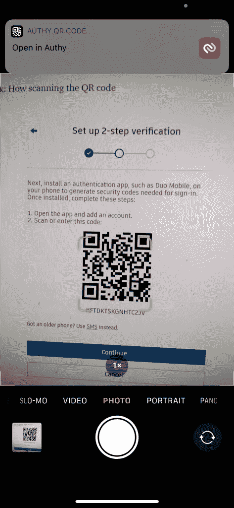
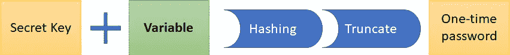

# Google 认证器、基于 HMAC 的一次性密码和基于时间的一次性密码是如何工作的

> 原文：<https://levelup.gitconnected.com/how-google-authenticator-hmac-based-one-time-password-and-time-based-one-time-password-work-17c6bdef0deb>


[迈卡·威廉姆斯](https://unsplash.com/@mr_williams_photography?utm_source=unsplash&utm_medium=referral&utm_content=creditCopyText)在 [Unsplash](https://unsplash.com/s/photos/login?utm_source=unsplash&utm_medium=referral&utm_content=creditCopyText) 上拍照

已经知道 [*密码不够好*](https://www.jisc.ac.uk/blog/why-having-a-strong-password-isnt-enough-to-secure-your-account-23-jul-2020) 。多因素身份认证(MFA)通过要求用户提供除密码之外的其他信息，增加了额外的防御级别。主要有三类信息:

*   **您知道的一些事情:**密码、安全问题、pin 码
*   **您拥有的东西:**用户拥有的东西，例如智能手机、硬件令牌
*   **你是什么:**证明用户是他们所声称的那个人的东西——通常是生物特征因素(指纹、Face ID 等。)

很多[网站](https://evanhahn.com/2fa/)以密码为“你知道的东西”，以认证者生成的令牌为“你拥有的东西”来提供 2FA。事实上，如果你在智能手机上使用 authenticator 应用程序，你还可以免费获得第三个因素，在启动 authenticator 应用程序之前，你需要通过智能手机的生物认证。

> 一些密码管理器，如 LastPass 和 BitWarden，也提供认证器功能。我认为使用它们是一个可怕的想法，你基本上是把所有的因素都压缩成一个——你的主密码。

**所有授权码都是平等的吗？**

当你在网站上启用双因素认证时，他们通常会向你显示一个二维码，并要求你扫描并启动你的认证器应用程序。有些网站**专门**要求你使用谷歌认证器，**你不用**。Google Authenticator 使用的是基于 HMAC 的一次性密码(HOTP)和基于时间的一次性密码(TOTP)算法。其他认证器应用程序，如 Authy、Duo Mobile、Lastpass 和 1Password，都实现了相同的算法，并且能够生成与您从谷歌认证器获得的**完全相同的令牌**。

不同授权码之间的主要区别是，一些授权码与云集成，并将您的密钥的加密副本上传到他们的服务器，因此您可以享受在多个设备上访问您的令牌的便利。当然，在这种情况下，您还信任身份验证者提供者。

**二维码背后有什么魔力？**



二维码实际上是一个 URI。上面截图中的是

```
otpauth://totp/Autodesk?secret=KFTDKTSKGNHTC2JV
```

URI 计划最初是由谷歌正式提出的。大多数验证器应用程序为`otpauth://`注册了一个处理程序，因此相机应用程序知道如何在扫描时提示用户启动验证器应用程序。GitHub 上的这个[文档](https://github.com/google/google-authenticator/wiki/Key-Uri-Format)解释了 URI 的构造:

```
otpauth://TYPE/LABEL?PARAMETERS
```

`TYPE`要么是 HOTP，要么是 TOTP(稍后将详述)。`LABEL`仅用于显示，验证者应用程序使用它来预填充帐户名称。`secret`是认证者用来生成令牌的密钥。

尽管 URI 方案本身支持不同的`PARAMETERS`，如`Algorithm`和`Digits`，但谷歌认证器并不实现它们，大多数网站采用默认设置，使用 SHA1 和 6 位令牌。

**HOTP 和 TOTP**

Google Authenticator 支持两种算法。

*   HMAC 的一次性密码(HOTP)
*   基于时间的一次性密码(TOTP)



HOTP 和 TOTP

在这里，一次性密码是用户发送到网站进行验证的 6 位数令牌。密钥由网站在二维码中提供给用户，**双方需要保留该密钥用于一次性密码生成(该密钥存储在认证器内)**。

一次性密码的一个关键要求是每个密码只应使用一次，因此该算法需要某种可变元素来在用户每次想要登录时生成不同的 OTP。

在 HOTP，这个变量是一个计数器。服务器和用户通过对秘密密钥和计数器应用散列和截断操作来计算 OTP。服务器将其计算的 OTP 与用户提供的 OTP 进行比较。**然后双方递增计数器**。

HOTP 的一个明显缺点是服务器和用户之间的计数器必须保持同步。如果用户打开 authenticator 应用程序来生成 OTP，但最终没有使用它，则用户端的计数器将与服务器不同步。处理这种情况的一种方法是重新同步机制，其中服务器尝试几个未来的计数器值，以查看它是否找到匹配的 OTP，并相应地同步计数器。


TOTP

TOTP 通过使用当前时间作为可变元素来改进 HOTP。在 TOTP，时间被定义为从 Epoch 开始的秒数除以一个周期(在大多数实现中为 30 秒)。只要用户设备和服务器上的时钟准确，它们将能够一起生成相同的 OTP。

尽管如此，仍有一个**边缘案例**。在用户 OTP 生成和服务器 OTP 生成之间存在时间间隔。服务器根据用户的动态口令到达服务器的时间来生成动态口令。假设用户设备和服务器之间存在一些未知的消息传输时间和时钟漂移，则用户计算中使用的时间可能与服务器使用的时间属于不同的时间步长(30 秒)。对此的解决方案通常是让服务器接受使用向前或向后一个时间步长计算的 OTP。

> 你是否曾经等待下一个令牌出现，而它将在几秒钟后到期，担心你没有足够的时间将其输入到文本框中？*你可能不需要*，因为如果时差不太大的话，服务器通常会接受新旧两个版本。

大多数网站使用 TOTP 算法，市场上所有谷歌认证兼容的替代品都支持同样的算法。如果你是 advanturous，你也可以实现自己的 TOTP 生成器，你会得到完全相同的 6 位数字令牌作为谷歌认证，如果你这样做是正确的。

HOTP 和 TOTP 的简单实现:

*   [Python](https://github.com/susam/mintotp#source-code)
*   [走](https://github.com/robbiev/two-factor-auth)

希望你喜欢这个故事！