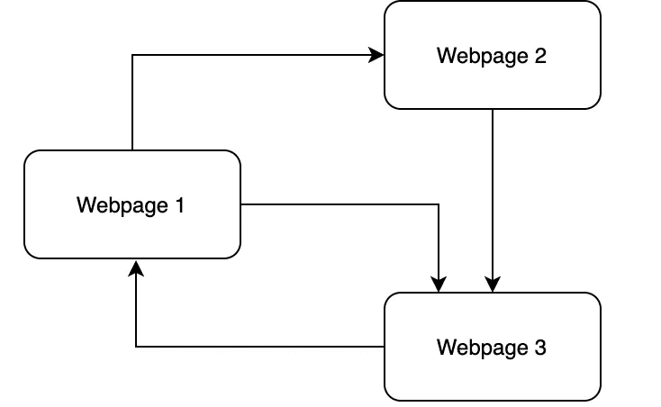
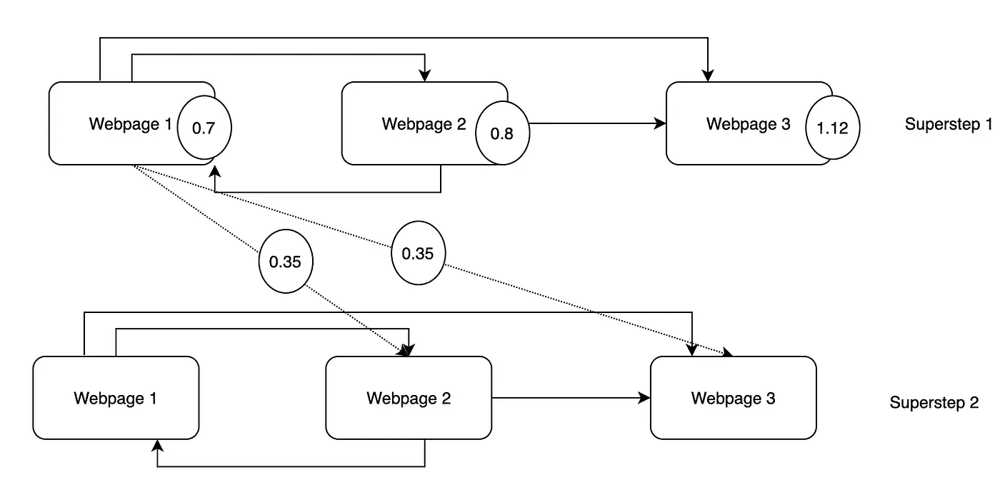

# Google 如何高效地计算整个互联网的 PageRank(第一部分)

> 原文：<https://levelup.gitconnected.com/how-google-computes-the-pagerank-for-the-whole-internet-efficiently-part-1-135ca6ef3247>

Google 的 PageRank 算法和 Pregel 图形处理框架介绍


Solen Feyissa 在 [Unsplash](https://unsplash.com?utm_source=medium&utm_medium=referral) 上拍摄的照片

> 博客的第二部分可以在这里找到:[https://megtechcorner . medium . com/how-Google-computes-the-page rank-for-the-whole-internet-efficient-part-2-57224 df 8737 c](https://megtechcorner.medium.com/how-google-computes-the-pagerank-for-the-whole-internet-efficiently-part-2-57224df8737c)

随着互联网的出现，图形数据变得越来越丰富。一些例子是网络图(即互联网)、社交网络、交通路线和疾病爆发。高效挖掘图数据吸引了研究者和实践者的兴趣。在这篇博客中，我们将关注一个名为 Pregel 的框架，Google 使用它来处理其海量的网络图数据。

我们将从介绍 PageRank 算法开始，并说明什么是图形数据以及如何处理它们。然后我们将讨论 Pregel 框架的计算模型。接下来，我们将讨论框架的 API 和实现。

# PageRank

互联网可以被建模为一个图，其中每个网页是一个顶点，网页之间的链接是边。PageRank 算法的目标是为每个页面分配一个值，称为 *pagerank* ，以表示网页的质量。如果网页具有较高的页面等级，则它被认为具有较好的质量，并且在搜索结果中显示在具有较低页面等级的网页之前。

> 请注意，下面的例子是基于 Google 的联合创始人 Sergey 和 Page 的论文[2]中的原始 PageRank 算法。其他优化已被纳入算法后来。感兴趣的用户可以参考[这个 wiki 页面](https://en.wikipedia.org/wiki/PageRank#Variations)。

网页的页面排名(PR)用下面的公式计算。对于链接到 w 的所有网页，其页面排名的一部分被传播到 w，其计算为其页面排名除以传出链接的数量。也就是说，网页的页面等级在它链接到的所有网页之间平均划分。

```
PR(w) = 0.15 + 0.85 * (PR(w1)/num_of_outgoing_links(w1) + ... + PR(w_n)/num_of_outgoing_links(w_n))
```

想象下面这个简单的案例。网页 1 链接到网页 2 和 3。网页 2 链接到网页 3，网页 3 链接到网页 1。



假设网页 1 的页面排名为 0.7，网页 2 的页面排名为 0.8。网页 3 的页面排名是

```
0.15 + 0.85 * (0.7 / 2 + 0.8 / 1) = 1.1275
```

在我们得到网页 3 的页面排名后，很容易看出网页 1 的页面排名应该更新。

```
0.15 + 0.85 * 1.1275 / 2 = 0.629
```

网页 2 的页面排名也是如此。网页 1 和 2 的页面排名更新后，网页 3 的页面排名不同步，需要再次更新。这个过程将一直重复，直到我们达到平衡。也就是说，如果我们再次重复这个过程，网页的网页排名不再更新。

对于我们的例子，处于平衡状态的网页的页面等级是:(网页 1，1.163)，(网页 2，0.644)，和(网页 3，1.192)。例如，对于网页 1 和 2 的页面排名，网页 3 的页面排名是 1.192。

```
0.15 + 0.85 * (1.163 / 2 + 0.644) = 1.192
```

开发 pregel 框架是为了促进这种迭代过程达到图中的某种平衡状态。

# 预凝胶计算模型

## 顶点

Pregel 的计算模型密切反映了图形的概念。框架的核心是顶点的表示。顶点的界面如下所示。每个顶点包含用户定义的值。可以通过 *GetValue()* 函数访问，通过 *MutableValue()* 函数变异。在页面排名示例中，每个顶点将存储其页面排名值。

顶点还保存了它所有的输出边，可以用 GetOutEdgeIterator()函数访问它们。请注意，顶点不存储它们的传入边。这样做有两个原因。**第一个原因**是每个顶点只需要负责将消息发送到适当的顶点。消息转发和接收由 Pregel 框架处理。**第二个原因**是这个布局提供了一个清晰的机制来划分图表。一个分区是顶点及其所有输出边的子集。不同分区之间不会有重叠。

```
template<typename VertexValue, 
         typename EdgeValue, 
         typename MessageValue>
class Vertex {
 public:
  virtual void Compute(MessageIterator* msg) = 0;

  const std::string& vertex_id() const;
  int64 superstep() const; const VertexValue& GetValue();
  VertexValue* MutableValue();
  OutEdgeIterator GetOutEdgeIterator(); void SendMessageTo(const string& dest_vertex, const MessageValue& message);};
```

## 预凝胶计算循环

在非常高的层次上，Pregel 计算由一系列迭代组成，其中每个迭代被称为一个**超步骤**。在每个超级步骤中，框架调用用户逻辑(在 Compute()函数中定义)。Compute()函数可以读取在前面的超级步骤中发送给它的消息。它还可以使用 *SendMessageTo()* 函数向其他顶点发送消息，这些消息将在下一个超步骤中被接收。

下面的代码总结了 Pregel 框架的概念计算循环。对于每个循环/超步骤，它用前一个超步骤中发送给它的消息填充顶点，并调用用户逻辑。

```
for (int superstep=1; !shouldTerminate(); superstep()++) {
  // At superstep s, we only allow access messages from superstep 
  // s-1\. So we move the message to the `old_map` so that it is 
  // not updated while iteration s is running.   for (Vertex v : all_vertices_) {
    v.incrementSuperStep();  // private function
    v.setMessage(old_map.at(v.vertex_id()); // private function. 
                     // Populate vertex v with all messages sent to 
                     // it in the previous superstep. v.Compute(); // user logic CollectMessage(v.getSentMessages(), &map); // private function
                     // Dumps all "sent" messages to the map.
  }
}
```

## 信息传递

顶点通过发送消息直接相互通信。一个顶点可以在超级步骤 s 中发送任意数量的消息，但是这些消息将在超级步骤 s+1 中被接收。

如上面的概念计算循环中所总结的，框架收集所有发送的消息，代码为*collect message(v . getsentmessages()，& map)* 。这里我们假设顶点的 *SendMessageTo()* 函数仅仅将消息存储在本地存储器中，这些消息可以通过 *getSentMessages()* 函数访问。在下一次迭代开始时，这些消息对带有`v.setMessage(map.at(v.vertex_id())`的顶点可用

> 请注意，这只是一个概念模型。在大规模系统中使用一个集中的协调器来传递消息实际上是非常低效的。关于它是如何实际实现的，请参考实现部分。

## 应用:PageRank

使用 Pregel 框架，可以用下面几行代码简洁地表达页面排名算法。前 7 行计算顶点的页面排名。最后两行向每个顶点发送一条消息，告诉它有多少页面等级将从顶点流向它。

```
class PageRankVertex : public Vertex<double, void, double> {
 public:
  virtual void Compute(MessageIterator* msgs) {
    // Compute the page rank of the vertex
    if (superstep() >= 1) {
      double sum = 0;
      for(; !msg->Done(); msgs->Next()) {
        sum += msgs->Value();
      }
      *MutableValue() = 0.15 + 0.85 * sum();    
    } // Propagate the page rank to the webpage that it links to.
    const int64 n = GetOutEdgeIterator().size();
    SendMessageToAllNeighbors(GetValue() / n);
  }
};
```



与我们的示例一样，网页 1 将向网页 2 和 3 发送 1 条消息。这两个消息都包含值 0.35，该值表示有多少页面排名从网页 1 传播到网页 2 和 3。

# 履行

使用 Pregel 框架，用户只需提供一些功能来处理顶点的状态，而 Pregel 将负责图形的执行，如消息传递和顶点调度，并将其扩展到数 Pb 的数据和数千台机器！

在博客的第 2 部分，我们将深入探讨 Pregel 框架的架构，以及它如何可靠地扩展到数千台机器。继续阅读这里:[https://megtechcorner . medium . com/how-Google-computes-the-page rank-for-the-whole-internet-efficient-part-2-57224 df 8737 c](https://megtechcorner.medium.com/how-google-computes-the-pagerank-for-the-whole-internet-efficiently-part-2-57224df8737c)

# 参考

[1] Malewicz，Grzegorz 等，“Pregel:大规模图形处理系统”2010 年 ACM SIGMOD 数据管理国际会议论文集。2010.

[2]布林、谢尔盖和劳伦斯·佩奇。“大规模超文本网络搜索引擎的剖析。”*计算机网络和 ISDN 系统*30.1–7(1998):107–117。