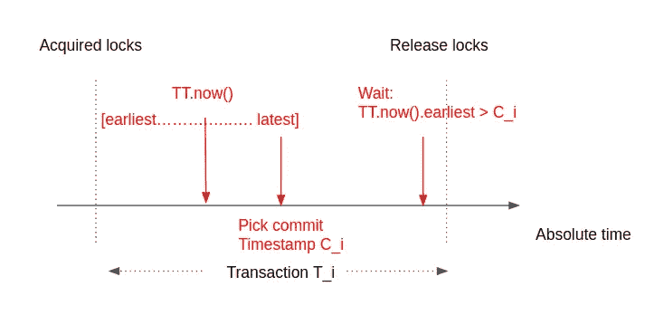
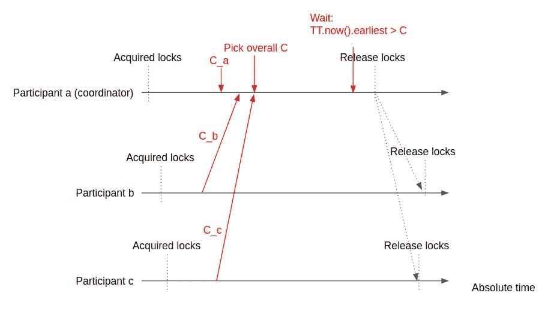

# Google Spanner 如何分配提交时间戳——其强大一致性的秘密武器

> 原文：<https://levelup.gitconnected.com/how-google-spanner-assigns-commit-timestamps-the-secret-sauce-of-its-strong-consistency-8bc143614f26>

卢卡斯·布拉塞克在 [Unsplash](https://unsplash.com?utm_source=medium&utm_medium=referral) 上的照片

Spanner 是 Google 的全球规模、同步复制的关系数据库。其研究论文首次发表于 2012 年。Spanner 受到了很多好评，因为它是第一个在全球范围内分发数据并支持强一致性分布式事务的系统。这似乎打破了上限定理。但事实上，Spanner 在面对网络分区时选择了一致性而不是可用性。只是谷歌的数据中心基础设施非常可靠，外部用户通常不会担心它的中断。谷歌现在通过其云平台提供 Spanner 作为服务。

已经有很多博客文章试图解释 Spanner 是如何工作的。但他们中的大多数人只是承认 Spanner 有准确的提交时间戳，并继续讨论其功能或架构的其他方面。很少有人真正尝试清楚地了解它的准确提交时间戳是如何选择的，这是它强大一致性的真正秘密。答案不仅仅是“是的，他们有一个 TrueTime API”。在这篇博文中，我将和你一起探索它的内在逻辑。

## **准确的提交时间戳有什么大不了的**

首先，我们需要理解为什么准确的提交时间戳很重要。简而言之，它们给混乱的分布式系统带来了秩序。分布式系统的根本挑战在于所有移动部件之间缺乏同步。缺乏同步的部分原因是自然的，因为事情可能会频繁地和不可预测地失败，部分原因是设计的，因为如果所有部分都需要一起移动，整个系统将会非常慢。准确的提交时间戳给系统灌输了一种有序感。当所有事件都可以用它们发生时的真实时间戳来标记时，系统会考虑提交顺序和全局墙时间顺序。具有这种能力的系统保持了线性化，即外部一致性，即强一致性。具体来说，一旦提交了写操作，随后的所有读操作都会反映出来，因为它们的时间戳大于写时间戳。我们可以支持多版本数据库，并允许客户在任何时间点跟踪历史。我们甚至可以通过给更新分配一个未来的时间戳来提供非阻塞的原子模式更新。为了横向扩展性能，我们可以提供来自副本的数据，只要它足够新，这也可以通过准确的提交时间戳来确定。顺便说一下，扳手做所有这些。

但是全球精确的时间戳是非常困难的。我们不能依赖机器的本地时钟，因为时钟偏差在分布式系统中是真实存在的。研究表明，本地时钟可以在仅仅 30 秒内漂移几毫秒。对于由数万台机器组成的分布式系统来说，这将是灾难性的，这些机器希望使用时间戳来进行事件排序。Spanner 试图通过构建一个 TrueTime API 来克服这个问题。TrueTime API 并没有给出一个绝对时间——正如它的名字所暗示的那样——相反，它公开了有界区间中的时间不确定性，Spanner 利用这一点来订购事务。稍后我们会看到更多。

## **什么是提交时间戳，确切地说是**

在我们继续之前，我们需要花点时间考虑一下提交时间戳到底是什么。一种常见的说法是，这是一个事务中所有写入都被写入的时刻。虽然这个定义在某些场景中发挥了它的作用，但在这个讨论中我更喜欢一个不同的解释:提交时间戳是在事务获得所有锁之后、释放任何锁之前分配给事务的时间戳。

要理解它的意义，请看下面的推理。数据库事务依靠两阶段锁定来实现隔离。一块数据受读写锁保护，该锁允许共享读取，但一次只能进行一次独占写入。如果两个并行事务不争用锁，这意味着它们不会相互混淆，它们是真正并发的，它们没有因果相关性，所有这些最终意味着我们不必过多地比较它们的时间戳，因为它们的排序是不确定的。客户只会接受其中一个恰好比另一个完成得快。

另一方面，如果两个事务争用锁，其中一个将首先获得所有锁，并进入其事务逻辑。另一个必须等待，并且能够在第一个开始释放锁时获取锁。因此，如果我们可以在获取所有锁之后和释放任何锁之前分配一个时间戳，那么时间戳将反映执行顺序及其因果依赖关系。

## **true time API**

呼叫者呼叫`TT.now()`。TrueTime API 返回一个`[earliest, latest]`间隔。绝对时间落在该区间内。它的本质不是告诉我们现在是什么时间，而是告诉我们当前时间在 10:30 到 10:35 之间。这非常有用，我们将在后面看到，因为它限制并暴露了时钟的不确定性，调用者可以反过来利用这一点。我的“10:30 到 10:35 之间”只是一个说明性的夸张。实际上，返回的`earliest`和`latest`只相差几毫秒。间隔很窄。归功于部署在每个谷歌数据中心的 GPS 和原子钟。您可能想知道，如果绝对时间由于误差而超出了该时间间隔，会发生什么情况。谷歌的实验表明，这比 CPU 故障的可能性低六倍。所以实际上我们并不担心。

## **如何分配提交时间戳**

Spanner 的数据按表键分区，以实现可伸缩性。然后复制每个分区以获得冗余和性能。在每个分区内，从副本中选出一个领导者。所有的写作都要经过领导。Spanner 使用多 paxos 来实现基于时间的 leader lease，因此一个分区(leader +其他副本)被称为 paxos 组。组长租约到期后，小组将选举新的组长。领导者可以通过发送“心跳”来延长租期。如果一个事务的所有读写都涉及一个分区中的数据，则该事务只与该分区进行交互。

感叹词:不懂 Paxos 也没关系。不会影响你对这篇博文的理解。事实上，有趣的是，研究表明过早地学习 Paxos 实际上会损害你理解分布式共识的机会。我写过一篇关于 Raft[[https://level up . git connected . com/Raft-consensus-protocol-made-simpler-922 c 38675181](/raft-consensus-protocol-made-simpler-922c38675181)]的博文，比较适合想掌握分布式共识和日志复制的新手。

当一个事务涉及多个分区时，就会发生分布式事务。spanner 客户端库从参与分区中选择一个协调器，并开始两阶段提交。最终，一旦协调器收集了所有必要的信息，它将分配时间戳并通知参与者提交数据。

在单个分区的情况下，分区领导者需要确保提交时间戳大于它已经分配的所有以前的提交时间戳。这可以通过提交等待来实现。参见图 1 中的图解。

图 1

对于一个事务`T_i`，我们在获取所有锁后调用`TT.now()`，并选择时间戳`C_i`作为返回的`latest`。然后我们旋转，直到下一个`TT.now().earliest`大于`C_i`。这保证了提交时间戳落在事务`T_i`的独占区间内。在`T_i`提交之后发生的冲突事务`T_(i+1)`将因此具有比`C_i`大的提交时间戳`C_(i+1)`。这种等待似乎导致了事务提交的明显延迟。但在实践中，Spanner 在等待的同时还做了其他工作，包括跨洲复制数据，到最后`TT.now().earliest`在`C_i`之后很久。

在多分区的情况下，协调器需要确保提交时间戳不仅大于它自己以前的提交时间戳，而且大于其他参与者以前分配的提交时间戳。协调器在两阶段提交过程中收集这些信息。如果您知道两阶段提交，您就会知道有一个准备阶段，在这个阶段协调者将接收来自参与者的响应。参与者可以在这些响应中发送他们以前的提交时间戳。最后，协调器将指示其他参与者提交，其中它还可以传递所选择的提交时间戳。但是这个细节在这里并不重要。要点是在坐标和其他参与者之间存在预先存在的通信通道，通过这些通道，他们可以附带提交时间戳信息。参见图 2 中的图解。

图 2

协调器获取锁并挑选自己的提交时间戳`C_a`。然后，它等待其他参与者获取它们的锁，并将它们选择的提交时间戳(`C_b`和`C_c`)发送给它。协调器选择一个总的提交时间戳`C`，这是最大值。然后，协调器以与单个分区相同的方式等待提交。当可以安全释放锁时，协调者会这样做并通知其他参与者。一个新的事务可能在协调器释放锁之后立即开始，而其他参与者仍处于锁中。但那是安全的。因为如果新的转换是被限制在协调器中的单个分区事务，那么它不涉及其他参与者中的数据。但是如果它是一个分布式事务，它的总提交时间戳`C`将不得不首先等待前一个事务释放其他参与者中的锁，因为其他参与者只在获取新锁之后发送他们选择的新提交时间戳。

## **关闭**

我希望这篇博文对 Spanner 如何保证强一致性提供了一些见解。下一次，当人们问你这个问题时，你将能够说:“这是因为 Spanner 等待时钟不确定性——它通过 TrueTime API 获得——并确保分配的提交时间戳落在事务的独占间隔内。”就这些了。下次见。