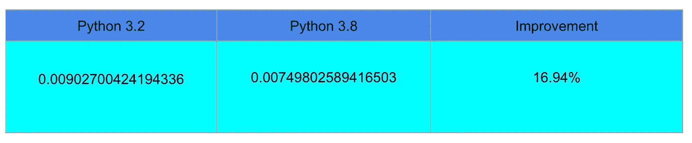
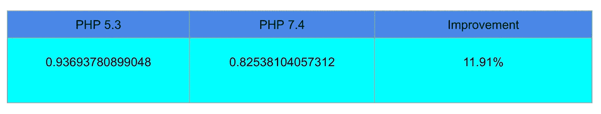
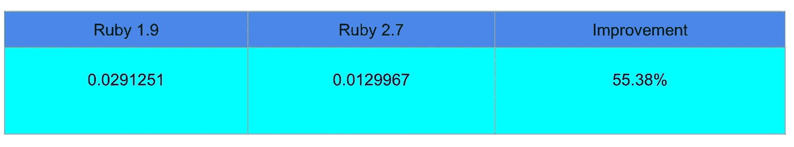
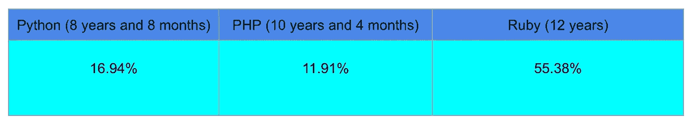

# PHP、Python 和 Ruby 的性能近年来有了怎样的提升？

> 原文：<https://levelup.gitconnected.com/how-has-the-performance-of-php-python-and-ruby-improved-in-recent-years-1768fd5b6df9>

让我们回顾一下三种主要编程语言的性能改进，以便更好地理解保持项目更新的重要性。


由 [SpaceX](https://unsplash.com/@spacex?utm_source=medium&utm_medium=referral) 在 [Unsplash](https://unsplash.com?utm_source=medium&utm_medium=referral) 上拍摄的照片

改善应用程序响应时间的需求是我们一直关注的问题。任何现代开发语言背后的软件工程师都在试图提高开发过程的速度。问题是，他们实现了改进吗？他们改进了多少？

为了测试性能改进，我运行了求解斐波那契计算的脚本。这种比较是针对一种语言的旧版本和最新版本的。

> 免责声明:根据 docker 版本、使用的机器和 fibonacci 解决方案的实施情况，结果(确切的数字和甚至微小的百分比)可能会有所不同。
> 
> 本文的目的是比较 Python、PHP 和 Ruby 旧版本与最新版本(截至 2020 年 2 月)之间的改进，而不是不同语言之间的改进。如果有人对此感兴趣，我推荐使用相同的 linux 基础创建一个 docker 映像，并使用非常接近的 fibonacci 解决方案实现(加上过程时间的测量)。

## 计算机编程语言

我们从 2011 年 2 月 20 日发布的 Python 3.2 版本开始。

```
docker container run --rm -v $(pwd):/script/ python:3.2 python /script/Fibonacci.py
```

运行 100 次后的平均时间:0.00902700424194336 秒。

现在 Python 版，日期 2019 年 10 月 14 日。

```
docker container run —-rm -v $(pwd):/script/ python:3.8 python /script/Fibonacci.py
```

0.007498025894165039 秒。



## 服务器端编程语言（Professional Hypertext Preprocessor 的缩写）

接下来是 PHP，从 2009 年 6 月 30 日的 PHP 5.3 开始。

```
docker container run --rm -v $(pwd):/script/ php:5.3 php /script/Fibonacci.php
```

0.93693780899048 秒。

现在有了 PHP 7.4，从 2019 年 11 月 28 日开始。

```
docker container run --rm -v $(pwd):/script/ php:7.4 php /script/Fibonacci.php
```

0.82538104057312 秒



## 红宝石

首先，让我们试试 2007 年 12 月 25 日发布的旧版本 1.9。

```
docker container run-rm -v $(pwd):/script/ ruby:1.9 ruby /script/Fibonacci.rb
```

0.0291251 秒。

现在是 Ruby 的最新版本，2019 年 12 月 25 日的 2.7。

```
docker container run --rm -v $(pwd):/script/ ruby:2.7.0 ruby /script/Fibonacci.rb
```

0.0129967 秒。



## 改进的比较



虽然这种比较不是 100%科学的——我们比较的是不同的时间量——但很明显这些编程语言背后的团队为提高其性能所做的努力。对于将我们生活应用程序的基础代码更新到最新版本来说，这是一个很好的点——以及安全性增强和新功能。

## 注释和注意事项

*   我为这篇文章选择了一个斐波那契问题，因为它是一个明显的递归解决方案，会大量消耗资源。
*   我是在一台装有 Linux Manjaro 的笔记本电脑上进行这些测试的，这台笔记本电脑配有 3 GHz 英特尔酷睿 i5 处理器和 32 GB 内存。对于其他配置，这些数字可能会有所不同，但我确信改进是相似的。
*   我将每个脚本运行 100 次，结果是平均值。
*   本文的目的不是比较不同语言之间的性能。为此，我会清理更多具有相同行为的脚本，并优化 docker 容器以确保它们在相同的条件下运行。
*   我已经为每种语言选择了中央 docker 库中最老和最新的版本。

## 下一步是什么？

我预计在接下来的几个月里，几种语言将会实现雄心勃勃的改变，这将极大地提高其代码库的运行速度。即将发布的具有 JIT 特性的 PHP-8 将会刺激其他开发语言的变化。

如果你想看看包含 PHP-8 的新 JIT 特性的基准，你可以阅读下面的文章(剧透冒泡排序中 45%的改进！):

[](/how-fast-is-php-8-going-to-be-f7fdc111cd6) [## PHP-8 会有多快？

### PHP-8 将于今年年底发布。让我们看看它如何提高一个脚本的速度。

levelup.gitconnected.com](/how-fast-is-php-8-going-to-be-f7fdc111cd6)