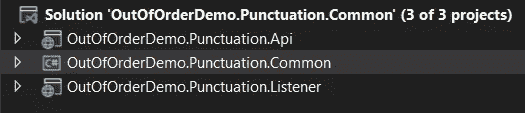

# 我如何处理无序事件

> 原文：<https://levelup.gitconnected.com/how-i-am-handling-out-of-order-events-d3e356959820>

## 使用基于标点的技术处理无序事件

照片由 [@uxindo](https://unsplash.com/@uxindo) 在 [unsplash](https://unsplash.com/) 拍摄

在分布式系统的世界中，我们经常处理事件和消费者，而不考虑消费它们时的时间现实。作为开发人员，我们倾向于以顺序的方式思考事件，但是当我们不在单线程环境中工作时，我们的思考不能反映现实。

当我不得不围绕如何最好地处理事件的**顺序**做出设计决策时，我挣扎了很久，我想分享一些我的发现。

> *使用以下链接可以找到演示的链接:*[https://github . com/ramihamati/demo _ out of order/tree/main/out of order demo。标点符号](https://github.com/ramihamati/demo_outoforder/tree/main/OutOfOrderDemo.Punctuation)

# 定义

**无序事件**是指接收时间晚于预期的事件(或者处理时间早于预期)。这可能会导致我们的系统出现不正确的状态。

在处理这种情况时，有两种常用的处理方法:

*   IOP——按顺序处理——通常使用一个缓冲区来存储多个事件，我们可以稍后在实际调度它们进行处理之前对它们进行排序。
*   OOP——无序处理——不需要订单维护。在排序需求的情况下，OOP 缓冲输入项，直到满足一个特殊的条件。这种情况由进度指示器支持，如标点、低水位线或心跳。

定义了属于这两类的几种技术:

> 基于缓冲区的方法
> 
> 基于标点的方法
> 
> 基于推测的方法
> 
> 基于近似的方法

*你可以通过本页底部的链接了解更多信息。*

# 语境

*   出于特殊的查询目的，我想消费多个事件并将其转换成聚合事件
*   转换后的模型并不重要，因此最终的一致性足够好。
*   我需要一个简单的解决方案，缓冲不是一个选项，因为它引入了额外的复杂性。
*   我的事件是基本的域操作，如创建、更新、删除。这简化了我的设计

我决定采用基于标点符号的方法，使用实体版本控制系统。

# 设计决策

*   原始的域模型将有一个由存储库透明处理的版本属性。
*   发送的事件将包含独立于动作类型的整个域模型(作为事件模型)。这意味着如果我在一个创建的事件之前收到一个更新的事件，我可以使用这个信息来创建我的转换模型
*   每个转换后的模型将存储用于创建它的所有事件的版本。

# 实施—结构

我将介绍的项目结构如下:

*   api 项目包含原始的领域模型
*   监听器包含转换后的模型
*   公共项目包含基础设施类，帮助我维护版本系统以及事件和事件模型。

# 实施— Api

因为域模型必须包含一个版本，所以我创建了一个接口来实现:

上述接口的实现将代表我们的 mongo 实体的基类(我不会详细介绍`BaseDocument`，它只是一个 mongo 基类，你可以在 git 项目中查看)

关于我的实现，重要的是我没有让用户处理版本，因为他可能会忘记增加它。相反，我是在存储库中这样做的。您可以在 git 中查看完整的代码，但这里有一个片段:

对于 API，我创建了一个简单的控制器，它将创建和更新实体，对于每个动作，它将发布一个事件。每个事件都有一个事件模型，特定实体的事件模型对于与该实体相关的所有操作都是相同的。这很有用，因为如果我在一个创建的事件之后收到一个更新事件，我就可以访问转换后的模型所需的全部信息。

对于出版商，我使用的是为 RabbitMQ 配置的 [MassTransit](https://masstransit-project.com/usage/transports/rabbitmq.html)

# 实现监听器

这部分有点复杂。这里我们有一组由一个或多个实体组成的实体。也许从结果开始，然后举例说明解决方案更容易。我在这里的目标是创建一个`BookExpanded`，一个包含书籍和作者详细信息的模型。

那么我们可能会有什么样的情况:

*   在`*BookCreated*` 事件之前接收`*BookUpdated*` 事件
*   在`*BookCreated*` */* `*Updated*` 事件之后接收`*AuthorCreated*` 事件
*   在`*AuthorCreated*` 或`*BookCreated*` */* `*Updated*` 事件之后接收`*AuthorUpdated*` 事件

正如你所看到的，以上所有的可能性都会在我们的系统中引发一个不正确的状态。在`*BookCreated*` 之后收到`*AuthorCreated*` 事件意味着我们必须将该信息存储在某个地方，正因为如此，我们将需要一个单独的`*BookAuthor*` 副本作为一个实体

多版本文档是存储用于创建转换模型的实体的多个版本的基类。

版本控制系统由一个前缀和实体的 id 组成，在我的例子中，多版本文档有一个基本前缀(可以删除)，因为每个转换后的文档都有一个主事件，转换后的文档将存储该前缀。

多版本文档有两个主要方法，`CanSetVersion`和`SetVersion`，主要检查是否有更低版本，如果有，则设置为新版本。其他两个派生方法使用预定义的前缀`CanSetOwnVersion`和`SetOwnVersion`

`MultiVersionField`是来自我们转换类的 versionable 属性的基类(参见`BookExpanded` 模型中的`Author` 属性)。我们希望能够更新这个属性，只要有一个更新的版本，但使它无缝

现在我可以展示整个 BookExpanded 模型。您可以看到，为了构建这个模型，我使用了图书事件，而不是作者事件。因为作者将被存储在一个单独的副本中，所以我们使用构建的 BookAuthor 模型。

# 实现—侦听器消费者

这是一个很长的阅读，所以对于那些设法达到这一步的人，谢谢大家！

在这一节中，我将向您展示最终消费者以及他们如何利用最终构建的模型

我在这里只展示一个示例，您可以在 GitHub 链接中查看其余的示例。下面创建了 ConsumerAuthorCreated，所有消费者的模式都是相似的，我们首先创建作者，并检查在收到该事件之前是否创建了任何书籍。

# **读数**

 [## 无序事件处理技术

### 在这个快速的世界里，每一项操作和功能都涉及到大量的数据，而不依赖于领域…

vithursa.medium.com](https://vithursa.medium.com/out-of-order-events-processing-techniques-ab3fbb6f8b) 

[https://www . researchgate . net/figure/A-summary-of-the-out-of-order-event-processing-techniques _ TBL 4 _ 323160411](https://www.researchgate.net/figure/A-summary-of-the-out-of-order-event-processing-techniques_tbl4_323160411)

 [## 追溯事件

### 处理追溯事件意味着我们当前的应用程序状态在某些方面是不正确的。如果我们…

www.martinfowler.com](https://www.martinfowler.com/eaaDev/RetroactiveEvent.html) 

# 分级编码

感谢您成为我们社区的一员！在你离开之前:

*   👏为故事鼓掌，跟着作者走👉
*   📰查看[级编码出版物](https://levelup.gitconnected.com/?utm_source=pub&utm_medium=post)中的更多内容
*   🔔关注我们:[推特](https://twitter.com/gitconnected) | [LinkedIn](https://www.linkedin.com/company/gitconnected) | [时事通讯](https://newsletter.levelup.dev)

🚀👉 [**加入升级人才集体，找到一份惊艳的工作**](https://jobs.levelup.dev/talent/welcome?referral=true)