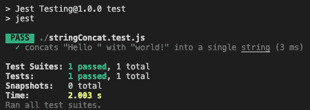
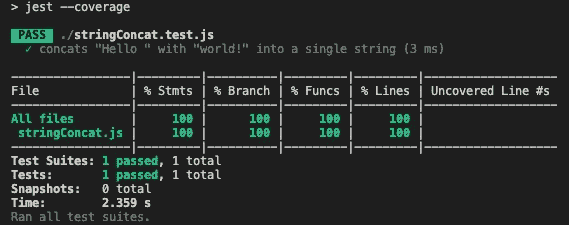

# 我如何使用 Jest 自动化测试

> 原文：<https://levelup.gitconnected.com/how-i-automate-testing-using-jest-96b93baacaa4>

## 当谈到测试自动化时，笑话是取胜的法宝


照片由 Pexels 上的数码 Buggu 拍摄

软件开发的一个非常重要的部分是测试自动化，因为它为一种或多种类型的测试创建了一个自动化的过程，而不需要人工干预。

在处理 JavaScript/TypeScript 代码库时，我最喜欢的自动化测试工具之一是 [Jest](https://jestjs.io/) ，因为它允许我在开发时轻松地创建测试并迭代它们。它的简单性使它成为使用 TDD 开发的一个非常好的工具。

在本文中，我将对 Jest 做一个简单的介绍，解释 Jest 成为一个优秀测试工具的主要原因，并给出一些例子。

先说为什么要用。

# 为什么开玩笑

当我选择使用一个工具时，我总是试图找到具体的事实，为什么我应该使用这个工具，而不是其他任何工具。

以下是我最喜欢的特性，这些特性让我选择 Jest 作为测试自动化工具:

*   简单快速，非常适合原型制作。
*   它允许简单地通过在命令行中添加参数`—-coverage`来生成代码覆盖报告。
*   测试执行期间的错误报告是丰富而有价值的。
*   围绕该工具的文档和社区非常好。

既然我们已经有了选择 Jest 的正当理由，让我们开始工作，安装 Jest 并浏览一些例子。

📝*如果你还没有安装 Node.js 可以从官网* [*下载*](https://nodejs.org/en/download/) *安装。*

# 开玩笑的测试

让我们从创建一个简单的项目并安装 Jest 包依赖项开始。

我们需要做的第一件事是打开命令行终端并运行以下命令来初始化项目。

```
npm init
```

命令行终端将提示几个问题，在它结束时，您应该有一个名为`package.json`的文件，其内容与下面的类似。

```
{
  "name": "Jest Testing",
  "version": "1.0.0",
  "description": "Let's create some tests with Jest",
  "main": "index.js",
  "scripts": {},
  "author": "Nuno Brites",
  "license": "MIT"
}
```

项目准备就绪后，我们需要做的第一件事是安装 Jest，为此只需运行下面的命令。

```
npm install --save-dev jest
```

现在让我们创建一个名为`stringConcat.js`的文件，并将下面描述的函数添加到它的内容中。功能`stringConcat`将在测试中使用。

```
function stringConcat(str1, str2) {
  return str1 + str2;
}module.exports = stringConcat;
```

下一步是创建测试文件。创建另一个名为`stringConcat.test.js`的文件，并将下面的代码添加到它的内容中。

```
const stringConcat = require('./stringConcat');test('concats "Hello " with "world!" into a single string', () => {
  expect(stringConcat("Hello ", "world!")).toBe("Hello world!");
});
```

现在我们已经有了第一个测试，我们需要创建一个运行测试的方法。我们有两个选择，更新`package.json`文件中的`scripts`元素，或者在您的机器上安装 Jest 并直接从命令行运行它。

让我们通过第一种方法，更新`package.json`文件并添加以下内容。

```
{
  "scripts": {
    "test": "jest"
  }
}
```

更新完`scripts`元素后，我们需要做的就是进入命令行并执行。

```
npm run test
```

运行该命令后，您将看到以下输出。让我们更详细地看看 Jest 向控制台写入了什么。



Jest 输出

运行完测试后，Jest 在控制台上打印出执行摘要，并以红色突出显示绿色🟢运行良好的地方和导致错误的地方🔴。在这种情况下，我们可以看到测试运行是成功的，测试的范围由一个测试套件和一个测试组成。

现在让我们将`scripts`元素更新为下面的元素。

```
{
  "scripts": {
    "test": "jest"
    "test-with-coverage": "jest --coverage"
  }
}
```

新代码行将执行 Jest，并将代码覆盖率报告打印到控制台。让我们运行它，看看会发生什么。

```
npm run test-with-coverage
```

运行上面的命令后，您将看到以下输出。



带有覆盖率报告的 Jest 输出

在这种情况下，Jest 打印出与我们之前看到的相同的输出，但是添加了一个由测试提供的代码覆盖率的表格。上表显示我们已经覆盖了 100%的代码。

# Jest 社区

Jest 有一个对该工具感兴趣并为其发展和改进做出贡献的社区。它存在于 GitHub 上，其中有一个 Visual Studio 代码插件或者 Jest 本身的一些扩展。

GitHub 上绝对值得关注的东西。

# 包扎

在使用 Jest 作为测试工具之后，这里有几点值得一提:

*   我喜欢 Jest 的一个主要原因是因为它将简单易用与强大的测试工具结合在一起，并允许快速可靠的原型开发，正如我们在上面的例子中所看到的。
*   如果你使用 JavaScript 作为前端和后端的语言，你可以在两者中使用 Jest。

如果你有任何建议或贡献，欢迎在下面评论。编码快乐！