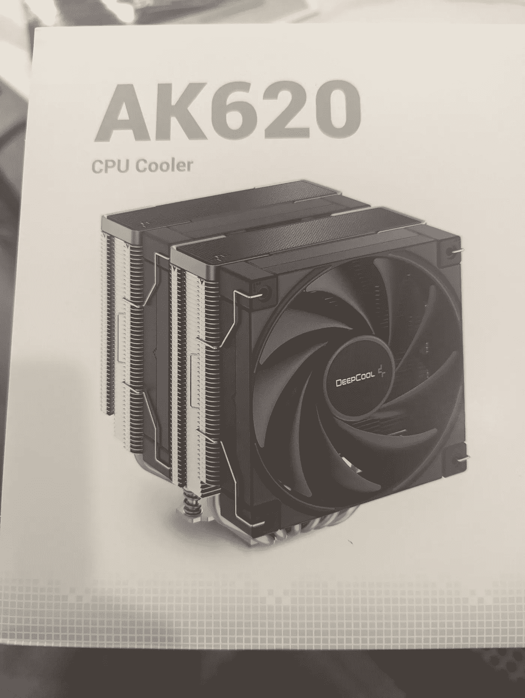

# 我如何构建游戏电脑

> 原文：<https://levelup.gitconnected.com/how-i-build-a-gaming-pc-727524bb3457>

您是否正在研究或计划为自己、孩子或朋友打造一台游戏电脑？不知道从哪里开始，争论这是否是你能做的事情？请放心，我将分享我构建游戏 PC 的过程，并从我的最新构建中给你一些提示和技巧。

在 [Unsplash](https://unsplash.com?utm_source=medium&utm_medium=referral) 上[泰沛](https://unsplash.com/@agforl24?utm_source=medium&utm_medium=referral)拍摄的照片

# 概观

制造一台个人电脑看起来非常复杂，但最终还是要弄清楚你想要制造什么，购买合适的部件，将几根电线连接在一起，将主板固定到位，然后打开机器。

有一些技术组件，特别是在购买部件和调试时，如果硬件或软件出现问题，但有许多*资源可以帮助你解决这些棘手的问题，希望我可以在本文中帮助你解决其中的一些问题。*

# 部件

有几个变化，你可以有当建立一个电脑一样，空气或水冷却，固态硬盘驱动器与硬盘驱动器，RGB 灯无处不在。一般建筑将是风冷的，有一个硬盘驱动器，有时有一些 RGB 灯。如果你想让你的构建更加具体，那么你应该多花点时间在你想要使用的部分上。下面是你需要的所有东西的通用零件清单

*   机箱(通常你会得到一个全尺寸的机箱来容纳全尺寸的主板)
*   球迷(通常你的情况下会与他们在一起，但仔细检查)
*   中央处理器
*   CPU 风扇(有时与 CPU 捆绑在一起，但现在不太常见)
*   图形卡
*   电源(应该附带一根电源线，但要仔细检查，你也可以选择模块化的或标准的。如果你想有良好的电缆管理，那么你应该考虑模块化。)
*   主板(我建议买一个带有板载声音和大量 USB 端口的)
*   RAM 记忆棒(通常是两个等值的记忆棒，例如 2-16Gb 记忆棒)
*   USB 键盘
*   USB 鼠标
*   显示器(检查您是否有正确的连接器来连接您的显卡和主板，通常是 HDMI，但不总是如此)
*   硬盘驱动器
*   CD 或 DVD 驱动器(可选，但推荐使用)
*   操作系统(通常是 Windows，如果有 u 盘的话，你可以在网上下载并把它放在 u 盘上)

有几个部分**必须**兼容在一起，有时甚至可以捆绑在一起。你的主板 CPU 插座(通常是像 AM4 或 LGA 1700)必须匹配任何你购买的 CPU。如果你想运行双显卡，那么你应该有一个超过 1000 瓦的电源来支持额外的功耗，并确保你的主板支持 SLI。确保您的主板有正确的图形卡连接，这通常是一个 PCI Express x 16 插槽。还要确保你的主板支持你得到的任何内存(通常这是 DDR4，大多数主板支持范围很广)。

如果你附近有一个[微型中心](https://www.microcenter.com/)，我会鼓励你去那里找个人帮你挑选零件。他们应该能够将零件捆绑在一起，并回答您关于将所有零件组装在一起的任何问题。

[内森·安德森](https://unsplash.com/@nathananderson?utm_source=medium&utm_medium=referral)在 [Unsplash](https://unsplash.com?utm_source=medium&utm_medium=referral) 上拍照

# 购买你的零件

如上所述，如果你附近有一个微型中心，那么对于新人来说，这是一个提问的好地方，并且有一个向导来引导他们找到最适合的部件。否则，您可以查看 [NewEgg](https://www.newegg.com/) 、 [SlickDeals](https://slickdeals.net/) 、 [TigerDirect](https://www.tigerdirect.com/) ，了解不错的 PC 零件交易。在构建新的游戏电脑时，通常有三个类别:预算构建、中端构建和高端构建。

**预算构建** —您正在寻找打折或大幅打折的零件，您的预算是您最关心的问题。您通常会寻找 2-3 年前或更久以前的最佳零件，并查看在线零售商的销售情况。

你寻找零件的时间越长，就越有可能在假日或清仓大甩卖中获得一笔交易。

**中端制造** —你想让你的钱得到最好的回报，但没有无限的资金来购买每个类别中最好的零件。一般来说，你希望有一个好的主板，强大的处理器，尽可能大的显卡，并得到坚实的部分来完成其余部分。一般来说，这些机器将保持相关 3-5 年，然后你会想要升级你的显卡或你的 CPU/主板，无论哪个是你正在玩的游戏的更大瓶颈。

**高端制造** — 最大的障碍是找到最好的零件，并在有库存的时候拿到它们。这里可以考虑液冷，RGB、CPU、显卡、SSD、机箱工艺最好。你的目标是尽你所能，在未来的几年里以最高的设置运行所有的游戏。

# 组装步骤

组装计算机时，您希望避免任何静电，这些静电可能会转移到硬件组件上。在坚硬的表面上放置一个远离地毯的工作站是最理想的。你还需要一个小的**无磁**螺丝刀来拧松你的主板和机箱。

首先打开你的机箱，取出所有的螺丝(你可能已经为主板拧上了一些螺丝，也把它们取出来)和其他部件，准备安装主板。如果是新的，你可能需要在背面打孔，并在前面去掉一个 CD 或 DVD 驱动器的插槽，这样你就可以提前做了。找到机箱中需要插入主板的电线(复位开关、电源开关、硬盘指示灯、RGB 灯等)，并确保它们在安装后不会被主板覆盖。

接下来拿出你的主板，找到你要把主板拧到位的孔，然后把你的主板装到机箱上。在开始将主板固定到位之前，请确保将 USB 和声音端口的塑料或金属片放置到位。

接下来，通过找到中心的槽口并将其对准撞锤杆来安装撞锤杆。请查阅您的主板文档，了解哪些插槽适用于您的特定情况。在我的最新版本中，有 4 个插槽，我将插槽 2 和 4 用于每个 16Gb 的 RAM 棒。确保您听到 RAM stick 两端的咔嗒声，以了解它是安全的。

接下来得到你的 CPU 和 CPU 风扇，并安装到主板上的 CPU。通常在一个角上有一个填充的三角形，你可以将它与主板上的插槽匹配，然后用一个杠杆将它锁定到位。

> 不要将导热膏放在主板和 CPU 之间。

接下来拿起你的 CPU 风扇，想办法用提供的硬件把它安装到你的主板上。在我的最新版本中，我不得不移除主板上的塑料支架，然后为 CPU 风扇添加新的支架。在 CPU 顶部滴几滴导热膏，然后将 CPU 风扇安装到 CPU 和主板上，并确保任何 CPU 风扇电线都可以插入主板上的“CPU 风扇控制”端口。

接下来将你的机箱电线(复位开关、电源开关、硬盘指示灯、CPU 指示灯)连接到你的主板上。最常见的是，这些连接到您的主板右下方，但请查阅您的主板附带的文档。

接下来，将您的图形卡连接到主板的 PCI Express 插槽中，并确保它卡入到位。通常在远离表壳背面的一端有一个夹子，可以卡入到位。确保您在机箱背面打出所有插槽，以便您可以使用 HDMI 或其他显卡连接器。然后，将显卡拧入机箱外部，使其固定到位。

接下来，取出电源，将其滑入机箱，拧入背面的螺钉，将其固定到位。连接 CPU 电源、主板电源、显卡电源(PCI-E 电源)。

接下来，将 CD / DVD 驱动器从机箱外部滑入，使用 SATA 电缆连接到主板，并连接电源。

接下来，将硬盘从机箱内部滑入其中一个硬盘插槽，使用 SATA 电缆连接到主板，并连接电源。

# 最终测试—开机

现在你已经把所有的东西都放在一起了，仔细检查所有的东西都连接好了，所有的螺丝或者其他的碎片都没有从箱子里出来。我喜欢把机箱的侧面留着，以防我需要进入电脑调试任何东西或修理任何松动的电线。

将电源插入插座，将显示器插入主板显示器(确保您尚未插入显卡)，插入键盘和鼠标以及 Windows CD 或 u 盘，然后按下机箱上的电源开关。希望你的电脑启动后，你会看到主板标志，然后进入 Windows 安装流程。

乌斯曼·尤萨夫在 [Unsplash](https://unsplash.com?utm_source=medium&utm_medium=referral) 上的照片

**当你的电脑无法启动时**

别担心，我做的最后几个 PC 版本第一次没有正确启动。检查你的主板是否有“EZ Debug”指示灯，检查问题是 CPU、VGA、硬盘还是其他。如果您没有这个选项，那么从外到内从电源一直到显示器。计算机是否启动并运行，但您在显示器上看不到任何内容？检查你在哪里插上显示器，通常你必须在你的图形卡工作之前安装驱动程序，但并不总是这样。我最近在 MSI 主板上遇到了一个问题，我必须在 HDMI 电缆插入主板的情况下启动计算机，然后当计算机运行时，将插头插入显卡，如果一切似乎都正常，但你在显示器上看不到任何东西，请尝试一些类似的事情。

如果你还是被卡住了，试着去 youtube 上搜索发生了什么，你认为是哪个零件和制造商。类似“GeForce 3060 在启动时不显示”或“CPU 风扇不工作”是我的建议。最坏的情况是，你有一个坏零件，需要退回给制造商，但这种情况现在似乎越来越少了。

# 结论

建造一台游戏电脑是一件非常有趣的事情，而且当你意识到它主要是插上电线，并弄清楚哪些部件应该放在一起并排序时，这真的不是一件令人畏惧的任务。一旦你的电脑启动并运行，你的第一步应该是安装你的主板和显卡驱动程序和任何 Windows 更新。从那里安装你所有的游戏，玩得开心！

如果你喜欢这篇文章，考虑[订阅媒体](https://medium.com/@ascourter/membership)！

如果你或你的公司有兴趣找人进行技术面试，那么请在 Twitter ( [@Exosyphon](http://twitter.com/Exosyphon) )上给我发消息，或者访问我的[网站](https://andrewcourter.com/)。如果你喜欢这样的话题，那么你可能也会喜欢我的 Youtube 频道。如果你喜欢 3D 打印的东西，可以去我的商店看看。祝您愉快！