# 我如何为真实用户构建可伸缩的现代 Web 应用程序

> 原文：<https://levelup.gitconnected.com/how-i-build-scalable-modern-web-applications-for-real-users-3910a3e32793>

## 编码更好

## 我在人们使用的应用程序中展示我做出的决定。是时候超越玩具应用教程了。

这篇文章详细介绍了我用来构建 [**Skilled.dev**](https://skilled.dev/) 的语言、库和工具，这是一个为开发人员成功编写面试代码做准备的平台。

## TLDR

UX +性能+可扩展+可定制

我的决定集中在自动化过程中会阻止我做我想做的事情的部分——构建一个为我的用户提供大量价值的产品。我为快速迭代速度、开发人员体验和可伸缩性进行优化，而不牺牲控制或必要时的定制。

**成本:目前总计 77 美元**。这都是基础设施成本，可能在一段时间内不会变得更贵。将有额外的费用，如电子邮件营销和交易费。

**压力测试结果**:我在 1 分钟内发送了 10000 个页面请求(每秒 167 个)，基础设施没有退缩。总体平均响应时间为 990 毫秒，第 95 个百分点的数据库响应时间为 75 毫秒。我使用的 7 美元的 dyno 没有超过 60%的使用率。我使用 [loader.io](https://loader.io/) 来执行测试。这是 10k 的页面浏览量，但我还没有把它在页面内的额外调用加起来，这将会更多。

您可以在文章末尾的“压力测试和可伸缩性”部分找到更深入的分析。

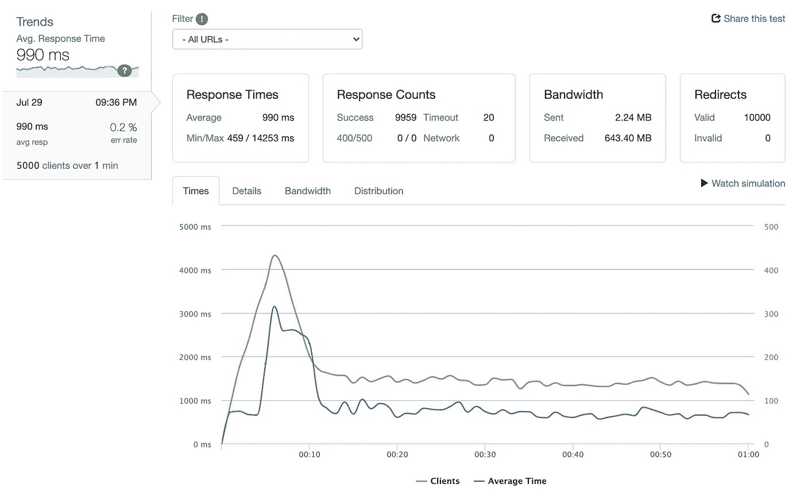

## 介绍

Skilled.dev 是一个以用户为中心的应用程序，UX 对尽可能有效地教学至关重要，我认为它与一大类产品有相似之处。我还想超越标准编程教程，向*展示为什么*我们要使用某些工具，以及如何利用它们来快速构建可扩展的应用程序，即使你是一个单独的开发人员或在一个小团队中。

> 我也开始了一个 [**YouTube 频道**](https://www.youtube.com/channel/UC3v9kBR_ab4UHXXdknz8Fbg?sub_confirmation=true) ，在那里我将分享对我们项目的见解(Level Up Coding，Skilled.dev，gitconnected.com ),并带你浏览代码和我们如何构建东西。我还将为面试问题编码制作视频，并提供职业发展建议。

# 我的堆栈

我将在这里简要介绍一下这些工具，并在本文的其余部分更详细地解释我为什么选择每一种工具。

在文章的最后，我还将提供我如何构建代码的截屏。

## **前端($0)**

*   [类型脚本](https://www.typescriptlang.org/)(通过 GraphQL 自动生成类型)
*   [反应](https://reactjs.org/) ( [Next.js](https://nextjs.org/) 为 SSR +静态站点生成)
*   [CSS-in-JS](https://speakerdeck.com/vjeux/react-css-in-js) 使用[样式的组件](https://styled-components.com/)
*   [Apollo](https://www.apollographql.com/) 用于 GraphQL API 消费
*   [MDX](https://mdxjs.com/) 用于编写课程内容

## 后端(0 美元)

*   使用 [Hasura](https://hasura.io/) 的 GraphQL
*   Lambda 通过 Next.js 发挥作用
*   一种数据库系统
*   身份验证最初是手工进行的，以防止供应商锁定

## 基础设施(77 美元)

*   部署到 [Vercel](https://vercel.com/) 的前端/无服务器 API
*   GraphQL API 部署到 [Heroku](https://heroku.com/)
*   用于存储代码的 GitHub
*   [哨兵](https://sentry.io/)寻找漏洞和应用程序崩溃

# 开发资源

拥有正确的工作流程会让你尽可能地高效。这些不是我的代码堆栈的一部分，但我认为值得一提，因为它们节省了我大量的时间。

## 每日发展

首先是 [**daily.dev**](https://r.daily.dev/gitconnected) 。它们将最好的开发者新闻聚集起来，并通过算法排序，作为浏览器中的一个新标签。这为我节省了大量的时间，因为我不用在不同的网站之间切换就能找到我感兴趣的内容。

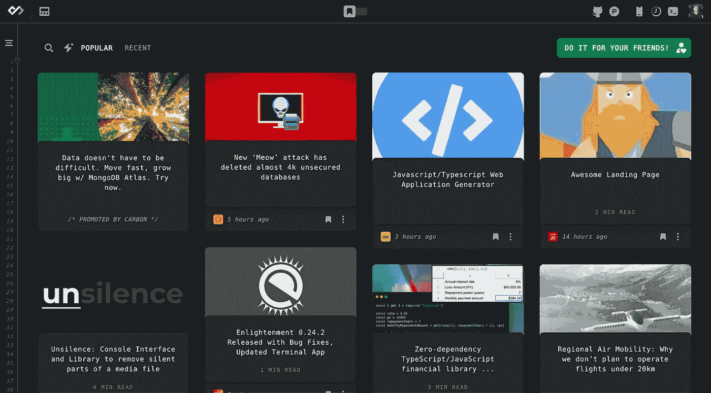

[Daily.dev](https://r.daily.dev/gitconnected)

## 泰伯宁

我最近发现的一个让我在文本编辑器中效率更高的工具是 [**TabNine**](https://www.tabnine.com/promotion/TreyHuffine/) 。这是一个由人工智能驱动的自动完成工具。在很多情况下，感觉它为我编码。例如，它已经识别了我用于写作风格的模式，我把外部的`div`称为`Wrapper`:

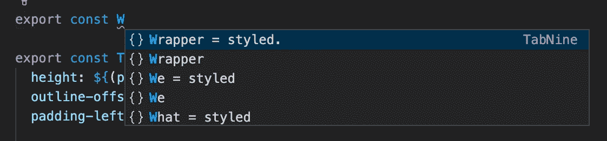

对我来说，一个好处是我正在使用 Markdown 在我的文本编辑器中编写课程内容，TabNine 足够智能，可以为英语句子和代码提供单词和拼写检查。

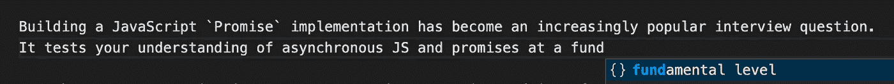

在我的文本编辑器中自动完成一个英语句子

这里有一个简短的 TabNine 示例，但是您也会在文章中的一些图像/屏幕记录中注意到。

# 前端(0 美元)

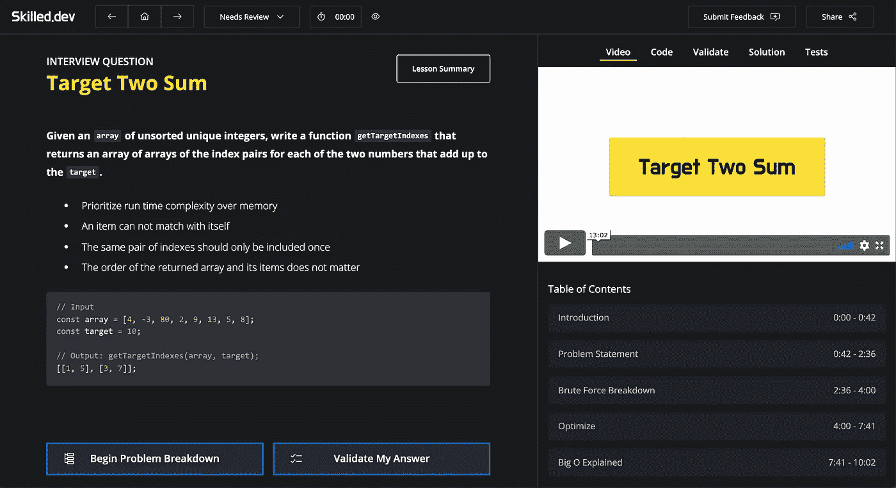

## 以打字打的文件

TypeScript 改变了前端，应该在任何生产项目中大力考虑。它使我们的代码更安全(根据 Airbnb 的数据，至少安全了 38%)，与我们的文本编辑器集成以提高生产率，并使我们的代码更具可读性。

但这还不是最棒的部分——TypeScript 与 GraphQL 无缝集成，为您的客户端生成类型，并对挂钩提取做出反应(稍后将详细介绍)。老实说，**是** **就像** **用作弊码**编程。只需输入几个键，自动完成功能基本上就能为您编写所有代码并构建组件。我使用 [graphql-code-generator](https://graphql-code-generator.com/) ，但是还有其他选项。

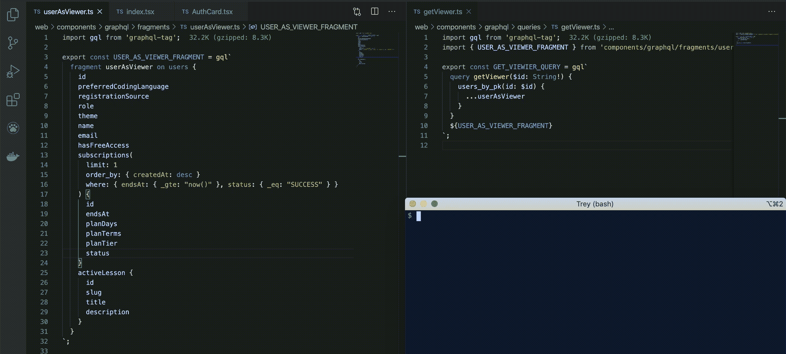

不可否认，学习和维护 TypeScript 需要一些前期成本，但是我无法想象在没有它的情况下从事一个项目。

## 与 Next.js 反应

我将简要介绍反应部分，因为大多数人都知道这是什么。我知道这有待商榷，但对我来说，React 仍然是构建 UI 的最佳库。核心团队强大，库不断完善，社区庞大。同样(如果事情进展顺利🤞)雇佣有 React 经验的开发者应该是最容易的。

js 是一个半自以为是的 React 框架，用于构建非常快速的应用程序。它需要一些代码库结构，并对如何访问文档和数据有严格的 API，但它提供的价值是惊人的。

Next.js 为您处理所有客户端工具链，并且针对生产应用程序进行了高度优化。只要你遵循他们的模式，你就不必担心设置应用程序的痛苦部分(即 Webpack 配置、代码分割、路由)并且可以把你的时间集中在构建你的用户喜欢的 web 应用上。此外，它真的很快，并遵循最佳做法。以下是页面的[灯塔](https://web.dev/measure/)结果:

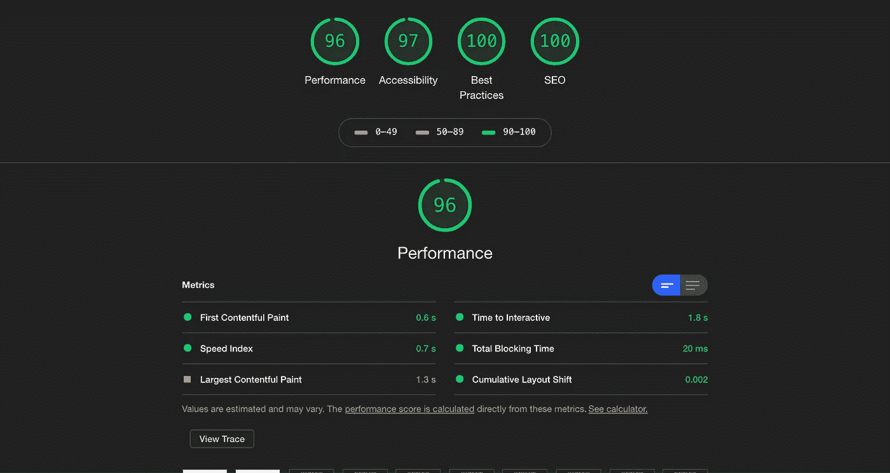

Next.js 提供了现成的服务器端渲染和静态站点生成，甚至会根据您如何为每个页面提供数据，以最佳方式(CSR/SSR/SSG)进行精细渲染。

它还优化了构建和代码分割，因此您只需下载每个页面所需的 JavaScript。然后，它会急切地下载后续页面的 JavaScript，这样当你的用户导航时，它已经在浏览器中了。

如果你使用 Vercel(next . js 的创建者)作为你的前端基础设施提供者，那么部署你的应用是无缝的和自动的。您可以在下面的基础设施部分了解更多信息。

TLDR: Next.js 提高了你的应用程序的性能，同时也减少了你配置和维护它的时间。

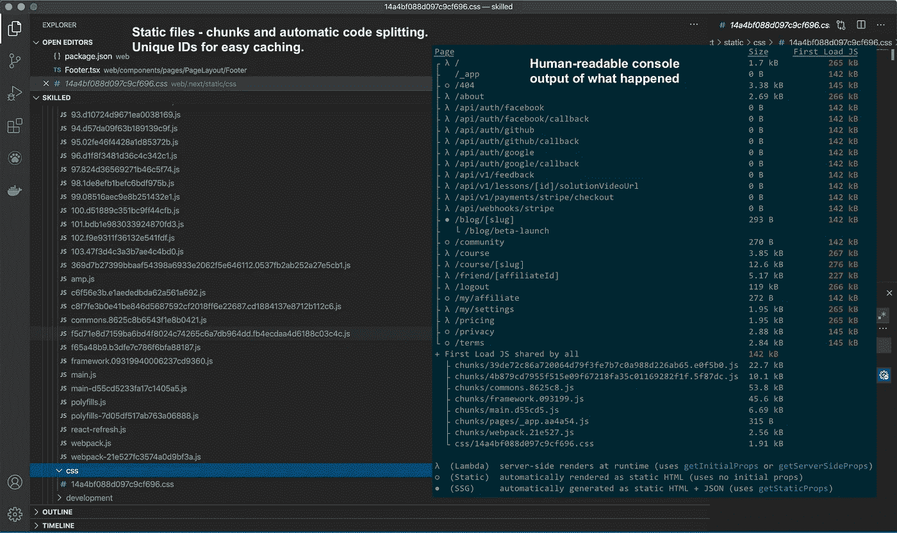

## CSS 库-无

我真的想完全控制用户体验和设计，所以我决定从头开始编写整个 UI。这使我能够优化我试图传递的价值。我的所有组件都是手工构建的，除了一些低级的库，以方便功能。

我正在考虑添加的一个东西是[顺风 CSS](https://tailwindcss.com/) 。我发现自己写了很多样板风格，浪费时间。我也害怕为简单的事情构建新的组件。我认为顺风会有助于进一步提高迭代速度。

此外，可访问性(a11y)对我来说非常重要，根据我的研究，没有多少框架做得很好。这也是一个机会，让我真正了解如何正确地建立一个可访问的网站，并随着时间的推移继续改进它。这是一个持续的过程，但我希望我正在构建一个每个人都可以使用的东西。

我学到的重要的可及性:

*   最重要的是结构良好的 HTML。计算机知道如何处理这种情况。
*   管理光标和焦点。
*   使用屏幕阅读器测试页面。
*   Aria 应该只需要在 HTML 结构不够用的少数情况下使用。

> 如果你有 a11y 的经验，请评论并让我知道是否有不正确的地方或我可以添加的关键改进！

## 用于 UI 样式的 CSS-in-JS

很长一段时间我都不愿意采用这种方法，但是现在我认为它是我的堆栈中必不可少的一部分。我使用的是风格化的组件，但我在过去也有过使用情感的美好经历。

CSS-in-JS 允许我将 UI 样式简单地视为我的应用程序中的一个组件。样式化组件可以接收道具，并根据应用程序的状态决定样式的呈现方式。

它还允许您使用标准的`import` / `export`语法来共享样式，因此您总是只需编写 JavaScript。

因此，我们的组件不会管理样式:

我们只需将道具传递给我们的样式化组件，它会决定如何呈现:

我曾经反对 CSS-in-JS，因为我认为它打破了关注点的分离，但是在多年痛苦地管理类来决定样式之后，我意识到关注点根本不是分离的。您的应用程序的样式、状态和布局是如此紧密地耦合在一起，以至于将它们统一起来更有意义。

因此，它对关注点的分离采取了不同的观点——不是由组件管理类名来设计组件的样式，而是由实际上正在改变其样式的组件接收数据并做出决定。

## 内容的降价扩展(MDX)

我在使用内容管理系统(CMS)和在代码库中编写课程之间左右为难。我想给内容添加动态功能，以改善教育体验，这意味着我可能需要将 JavaScript 绑定到内容上——这意味着 CMS 不是一个真正的选项，因为它是静态字符串。

这使得 MDX 成为完美的选择。它允许我在代码库中使用 markdown 编写内容，但也允许我将它与 React 结合起来。因此，我可以将组件导入我的 markdown 来添加额外的功能，而不会牺牲我编写课程的方便性。

例如，我想帮助我的用户直观地理解递归生成排列意味着什么，所以我构建了一个组件来生成它们，并将其嵌入到我的文本内容中:

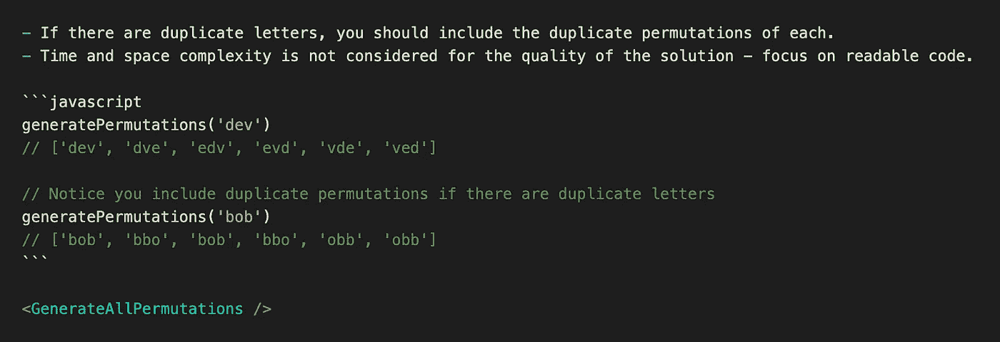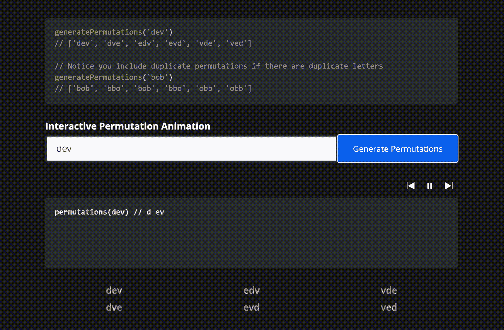

# 后端(0 美元)

我的后端需要很少的编码。我通过 Hasura 获得了一个由仪表板管理的完整的 GraphQL API，它非常适合处理 CRUD 操作。对于更复杂的业务逻辑，我使用 Next.js(从我的前端)提供的 API 路由，因此只需很少的额外工作。

我做得比较艰难的一个领域是认证。我自己编写了这些代码，因为任何提供者都需要严格的锁定，而且我还没有准备好提交。

## 带 Hasura 的 GraphQL

Hasura 为我节省了数百小时的编码时间，并完全改变了我对堆栈的看法。他们的仪表板允许您通过用户界面管理数据库，并自动为您创建迁移文件。Hasura 还用所有必要的 CRUD 操作来构建您的 GraphQL API。

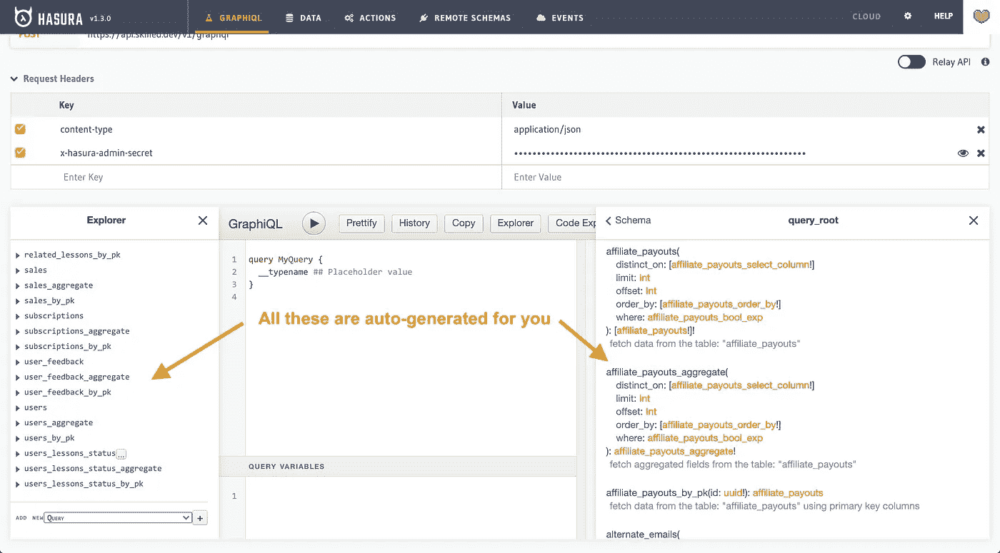

它运行在 Haskell 上，并将 GraphQL 请求直接转换为 SQL 查询，以便在 PostgreSQL 上运行。正因为如此，它的速度非常快，他们声称在云基础设施提供商的最便宜的计划层上，您可以支持 1000 个并发用户。

它不仅非常简单，而且还可以扩展。您可以将它与其他服务器上的定制 GraphQL 模式相结合，使用可以在数据库事务生命周期的任何时候执行 lambda 函数的钩子，并调度 cron 作业。

Hasura 还使用了其他开源技术，因此供应商锁定是最小的。它构建在 PostgreSQL 之上，可以与任何身份验证提供者和 GraphQL 客户端一起工作。您可以使用自己的工具来管理迁移或在其控制面板内工作。您可以随意控制，如果您想使用不同的东西，只需删除 Hasura，您仍然有一个格式良好的 Postgres 数据库。

您可以通过他们的控制面板控制一切，包括自动生成的迁移、权限和关系。请查看以下内容:

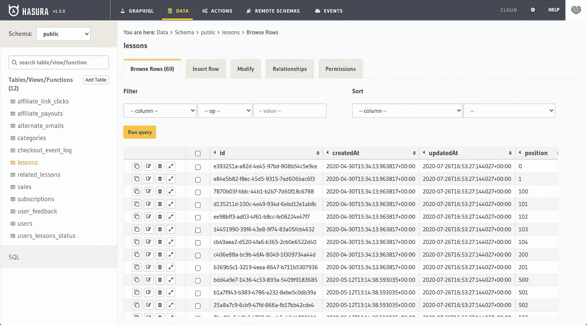

Hasura 提供了一个安全的 GraphQL API，我可以通过一个仪表板来管理它。来自 GraphQL 的强类型通过自动代码生成工具传播到我的前端，因此我的 TypeScript 中的查询和数据与数据库的预期完全匹配。**我的整个堆栈是同步的，我不需要写任何代码来实现它**。

还有，我提到过 Hasura 是免费和开源的吗？

## Next.js 中带有 Lambda 函数的业务逻辑

Hasura 对于 CRUD 操作来说非常优秀，但是对于服务器端业务逻辑来说，您仍然需要额外的工具。幸运的是，使用 Next.js，您可以通过 API 路由轻松地添加这些内容，并且当您使用 Vercel 进行部署时，它们会自动工作。

Next.js 将路由存储在一个`pages`文件夹中，您可以在一个`pages/api`文件夹中创建 API 路由。然后，每个文件都被视为一个独立的 Lambda 函数，在这个函数中，您接收一个包含请求数据的对象，允许您处理任何使用 Hasura 无法处理的逻辑。

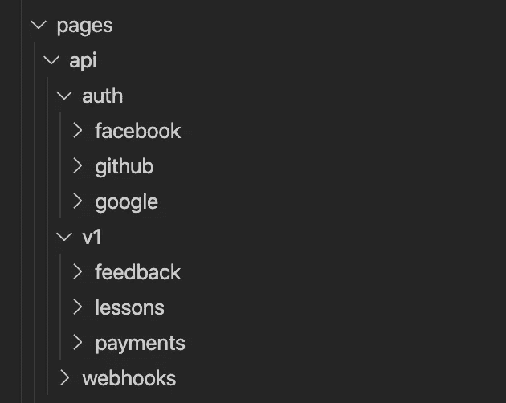

# 基础设施(77 美元)

基础设施的目标是尽可能自动化，并依赖那些完善了系统的公司。我还希望它的价格合理，因为人们很容易陷入支付过高的云服务费用。

## 前端/无服务器 API 托管—Vercel(20 美元/月)

走向 Vercel 为我节省了大量的时间和金钱。在维护或扩展方面，您无需进行任何管理。因为它完全基于 Lambda 函数，所以可伸缩性应该是无限的(或者至少远远超过大多数应用程序的需求)。

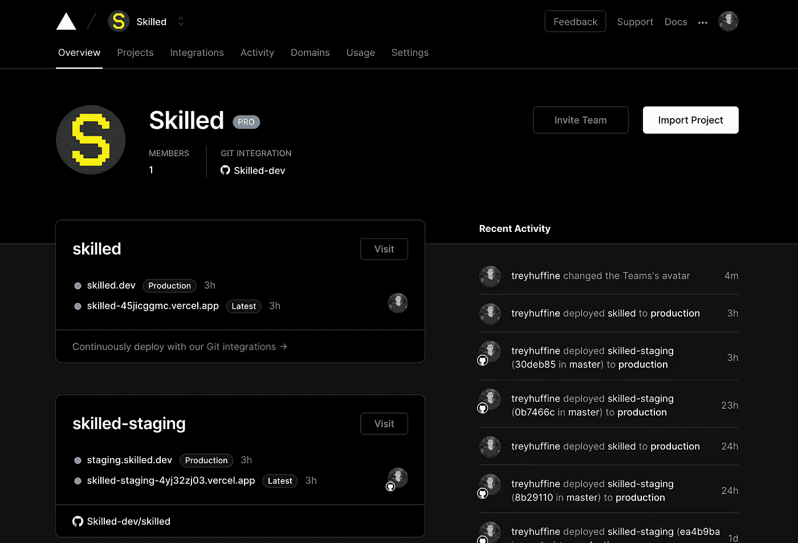

Next.js 是由 Vercel 创建的，所以他们让部署应用程序变得非常简单。一切要么是 lambda 函数(包括服务器端渲染)，要么是可以在全球范围内缓存的静态文件。

我设置了在 Git 提交时自动进行部署。当我在 CLI 中执行`now --prod`时，生产部署发生了。我也可以让生产自动化，但我仍然希望有一个人接触点，只是为了确保在发布之前一切都好。尽管如此，部署生产应用程序的一个 CLI 命令并不算什么。

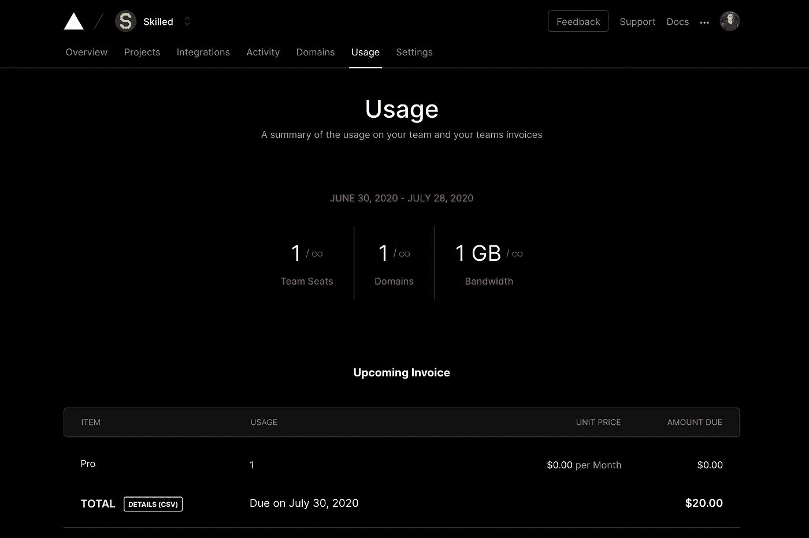

20 美元包括你所有的带宽和网站接入需求。然而，如果我有一个抱怨，那就是他们对你可以使用的 lambda 函数的数量限制很低(免费计划 12 个，付费计划 24 个)。这似乎是一个合理的数量，但它也包括服务器端渲染的所有路线。在我第一次部署到测试服务器之前，我不知不觉地用完了免费计划。

## graph QL API——Heroku(50 美元数据库+7 美元 dyno)

Heroku 使得部署 API 变得非常简单，而 Hasura 提供了一个模板，使得维护和升级他们的引擎变得非常简单。就像一个`git push`命令那么简单。Heroku 还为您全面管理 Postgres 数据库。

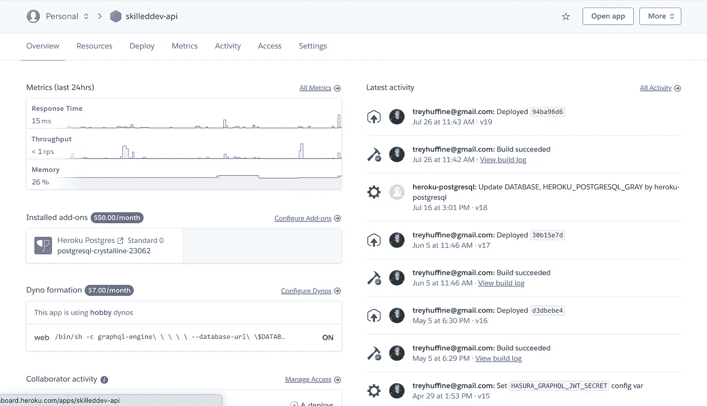

我目前购买了一个 64GB 的 Postgres 数据库和一个 7 美元的 dyno(尽管在发布后我可能需要在这里增加一层)。我认为数据库存储应该够我用一段时间了，但是如果你想多启动一点，还有更便宜的选择。您还可以在应用程序准备好投入生产(或始终用于您的临时环境)之前，使用数据库空闲层来构建您的应用程序。

就定价而言，50 美元可能是中间价。如果你想自己管理它，你肯定可以更便宜，或者你可以选择像 AWS 这样更贵的选项。对我来说，得到 Heroku 提供的一切是值得的。这可能会超过我一段时间的需要，但我知道它会非常快，我从来不需要考虑维护它。

Heroku 的另一个好处是他们的度量标准。它们提供了对请求和数据库性能的一些一般性了解，因此您不需要额外的工具来获得可见性，至少在早期是这样。

## 用于代码存储和版本控制的 GitHub(免费)

GitHub 现在已经为个人或小团队提供了几乎所有免费的东西，所以使用它们对我来说是理所当然的。他们的用户体验和工具是最好的，并且可以与我使用的所有其他工具集成。

## 错误跟踪和应用程序崩溃的哨兵(免费)

使用 Sentry 对于拥有真实用户的应用程序来说是必不可少的。无论您在编码时多么小心，或者您进行了多少次测试，当您的应用程序中有真正的用户时，总会出现问题。哨兵让你发现错误，并迅速确定原因是什么。

哨兵的免费计划相当慷慨，应该持续你一段时间。如果你达到了极限，那么你的应用程序也可能获得足够的收入来支付下一步。

# 压力测试和可扩展性

我使用 [loader.io](https://loader.io/) 将 5000 个客户端在一分钟内平均分配到两个 URL(总共 10000 个页面请求)。这相当于每秒 167 个请求。

需要注意的一个有趣的事情是，在测试开始时有一个很大的峰值。我的假设是，要么是缓存未命中，要么是启动了一个冷 lambda 函数导致的。在它解决之后，所有的请求都会在 600-800 毫秒内得到一致的处理。

老实说，如果你的应用程序处理这么多流量，你可能有一个惊人的业务，这可能比我从这个网站收到的流量还要多。这相当于每月有数百万用户。

我真的被它的出色表现惊呆了。基础设施几乎没有移动。

结果:

*   总共 10000 次页面请求
*   总体平均响应时间为 990 毫秒
*   75 毫秒 95%数据库响应时间。这意味着 95%的数据库请求处理速度超过 75 毫秒。
*   60%最大 CPU 负载
*   9959 个成功的请求
*   20 次超时
*   传输了 643MB 数据
*   零错误响应(4xx 或 5xx)

负载测试结果:

来自 Hasura dashboard 的指标:

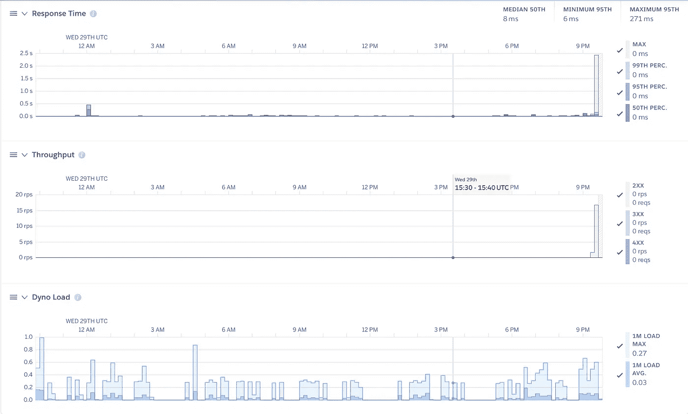

# 结论

在我的堆栈中磨砺是许多痛苦的尝试和错误，我希望这能为您节省为自己的项目做决策的时间。这种设置让我觉得在构建快速、可扩展的应用程序时，能够快速移动，并且还提供了对用户体验的控制，以创建我的社区会喜欢的东西。