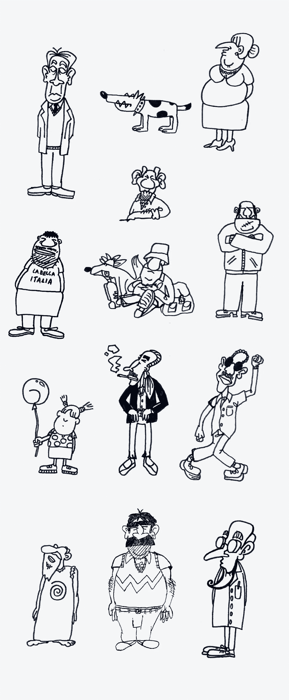

# 我如何在 1999 年用 Macromedia Director 在 MacOS 8.6 上构建了一个经典的点击式冒险游戏

> 原文：<https://levelup.gitconnected.com/how-i-built-a-classic-point-and-click-adventure-game-in-1999-with-macromedia-director-on-macos-8-6-f95325e76533>

## 作为一个研究项目，我和西蒙·巴卡一起编程、设计并实现了一个包含故事、艺术和引擎的冒险游戏。


1999 年，我在斯图加特的 SAE 学院学习。作为一个主要的研究项目，我们必须与 *Macromedia 主管*一起实现一个应用程序，作为小组项目的一部分。我们决定以经典的卢卡斯艺术游戏(狂魔大厦，猴岛)的风格制作一个点并点击冒险，但没有口头导航(*开门，与人交谈*)。

项目时间约为六周。我们设法完成了游戏的 30%。

# 技术背景

我们使用 *Macromedia Director* 和脚本语言 *Lingo* 作为平台。当时导演项目都是 640x480，8 位色深(256 色)制作的。


MacOS 上 Macromedia Director 8 的屏幕截图

对于这个项目，我们在 MacOS 8.6 下的苹果平台上工作。我们的 G4 Macs 有 128 MB 内存和 450 MHz 的 CPU。

在 Windows 2000 下的 DirectX 7 中，声音控制仍然存在许多问题。Windows 还不能直接混合声道——苹果可以，所以决定很容易。

> 在 2000 年，多媒体不适合 Windows 电脑是一个事实。在 2021 年，这仍然存在于许多人的脑海中。*🤓*

# 让我们来玩吧！

这个视频展示了一些游戏的场景。享受观看！

# 故事

**故事的想法很简单:**当在月球上坠毁时，一些奇怪的外星人丢失了他们继续旅行所需的能量石。因为他们不能变形，而且会被人类注意到，他们决定绑架罗比的女朋友作为人质，强迫他找到能量石。


# 库存和全局变量

我没有计算机科学背景。出于性能原因，我决定将完整的游戏状态放入 15 个全局变量中。


包括所有库存项目的 cast 窗口的屏幕截图

让我有些头疼的是库存。它必须像一个寻呼机，但如果一个项目被拖放动作消费，库存必须自我更新。我花了一些时间让它工作。😎


库存渲染的概念

# 脚本语言行话

从一开始我就不喜欢导演的脚本语言。特别是和我们在 SAE 学院开始的*导演 6.5* 一起，我们先学了行话，后学了点语法。**想要个例子？**

```
**set** the text **of** **member** "robi" **to** "Hallo"
```

幸运的是，在 1998 年，随着导演 7 的出现，出现了点语法。

```
member("robi").text = "Hallo"
```


Director 8 中的电影脚本截图

对于这个游戏项目，我使用了一个全局*电影脚本*，它可以通过所有场景和实例访问。这个脚本包含了所有全局功能，如库存、关卡加载、声音和角色控制。

这是我发现的一个仍然印在纸上的脚本示例😂。它控制主角*罗比*的移动。


**注释**是用两个连字符开始的。

```
--comment
```

**功能**必须以如下方式定义。

```
on [function name] [function parameter]
```

我不记得是否允许在函数上使用多个参数，*我想不是*！

# 对象和动画

所有动画都是基于关键帧的。导演有 1000 层，所有的物体都必须放置在那里。像在*闪光中一样*物体被堆叠起来。

为了处理动画背景上的动画角色，我们不得不使用导演的*电影循环*。这些是所谓的成员(来自库中的元素)，在舞台上使用一个帧，但包含动画的子帧。这些子帧可以在*电影循环*中控制，所以你可以像使用*斜板*一样使用它。


游戏中所有的角色和背景都是直接在 *Macromedia Director* 中手绘、扫描、修饰、着色和制作动画。我真的不喜欢它的绘画功能。😂


Director 的内联绘画窗口的屏幕截图

# 字体设计

我找到了我在纸上画的一些字符的扫描图。



# 美术风格和截图

我们的艺术风格是草率的像素风格。因为项目时间很短，只有六个星期，我们没有清理掉一些人物和所有背景图片上的双像素轮廓。


马虎与完美的像素风格


在药房


要进入迪斯科舞厅，你需要贵宾通行证。经典的任务设计。


Robi 正在寻找一个主要的任务物品:绿色能量石。

感谢阅读。
期待您的反馈。😍

请评论、书签或关注我，支持我的频道。

如果你想让我写第二篇关于制作这个游戏的文章，包括一些单级和多级谜题，请告诉我！


如果你心中有一个特定的主题，你会希望我写下来，让我在推特上知道:[https://www.twitter.com/@stephan_romhart](https://www.twitter.com/@stephan_romhart)