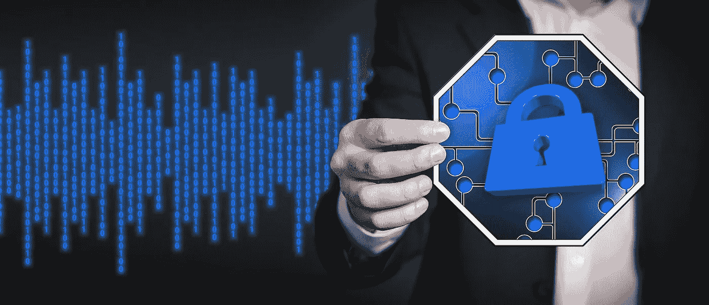
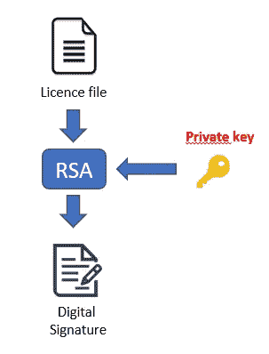
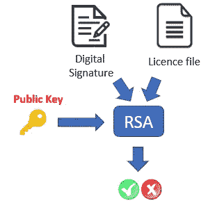

# 我如何在不到一天的时间里为我的软件构建了一个许可系统(第一部分)

> 原文：<https://levelup.gitconnected.com/how-i-built-a-licencing-system-for-my-software-in-less-than-a-day-part-i-4124cebcba01>

## 使用简单的工具为您的软件创建许可框架。

我曾经为我的客户开发过一个软件。一开始是供他个人使用，但他意识到他的同事也感兴趣。我们同意分发它，并决定保护软件，以避免非法拷贝。

以下是背景:

1.  该软件将被嵌入一台没有联网的机器中
2.  每个许可证应该只交付给一台机器，所以应该没有办法在其他机器上使用相同的许可证
3.  我应该是唯一可以生成许可证的人

第一点意味着我们不能有一个在线验证系统。那会更容易构建，并且不需要这个框架。

# 大意

整个系统的思路就是利用[Rivest–sha mir–ad leman 算法(RSA)](https://en.wikipedia.org/wiki/RSA_(cryptosystem)) 的签名特性。我不会详细介绍 RSA 是如何工作的，但我只想提醒您，它是一种非对称密码系统。它使用两个密钥:一个私钥和一个公钥。该算法的高明之处在于公钥只能用来加密，而私钥只能用来解密。因此，您可以分发公钥，确保只有您可以解密加密的消息。

因为这不是我们在许可系统中想要的，所以我们使用 RSA 的第二个特性:签名。这个想法是使用私钥而不是公钥来“签署”消息。然后可以用公钥验证签名，以确保消息的真实性。

## 1.生成许可证

生成许可证

第一件事是生成一个 RSA 密钥对(私有/公共)。

我们创建一个文件，并把所有的许可信息放在里面:即到期日期，客户 ID，…我们将进一步看到我的文件由什么组成。

我们使用私钥来签署许可证文件。同样，不需要进入 RSA 的详细操作，但其思想是将您的消息提升到私钥的力量。

这种操作的结果称为“签名”。我们给客户:许可证文件、签名(通常在一个文件中)和公钥。

同样，确保永远不要与任何人共享您的私钥。

## 2.验证许可证

验证许可证

为了验证许可证文件是否可信，客户端只需使用公钥“解密”签名，然后将结果与许可证文件进行比较。

现在所有这些只能保证许可证文件是真实的，但是它可以被无限地重新分发，你没有办法避免这一点。

这就是为什么我在文件中添加了一些东西，以确保这种情况不会发生。

## 许可证文件内容

同样，您可以在许可文件中放入您想要的任何内容。但是这里我的内容:

*   **客户端 ID** :我用它来识别谁是客户端，例如在需要支持的情况下。
*   **发放/到期日期**:我通常避免发放终身许可证，所以我更喜欢定义一个到期日期。如果许可证过期，软件将被阻止。
*   **机器** [**GUID**](https://en.wikipedia.org/wiki/Universally_unique_identifier) (全局唯一 ID):这是唯一标识任何机器的全局标识符。不需要了解它是如何生成的细节，但是大多数语言中都有库可以获取这个 ID。

GUID 实际上是许可证文件中最重要的元素。这个想法是将许可证的使用限制在一台机器上。启动时，软件将检查当前机器的 GUID 与许可证文件中的 GUID 是否匹配。这样你就避免了在多台机器上用相同的许可证执行你的软件。

## 重要说明

GUID 并不是在世界上唯一标识一台机器的理想方法。可能有更聪明的方法，例如，获取多个硬件组件 id 并混合它们。然而，对于我的具体情况，我不需要走得更远。如果您愿意大规模部署您的软件，您可能应该记住这一点。

## 结论

当您开始拥有数百个客户端时，这个系统显然是不可伸缩。此外，如果您的客户端将连接到互联网，您应该考虑基于云的服务。我将在文章的下一部分分享和解释相关的代码。