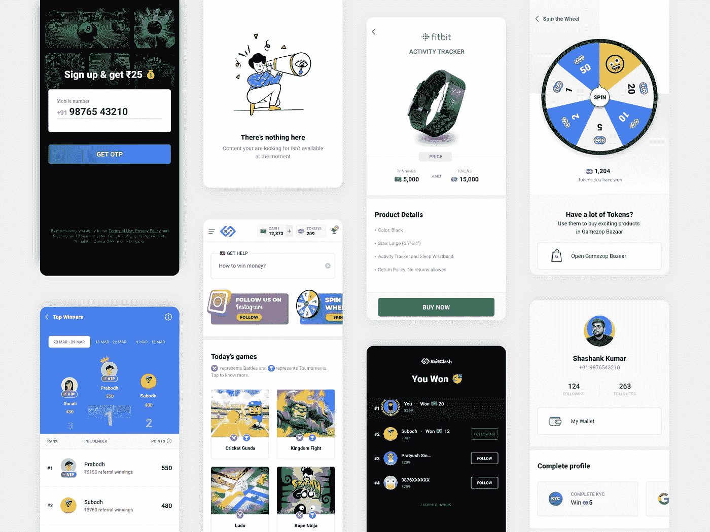
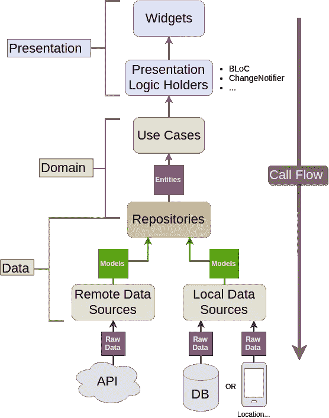
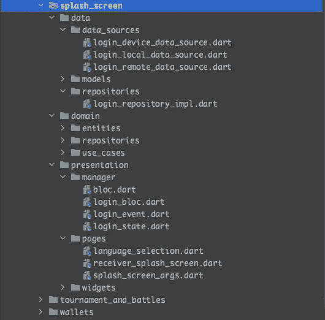
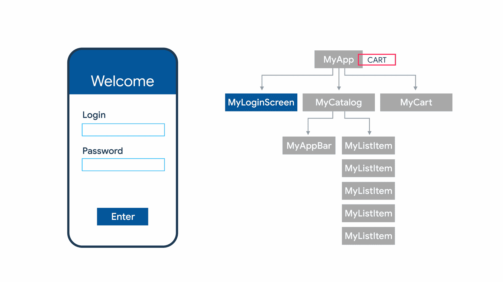
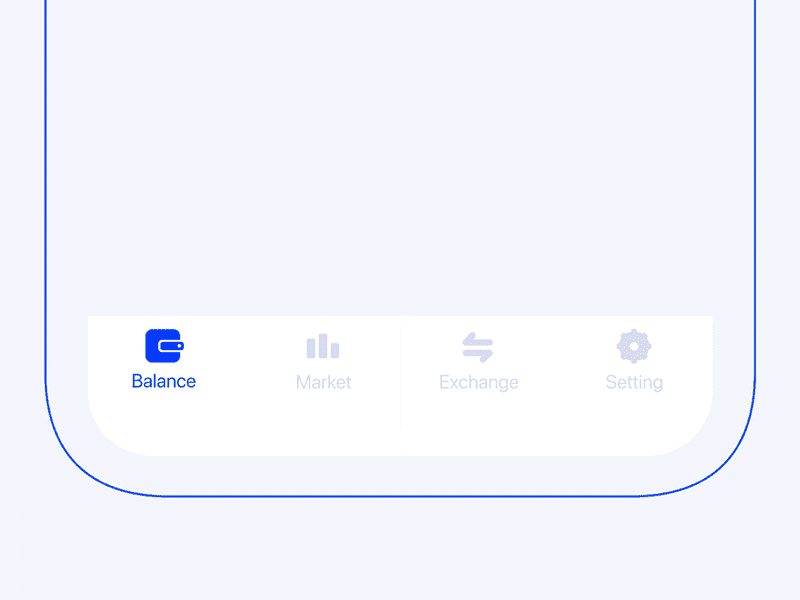
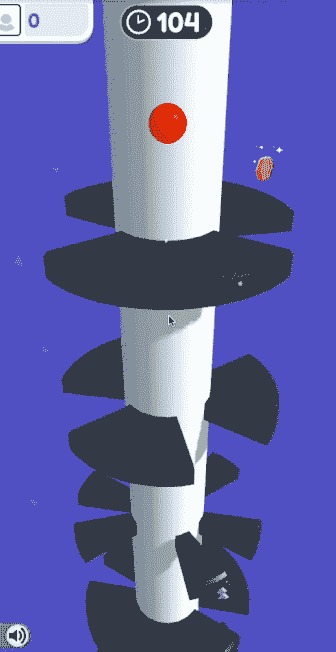

# 我如何构建一个拥有 7500 多日活跃用户(dau)的生产就绪型 Flutter 游戏应用程序

> 原文：<https://levelup.gitconnected.com/how-i-built-a-production-ready-flutter-product-that-has-3000-daily-active-users-daus-a3ef7fa3d37a>


如果全面使用，Flutter 是一项非常好的技术，这对于每个人来说都是正确的。它超越了设计语言和期望的界限。它在开发者手中掌握着巨大的权力，并帮助构建像素级完美的移动应用程序故事，从而节省大量资金并创造收入。

> 但是对技术的巨大控制带来了巨大的责任

因为作为开发商，我们有很多控制权，事情很容易变糟。产品必须使用好的架构和好的工具系统来帮助为客户提供更好的用户体验。Flutter 的工作原理是一样的。此外，该技术仍然相当新，不同的架构仍在开发中。虽然谷歌一直在宣传如何设计应用程序以及如何使用这项技术，但如果你想开发一个相当定制的应用程序，往往会有一段时间你不得不回到 Android 的基础上。

所以，[我们](https://gamezop.com)在上个月，也就是 2021 年 8 月发布了我们的游戏[应用](https://bit.ly/skillclash-app)的 1.0.0 版本，我们的数量还在增加。这个产品已经酝酿了很长时间，但我对它的结果相当有信心。在这篇文章中，我将谈论如何构建一个**生产就绪的 Flutter 游戏产品。**

# 我造了什么——skill clash？

SkillClash 是一个基于技能的真钱游戏平台，在这个平台上，人们可以在锦标赛和战斗中争夺真钱。有多种游戏可供选择，用户可以通过 Paytm、Amazon、UPI、银行转账或移动充值等热门选项兑现他们的奖金。

我们已经为 SkillClash 开发了一个移动应用程序(目前是 Android ),并且一直在使用 Flutter。这里有一个讨论的链接，讨论的目的是决定我们为什么把 [Flutter 作为一项技术](https://medium.com/flutter-community/how-i-convinced-my-team-lead-to-go-for-flutter-and-kotlin-9e9bde16d73)。

SkillClash 已经在网上上线，移动应用程序也已经上线。我们的应用在 play store 上不可用，因为 Google 不允许基于技能的真钱游戏应用。但是[在这里](https://bit.ly/skillclash-app)你可以下载我们的应用，试一试。



上图展示的是我们的设计师[沙尚克·库马尔](https://www.linkedin.com/in/shanksgee/)(现在在 [Airtel](https://www.linkedin.com/company/airtel/) )制作的一组非常小的屏幕

# 建造的过程


[信号源](https://thumbs.gfycat.com/TimelyHappygoluckyGalapagostortoise-max-1mb.gif)

在我被提供了一组巨大的屏幕来交付之后，我打开我的笔记本电脑，回到 Android Studio，开始一个模块一个模块地构建用户界面，没有任何 API，只有模拟数据。

## 首先要看的几件事:

1.  我要追随的建筑
2.  状态管理
3.  应用程序中的导航
4.  添加游戏

# 应用程序的架构



[Reso Coder 博客](https://resocoder.com/2019/08/27/flutter-tdd-clean-architecture-course-1-explanation-project-structure/)

我知道应用程序将会非常庞大，有超过 1，500，000 行代码，所以我需要一个好的架构设置，它很难被破坏，很容易测试，并且确保我在编写代码时使用好的模式。当平台有些冗长时，错误和糟糕的代码质量很容易渗透进来。

于是我就用[鲍勃大叔的干净架构](http://cleancoder.com/products)模式。

帮助我理解这个架构的分层系统的是 Reso Coder 博客。它们非常容易理解，易于复制和遵循。虽然在一个模块中集成第一个 API 的样板文件有点麻烦，但是当你掌握了它的窍门时，你不会感觉到太多。

单个模块，例如应用程序中用于闪屏和登录的模块，具有如下结构:



应用程序中的所有模块都遵循相同的结构。我称之为模块，是因为所有与登录相关的文件都分组在一起。类似地，另一个模块如钱包也有相同的结构。

我决定在项目中使用 2 个 Flutter 应用模块。一个是主项目，也就是`main.dart`所在的地方。另一个是我保存公共功能、公共用户界面和公共实用程序类的地方。

# 状态管理



[来源](https://www.spec-india.com/blog/flutter-state-management)

当然，状态管理是整个游戏的一个重要部分，除非它是一个静态应用程序。我们的并不需要一些解决方案。

我混合了两种。 [**提供商**](https://pub.dev/packages/provider)T5[**集团**](https://pub.dev/packages/flutter_bloc) **。**我使用 provider 来帮助特定屏幕的状态管理，使用 bloc 来帮助表示层与数据层的通信。

刚开始工作的人，或者不知道状态管理解决方案的人，如果它支持您的用例，请使用这个解决方案。因为我知道这个应用程序将会非常庞大，所以我必须同时使用它们。

**注意事项:**

1.  [**更小的小部件**](https://medium.com/flutter-community/improve-your-flutter-app-performance-split-your-widgets-935f97e93f7d) **:** 记住要创建更小的小部件，而不是在同一个小部件类的函数中创建小部件。将一个较大的部件分解成较小的部件将有助于性能优化。
2.  [**提供者上下文**](https://github.com/rrousselGit/provider/issues/313) **:** 更容易得到一个错误，指出“*试图从小部件树*之外监听提供者公开的值”。所以记住要么使用提供者小部件下的构建器小部件，要么将子小部件移动到不同的无状态或有状态小部件类中。
3.  **设定值时听假:**很容易掉入这个陷阱。当您在构建函数中访问提供者状态值时，listen 参数默认设置为 true。每当状态值改变时，这有助于重新构建小部件。但是当我们需要改变一个状态值时，我们需要将该值设置为 false，这样整个部件树就不会一直重建。像这样的`Provider.of<Counter>(providerContext, listen: false).add(n+1);` [这里的](https://stackoverflow.com/a/58584363/7370876)是同样的另一种解释。
4.  **使用插件树深处的提供者状态:**记住使用插件树深处的提供者值。这是因为无论您在小部件树中的什么地方使用提供者值，只要有变化，整个小部件都会重新构建。因此，明智地拆分您的小部件，并尽可能深地使用 provider，以便减少小部件的重建来提高性能。

# 项目中的导航



[来源](https://www.smashingmagazine.com/2019/08/bottom-navigation-pattern-mobile-web-pages/)

> 如果您需要在应用程序的许多部分导航到同一个屏幕，这种方法会导致代码重复。解决方法是定义一条*命名的路线*，并使用命名的路线进行导航。[来源](https://flutter.dev/docs/development/data-and-backend/state-mgmt/simple)

正如 Flutter 官方网站所说，在一个相当大的应用程序中，命名导航路线是非常有效的。下面是如何在一个 Flutter 项目中实现同样的功能。

首先，定义一个非常基本的路由生成器类。这个类只包含一个方法来帮助你生成路线和导航。我们需要做的只是在应用程序中定义路线，这些只是屏幕小部件中简单的常量静态字符串。

如果你想传入参数，你可以在`setting.arguments`的帮助下直接传入

```
class RouteGenerator {
  static Route<dynamic> *generateRoute*(RouteSettings settings) {
    switch (settings.name) {

      // Language Selection Route
      case LanguageSelectionRoute.*routeName*:
        return *_transitionRoute*(
            LanguageSelectionRoute(
              args: settings.arguments,
            ),
        ); ...
     }
  }
}// route_generator.dart
```

一旦完成，您需要定义一个公共的`_transitionRoute`函数，该函数在同一个文件中抽象出调用路由的代码块。

```
static PageRoute *_transitionRoute*(Widget widget) {
  return MaterialPageRoute(
    builder: (_) => widget,
  );
}// route_generator.dart
```

设置的最后一件事是分配一个初始路线，该路线将在应用程序启动后打开。您还需要分配一个函数，当路线被传递给导航器时，这个函数会被调用，导航器又会调用我们刚刚在`route_generator.dart`中创建的自定义 generateRoute 函数

```
class MyApp extends StatelessWidget *{* final analytics = FirebaseAnalytics*()*;
  // This widget is the root of your application.
  @override
  Widget build*(*BuildContext context*) {*
    return MaterialApp*(
*      title: 'Dummy Application',
      initialRoute: ReceiverSplashScreenRoute.*routeName*,
      onGenerateRoute: RouteGenerator.*generateRoute*,
    *)*;
  *}
}*// main.dart
```

现在你可以在导航仪上用`pushedNamed`功能轻松调用任何路线。

```
Navigator.pushNamed(context, LanguageSelectionRoute.routeName);// dummy_widget.dart
```

这就是我在应用程序中使用导航的方式。所有的路径处理都在同一个文件中，这让我相信项目会更干净，更容易管理。

# 添加游戏



[塔扭](https://www.skillclash.com/en-in/HJT46GkPcy7/Tower-Twist/tournaments-and-battles)

我们的产品是一个游戏应用程序，我必须将 HTML5 游戏加入其中。尽管我们已经有了发布游戏的服务，但我需要以最真实、最自然的体验将游戏呈现给用户。为此，我使用了一个可信的 Web 活动。

所以没有一个包已经做到了这一点，所以我不得不基本上从头开始创建。目前，该应用程序创建了一个本地视图，我们在`MethodChannel`的帮助下调用该视图，我也围绕它建立了一个通信。但目前我正在测试平台视图的性能。尽管文件表明这是一种昂贵的操作，在没有颤振当量出现之前应该避免。但是我想比较一下性能，看看在一致性和滞后问题上哪个更好。

我已经写了一篇文章，解释了我是如何在我们的应用程序中加入可信 Web 活动的。点击查看[。](/using-trusted-web-activities-twa-with-flutter-part-1-8722c3b3979b)

暂时就这样了。我希望你喜欢这个项目。我总是支持更好的编码实践和策略。由于这个项目是由一个人开发的(当然还有一个测试人员)，这个项目必然会有一些问题。当有报道的时候，我总是在做。上个月，我们在团队中雇佣了一名新人，希望看到更快、更高效的表现。

# 在下一篇文章中，我们将讨论

1.  应用程序中的文本管理
2.  架构即将发生的变化
3.  接下来还有什么