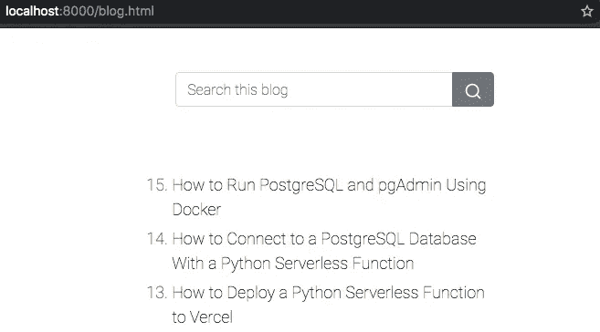

# 我如何使用机器人构建自我更新的博客目录——第 1 部分

> 原文：<https://levelup.gitconnected.com/how-i-built-a-self-updating-blog-catalog-using-a-bot-part-1-bd7399ba1e4f>

## 使用 GitHub 操作和 Python


照片由[李·坎贝尔](https://www.pexels.com/@lee-campbell-18167?utm_content=attributionCopyText&utm_medium=referral&utm_source=pexels)从[佩克斯](https://www.pexels.com/photo/apple-books-desk-keyboard-115655/?utm_content=attributionCopyText&utm_medium=referral&utm_source=pexels)拍摄

几周前，我更换了我的网站，增加了一个[博客版块](https://mahbub.ninja/blog.html)，在那里我列出了我所有的媒体文章。但是我立即遇到了一个问题，这意味着这个小任务比我预期的需要更多的手工工作。由于我使用 JSON 文件作为博客目录数据的来源，所以每次我在 Medium 上发布一篇新的博客文章时，我都必须将它的标题和 URL 添加到 JSON 文件中，并将其推送到 GitHub。最后，由于[持续部署](https://docs.netlify.com/site-deploys/create-deploys/#deploy-with-git)，它自动部署到[网络](https://www.netlify.com/)。

总的来说，没那么糟糕。但是我不想手动更新 JSON 文件。相反，我决定用 GitHub Actions 和 Python 为我写一个更新 JSON 文件的机器人。它节省了我大约五分钟。这听起来可能不多，但你愿意花多少钱来换取每周半小时或每月两小时？这一切都说明了。

> 你可以使用同样的技术来更新你网站上任何你想更新的东西。

# 设置

你需要安装 [Python](https://www.python.org/downloads/) 并从 [GitHub](https://github.com/lifeparticle/Medium-Blog-Bot) 下载一个 git 库。对于这个设置，我使用 Python 版本`3.8.4`和 macOS。

我用这四个步骤创建了我的自动更新机器人。

1.  用初始博客目录数据创建一个 JSON 文件。
2.  创建网页来显示博客目录数据。
3.  创建一个 Python 脚本。
4.  创建 GitHub 操作。

## 1.创建一个 JSON 文件

这里是 [GitHub](https://github.com/lifeparticle/Medium-Blog-Bot/blob/main/blog_links.json) 上 JSON 文件 **blog_links.json** 的链接。这个文件是我博客目录的唯一真实来源。我的目标是每当有新帖子时更新这个文件。

JSON 文件格式

## 2.创建网页

这里是 blog.html 的 HTML 文件**在 [GitHub](https://github.com/lifeparticle/Medium-Blog-Bot/blob/main/blog.html) 上的链接。这个文件从 **blog_links.json** 加载数据。在博客目录的顶部，我添加了一个目录搜索功能。我将 CSS 框架 [Bootstrap](https://getbootstrap.com/) 用于响应式设计，将 JavaScript 库 [jQuery](https://jquery.com/) 用于 HTML DOM 操作、事件处理等。**

接下来，我需要一个 web 服务器来本地加载 blog.html 页面。对于这篇文章，我使用了 Python web 服务器。python 命令`python -m http.server`将运行`http.server`模块。你可以在 [Python 文档](https://docs.python.org/3/using/cmdline.html)和 [Python 文档](https://docs.python.org/3/library/http.server.html)上阅读更多的命令行选项。

```
cd Medium-Blog-Bot
python -m http.server
```

如果您不使用 web 服务器，您将会得到类似下面的错误。

```
from origin 'null' has been blocked by CORS policy:
```

出于安全原因，它限制访问。你可以在[互联网工程任务组](https://tools.ietf.org/html/rfc6454)网站上了解更多。



博客页面

现在，用你最喜欢的网页浏览器访问[**http://localhost:8000/blog . html**](http://localhost:8000/blog.html)网址，你应该会看到类似上面截图的东西。

## 3.创建 Python 脚本

这里是 [GitHub](https://github.com/lifeparticle/Medium-Blog-Bot/blob/main/build_json.py) 上到 Python 文件 **build_json.py** 的链接。此文件比较来自介质的 **blog_links.json** 和[**RSS feed**](https://help.medium.com/hc/en-us/articles/214874118-Using-RSS-feeds-of-profiles-and-publications)**数据。最后，如果在 **RSS 提要**中有新数据，它会更新 **blog_links.json** 文件。**

**`build_json.py`**

**我想重点介绍一下`compare_data(oldData, newData)`函数。`oldData`保存来自 **blog_links.json** 文件的数据，`newData`保存来自 **RSS 提要**的数据。如你所见，我使用了一个名为 [**FuzzyWuzzy**](https://pypi.org/project/fuzzywuzzy/) 的 python 模块。`ratio()`函数使用 [Levenshtein 距离](https://en.wikipedia.org/wiki/Levenshtein_distance)计算两个字符串之间的相似度。但是有经验的程序员可能会奇怪，为什么我不只是用传统的方法比较两个标题。**

**如果你比较一下 **blog_links.json** 和 **RSS feed** 的标题，你会看到两个略有不同的标题。这是因为我发布帖子后改了标题。但是 **RSS 提要**并没有反映最近的变化。**

```
An Introduction to Ruby Hashes
vs
An Introduction to Ruby Hash
```

**如果我不使用比率来比较两个字符串，Python 脚本会将这一个帖子视为两个帖子。在这里，我使用了 90%的相似度。你可以根据你的要求来设置。使用以下命令在本地运行 **build_json.py** 。**

```
pip install requests
pip install fuzzywuzzy
cd Medium-Blog-Bot
python build_json.py
```

## **4.创建 GitHub 操作**

**这里是 [GitHub](https://github.com/lifeparticle/Medium-Blog-Bot/blob/main/.github/workflows/python-app.yml) 上到 YML 文件 **python-app.yml** 的链接，它会在每天午夜( [UTC](https://docs.github.com/en/actions/reference/events-that-trigger-workflows#scheduled-events-schedule) )和主分支上的每次 git 推送运行 python 脚本。阅读更多关于 [GitHub 动作](https://docs.github.com/en/actions)的信息。**

# **包裹**

**确定你是否需要机器人的一个好方法是在日常生活中重复。如果是这样的话，您很有可能可以将其自动化。**

**虽然这个场景并没有节省很多时间，但它让我的生活变得更容易，因为我不用担心更新我的网站(希望如此！)，而这也是写一个 bot 的足够理由。编码快乐！**

**如果您在第 1 部分学到了新东西，请阅读第 2 部分。**

**[](/how-i-built-a-self-updating-blog-catalog-using-a-bot-part-2-a67968be5f42) [## 我如何使用机器人构建自我更新的博客目录——第 2 部分

### 改进比较功能

levelup.gitconnected.com](/how-i-built-a-self-updating-blog-catalog-using-a-bot-part-2-a67968be5f42)**