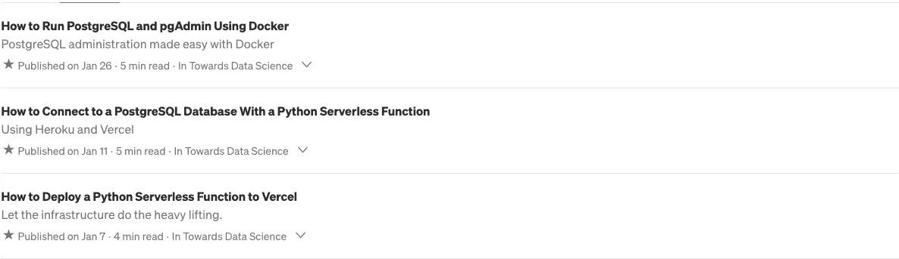
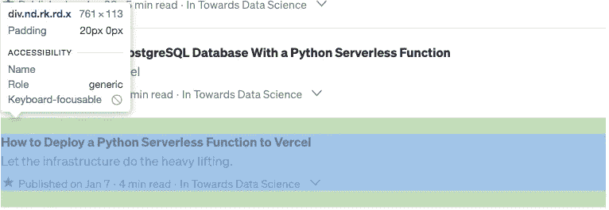
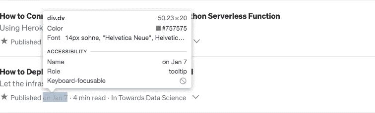
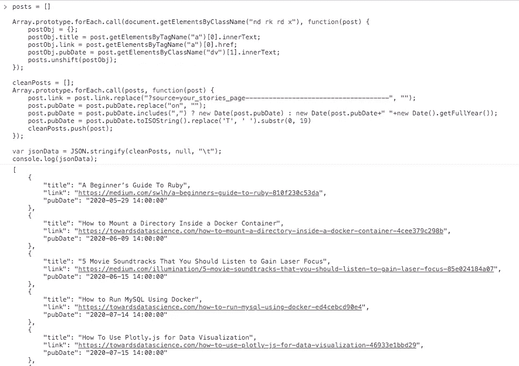

# 我如何使用机器人构建自我更新的博客目录——第 2 部分

> 原文：<https://levelup.gitconnected.com/how-i-built-a-self-updating-blog-catalog-using-a-bot-part-2-a67968be5f42>

## 改进比较功能


照片由 [Pexels](https://www.pexels.com/photo/man-sitting-in-front-of-three-computers-4974915/?utm_content=attributionCopyText&utm_medium=referral&utm_source=pexels) 的 [olia danilevich](https://www.pexels.com/@olia-danilevich?utm_content=attributionCopyText&utm_medium=referral&utm_source=pexels) 拍摄

欢迎来到我的自我更新博客目录系列的第二部分。这篇文章的主要原因是为了提高`compare_data`函数的时间复杂度。前面的函数的时间复杂度是 O(mn)，其中`m`是 RSS 数据源的长度，`n`是 JSON 数组的长度。RSS 数据提要包含新数据，JSON 数组包含旧数据。

想了一会，我有了一个想法，把函数的复杂度从 O(mn)提高到 O(m)。为了实现这一点，我通过添加一个名为 **pubDate** 的额外字段来改变 JSON 对象的数据结构。

旧的 JSON 格式与新的

如果你没有读过第一部分，请访问下面的链接。

[](/how-i-built-a-self-updating-blog-catalog-using-a-bot-part-1-bd7399ba1e4f) [## 我如何使用机器人构建自我更新的博客目录——第 1 部分

### 使用 GitHub 操作和 Python

levelup.gitconnected.com](/how-i-built-a-self-updating-blog-catalog-using-a-bot-part-1-bd7399ba1e4f) 

# 设置

你需要安装 [Python](https://www.python.org/downloads/) 并从 [GitHub](https://github.com/lifeparticle/Medium-Blog-Bot-V2) 下载一个 git 库。对于这个设置，我使用的是 Python 版本`3.8.4`、Google Chrome 和 macOS。

## 创建一个 JSON 文件

这里是 [GitHub](https://github.com/lifeparticle/Medium-Blog-Bot-V2/blob/main/blog_links.json) 上 JSON 文件 **blog_links.json** 的链接。这个文件是我博客目录的唯一真实来源。我的目标是每当有新帖子时更新这个文件。现在，我将向你展示我如何创建我的 **blog_links.json** 文件。这一步我不得不做一次，GitHub 动作和 Python 脚本以后会更新这个文件。首先，我通过这个[链接](https://medium.com/me/stories/public)访问了下面的页面。



所有已发布故事的列表

然后我打开了开发者控制台。对于 macOS，键盘快捷键是`cmd+option+J`。之后，我检查了一个故事的行。在这里，我为所选的 div 创建了`nd rk rd x`类。



检查故事部分

我对出版日期做了同样的事情。在本例中，我为所选的 div 创建了一个`dv`类。



检查日期

然后我用`nd rk rd x`和`dv`修改了 3 号线和 7 号线。最后，我在开发人员控制台上运行了整个脚本。记住，这两个 div 可能有不同的值。

使用 JavaScript 的网页抓取

我将`jsonData`从控制台复制到 **blog_links.json** 文件中。



抓取的数据

最后一步，我必须修改最后发布的故事的时间戳数据。这一步非常关键，因为根据这些信息，我可以确定是否需要更新 **blog_links.json** 文件。我使用 RSS 提要来获取我最新报道的时间戳。用你的媒体 id 替换掉 [@lifeparticle](https://medium.com/feed/@lifeparticle) 来获取你的 RSS 订阅数据。

```
https://medium.com/feed/@lifeparticle
```

之前和之后。

```
"pubDate": "2021-01-25 13:00:00" -> "pubDate": "2021–01–25 13:15:40"
```

## 创建 Python 脚本

这里是 [GitHub](https://github.com/lifeparticle/Medium-Blog-Bot-V2/blob/main/build_json.py) 上到 Python 文件 **build_json.py** 的链接。该文件比较了来自媒体的 **blog_links.json** 和[**RSS feed**](https://help.medium.com/hc/en-us/articles/214874118-Using-RSS-feeds-of-profiles-and-publications)**数据。最后，如果在 **RSS 提要**中有新数据，它会更新 **blog_links.json** 文件。**

**`build_json.py`**

**让我们把重点放在`compare_data(oldData, newData)`函数上。`oldData`保存来自 **blog_links.json** 文件的数据，`newData`拥有来自 **RSS 提要**的数据。如您所见，我选择了`oldData`数组中的最后一个元素，并提取了`last_pub_date`变量中的`pubDate`。然后我遍历了`newData`数组，并将`pubDate`与`last_pub_date`进行了比较。对于每个大于`last_pub_date`的`pubDate`，我将其添加到`data`数组中，或者如果`pubDate`小于`last_pub_date`则中断循环。后来，我将`data`数组的元素添加到我的 **blog_links.json** 文件中，这就是我如何实现时间复杂度为 0(m)的方法，其中`m`是 RSS 数据提要的长度。**

# **包裹**

**虽然我减少了时间，但我增加了空间的使用。在计算机科学中，这被称为[时空权衡](https://en.wikipedia.org/wiki/Space%E2%80%93time_tradeoff)。我希望您从这个系列中学到了一些新东西。编码快乐！**