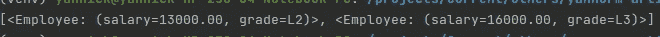
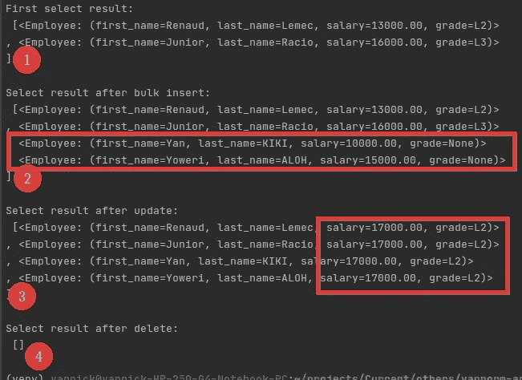

# 我如何用 Python 从头开始构建一个简单的 ORM

> 原文：<https://levelup.gitconnected.com/how-i-built-a-simple-orm-from-scratch-in-python-18b50108cfa3>


# 介绍

一个 **ORM** (对象关系映射器)是一个允许你使用*面向对象*范例与你的*数据库*交互的工具。因此，ORM 一般作为支持面向对象编程的语言的库来实现。

下面是 Django ORM 的一个基本例子:

在不同的编程语言中有几个开源的 ORM 比如[Django ORM](https://docs.djangoproject.com/en/3.1/topics/db/queries/)(Python)[Laravel 口才](https://laravel.com/docs/4.2/eloquent#introduction)(PHP)[Sequelize](https://sequelize.org/master/index.html)(JavaScript)等等。

这些 ORM 实现了非常高级的特性，当您是初学者时，它们的源代码可能会有点吓人，所以在本文中，我们将从头开始用 Python 实现一个简单的 ORM，来揭开这个过程的神秘面纱，并给出它如何工作的一般概念。


# 用法定义

因为我们是从零开始构建 ORM，所以在开始编码之前，我们应该定义如何使用它。这将允许我们对我们试图设计的东西有一个很好的概述。

例如，让我们考虑这个查询:

> SELECT * FROM salary = 10000 的员工；

使用 Django ORM，要执行这个查询，我们可以这样写:

```
employees = Employee.objects.filter(salary=10000)
```

但那是因为 Django 决定实现他的 ORM 来实现那样的行为。以下是一些可以不同方式实现的示例:

```
(1) Employee.get_objects(where={'salary': 10000})
(2) Employee.objects.select('*', condition=Condition(salary=10000))
```

因此，由系统开发人员决定他的系统将如何运行。

在我们的例子中，我们将尝试设计一个 ORM，允许我们使用下面定义的用法执行基本的*创建*、*读取*、*更新*和*删除*操作:

在理解了这是如何实现的之后，您应该能够添加更多的特性和用例。


# 履行

## 结构

我们 ORM 实现的第一步是实现允许我们使用预期的结构。我们可以通过下面的代码实现这一点:

ORM 实现结构

现在我们有了总体结构，我们可以继续实现我们的特性(选择、插入、更新和删除)，如上所述。但是在此之前，让我们建立一个数据库来测试我们的 ORM。

## 数据库设置

大多数流行的 ORM 支持许多数据库管理系统，但是为了简单起见，我们只实现对 PostgreSQL 的支持。

因此，为了能够测试我们的 ORM，我们需要一个 Postgres 数据库。这就是我们的数据库设置的样子。

```
DB_SETTINGS = {
    'host': '127.0.0.1',
    'port': '5432',
    'database': 'ormify',
    'user': 'yank',
    'password': 'yank'
}
```

您可以按照这篇漂亮的[文章](https://medium.com/coding-blocks/creating-user-database-and-adding-access-on-postgresql-8bfcd2f4a91e)创建一个 Postgres 数据库、用户，并授予用户访问数据库的权限。

为了遵循上面定义的 ORM 用法，在创建数据库之后，我们需要创建一个表`employees`，其中包含字段`first_name`、`last_name`、`salary`和`grade`。

您可以使用下面的脚本创建该表，并用一些数据填充它(在用您自己的凭证更新`DB_SETTINGS`之后)。

设置:创建员工表

这个脚本需要 [*psycopg2*](https://pypi.org/project/psycopg2-binary/) 包。您可以通过执行以下命令来安装它:

*   `pip install psycopg2-binary`

如果您已经有了一个包含一些表的数据库，您也可以创建自己的模型(作为我们的`Employee`模型)并用它进行测试。

好了，如果现在一切都设置好了，我们可以开始第一个功能:*选择*

## 选择功能

提醒一下，下面是我们想要的*选择*功能:

```
# SQL: SELECT salary, grade FROM employees;
employees = Employee.objects.select('salary', 'grade')
```

用`employees`一个雇员对象列表。我们可以通过如下更新 ORM 实现代码来实现这一点:

ORM“选择”实施

您可以使用您最喜欢的代码编辑器 diff 工具或 [Diffchecker](https://www.diffchecker.com/) 来轻松检查实现的不同步骤中的变化。

让我们测试一下这段代码，看看会发生什么。

如果一切顺利，您应该会看到如下输出:



如果是的话，恭喜你😎，您已经用 Python 实现了一个 ORM，它可以在您的数据库🗸.上进行基本的选择查询现在让我们添加插入、更新和删除特性。

## 插入、更新、删除特征

为了实现这些功能，我们可以按如下方式更新代码:

ORM 完整实施

运行该脚本后，您应该会得到如下输出:



ORM 使用输出

啊啊。！我们可以自豪😎 😎，我们现在有了一个支持所有基本查询的功能性 ORM。祝贺你🗸.

# 结论

我们已经能够用 Python 实现一个支持基本 SQL 查询的简单 ORM。我们现在可以通过 Python 代码与我们的数据库进行交互，并且我们还对如何继续设计我们自己的软件系统有了一个概述。

我们可以向此 ORM 添加许多功能，使其更加强大，例如:

*   使用`WHERE`子句过滤记录
*   接缝
*   聚合等。

您可以在 Github 上找到 ORM 实现的当前状态:

[](https://github.com/yannickkiki/yann-orm) [## yannickkiki/yann-orm

### 在 GitHub 上创建一个帐户，为 yannickkiki/yann-orm 的开发做出贡献。

github.com](https://github.com/yannickkiki/yann-orm) 

请随意对项目进行代码审查、问题报告、特性实现、特性请求等。

如果您有任何问题/反馈，请在评论区告诉我，或者直接与我联系。谢了。