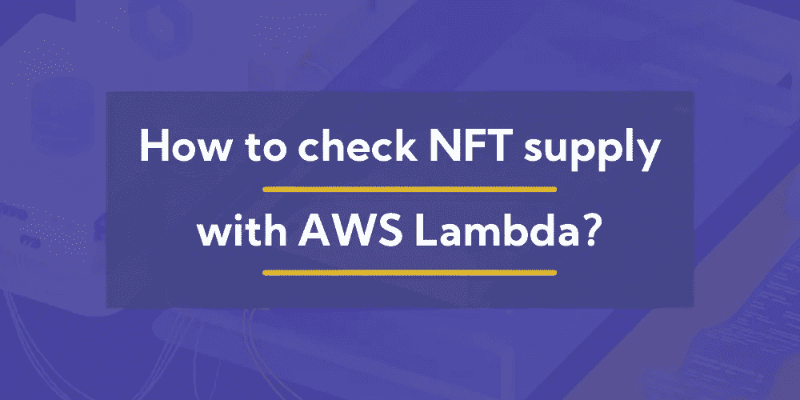
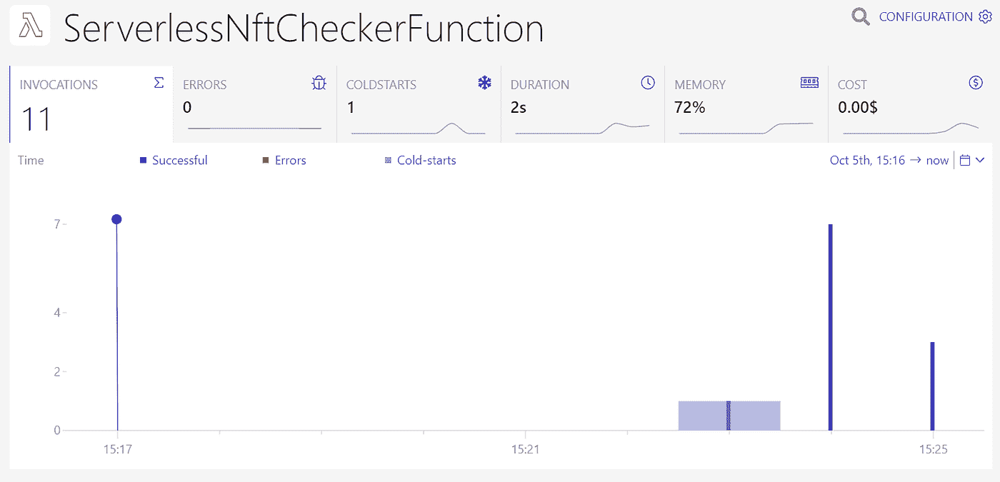
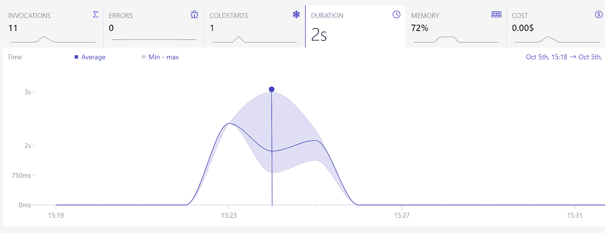

# 我如何用 AWS Lambda 构建 NFT 供应检查器

> 原文：<https://levelup.gitconnected.com/how-i-built-an-nft-supply-checker-with-aws-lambda-1d75b8323c27>

不可替代代币，或简称 NFT，现在非常流行。每个人和他们的宠物都开始了一个 NFT 项目。一些人通过使用 NFT 致富；其他人没有。有人说救世主会把权力从大公司手中夺走，还给创造者；也有人说只是一个巨型传销。



我不知道事情会如何发展，区块链是否会在 NFT 的炒作下成为下一个大事件，或者它是否会像之前的许多其他技术一样失败。但是我最近被问到的一个问题是，**这与 AWS 和无服务器技术**有什么关系？

这就是为什么我想，让我们乘坐炒作列车，写一篇关于 NFTs 和无服务器技术的文章！

# 区块链相关的 AWS 服务

当想到 AWS 和区块链时，我的第一个想法当然是名称中带有区块链的 AWS 服务:**亚马逊管理的区块链** (AMB)。

有了 AMB，你可以在你选择的 EC2 机器上托管**以太坊节点**，由 AWS 管理。你可以把它想象成 RDS，但是用区块链代替 SQL 数据库。

如果你不想依赖第三方的节点，比如 Infura 或 Alchemy，你将需要这样一个服务。这些节点可以被视为链上服务和链下服务之间的桥梁。

ABM 既不是无服务器，也不便宜；你按小时付费，最终账单可能会超过 300 美元，没问题。因此，您应该使用它来确保当第三方破产或您设法从第三方服务获得过高的账单时，您的节点不会宕机。

另一个相关的服务是**亚马逊量子账本数据库** (QLDB)，一个托管的不可变区块链/账本。如果你需要区块链的不变性，就使用它，但是没有分散的一切，这也随之而来。它可以按需付费，而且比 AMB 便宜很多，所以如果你只需要一个不可变的数据库，那就选择 QLDB 吧。

# 节点还是客户端？

构成分散式以太坊系统的节点可以被视为经典设置中的服务器，或者无服务器设计中的数据库和功能。他们挖掘新的区块或验证交易；他们还执行被称为智能合同的软件。这意味着你需要连接到一个节点来访问以太坊区块链。

在本文中，我们并不关注节点，所以我们对 AMB 不感兴趣。我们希望实现一个客户端，它向一个节点请求存储在区块链上的数据。因此，我们的例子将位于链外。

# 我们将建造什么？

我们将使用 AWS CDK 构建一个无服务器系统。它将由一个每小时调用一次的 Lambda 函数和一个存储离线数据的 S3 桶组成。我们将使用 JavaScript 和 Ethers.js 库从 AWS Lambda 连接到以太坊。

我们将检查的数据是智能合同已发布的 NFT 的供应。由于以太网区块链上的许多智能合约都有定义良好的接口，我们可以编写一个只需要合约地址就能完成工作的函数。

通常，AWS 被视为以太坊的竞争对手，因为“以太坊只是构建后端的另一种方式”，但我认为它们可以一起工作。区块链上的交易是昂贵的，所以一些数据和计算可以外包给像 AWS Lambda 这样的链外系统。

# 如何与以太坊互动？

要将非以太坊(离线)系统与以太坊智能合约(在线)连接，它必须连接到一个节点。我们已经了解到 AWS 提供了我们可以使用的相当昂贵的节点，但是还有许多服务可以免费使用。这些服务有严格的限制，但是对于这个例子，它们应该足够了。

通常，区块链上的事务会消耗 gas，但我们将只调用标记为 view 的函数。这样，我们连接到的节点可以简单地从其本地区块链副本中读取数据，无需任何事务，因此既不需要钱包也不需要汽油。

# 基础设施

让我们看一下定义我们基础架构的示例 CDK 堆栈。

```
const nftChecks = new s3.Bucket(this, "nftChecks");const nftChecker = new lambda.Function(this, "nftChecker", {
  runtime: lambda.Runtime.NODEJS_14_X,
  handler: "index.handler",
  code: lambda.Code.fromAsset(
    path.join(__dirname, "functions", "nftChecker")
  ),
  environment: {
    BUCKET_NAME: nftChecks.bucketName,
    CONTRACT_ADDRESS: "0x25ed58c027921e14d86380ea2646e3a1b5c55a8b",
  },
});nftChecks.grantWrite(nftChecker);const rule = new events.Rule(this, "nftCheckRule", {
  schedule: events.Schedule.rate(cdk.Duration.hours(1)),
});
rule.addTarget(new eventsTargets.LambdaFunction(nftChecker));
```

一个桶和一个λ函数。智能契约的桶名和地址通过环境变量传递给 Lambda 函数。

在这个例子中，我使用了智能合约的开发者道，因为的代码是开源的，所以我知道他们实现了什么接口。

在堆栈的末尾，用 CloudWatch 事件设置了时间表。

# λ函数

现在，让我们看看将与以太坊交互的代码。

```
const contractAbi = ["function totalSupply() external view returns (uint256)"];const { BUCKET_NAME, CONTRACT_ADDRESS } = process.env;exports.handler = async function () {
  const provider = new ethers.providers.getDefaultProvider();
  const contract = new ethers.Contract(CONTRACT_ADDRESS, contractAbi, provider);
  const mintedTokens = await contract.totalSupply(); await s3
    .putObject({
      Bucket: BUCKET_NAME,
      Key: new Date().toISOString() + ".json",
      Body: mintedTokens + "",
    })
    .promise();
};
```

第一行定义了我们想要调用的智能合约的应用程序二进制接口。它只是一个字符串数组，组成了该契约的方法签名。我没有定义所有的契约方法，因为我将只调用其中的一个。

接下来，我获取环境变量，以了解从哪里获取数据以及将数据保存到哪里。

在函数体中，我从 Ethers.js 获取默认提供者，在这个例子中，函数每小时只执行一次，所以不会达到限制。尽管如此，在可能更频繁地访问节点提供者的生产系统中，您应该注册一个以太坊网关服务，如 Infura 或 Alchemy。

然后，我与正确的 ABI、地址和提供商签订了合同。提供商确保我们连接到正确的链(以太坊有测试链，我们不想与这些测试链通信)。ABI 告诉 Ethers.js 契约提供了哪些方法。最后，契约的地址使 Ethers.js 知道在链上哪里可以找到契约。

最后，我们调用方法，该方法给出了已经创建的 NFT 的数量，并将其作为 JSON 文件保存到我们的 S3 桶中。文件名是 ISO 字符串形式的当前日期和时间；我们将会知道每小时有多少 NFT 被铸造出来。

# 用 Dashbird 监控

如果你将一些计算转移到 AWS Lambda 中，你可以用 [Dashbird](https://dashbird.io/) 监控它们，就像你在 AWS 上构建的其他无服务器系统一样。不需要额外的设置。我们可以为我们的 NFT 检查器设置警报，并在出现故障时得到通知。

在图 1 中，我们看到了 Dashbird 提供给我们的关于 Lambda 函数的一般信息。这只是类似于一些测试调用，但我们已经可以看到一些有趣的事情。



*图 1: Dashbird Lambda 函数细节*

所有的执行都是免费的，而且它们非常适合最小的内存配置。很高兴知道这一点。但是如果我们看一下图 2 中的 Duration 选项卡，我们会看到我们的函数有不同的运行时。



*图 2: Dashbird Lambda 持续时间标签*

该功能需要不到 1 秒到 3 秒的时间来完成工作。默认的 Lambda 调用超时为 3，000 毫秒，我们的函数很有可能被过早关闭。特别是，由于它每小时只调用一次，所以每次都会冷启动。

我们可以利用 Dashbird 收集的信息，用更大的超时来更新我们的 Lambda 函数定义，这样它就不会在将来意外崩溃。

```
const nftChecker = new lambda.Function(this, "nftChecker", {
  runtime: lambda.Runtime.NODEJS_14_X,
  handler: "index.handler",
  timeout: cdk.Duration.seconds(30),
  code: lambda.Code.fromAsset(
    path.join(__dirname, "functions", "nftChecker")
  ),
  environment: {
    BUCKET_NAME: nftChecks.bucketName,
    CONTRACT_ADDRESS: "0x25ed58c027921e14d86380ea2646e3a1b5c55a8b",
  },
});
```

# 结论

这个小示例应用程序概述了如何将无服务器技术与区块链结合使用。Lambda 函数比区块链事务更便宜、更快，因此它们适用于不需要被区块链跟踪的非关键计算。

这个例子很简单，也有些做作，但是根据区块链的状态进行自动化工作是一个实际的用例。Lambda 函数可以在 HTML 站点上呈现统计数据，或者通知 NFT 的创建者他们的供应发生了变化。

使用 Dashbird，您可以像使用任何其他 Lambda 函数一样跟踪您的 NFT 检查器，并使用洞察力来进一步优化执行。你可以在 GitHub 上找到[完整的例子。](https://github.com/kay-is/serverless-nft-checker)

*延伸阅读:*

[我们如何为华尔街赌注构建一个无服务器的“stonks”checker API](https://dashbird.io/blog/serverless-hot-stock-checker/)

[如何在 Lambda 调试上节省几百个小时？](https://dashbird.io/blog/how-to-save-hundreds-hours-debugging-lambda/)

[具有故障和威胁检测功能的防弹无服务器应用](https://dashbird.io/blog/failure-and-threat-detection-serverless/)