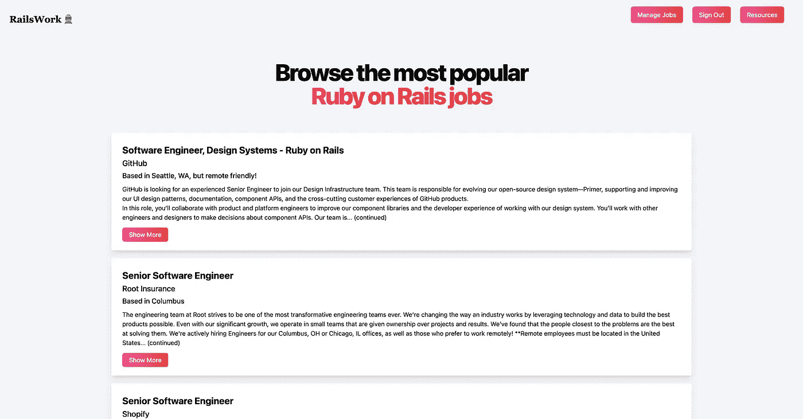
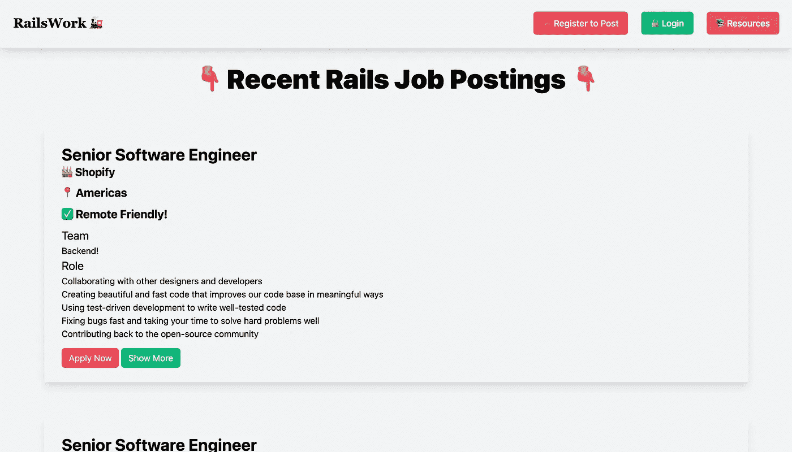
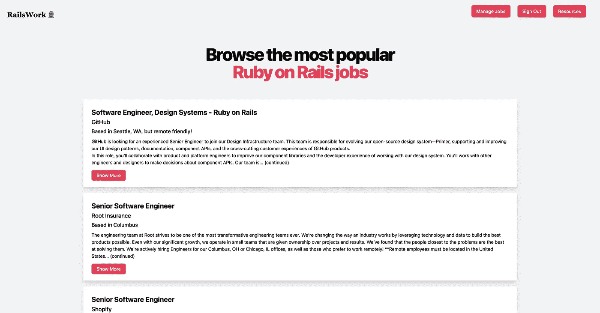
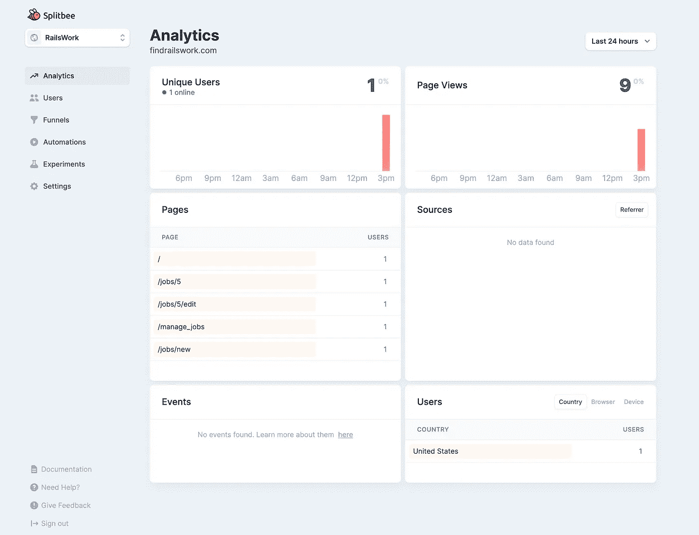

# 我如何在两天内创建并发布一个 SaaS 应用程序

> 原文：<https://levelup.gitconnected.com/how-i-built-and-launched-a-saas-app-in-2-days-6ea2245eaced>

## 我实际上启动了我的周末项目

findrailswork.com 的登录页面

一周多以前，我发布了一个面向 Ruby on Rails 开发者的工作平台 [RailsWork](http://findrailswork.com) 。在这篇文章中，我将谈论我的项目的原因和方法，以及我在这个过程中使用的工具。请随意走动👀

像很多人一样，我有一个坏习惯，就是开始一个项目，然后为了下一件大事完全放弃它们。实际上，我去年推出了 2 个 iOS 应用，前年推出了 2 个 Android 应用。有趣的是，去年我花了更多的时间进行 web 应用程序开发，而不是移动应用程序，我认为是时候让我的兼职项目组合反映这一点了。

**我想创建一个能实现几个目标的网络应用**

*   强迫我学点东西📚
*   展示我在 web 应用程序开发🧑‍的技能💻
*   解决了我面临的一个问题(稍后将详细介绍)👀
*   让我赚了些钱💰

除此之外，我想实际启动应用程序，并让人们使用它。

# 从问题开始

我是一名大学生，过去几年花了很多时间找工作和实习。现在，我的很多技能都是在 Ruby on Rails 上，所以我在寻找可以利用并建立在其上的工作。因此，尽管这不是一个非常复杂的应用程序，我还是决定为 Ruby on Rails 开发人员构建一个工作板。

在这个领域有两个现有的工作板可以解决这个问题，但是设计和体验还有待改进。

实际上，有两种不同的人会使用求职板:一种是寻找工作的人，另一种是发布工作信息的人。这显然带来了需要足够多的搜索者来支持海报的问题，反之亦然。为了抵消这一点，我决定现在免费发布工作，不久我将自己发布工作，为求职者增加价值。一旦我建立了足够多的稳定用户群，我就会打开 Stripe 的开关，开始向发布职位的雇主收费。

# 开始开发 SaaS 应用程序

具有讽刺意味的是，我使用 Ruby on Rails 构建了工作板。我首先生成了一个新的 Rails 应用程序(yay Rails 6！)和积分 [TailwindCSS](https://tailwindcss.com/) 。Tailwind 是一个实用的 CSS 框架，我正在利用它以令人难以置信的速度进行令人愉快的设计。我肯定会向几乎所有项目推荐它。

接下来，我实现了一个认证系统，这样用户就可以创建一个帐户并登录或注销。接下来，我创建了一个作业模型，并为用户创建、读取、更新或删除(CRUD)作业创建了视图和逻辑。从这个角度来看，这是一个非常简单的应用程序，所以到目前为止，🥳只花了一个小时左右的时间

# 用户体验改善

即使我使用顺风，我的观点在这一点上有点糟糕。我有创建帐户、登录、查看所有作业、查看单个作业、编辑作业或创建作业的视图。我花了大量的时间在这上面迭代，我仍然试图把它做好。

这是主页的早期版本之一。表情符号非常多😅

铁路工程的 0.5 倍

我决定将页面的根(登录页面)作为招聘信息的索引。所以当你去[www.findrailswork.com](http://www.findrailswork.com)时，你会立即看到按最近发布的信息分类的招聘信息。我认为这是网站上最有价值的页面，所以我最好把它放在第一位。

我添加了对职位描述的 markdown 支持，所以发布职位的人可以对它进行一些定制。我还换出了一些颜色，使它更加远程友好。前端设计工作量很大，我不知道为什么每个人都如此擅长。我想是时候了。我还删减了职位描述，这样发布信息的卡片就不会永远存在，把所有按钮的颜色换成有趣的渐变，并用同样的渐变设计标题。

在所有这些之后，在我写作的时候，它看起来是这样的，尽管我仍然在快速迭代。

铁路工程的当前设计

# 部署

接下来，我做了一些完全超出我的舒适区的事情，并将应用程序实际部署到生产环境中！这令人望而生畏，没有什么比将应用程序发送到 Android 或 iOS 应用程序商店更令人生畏的了。

我以每年 12 美元的价格在 Google domains 上注册了这个域名，并计算出即使这个项目彻底失败，所有这些学习也至少值 12 美元。接下来，我用我的学生折扣获得了 2 年免费的 Heroku 爱好 Dyno。(如果你是大学生，可以看看 Github 学生包，它非常棒，而且完全免费)

我很幸运，从一开始就用 Git 跟踪这个项目，所以部署并不太糟糕。我不得不将我的 sqlite3 数据库换成 postgres，但这并不需要太多的工作。我还必须修复一个顺风错误，但在 2 小时内，我的应用程序就在我的域上直播，让全世界都可以看到:)经过两天的碰壁，我创建了一个非常简单但功能强大的产品，并将其放在互联网上供任何人使用。我被删除了，现在还在想这有多容易理解。

到目前为止，该网站已经花费了我 12 美元/年的域名和 0 美元的未来 2 年的主机，之后将花费 7 美元/月。

# 生产应用程序不错

现在我的应用程序已经进入生产阶段，在我花时间寻找用户之前，我想先解决一些事情。

首先，我自动化部署。我用 Github 动作设置 Heroku 来检测主分支上的任何新提交，并自动触发部署。这已经节省了我的时间，而且只需 *git push* ，不到一分钟我的应用就能更新，这太有趣了。

我对 bug 并不免疫，事实上我写了很多 bug。我想知道我的💩代码影响了我的用户，所以我添加了蜜獾。Honeybadger 花了不到 5 分钟的时间就添加到了我的应用程序中，只要生产中出现错误，它就会给我发一封电子邮件，提供详细的崩溃报告。另外，他们有一个有趣的名字。我还没有太多的错误，所以蜜獾对我来说是免费的。

我还想知道我的用户是如何使用我的应用程序的，以及我对它的更改是如何被接收的。我想要一个不侵犯用户隐私的分析解决方案。我听说过很多关于[似是而非](https://plausible.io/)的好消息，但我还没准备好接受他们的定价。我用的是 [Splitbee](https://splitbee.io/) ，它尊重用户隐私，有真正易懂的分析，精彩的设计，而且碰巧对我的流量水平是免费的！

我的 Splitbee 仪表板

我还添加了一个管理工具，它本质上充当 Rails 控制台的 GUI 包装器，这样，如果发生灾难性事件需要我干预，我就可以快速操作数据库数据。这还没有派上用场，但我有一种感觉，在某个时候，我会感谢它已经存在。再说一遍，免费！

# 下一步是什么

才一个星期，这个 app 我规划了很多。这是一个非常基本的 CRUD 应用程序，具有非常坚实的基础，所以我很高兴看到它的发展方向。

首先，我想让工作板本身更容易使用。我计划为求职者添加过滤器，根据远程、工资、位置等进行过滤。我还想添加一个自动邮件程序，每周向订阅者发送一封电子邮件，通知他们任何新的帖子，但我不知道从哪里开始。

该应用程序当然需要大量的搜索引擎优化，以便显示在搜索结果中。我认为当人们搜索 Rails 工作时，开始排名的最好方法是成为寻找 Rails 工作的有价值的地方！这就是为什么我会在相当长的一段时间内自己添加 jobs，以保持 job board 的最新状态，我还添加了一个资源页面，我将在其中填充关于成为更好的 Rails 开发人员的教程和博客。

在今后的某个时候，我将集成 Stripe 来处理用户支付。我想招聘人员会希望看到一些关于他们投资回报率的数据，所以我想等到分析显示每月 300-600 次点击，或者每天 10-20 次。我计划使用 Stripe Checkout，只对招聘信息收取一次费用。还在争论价格，所以如果你有任何想法让我知道！

如果你检查了铁路工作并让我知道你的想法，这对我意义重大。你可以通过[在 twitter 上关注我](https://twitter.com/JeffMorhous)或者[订阅我的时事通讯](https://www.getrevue.co/profile/jeffmorhous)来跟踪应用的开发进度。