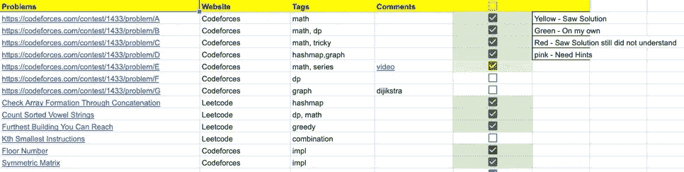

# 我是如何准备谷歌实习面试的？

> 原文：<https://levelup.gitconnected.com/how-i-cracked-the-google-internship-interview-with-no-background-in-competitive-coding-ffb395b4ffbe>

图片由[米切尔·罗](https://unsplash.com/@mitchel3uo)在 Unsplash

大家好，我是 Atibhi，我在 2020 年作为一名暑期实习生在谷歌实习。我得到实习机会后，很多人问我准备策略。

在这篇博文中，我试图澄清一些每个学生都有的关于面试准备的常见问题。我还附上了在我准备过程中对我有帮助的资源！

## 为什么要做 Leetcode？

我浏览了很多网站，最后，我发现 Leetcode 是最好的。

像 CodeChef、Codeforces、SPOJ 这样的网站确实不错，但它们不是以面试/工作为中心的，它们更倾向于竞争性编程。如果你的目标是去 ICPC ACM 比赛，无论如何，在那些地方练习。

面试准备方面，排名靠前的站点有 Leetcode、GeeksForGeeks 和 Interview Bit。Leetcode 轻而易举地击败了其他两个网站。而 GeeksForGeeks 中的理论是好的(往往是低效编码)，他们的实践平台有薄弱的测试用例。InterviewBit 有一个很好的问题集，但他们的列表有限，而且他们没有一个充满活力的社区。

Leetcode 拥有一个好网站应该拥有的一切，惊人的问题列表，优秀的社论，真正优秀的测试案例以及一个**社区**(最好的东西)。讨论区有惊人的讨论，有时这里的解决方案比社论中的更好。

## 我被问题列表吓倒了，我应该从哪里开始？

首先，没有理由被吓倒，我们都必须从某个地方开始:)如果你是一个完全的初学者，从[100 个喜欢的问题](https://leetcode.com/problemset/top-100-liked-questions/)和[顶级面试问题](https://leetcode.com/problemset/top-interview-questions/)开始。按照难易程度分类，先做容易的，然后是中等的，最后是难的。

## 我应该如何解决每个问题？

每个人都有不同的解决问题的方式，我最初会查找每个问题的解决方案，但是当我每周进行竞赛时(另一个惊人的特点！我意识到我的技术不起作用。然后我想了一个问题，想出了一个基本算法，然后编码。如果花费的时间超过一定量，我看到了解决方案。我也通过 Leetcode 讨论来了解不同的方法。

这里有一个来自不同人的“如何阅读代码”的精选列表，一定要读一读！这很有帮助:

*   [Leetcode 研磨导轨。Reddit](https://www.reddit.com/r/cscareerquestions/comments/6luszf/a_leetcode_grinding_guide/)
*   [关于 Leetcode 问题的模式](https://medium.com/@sourabreddy)
*   [想轻松破解 Leetcode 问题？](https://medium.com/algorithms-and-leetcode/want-to-crack-leetcode-problems-easily-dc825e27e423)
*   [r/cscarerierquestions——我必须逐字查找每一个 Leetcode 解决方案。正常吗？](https://www.reddit.com/r/cscareerquestions/comments/bc85gv/i_have_to_literally_lookup_up_every_leetcode/?utm_medium=android_app&utm_source=share](https://www.reddit.com/r/cscareerquestions/comments/bc85gv/i_have_to_literally_lookup_up_every_leetcode/?utm_medium=android_app&utm_source=share))
*   [如何有效地解码](https://leetcode.com/discuss/general-discussion/443629/how-to-leetcode-effectively)

## 我如何衡量自己的表现，我在解决问题，但我有进步吗？

一个词——每周竞赛。最初，当我开始每周举行竞赛时，我甚至不能解决一个问题，但随着练习，我开始解决两到三个问题。它激励我每周更加努力地工作，更好地管理时间。我还维护了一个 excel 表格，记录我在竞赛中解决的问题。

我的竞赛 excel 表格是什么样的。

## 我应该解决多少个问题？

这与问题的数量无关，而是与你“如何”理解这些概念并能够处理新问题有关。尽管如此，做顶级面试问题应该是必须的。

## 其他提示

*   从 Leetcode Discuss 中尽可能多地阅读人们的面试经历。
*   在 Leetcode 中提出疑问，并对每个问题进行讨论。
*   如果你的面试快到了，参加 Leetcode Premium，做一些公司特有的问题(非常有帮助)。

## 我应该研究的重要课题是什么？

*【这不是一份详尽的清单】*

## **大 O 符号**

*   [理论](http://web.mit.edu/16.070/www/lecture/big_o.pdf)
*   破解编码面试中的练习题

## 数组和数学

*   练习很多关于数组和数学的问题。下面提到一些重要的主题。
*   [圆形阵列——在 Leetocode 上求解的典型方法](https://leetcode.com/problems/next-greater-element-ii/discuss/98262/typical-ways-to-solve-circular-array-problems-java-solution)
*   [Boyer Moore 投票算法 Leetcode](https://leetcode.com/problems/majority-element-ii/discuss/63520/Boyer-Moore-Majority-Vote-algorithm-and-my-elaboration)
*   [两个求和问题— Leetcode](https://leetcode.com/problems/two-sum/)
*   [三个求和问题— Leetcode](https://leetcode.com/problems/3sum/)
*   [四则求和问题— Leetcode](https://leetcode.com/problems/4sum/)
*   [购买和库存问题— Leetcode](https://leetcode.com/problems/best-time-to-buy-and-sell-stock/)
*   [购买和库存问题二— Leetcode](https://leetcode.com/problems/best-time-to-buy-and-sell-stock-ii/)
*   [购买和库存问题三— Leetcode](https://leetcode.com/problems/best-time-to-buy-and-sell-stock-iii/)
*   [购买和库存问题四— Leetcode](https://leetcode.com/problems/best-time-to-buy-and-sell-stock-iv/)
*   [带冷却期的购买和库存— Leetcode](https://leetcode.com/problems/best-time-to-buy-and-sell-stock-with-cooldown/)
*   关于回文的问题。
*   [最长回文子序列](https://leetcode.com/problems/longest-palindromic-subsequence/)
*   [求对数的平方根— Leetcode](https://leetcode.com/problems/sqrtx/)
*   子阵列和子序列问题。

## 二进位检索

*   [来自 Topcoder 的二分搜索法(必须)](https://www.topcoder.com/community/competitive-programming/tutorials/binary-search)

## 逐位操作

*   [总结:如何使用位操作简单高效地解决问题— LeetCode 讨论](https://leetcode.com/problems/sum-of-two-integers/discuss/84278/A-summary%3A-how-to-use-bit-manipulation-to-solve-problems-easily-and-efficiently)
*   一个很好的[网站来可视化按位运算](http://bitwisecmd.com/)
*   [https://www . geeks forgeeks . org/bits-manipulation-important-tactics/](https://www.geeksforgeeks.org/bits-manipulation-important-tactics/)

## 树

*   [预排序(递归和迭代)](https://leetcode.com/problems/binary-tree-preorder-traversal/)
*   [后置顺序(递归和迭代](https://leetcode.com/problems/binary-tree-postorder-traversal/)
*   [按顺序(递归和迭代](https://leetcode.com/problems/binary-tree-inorder-traversal/)
*   [N 元树前序遍历](https://leetcode.com/problems/n-ary-tree-preorder-traversal/)
*   [N 叉树前序遍历](https://leetcode.com/problems/n-ary-tree-postorder-traversal)
*   [N 叉树层次顺序遍历](https://leetcode.com/problems/n-ary-tree-level-order-traversal)
*   [N 叉树的最大深度](https://leetcode.com/problems/maximum-depth-of-n-ary-tree)
*   [树的序列化和反序列化— Leetcode](https://leetcode.com/problems/serialize-and-deserialize-binary-tree/)
*   二叉查找树
*   [最低共同祖先——leet code](https://leetcode.com/problems/lowest-common-ancestor-of-a-binary-tree/)
*   图沙尔·罗伊的莫里斯有序遍历(视频)
*   [线索二叉树](https://algorithms.tutorialhorizon.com/introduction-to-threaded-binary-tree/)

## 递归和回溯

*   [递归和回溯教程](https://www.hackerearth.com/practice/basic-programming/recursion/recursion-and-backtracking/tutorial/)
*   [cs gator 博客(最佳)](https://medium.com/leetcode-patterns/leetcode-pattern-3-backtracking-5d9e5a03dc26?source=---------6------------------)
*   [面试比特理论](https://www.interviewbit.com/courses/programming/topics/backtracking/)
*   收费公路问题
*   [断字问题 Leetcode](https://leetcode.com/problems/word-break/)
*   [断词问题 2 Leetcode](https://leetcode.com/problems/word-break-ii/)
*   [电话号码的字母组合 Leetcode](https://leetcode.com/problems/letter-combinations-of-a-phone-number/)

## 图表

*   [代表图形](https://www.khanacademy.org/computing/computer-science/algorithms/graph-representation/a/representing-graphs)
*   [BFS DFS，csgator 的解释](https://medium.com/leetcode-patterns/leetcode-pattern-1-bfs-dfs-25-of-the-problems-part-1-519450a84353)
*   二维矩阵上的 DFS 和 BFS
*   多源双向 BFS
*   拓扑排序
*   普里姆斯和克鲁斯卡尔
*   迪克斯特拉
*   [稀疏图上的 Dijkstra 竞争规划算法](https://cp-algorithms.com/graph/dijkstra_sparse.html)

## 几何学

*   [几何算法— GeeksforGeeks](https://www.geeksforgeeks.org/geometric-algorithms/)

## 散列法

*   [c++中的 map vs unordered _ map—GeeksforGeeks](https://www.geeksforgeeks.org/map-vs-unordered_map-c/)
*   [设计散列表](https://leetcode.com/problems/design-hashmap/)
*   [设计哈希集](https://leetcode.com/problems/design-hashset/)
*   [滑动窗口算法模板解决所有 Leetcode 子串搜索问题。— LeetCode 讨论(这个很重要！)](https://leetcode.com/problems/find-all-anagrams-in-a-string/discuss/92007/sliding-window-algorithm-template-to-solve-all-the-leetcode-substring-search-problem)
*   [字符串哈希](https://cp-algorithms.com/string/string-hashing.html)

## **链表**

*   插入
*   删除节点
*   反向链表(迭代和递归)
*   循环链表
*   双向链表
*   弗洛伊德循环检测算法
*   [链表循环— Leetcode](https://leetcode.com/problems/linked-list-cycle-ii/)
*   [LRU 缓存— C++实现— Bhrigu Srivastava](http://bhrigu.me/blog/2017/01/22/lru-cache-c-plus-plus-implementation/)
*   [用随机指针复制列表(漂亮的问题！)](https://leetcode.com/problems/copy-list-with-random-pointer/)

## 动态规划

用 Dp 真正帮助我的一件事是递归地解决每个问题，然后记住它。之后，我编写了迭代方法的代码。

*   [TopCoder 文章(非常重要！！！必须)](https://www.topcoder.com/community/competitive-programming/tutorials/dynamic-programming-from-novice-to-advanced/)
*   [20 大 DP 问题(极客对极客)重要！](https://www.geeksforgeeks.org/top-20-dynamic-programming-interview-questions/)
*   [图沙尔罗伊 DP 播放列表](https://www.youtube.com/playlist?list=PLrmLmBdmIlpsHaNTPP_jHHDx_os9ItYXr)
*   从面试位做问题(好清单):P
*   [50 大 DP 问题](https://medium.com/@codingfreak/top-50-dynamic-programming-practice-problems-4208fed71aa3)
*   [DP 和分而治之的区别](https://stackoverflow.com/questions/13538459/difference-between-divide-and-conquer-algo-and-dynamic-programming)

## 不相交集合并集

*   [DSU CP 算法](https://cp-algorithms.com/data_structures/disjoint_set_union.html)

## 整理

*   清楚所有排序算法的基本算法和时间复杂度。
*   此外，读取计数排序，桶排序和基数排序。

## 贪婪的

*   [贪婪的基础](https://www.hackerearth.com/practice/algorithms/greedy/basics-of-greedy-algorithms/tutorial/)

## **谷歌具体面试技巧**

*   在谷歌文档上练习编码。
*   编写描述性的变量名和函数名。
*   要诚实。不要虚张声势。
*   大声说出来，在编码时解释你的方法。
*   在真实环境下给朋友做很多模拟面试。
*   做很多 Leetcode。
*   要自信！

希望这篇博文对你有所帮助！万事如意！欢迎在评论中提出任何问题:)

# 分级编码

感谢您成为我们社区的一员！[订阅我们的 YouTube 频道](https://www.youtube.com/channel/UC3v9kBR_ab4UHXXdknz8Fbg?sub_confirmation=1)或者加入 [**Skilled.dev 编码面试课程**](https://skilled.dev/) 。

 [## 编写面试问题+获得开发工作

### 掌握编码面试的过程

技术开发](https://skilled.dev)