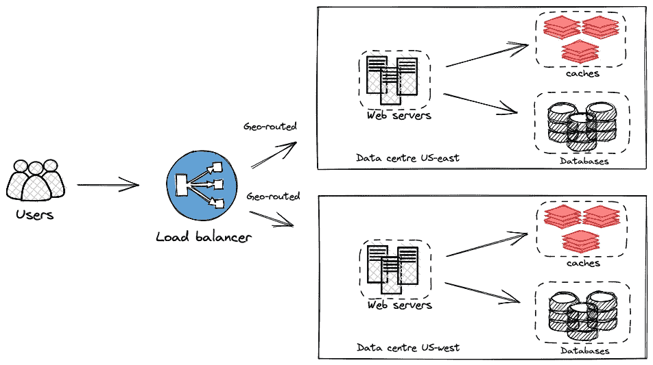

# 我如何用简单的核心概念破解系统设计面试

> 原文：<https://levelup.gitconnected.com/how-i-cracked-the-system-design-interview-with-simple-core-concepts-2a2c5681fe12>

## 如果你以前从未设计过一个系统，这就是开始的地方

图片来自 pexels.com，作者马体·米罗什尼琴科

如果你正在准备一个系统设计面试，或者你是一个软件工程师，有一份朝九晚五的全职工作，想要开始一个兼职或周末项目，或者如果你已经有了一个正在发展的项目，想要扩大规模，请系好安全带，继续阅读。

老实说，设计一个系统非常具有挑战性，对于大公司来说需要几年时间，但这一切都是从一步开始的。正如威尔·史密斯的名言:

> 你不打算建一堵墙。你不会说我要建造有史以来最大、最差、最伟大的墙。你不能从那里开始。你说我要把这块砖砌得尽可能完美，你每天都这么做，很快你就有了一面墙。

## 单一服务器设置

让我们从简单的开始，您的 web 应用程序、缓存和数据库运行在一台服务器上。

单一服务器设置

## 独立数据库

一旦您的用户群增长，单个服务器是不够的。我们可以为数据库再添加一台服务器。分离 web 层和数据层使我们能够独立地扩展它们。

独立的数据库设置

现在问题来了，用哪个数据库？传统的关系数据库还是非关系数据库？这是互联网上的一个热门话题，但没有明确的答案，这取决于你存储的是什么样的数据。两者都存储数据，但方式不同。

关系数据库是一个很好的选择

*   如果您的应用程序需要复杂的事务和数据完整性
*   你需要确保耐酸性
*   你不会期望有很多功能更新

非关系数据库是一个很好的选择

*   如果您的应用程序需要灵活的或者没有预定义的模式
*   如果您的应用程序需要不断增加功能
*   您不关心 100%的数据一致性

## 扩展 Web 服务器

当对应用程序的需求激增时，您会意识到应用程序的可访问性、可用性和容量的重要性。您想要扩展系统，有两种选择，垂直扩展(纵向扩展)和水平扩展(横向扩展)。这两种扩展类型之间的差异取决于向系统添加计算资源的方式。

垂直缩放增加了当前实例的计算能力。纵向扩展就像用法拉利升级你的旧车，因为你想要更大的马力。

垂直缩放有一个硬限制。向单个服务器添加无限量的 CPU 和 RAM 是不实际的，如果服务器停机，整个应用程序也会停机。

水平扩展通过向系统添加更多实例并将处理和内存分布到多个实例来增加系统的容量。这很相似，但你不会丢弃你的旧车去买一辆法拉利，而是保留你的旧车，并在你的车库里增加一辆法拉利。

## 负载平衡

为了应对增加的负载，我们增加了更多的服务器。我们需要一个负载平衡器来在多台服务器之间分配负载。负载平衡器可以防止单个服务器过载，从而降低速度或丢弃请求。

负载平衡器设置

这就是负载平衡器的工作方式，

*   浏览器或应用程序收到请求并试图连接到服务器。
*   负载平衡器接收请求，并根据预定义的算法将其转发给服务器组中的一个服务器。
*   服务器接受连接请求，并使用负载平衡器响应客户端。

这里需要注意的一点是，客户端使用公共 IPs 与系统进行交互，负载平衡器和服务器之间的交互通过私有 IPs 进行，以提高安全性。

## 数据库复制(主从)

假设您的应用程序变得很大，而您的服务器由于某种原因崩溃了。经过几次调试后，您发现问题是由对数据库服务器的大量读/写请求引起的。在这种情况下，建议采用主从数据库设计。这种将负载分布在多个节点上的设计，可以使您的应用程序向外扩展，以满足您不断增长的用户群。

数据库复制(主从)

主数据库只支持写和更新操作，从数据库获取主数据的副本，只支持读操作。

如果其中一个从数据库崩溃，传入的请求将被临时转发到健康的从数据库或主数据库。并且如果主数据库关闭，则从数据库被提升为新的主数据库，并且传入的请求被转发到新的主数据库。

## 尽可能多地缓存数据

大规模应用程序会经历高流量，这会逐渐影响应用程序的性能；我们可以缓存数据来解决这个问题。缓存可以在不同的层完成，如客户端、web 应用程序、数据库和 DNS。这里我们感兴趣的是数据库层，但是每一层的目的都是一样的。

缓存是一种高速的临时存储区域，用于存储频繁访问的数据。它可以存储以前检索或计算的昂贵响应，以便将来对相同数据的请求可以比主数据库更快地得到服务。缓存的主要优势在于它最大限度地减少了数据库工作负载，降低了成本，并提高了应用程序的整体性能。

有几种缓存策略，每一种都会对您的系统及其性能产生明显的影响。缓存策略定义了数据源和缓存系统之间的交互，以及如何检索数据。考虑如何访问您的数据，以便您可以选择哪种技术是理想的。下面列出了一些比较受欢迎的方法

*   撇开缓存不谈
*   通读
*   直写
*   回复
*   四处写

下图说明了一个简单的通读缓存策略。在我接下来的博客中，我将详细介绍所有的缓存策略。

通读缓存策略

## 将内容交付网络(CDN)用于静态资产

您的应用程序可能托管在一个位置，但是当其他国家的用户访问它时，内容(如图像、视频、CSS 和 JavaScript 文件)必须在世界各地传播，这可能会导致应用程序的延迟增加。我们可以利用 CDN 来解决这个问题。

CDN 是遍布全球的服务器网络。这是一种根据用户的地理位置更快、更有效地向用户提供内容的方法。

## 支持多个不同地理位置的数据中心

通过将用户对应用程序的请求转发到最近的数据中心，您可以降低延迟并进一步提高应用程序的整体性能。此外，如果发生洪水或地震等灾难，只有距离灾难最近的数据中心会受到影响，而其他数据中心将能够存储数据以供紧急访问。

地理多样化策略缩短了数据必须传输的距离，从而缩短了数据到达目的地所需的时间。

多个不同地理位置的数据中心

上图显示了不同地理位置的数据中心如何与位于不同位置的两个数据中心协同工作。用户被地理路由到最近的数据中心。

## 消息队列的使用

您可以将您的应用程序分离成独立的、更小的构建块，这使得它们更容易设计、部署和管理。得益于消息队列，这些分布式应用程序可以有效地进行通信。

消息队列的核心概念简单明了；消息由输入服务创建，有时称为生产者或发布者，它们被发布到消息队列。消费者和订户是连接到队列并执行消息指定的任务的其他服务或服务器。下图显示了消息队列的基本架构。

来源:https://www.cloudamqp.com/blog/what-is-message-queuing.html

消息队列的最佳用例是它们可以充当微服务之间的中间人。

另一个用例是用户可以通过应用程序将数据上传到网站。该网站将处理这些数据，创建一个 Excel，并通过电子邮件向用户发送它的副本。在本例中，处理数据、创建 Excel 和发送电子邮件需要几秒钟，因此这里可以使用消息队列。

## 数据库缩放

随着数据数量的日益增加，我们的数据库变得更加不堪重负。该数据层需要缩放。数据库缩放可以分为两类:垂直缩放和水平缩放。

**垂直缩放(放大):**

假设您有一个 5GB 内存的数据库服务器，它已经达到了它的极限。为了管理额外的数据，您现在需要购买一台昂贵的 2TB 内存的服务器。您的服务器现在能够处理海量数据。

另一方面，垂直缩放有几个缺点:

*   用于垂直扩展的强大服务器成本更高。
*   硬件限制。
*   单点故障的可能性更大。

**水平缩放(分片):**

下图显示了垂直和水平缩放的区别。

来源:[https://www . section . io/blog/scaling-horizontal-vs-vertical/](https://www.section.io/blog/scaling-horizontally-vs-vertically/)

如图所示，水平扩展是通过添加额外的服务器来水平扩展数据库。它分离数据，并将其分布在不同的服务器上，称为碎片。每个分片都是一个独立的数据库，共享相同的模式，但是每个分片上的实际数据对于该分片是唯一的。

想想下图。用户被保存在数据库中，数据库根据用户 id 被分成碎片。传入的请求将通过散列函数发送到适当的碎片。我们使用 user-id% 4 作为四个碎片的散列函数。如果散列函数的值为 0，则从碎片 0 存储和检索数据。如果碎片 1 是 1，则使用碎片 1，依此类推。

数据库碎片

分片是一种奇妙的方法，但它经常会给系统带来新的挑战。

*   很难跨数据库碎片执行连接操作。
*   一些碎片可能比其他碎片更快过载。这是由于数据分布不一致造成的。这可以通过改变 shard 函数和跨 shard 重新分配数据来解决。

## 无状态优于有状态

应用程序可以是有状态的，也可以是无状态的，这取决于与用户交互的状态存储了多长时间以及如何存储。

像任何其他应用程序一样，有状态应用程序也使用数据库，但是它将用户身份验证和过去的请求等状态数据存储在服务器上，从而使应用程序速度更快。它标记用户是*连接*还是*断开*。它还跟踪相同用户以前的请求。当处理后续的用户请求时，它使用所有这些信息作为上下文。

这里有一个简单的例子:一个有状态的应用程序相当于访问您当地的银行，您已经是这家银行的客户很多年了。银行里的每个人都知道你是谁，所以你不需要在交易前出示身份证。银行还把你以前交易的详细情况存档。简单地走上去，问一些关于你的余额的问题，并告诉他们你想做什么交易。只要银行能够同时处理大量试图进行交易的客户，这种方法就是快速有效的。

现在想象一下，有 1000 个人在同一个分支机构排队等待交易，而镇上只有一个人。因为银行不能一次处理这么多的请求，所以要等很长时间。你不能去一家新银行，因为他们不知道你是谁，也无法获得你过去的银行账户数据。事实上，您必须继续访问同一个银行分支机构，即使它已经人满为患，无法完成您的交易，这是一个可伸缩性问题。

我们可以通过使用无状态应用程序来解决这个问题。无状态应用程序不会在其服务器上保存任何有关过去事务的数据。无状态并不意味着没有状态，它只是意味着状态存储在服务器之外的其他地方。状态被传送到客户端和/或数据库。无状态应用程序需要存储其状态和稍后事务的上下文的客户端。因此，无状态应用程序及其客户端可以更加独立地进行通信，这增加了扩展能力。

## 记录和监控您的系统

日志记录生成一组发生在应用程序中的事件，错误监视可用于识别应用程序的问题，并告诉您应用程序是否正在运行。两者配合得很好，就像面包和黄油一样。

我们已经简要讨论了每个概念；请深入研究每一个问题，以微调您的系统。现在，为学习系统设计的基本概念和可伸缩组件而感到自豪。

## 参考资料和进一步阅读

*   系统设计采访 Alex Xu
*   [https://www . red hat . com/en/topics/cloud-native-apps/stateful-vs-stateless](https://www.redhat.com/en/topics/cloud-native-apps/stateful-vs-stateless)
*   [https://blog . dream factory . com/stateful-vs-stateless-we B- app-design](https://blog.dreamfactory.com/stateful-vs-stateless-web-app-design)

# 分级编码

感谢您成为我们社区的一员！在你离开之前:

*   👏为故事鼓掌，跟着作者走👉
*   📰查看更多内容请参见[升级编码刊物](https://levelup.gitconnected.com/?utm_source=pub&utm_medium=post)
*   🔔关注我们:[Twitter](https://twitter.com/gitconnected)|[LinkedIn](https://www.linkedin.com/company/gitconnected)|[时事通讯](https://newsletter.levelup.dev)

🚀👉 [**将像你这样的开发人员安置在顶级初创公司和科技公司**](https://jobs.levelup.dev/talent/welcome?referral=true)