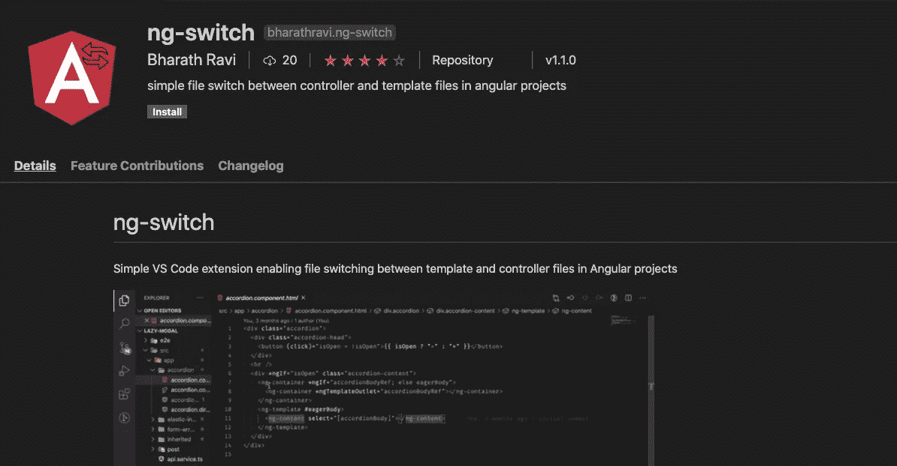
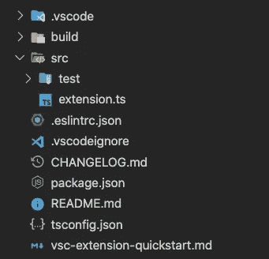

# 我如何创建我的第一个 VS 代码扩展

> 原文：<https://levelup.gitconnected.com/how-i-created-my-first-vs-code-extention-66d7d5ff7fbe>

不要让任何事情阻止你个性化你最喜欢的代码编辑器！



天然气开关

> “自动化应用于低效率的操作会放大低效率。”——比尔·盖茨

谈到编程，isual Studio Code 可以说是世界上使用最多的文本编辑器！事实上，在 [2018](https://insights.stackoverflow.com/survey/2018#development-environments-and-tools) 和 [2019](https://insights.stackoverflow.com/survey/2019#development-environments-and-tools) StackOverflow 开发者调查中，VS Code 被评为最受欢迎的开发者工具。它是轻量级的，易于导航，易于定制每个人都想要的代码编辑器。自 2015 年首次发布以来，这使得 VS Code 成为我们所有人的最爱。

VS Code 还允许开发者创建所谓的[扩展](https://code.visualstudio.com/docs/introvideos/extend),以确保来自技术领域各个角落的每个人都可以开发特定于他们的功能。我每天都在使用这些工具，这让我的开发者体验非常愉快。

## 为什么要创建自定义扩展？


丹尼尔·萨尔西乌斯在 [Unsplash](https://unsplash.com?utm_source=medium&utm_medium=referral) 上拍摄的照片

我已经问过自己一千次了，直到我不得不创造一个！

几乎所有明显的用例都有扩展。但是作为开发人员，我们的每个工作流程都是不同的。我们每个人的个人偏好都很广泛，把它们分成几个盒子可能并不总是管用。

创建自定义扩展也是同样的原因。你或你的团队可能有一个独特的想法，你认为这将有利于你的工作流程。

## 对我来说，它是有棱角的

我每天都和 Angular 一起工作。Angular 做得很好的一件事是开箱即用的模块化。使用 Angular CLI 创建的每个组件都会为您生成四个文件

*   组件。html(模板)
*   组件。ts 文件(控制器)
*   组件样式表文件
*   组件。规格文件(单元测试)

我发现自己一次又一次地在这些文件之间切换。这些年来，我意识到我在这上面花费了相当多的时间。

这个过程看起来像(从模板切换到控制器)

1.  打开边栏(Cmd+B)
2.  使用触摸板导航到组件文件
3.  点击控制器文件
4.  关闭侧边栏(Cmd+B)

我在一个小时内重复这个 20 次，它开始变得令人抓狂。我非常需要一个键盘快捷键，但是互联网并没有太大的帮助。我发现它不可用，并立即开始创建一个。

## 让我们创建一个

事不宜迟，让我们写一些代码。

搭建 VS 代码扩展的最简单和推荐的方法是使用 *code yeoman generator。* [约曼](https://yeoman.io/)是一个项目脚手架工具。每个 yeoman 应用程序都被称为生成器，因为它通常根据配置命令生成文件。在我们的例子中，我们想使用名为`generator-code`的生成器。
走吧！

```
npm install -g yo generator-code
```

> `yo`这里是约曼 npm 包，`generator-code`是约曼发电机包

一旦你安装好了所有的东西，运行

```
yo code
```

为您搭建第一个 VS 代码扩展项目。约曼将提示您有关分机的更多信息。全部照着回答，这里有个例子。

```
? What type of extension do you want to create? New Extension (TypeScript)
? What's the name of your extension? ng-switch
? What's the identifier of your extension? ng-switch
? What's the description of your extension?
? Initialize a git repository? Yes
? Bundle the source code with webpack? Yes
? Which package manager to use? npm
```

> 如果你喜欢 js 胜过 ts，使用`*New Extension (javaScript)*`

项目工作环境将类似于



这里有两个感兴趣的文件。

1.  **package.json** 事件是您希望使用扩展执行的任何操作。每个动作被称为一个*命令*。
2.  **src/extension . ts**
    *命令*注册在该文件中。一个*命令*可以只是一个你想显示给用户的信息弹出窗口。

所以，简单来说，*extension . ts*文件是写*命令*的地方，而 *package.json* 包含了关于如何激活这些*命令*的信息。

让我们退一步，把我们最初的目标联系起来。

我们需要注册一个切换文件的*命令*，并在键盘快捷键上激活它，比如说`Cmd+Y`。

让我们首先研究一下*命令*的实现。下面是最小功能版本的样子。

我们正在注册一个命令，即 *ng-switch.switch.*

> `*ng-switch*`是我们扩展的唯一标识符，`switch` *是命令*

激活此*命令后，*将触发以下流程。

1.  获取打开文件的当前路径(component.ts 文件或 component.ts 文件)
2.  交换文件名(*)。html* 到。 *ts 反之亦然)*
3.  为文件路径生成 VS 代码 URI
4.  使用 URI 打开文件

是的，就这么简单！

现在剩下的唯一步骤是激活键盘快捷键按下事件上的这个*命令*。

让我们导航到 *package.json* 文件并更新 *contributes* 条目，如下所示

*命令*数组可用于通过 VS 代码命令托盘(本例中为*开关*)触发命令，并且*键绑定*数组将包含激活*命令的所有键盘快捷键。*

这显然导致当用户按下`Cmd+Y`或`Ctrl+Alt+Y`时激活我们注册的命令(*开关*)。

我迫不及待地想看到您将创建的所有惊人的扩展！

在这里找到 GitHub repo 的完整源代码。请随意创建问题、功能请求或拉动请求，以使其变得更好。

你可以在这里了解所有关于向市场发布你的扩展的信息。

更多类似的文章👇

[](http://bharathravi.com/) [## Bharath Ravi | javaScript 文章

### 有能力的文章来提升你的网络技能。javaScript 全栈开发者 Bharath Ravi 的个人博客

bharathravi.com](http://bharathravi.com/) 

在 Twitter 上找到我[这里](https://twitter.com/_bharath_ravi)。

黑客快乐！