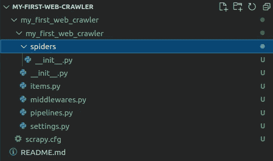
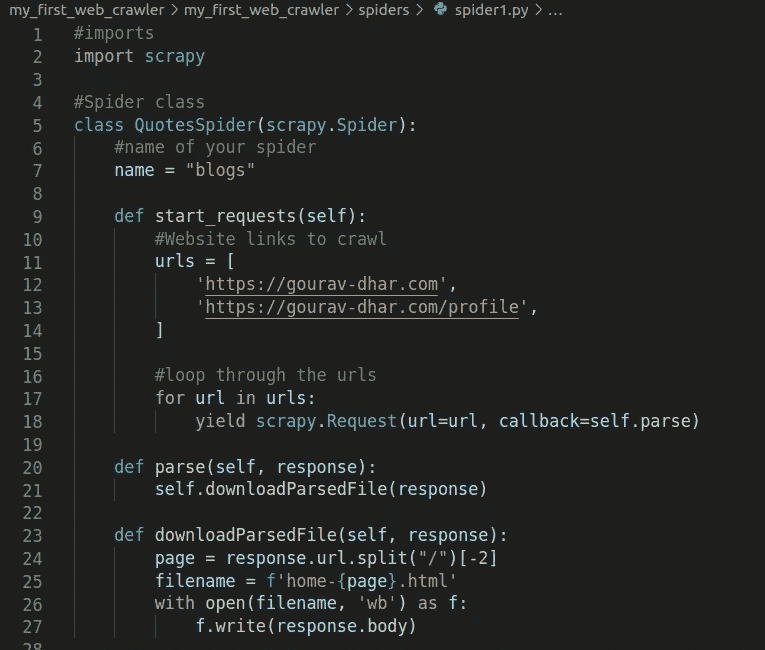
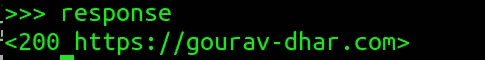
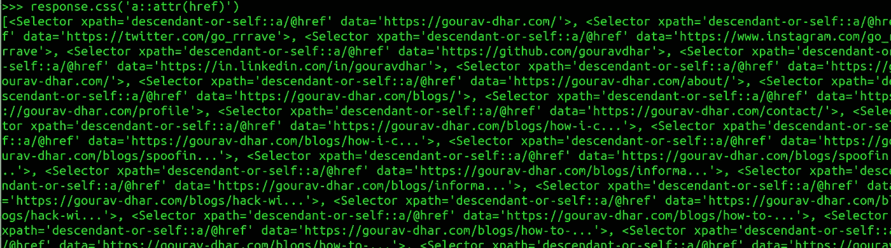
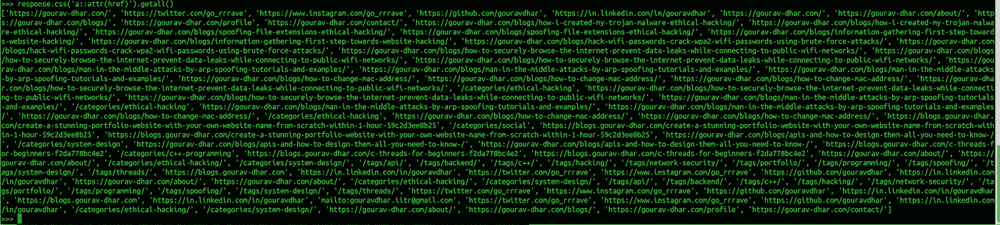
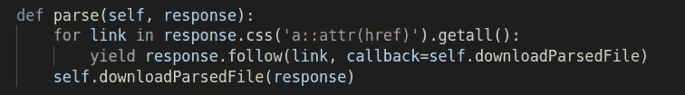

# 我如何创建我的第一个网络爬虫！

> 原文：<https://levelup.gitconnected.com/how-i-created-my-first-web-crawler-ff9bea9235bf>


# 什么是网络爬虫？

网络爬虫是一种将互联网抓取到**索引**并下载网站内容进行抓取的机器人。网络爬虫又称**网络蜘蛛**或**爬行机器人**。网络爬虫需要被提供有初始网站的列表，从该列表开始，它将索引和爬行被索引的网站中存在的链接，以发现新的页面。

# 图书馆类比

打个比方，让我们把互联网上所有的**网站想象成图书馆里的书**。网络爬虫是图书管理员，他的工作是在目录中输入图书的信息，以便在需要时很容易找到这些书。为了组织图书，图书管理员将在目录中存储图书的标题、描述和类别。网络爬虫也会做同样的事情。当网络爬虫索引互联网上的所有页面时，它的目标就完成了。一些不可能实现的事情！


# 创建网络爬虫

在这篇博客中，我将用 **python** 编写代码。python 中有几个 web 爬行和 web 抓取框架。我将使用`scrapy`。

安装 scrapy:

```
$ pip install scrapy
```

## 1.使用 scrapy 创建一个 python 应用程序

要创建一个 scrapy 项目，运行以下命令。这里我的应用程序的名称是`my_first_web_crawler`

```
$ scrapy startproject my_first_web_crawler
```

这将生成一个`scrapy`样板代码和文件夹结构，如下所示:



## 2.创建网络爬虫

名为`spiders`的文件夹包含 scrapy 用来抓取网站的文件。我将在这个目录下创建一个名为`spider1.py`的文件，并编写下面几行代码:



> 你可以在这里找到上面的代码:[https://github . com/gouravdhar/my-first-we b-crawler/blob/main/test _ spider . py](https://github.com/gouravdhar/my-first-web-crawler/blob/main/test_spider.py)

我已经提供了我将要抓取的网页的 URL。这些页面包含我的博客链接。您可以提供任意数量的 URL，因为这是一个列表。我将抓取的 URL:

```
[https://gourav-dhar.com](https://gourav-dhar.com) 
[https://gourav-dhar.com/profile](https://gourav-dhar.com/profile)
```

上面的代码遍历链接中提供的网页并下载页面。

要执行代码，请运行以下命令:

```
scrapy crawl <your-spider-name>
```

我的蜘蛛名是`blogs`(在上面代码的第 7 行中定义)

**还有 tada！！！链接的数据已下载到项目文件夹中。**

但这还不够，我想实际下载这个页面指向的链接的数据。为此，我不得不抓取主页上的所有链接并浏览。我将使用 **scrapy shell** 编写代码来抓取网站信息。

> **注意:Scrapy Shell** 是一个交互式 Shell，在这里你可以快速地尝试和调试代码

要启动 scrapy shell，只需编写:

```
$ scrapy shell 'https://gourav-dhar.com'
```

即`scrapy shell` 后跟 url

一旦外壳被打开，输入`response`确认你得到一个 200 的响应。



引用链接通常位于 html 的`a href`类中。我需要抓取这个链接中出现的所有值，所以我将编写这个来查看输出

```
>>> response.css('a::attr(href)')
```



这是页面上的`a href`类列表。为了得到一个只有链接的清理结果，我们必须使用`getall()`函数

```
>>> response.css('a::attr(href)').getall()
```

结果应该是这样的:



这将返回给我一个包含所有`href`值的列表。

为了下载这个列表中的所有文件，我将在 spider 代码中修改我的 parse 函数，使用上面的命令获取所有链接。修改后的解析函数如下所示:



> **项目的 Github 链接可以在这里找到:** [**Github 链接**](https://github.com/gouravdhar/my-first-web-crawler)

现在，再次在终端中运行以下命令:

```
$ scrapy crawl blogs
```

我可以下载我主页上所有链接的内容。这个功能可以扩展到一个无限循环，你可以在互联网上的所有网站中爬行。

# 概述网络爬虫

网络爬虫是存储和索引网页内容的强大工具。它的应用非常广泛。

> 注意:你也可以通过在你的站点的`robots.txt`文件中提到黑名单/白名单域来添加过滤器，以确定谁可以抓取你的站点。

**搜索引擎使用网络爬行**来索引和存储数据库中的`meta titles`和`descriptions`，以快速显示用户输入的查询结果。主要搜索引擎的例子有`[google](http://google.com)`、`[bing](http://bing.com)`、`[yahoo](http://yahoo.com)`、`[duck duck go](http://duckduckgo.com)`。搜索引擎还在这些结果之上添加了他们自己的推荐系统，这使得每个搜索引擎的算法都不同。

网页抓取也用于**版权/剽窃违规检测**。**网络分析**和**数据挖掘**也是主要应用。它还可以用于检测网络恶意软件，如**网络钓鱼攻击**。假设你拥有`facebook.com`，你可以抓取互联网来检查是否有其他人正在使用一个看起来类似于`facebook.com`的网站，这个网站可能会被用于网络钓鱼攻击。

> **该项目的 Github 链接可以在这里找到:** [**Github 链接**](https://github.com/gouravdhar/my-first-web-crawler)
> 
> 这是一个探索我们博客平台 [**的邀请，极客头脑**](https://www.thegeekyminds.com/) 。一个让您了解软件开发和技术领域最新发展的一站式平台。我们在 [**的极客头脑**](https://www.thegeekyminds.com/) 旨在写一些你实际上可以用来提高工作效率和充实你的职业生活的内容。
> 
> 邀请您在[**https://thegeekyminds.com**](https://thegeekyminds.com/)通过我们的平台。并订阅我们的时事通讯，以便在我们每次发布新帖子时收到电子邮件。我们承诺不会向您的收件箱发送垃圾邮件。点击下面的按钮订阅我们的时事通讯

[](https://forms.wix.com/4444cf13-7653-460d-9b32-f2e4e65544d1:c2184260-1ab5-4c6a-a37d-53de0778afa0)