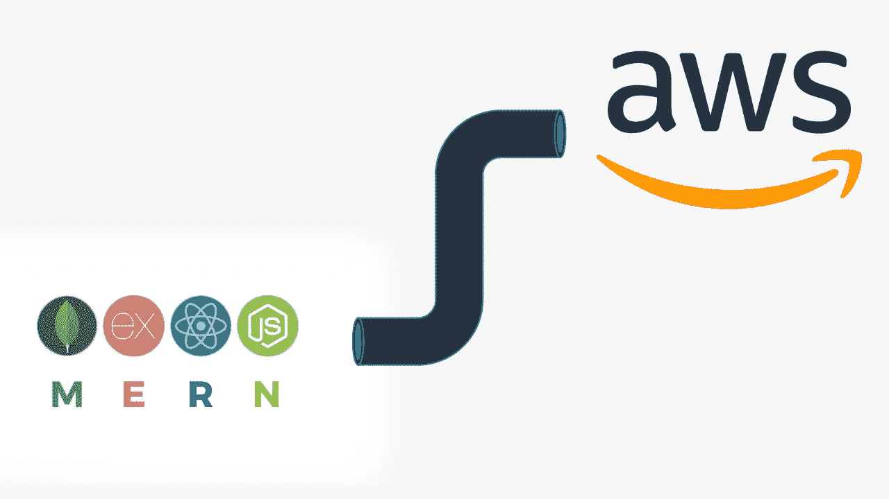
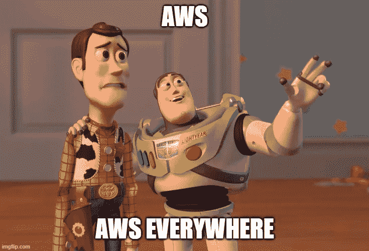
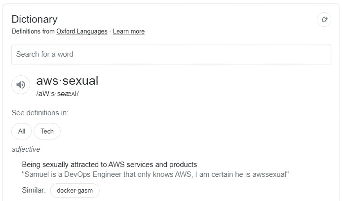
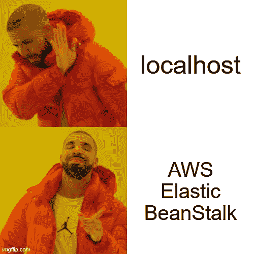

# 我如何在 AWS 上部署现代全栈应用程序

> 原文：<https://levelup.gitconnected.com/how-i-deployed-a-modern-full-stack-application-on-aws-4ce13113f8bf>



漂亮的互联网用户(还有机器人😊)，在本文中，我想向您展示我是如何在 AWS 上部署全栈应用程序的。是的，前端和后端💃💃

**前端堆栈**

对于前端，我使用了以下技术:

*   Axios / React 查询
*   反应(🤷)
*   下一个 JS

**后端栈**

对于后端，我使用了以下技术:

*   Node.js /快递
*   MongoDB

所以基本上 MERN·斯塔克😊

在部署时，我使用了以下 AWS 服务:

*   AWS 放大器
*   AWS 文档数据库
*   AWS SES
*   53 号公路
*   AWS 证书管理器
*   AWS 弹性豆茎
*   AWS S3
*   AWS 代码管道

所以让我们进入细节



**一期:53 号线**

第一件事就是把我们的域名导入到 53 路。

这个过程相当简单，在 AWS 控制台上转到 Route 53 并创建一个新的**托管区域**

托管区域代表您的域名

你输入你的域名，并更新你的注册服务商的域名记录；通常有四条记录

完成后，您的域名现在位于 AWS Route 53 上

**第二阶段:AWS 简单电子邮件服务(SES)**

如今，由于各种原因，每个现代应用程序都需要向用户发送电子邮件通知或其他类型的电子邮件

为了能够从 noreply@mydomain.com 发送电子邮件，你需要设置一个**验证身份**

经过验证的身份可以是域名或电子邮件地址。

要验证一个电子邮件地址，你只需点击发送到你邮箱的链接，但是对于域名，你需要更新 CNAME 记录

一旦您的身份得到验证，您就可以用该身份发送电子邮件

要向您的 AWS 帐户上未经验证身份的其他电子邮件发送电子邮件，您必须申请 AWS SES 的生产访问权限

**第三阶段:AWS 放大**

AWS Amplify 是一项允许您快速部署前端 web 应用程序的服务，它支持多种技术

我尝试了 AWS AppRunner，但我随后意识到它仍然非常新，缺乏许多关键功能(我在 2022 年写这篇文章🤥)

使用 Amplify，我们可以很容易地设置我们的代码库的哪一个分支用于阶段化和产品化

我们还可以为暂存环境启用密码保护，这真的很棒

Amplify 也有助于设置域和子域，当域在 AWS Route 53 上时，这个过程甚至容易得多

别忘了 HTTP 到 HTTPS 的重定向也是自动处理的😌



灵感来自[本·阿瓦德](https://www.youtube.com/c/BenAwad97)

**第 4 阶段:AWS 文件数据库**

AWS 正在通过提供自己版本的 MongoDB 来重新发明轮子。

这是一个惊人的服务(到目前为止👀)，只是我会喜欢像 Atlas 上那样的可视化编辑器。不管怎样，如果你感兴趣，这里有一篇关于如何在 MongoDB Compass 上访问你的文档 DB 的文章

设置文档数据库时，请记住它只能由同一 VPC 内的其他 AWS 服务访问。如果您想在 VPC 之外使用它，您需要建立一个 SSH 隧道。

记住这一点，在文档 DB 上配置安全组，以允许来自 EC2 实例的 TCP 访问。

您还可以将文档 DB 的 SG 设置为接受来自任何地方的 TCP 请求，这实际上不接受来自任何地方的 TCP 请求，而只接受 VPC 内部的请求。是的，我知道 AWS 喜欢和 devs 捣乱🤷

**第五阶段:AWS S3**

除非您是 Web 1 开发人员，否则需要一个 S3 存储桶来存储文件和配置文件图像

就个人而言，我喜欢用一个桶来存储公共和私有文件，并使用 AWS 所谓的“封装 ACL”来管理访问

创建存储桶时，请确保启用 ACL 并禁用对公共访问的阻止。此时，默认情况下，上传到 bucket 的所有对象都是私有的，要访问它们，您需要生成一个预先签名的 URL，这可以通过 AWS SDK 来完成

当上传您想要公开的对象时，您还可以指定“公共读取”ACL

**第六阶段:AWS 证书管理员**

AWS 证书管理器管理用于您的域的 SSL/TLS 证书。

使用证书管理器，您可以通过为以下对象请求证书来快速生成涵盖所有子域的证书

```
*.example.com
```

或许也适用于开发环境

```
*.dev.example.com
```

要激活 SSL，你需要做的就是添加一些 CNAME 记录，然后你的网站就安全了

虽然，如果你是一个 10 倍的开发者，你的域名已经在 53 号公路上，这是自动完成的😎



**第七期:AWS 弹性豆茎**

部署应用程序时，水平和垂直扩展的便利性非常重要

当工作负载增加时，水平扩展会增加更多的服务器实例，而垂直扩展会增加 CPU 能力

你自己设置的问题是你必须处理的；负载平衡器、自动扩展组、提供 EC2 实例、设置健康检查；因为有了豆茎，很多事情都不用我操心了😎

附注:学习如何手动设置是很好的🤓

有了 AWS Elastic BeanStalk，您需要的所有东西都可以轻松管理，并且您可以根据自己的需要轻松扩展或缩小

BeanStalk 还支持各种各样的语言和框架，这非常酷

**第 8 阶段:AWS 代码管道**

最后，让我们来看看我个人最喜欢的 AWS 服务之一

代码管道非常简单，它帮助您将远程 git 存储库连接到 AWS

它支持 GitHub、Atlassian Bitbucket 和其他一些 git 提供者

使用代码管道，您可以基于特定 git 分支上的操作，自动将代码管道化到不同的 AWS 服务中

**结论**

AWS 是一个非常好的服务，你可能需要学习一些相关的知识

我推荐这个免费课程来帮助你开始学习；[航线](https://explore.skillbuilder.aws/learn/course/external/view/elearning/134/aws-cloud-practitioner-essentials)🚀🚀

此外，我刚开始使用 AWS 不到一个月，决定分享一些我到目前为止学到的东西


联系我[这里](https://toluolatubosun.com/contact)的机会和合作或只是谈谈

下一篇文章再见🚀🚀

# 分级编码

感谢您成为我们社区的一员！更多内容请参见[升级编码出版物](https://levelup.gitconnected.com/)。
跟随:[推特](https://twitter.com/gitconnected)，[领英](https://www.linkedin.com/company/gitconnected)，[通迅](https://newsletter.levelup.dev/)
**升一级正在改造理工大招聘➡️** [**加入我们的人才集体**](https://jobs.levelup.dev/talent/welcome?referral=true)