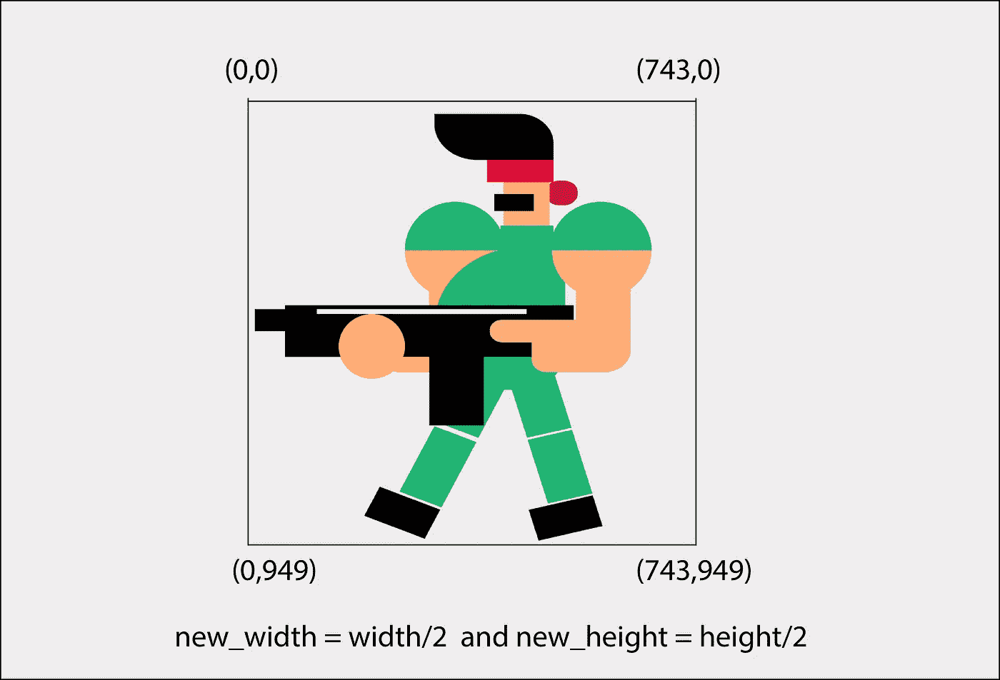
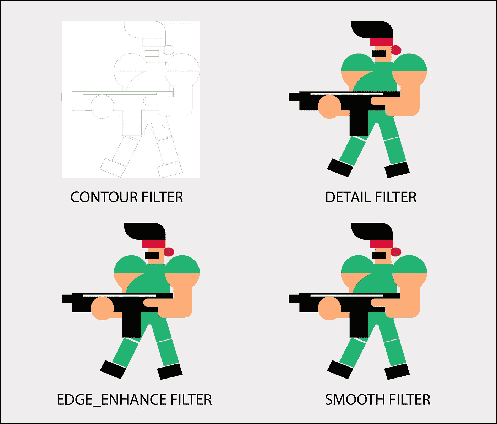
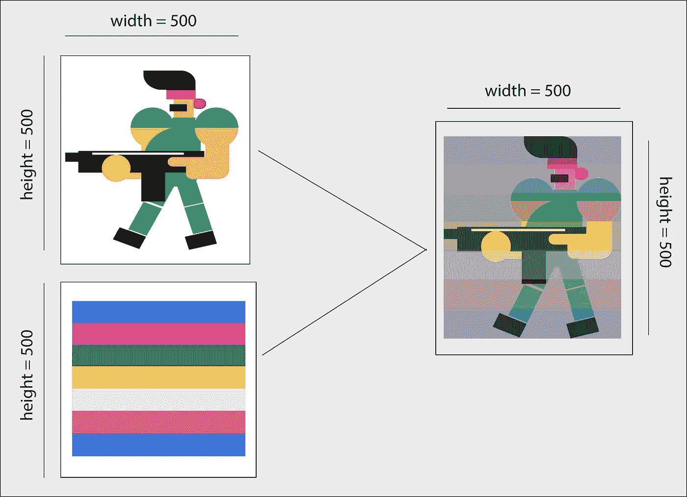

# 我如何用 Python 为社交媒体编辑照片(包括代码)

> 原文：<https://levelup.gitconnected.com/how-i-edit-photos-for-social-media-in-python-includes-code-a022deeb7935>

了解如何使用 Python 创建和处理数字图像


Karan Jagota 摄

我们生活在一个社交媒体的时代。在这个地方，我们希望我们在 Instagram 和脸书上的照片看起来比我们的真实个性更令人印象深刻。我们希望我们的时间表看起来精彩，充满了美丽的图片。为了实现这个目标，我们经常会下载一些我们根本不需要的软件和应用程序。更糟糕的是，其中一些应用非常复杂，难以理解和学习，以至于我们在使用两分钟后就卸载了它们。

在本文中，我将向您展示我如何使用 python pillow 库为 Fb、Twitter 和 Instagram 等社交媒体平台编辑我的照片，以及您可以如何做同样的事情。本文也面向希望了解 python 图像处理库的开发人员。对于每个问题，我们将用 python 编程语言遍历一个可能的解决方案代码。所以，不要再浪费时间了，让我们开始吧。

# **枕头库是什么？如何在 Python 项目中添加？**

Pillow 是一个免费的开源 python 库，允许我们创建和处理数字图像。全世界的 python 开发人员都使用它来处理应用程序中的图像。它可以用于许多目的，如从计算机中读取和写入图像，为 web 和移动应用程序创建图像缩略图，通过添加滤镜将图片变成艺术。相信我！枕头有很多优点。因此，它不仅对开发人员来说是一个方便的学习工具，对非技术人员和创意人员来说也是如此。

使用 pip 安装枕头

```
pip install pillow
```

安装完成后，我们可以使用 import 语句将它直接添加到我们的项目中。

```
import PIL
```

*您可以从我的 Github 资源库下载本文的代码。链接:*[https://github . com/karanjagota/Medium-Blogs/tree/master/PILLOW](https://github.com/karanjagota/Medium-Blogs/tree/master/PILLOW)

# 如何从我的电脑加载图像？

```
img = PIL.Image.open("my_image.png")
print(img.size)
img.show()
```

上面的代码片段基本上是不言自明的。第一行从计算机中读取名为“my_image.png”的图像，第二行在控制台上显示我们图片的尺寸，第三行在屏幕上显示它。是的，只需要三行 python 代码就可以用枕头库从你的电脑上加载一个图像。只需确保将图像保存在放置 python 文件的同一个目录中。


(我的图片)Karan Jagota 的照片

# 如何编辑图像？

当我们考虑为社交媒体编辑我们的照片时，我们主要寻找具有这四个简单功能的应用程序-

1.  图像裁剪
2.  美容滤镜
3.  调整大小
4.  保存并共享

幸运的是，pillow library 允许我们如此轻松地执行所有这些操作，以至于在 python 编程中使用它几乎感觉轻而易举。让我们逐一实现所有这些特性。

## 农作物

```
img = PIL.Image.crop(left,upper,right,lower)
```

pillow 库的图像模块中的 crop()方法为我们提供了根据给定的尺寸裁剪图像的方法。它在图片上创建了一个子矩形，允许我们删除不再需要的像素。图像的左上角坐标从(0，0)开始


(cropped _ image)karan ja gota 拍摄的照片

## 调整大小

```
img = PIL.resize(width,height)
```

上面的代码片段基本上是不言自明的。绕过 resize 方法中以像素为参数的宽度和高度，可以改变图像的尺寸。例如，让我们将当前图像的高度和宽度减半。



karan jagota 拍摄的照片

## 美容滤镜

```
img = PIL.filter(PIL.Imagefilter.FILTER_NAME)
```

枕头为我们提供了数以吨计的美容过滤器，以提高我们的图像质量。通过使用这些过滤器，我们可以把我们的图像变成艺术，如果我们想的话！我最喜欢使用的一些过滤器包括——轮廓、细节、平滑、边缘增强。



(filtered _ image)karan ja gota 拍摄的照片

## 混合

```
img = Image.blend(img,img2,alpha)
#alpha = interpolation factor 
```

我想说枕头库的混合功能可能是最酷的功能，也是我在编辑照片时几乎一直使用的功能。它让我们把两张图片混合成一张。这样，我们可以修改图像的样式，同时保留其原始内容。我们需要记住的唯一一件事是，两幅图像的大小应该相同。上面代码片段中的 Alpha 指的是插值。如果 alpha 为零，则返回第一个图像的副本。如果是一个，那么您将得到第二个图像作为输出。



(blend _ image)Karan ja gota 拍摄的照片

## 几何变换

```
img = PIL.rotate(Degree)
img = PIL.img.transpose(Image.FLIP_LEFT_RIGHT)
```

Pillow 还允许我们执行简单的几何变换，如旋转和转置。它为我们提供了我们在任何图像编辑应用程序中看到的所有东西。


(Transpose _ image)karan ja gota 拍摄的照片

## 保存并共享

```
img.save('edited_image')
```

用 python 保存编辑过的图像就像编写 hello world 程序一样简单。save 方法将编辑后的图像保存在包含原始图像文件和 python 文件的同一目录中。

# 完全码

# 摘要

在本文中，我们了解了以下内容:

1.  什么是 python 图像处理库，如何在 Python 项目中安装？
2.  如何在 python 中实现一些商业照片编辑软件和应用程序提供的功能，如裁剪、调整美颜滤镜大小和几何变换。