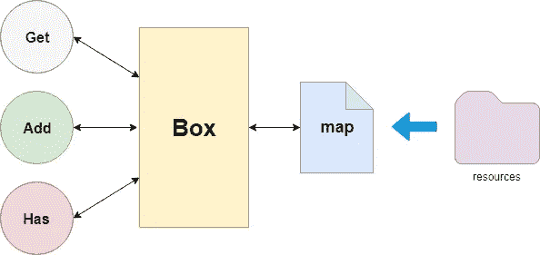
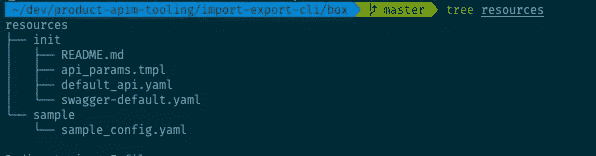
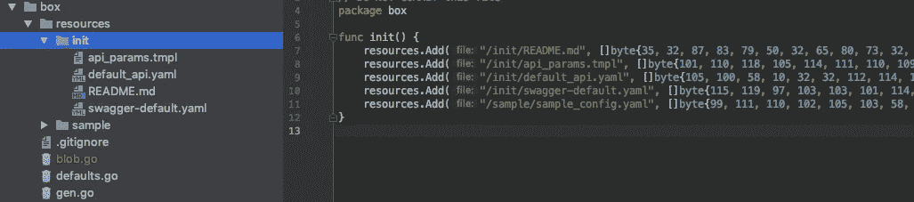

# 我如何在 Go 中嵌入资源

> 原文：<https://levelup.gitconnected.com/how-i-embedded-resources-in-go-514b72f6ef0a>


地鼠看起来很饿

D 在我在 [WSO2，Inc](https://medium.com/u/4571d92b14fa?source=post_page-----514b72f6ef0a--------------------------------) 实习期间，我参与了一个为 WSO2 API Manager 开发 CI/CD 管道的项目。工具大部分是在 Golang 完成的。

当我们开发工具时，我们希望通过 CLI 工具进行项目初始化。这确实涉及到大量的代码生成。

一开始，一切都很好。我们只有很少的文件，我们把它们保存为字节片并访问它们，这完全没问题。

结尾一塌糊涂

# backticks 的噩梦

项目在扩大，我们想要存储的内容也在增加。管理这些内容非常困难，因为它们基本上都在 Go 包中，每次都必须手动编辑。

有一天*我想对我们的自述文件*使用 Markdown，该文件是在项目的初始化阶段由工具生成的，在此之前我们一直在生成一个简单的文本文件。

**Markdown 对代码块使用反勾号**而 **Go 对原始字符串使用反勾号**，*我找不到更好的方法来避开它们*。这完全是一场灾难！

我们不能单独运送这些文件，因为这是一个小型 CLI 工具，所以我一直在寻找将资源嵌入 Go 的方法。

# 现有解决方案

是的，对于像 [Go.rice](https://github.com/GeertJohan/go.rice) 这样的确切问题已经有了解决方案，但是对于我的任务来说，我认为它们太复杂和臃肿了。我只想把我的资源转换成 Go 文件并访问它们。

# 去生成救援

Go 太棒了，包括电池。默认情况下，该语言能够生成代码。所以为什么不用呢。如果你不熟悉 go generate 是什么，读官方的[博客](https://blog.golang.org/generate)。Go generate 使用一个特殊的神奇字符串来标识需要生成的文件

```
//go:generate <command> <args>
```

当你执行`go generate filename.go`时，编译器将检查神奇的字符串并执行提供的命令。`go generate ./...`将在整个项目中运行该命令，查找包含神奇字符串的文件，并执行您提供的命令。

> *Go generate 运行给定的命令，该命令相对于包含带有魔术字符串的文件的目录。*
> 
> 既然我们需要让自己的代码生成通用化，为什么不应该用 go 本身来进行代码生成呢？

# 设置



我们资源箱的架构

我的主要需求是将文件存储为字节，并在我的 Go 文件中访问它们。为了满足同样的需求，我创建了一个名为`box` **的包。**它充当消费者和数据源之间的代理。我们将所有文件存储在一个名为资源的特殊目录中。它还可以包含目录来组织内容。



包含我们需要的所有文件的资源目录

> 这使得编辑内容更容易和更干净，因为它们只是系统中的文件。

box/defaults .前往救援

这是一个非常简单的 Go 文件，它所做的就是将我们的地图包装在一个漂亮的`ResourceBox`中，在包级别公开所有方法，这样你就可以在任何地方使用`box.Get('filename')`来调用它们——超级酷。

`resource`对象在包中扮演了一个关键的角色，作为单例来保存我们的盒子的所有资源。

现在神奇的是，它与`//go:generate go run gen.go`有一个特别的注释。

当您调用`go generate ./…`时，该文件将被检测到，并运行另一个 go 程序。

# 发电机

现在有趣的部分是，我们想读取我们的资源目录并将文件内容存储在一个`ResourceBox`中。为此，我们运行另一个名为`gen.go`的 Go 文件，它在同一个`package box`中。

正如我上面所描述的，`go generate`足够聪明，可以运行相对于它找到神奇字符串的目录的给定程序，所以`go run gen.go` 将在 box 目录中运行。这意味着我们可以毫无问题地轻松读取资源目录中的所有文件。

我们将创建一个名为`blob.go`的文件，在同一个包中包含我们需要的所有内容。

因为`gen.go`是一个程序，我们需要告诉 Go 这不是我们构建的一部分。否则，它会抱怨在同一个目录中声明多个包。

所以只要加上

```
//+build ignore
```

通知编译器在编译时忽略这一点。所以它不会抱怨。

现在我们需要遍历资源目录中的所有文件，并将它们转换成 go 文件。

gen.go 的一部分，遍历文件树，读取每个文件并存储它们

Go 提供了一个很好的方法来使用`filepath.Walk`方法处理这个问题。我们只是迭代 resources 目录中的所有文件(包括所有的**子目录以及**)并将它们存储在一个名为`resources`的映射中。我们将使用资源目录的相对路径来访问文件。

例如，要访问*resources/init/sample . YAML*中的文件，我们可以非常直观地使用`box.Get('/init/sample.yaml')`。但是如果我们在 Windows 机器上运行这一代呢？

为了克服这个问题，我们将在`filepath`包中使用一个名为`ToSlash`的特性，它将把平台原生路径分隔符转换成斜杠。

```
filepath.ToSlash(strings.TrimPrefix(path, "resources"))
```

接下来，我们需要用我们拥有的所有数据创建`blob.go`。我们只需要将所有数据添加到 box 包中的 resources 对象。

我们只需要打电话给`resources.Add('/file/path', data)`。我们所能做的是把它放在`blob.go`上的`init()`方法中，它将立刻为整个包初始化。

```
package box

func init() {
   resources.Add("/init/README.md", []byte{50, 70, 80, })
   resources.Add("/init/api_params.tmpl", []byte{100, 110, 125,})
   ...
}
```

要做到这一点，我们只需使用如下 Go 模板

它只是迭代并创建包含文件名和数据的实际文件，稍后我们将把它写到磁盘，允许在代码中访问。

您可以看到有一个函数映射传递给了模板引擎。我用它将切片的字节表示创建为一个字符串，并在模板中使用它。这是一个非常简单的函数，如下所示。它获取一部分字节，并返回一个逗号分隔的值字符串，其中包含所有字节的数字。

> 如果你有任何 back-tick 现在他们都已经被转换成一些数字，所以不用担心

现在，我们将文件写入磁盘，准备就绪

# 但是等等，我的棉绒不行了

这是因为代码格式不正确，生成后可以自己做。

不，我们不会这样做，go 本身提供了格式化任何 Go 代码的格式化程序，我们可以在将文件保存到磁盘之前调用它

```
data, err := format.Source(builder.Bytes())
if err != nil {
	log.Fatal("Error formatting generated code", err)
}
```

就这么简单。

gen.go 与 goodies 的来源

# 运行它

现在只需在您的应用程序中运行`go generate ./…`，您就可以找到一个名为`box/blob.go`的文件，它将包含您的`box/resources`目录中资源的所有数据。



生成的 blob 文件

现在你要做的就是调用

```
box.Get('/sample/sample_config.yaml')
```

从你的文件中获取数据。现在，它已经嵌入到您的 Go 二进制文件中。

# 包裹

有许多现有的解决方案可以解决嵌入高级功能的问题。但是我想实现一个简单的解决方案来解决我们的问题。

Go 是一种强大的语言，它有很多特性是每个程序员都想要的。它在标准库中有模板、代码生成和更多功能。

这个解决方案将内容从代码中分离出来，使它们更直观、更易于管理。

例如，如果内容作者想要纠正您的自述文件中的一些问题，他们可以简单地编辑该文件并构建程序，而无需考虑实现。这对双方都是双赢。

整个项目的代码:

 [## wso2/产品-apim-工具

### 此时您不能执行该操作。您已使用另一个标签页或窗口登录。您已在另一个选项卡中注销，或者…

github.com](https://github.com/wso2/product-apim-tooling) [](https://gitconnected.com/learn/golang) [## 学习围棋-最佳围棋教程(2019) | gitconnected

### Go 是一种静态类型的命令式编译语言。然而，与许多编译编程语言不同，Go 是…

gitconnected.com](https://gitconnected.com/learn/golang)