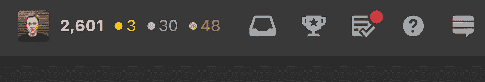
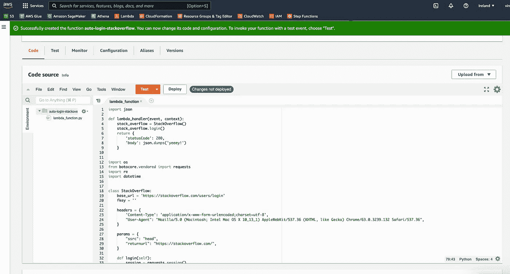
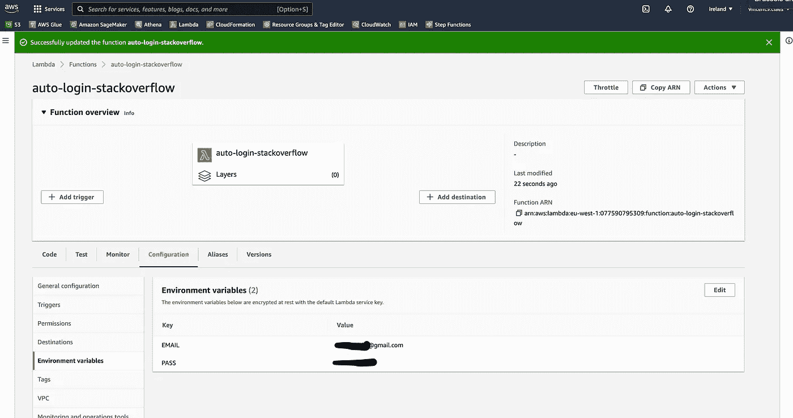
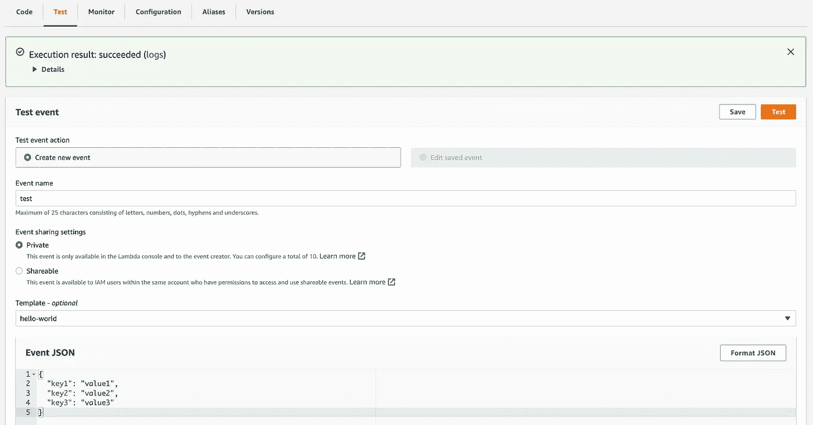
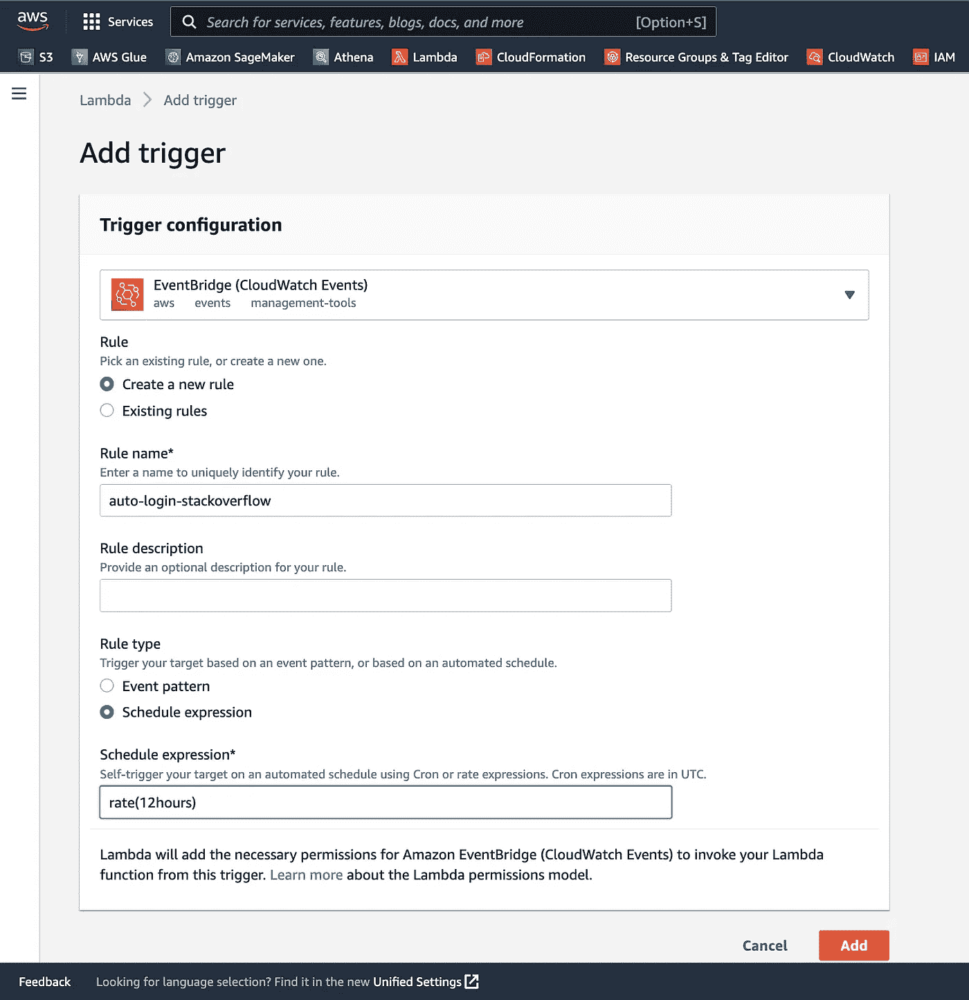
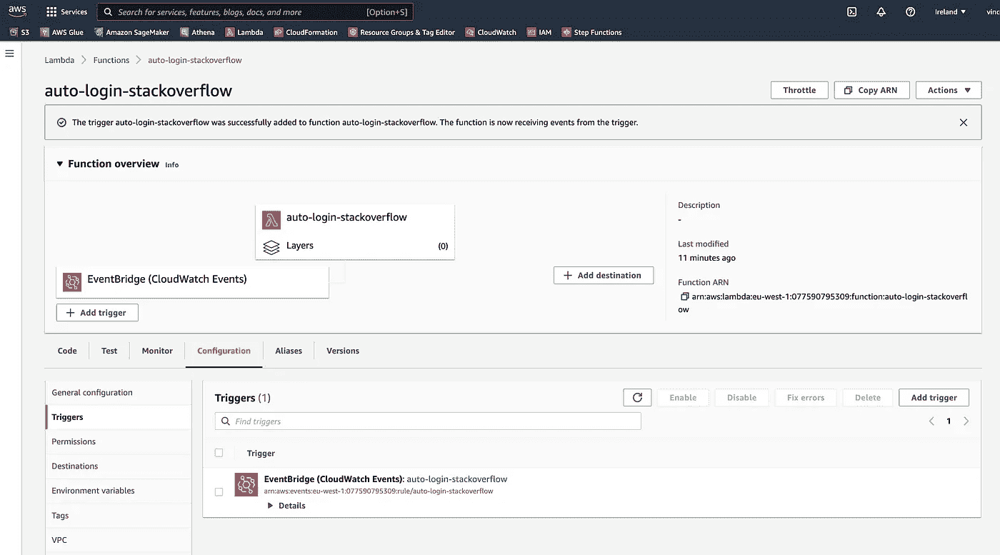

# 我是如何获得机器人自动化堆栈溢出金质徽章的？

> 原文：<https://levelup.gitconnected.com/how-i-got-a-golden-badge-on-stack-overflow-with-bot-automation-9456eaee470b>

## 金色徽章可以增强你的个人资料声誉，因为它们很难获得。本文将向您展示我如何在 AWS 上构建了一个自动登录机器人，从而获得了一个珍贵的金色徽章。

[https://www.freeimages.com/photo/medal-1-1315631](https://www.freeimages.com/photo/medal-1-1315631)

[StackOverflow](https://stackoverflow.com/) 是为你苦苦追寻的技术问题找到答案的地方。通常，平台上的其他人已经问过并回答了你的问题。如果是这种情况，你跳个开心舞，对答案和问题进行 upvote，复制/粘贴答案，继续下一期。

StackOverflow 也是为了建立声誉，如果你完成特定的任务，你就可以获得徽章。你有青铜、白银和黄金徽章的等级。金色的才是难得到的！

在 [StackOverflow](https://stackoverflow.com/users/1771155/vincent-claes) 的右上角，你可以看到你的徽章。

# 💯—连续 100 天参观 StackOverflow。

有许多不同的方法可以获得金质徽章；一种方式是[连续 100 天访问 StackOverflow】。](https://stackoverflow.com/help/badges/83/fanatic)

我意识到我可以通过自动化实现这个金色徽章！我需要一个脚本，让我登录网站 100 天。

## 👨🏽‍💻—获取代码

作为开发人员，您不会从头开始编写代码。你首先试图找到你想要的代码。我用谷歌搜索类似这样的东西:

*   *“stack overflow 登录 python Github”*
*   *“stack overflow 登录 python Github gists”*

这里有几个 Github 源代码的例子，它们完全符合我的要求，或者至少提供了一个起点:

*   [https://github.com/CoXier/stackoverflow-login](https://github.com/CoXier/stackoverflow-login)
*   [https://github.com/imjkrao/Stack-overflow-login-](https://github.com/imjkrao/Stack-overflow-login-)
*   [https://gist.github.com/guyzmo/5730750](https://gist.github.com/guyzmo/5730750)

Github 是一座金矿，但是不要忘记 Github Gists 拥有一堆脚本和代码片段。我从在 Github 上找到的片段构建了一个脚本，并创建了自己的 Github 要点:

[https://gist . github . com/Vincent claes/48 aeb 663 e 5b 69 a5c 61 ff 252289 c 67 CD 6](https://gist.github.com/vincentclaes/48aeb663e5b69a5c61ff252289c67cd6)

如果你调用`lambda_handler`函数，它期望你的 StackOverflow email 作为环境变量`EMAIL`，你的密码作为环境变量`PASS`。

## ⚙️ —登录自动化

好的，我有登录 StackOverflow 的代码。现在我需要安排这个脚本每天运行。我不能跳过一天，因为计数器将被置为 0，我必须重新开始。我不会用我的笔记本电脑，因为我可能会连续 100 天不打开电脑。

云服务为此提供了一个解决方案。我最熟悉 [AWS](https://aws.amazon.com/) 服务。因此，我选择在 Lambda 函数中运行我的 python 代码，并用 AWS EventBridge 调度我的 Lambda。

我将向您展示如何到达那里的步骤:

*   转到您的 AWS 帐户> Lambda >创建功能
*   选择“从头开始创作”
*   提供一个函数名
*   选择 python 3.8 作为“运行时”
*   点击“创建功能”按钮

*   将代码复制/粘贴到编辑器中
*   单击“部署”

*   转到“配置”
*   转到“环境变量”
*   点击“编辑”
*   添加环境变量“EMAIL”和“PASS”

让我们测试一下我们的脚本，看看它是否有效:

*   转到“测试”选项卡
*   给出一个“事件名称”
*   点击“测试”按钮
*   您应该会看到一个绿色条出现在顶部，显示
    “执行结果:成功”

太好了，你可以使用 Lambda 函数成功登录。接下来，我们将安排每天触发 Lambda。

*   在页面顶部，单击“添加触发器”
*   选择“EventBridge(云观察事件)”
*   给出一个“规则名”
*   将“Schedule expression”设置为 rate(12 小时),以确保您每天都登录。如果你错过了一天，计数器被设置为 0，你必须重新开始。
*   点击“添加”

就是这样！🥳

# 🏅—现在需要等 100 天。

现在您已经准备好每天登录 Stackoverflow，在 100 天内您将获得一枚金色徽章！

您可以通过在 StackOverflow 上导航到您的个人资料来跟踪您登录的“连续几天”的进度。

连续 412 天登录

如果你需要帮助，请在评论中告诉我。

祝你好运！🍀

# 👋文森特·克拉斯

我写这篇文章是为了好玩。平时我尽量严肃一点，写 ML 工程和 ML 管道。可以在[中](https://medium.com/subscribe/@vincentclaes_43752)、 [Linkedin](https://www.linkedin.com/in/vincent-claes-0b346337/) 、 [Twitter](https://twitter.com/VincentClaes1) 关注我。